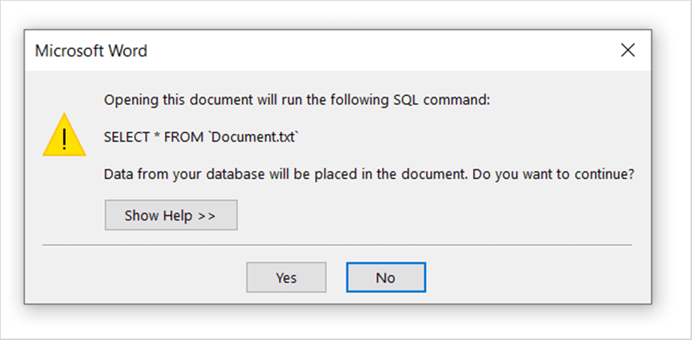

# Mail merge options

The `MailMerge` class allows you to customize the Mail merge process with the following options.

## Field Mapping

The `MailMerge` class can automatically **maps the merge field names with data source column names** during Mail merge process. You can also customize the field mapping when the merge field names in the template document varies with the column names in the data source by using `MappedFields` collection.

The following code example shows how to add mapping when a merge field name in a document and column name in data source have different names.

  


//Opens the template document 
WordDocument document = new WordDocument("Template.docx");
//Creates data source
string[] fieldNames = new string[] { "Employee_Id_InDataSource", "Name_InDataSource",
    "Phone_InDataSource", "City_InDataSource" };
string[] fieldValues = new string[] { "101", "John", "+122-2000466", "Houston" };
//Mapping the required merge field names with data source column names
document.MailMerge.MappedFields.Add("Employee_Id_InDocument", "Employee_Id_InDataSource");
document.MailMerge.MappedFields.Add("Name_InDocument", "Name_InDataSource");
document.MailMerge.MappedFields.Add("Phone_InDocument", "Phone_InDataSource");
document.MailMerge.MappedFields.Add("City_InDocument", "City_InDataSource");
//Performs the mail merge
document.MailMerge.Execute(fieldNames, fieldValues);
//Saves and closes the Word document instance
document.Save("Sample.docx");
document.Close();



'Opens the template document 
Dim document As New WordDocument("Template.docx")
'Creates data source
Dim fieldNames As String() = New String() {"Employee_Id_InDataSource", "Name_InDataSource", 
    "Phone_InDataSource", "City_InDataSource"}
Dim fieldValues As String() = New String() {"101", "John", "+122-2000466", "Houston"}
'Mapping the required merge field names with data source column names
document.MailMerge.MappedFields.Add("Employee_Id_InDocument", "Employee_Id_InDataSource")
document.MailMerge.MappedFields.Add("Name_InDocument", "Name_InDataSource")
document.MailMerge.MappedFields.Add("Phone_InDocument", "Phone_InDataSource")
document.MailMerge.MappedFields.Add("City_InDocument", "City_InDataSource")
'Performs the mail merge
document.MailMerge.Execute(fieldNames, fieldValues)
'Saves and closes the Word document instance
document.Save("Sample.docx")
document.Close()



//Creates an instance of a WordDocument
Assembly assembly = typeof(App).GetTypeInfo().Assembly;
WordDocument document = new WordDocument();
document.Open(assembly.GetManifestResourceStream("Sample.Assets.Template.docx"), FormatType.Docx);
//Creates data source
string[] fieldNames = new string[] { "Employee_Id_InDataSource", "Name_InDataSource", 
    "Phone_InDataSource", "City_InDataSource" };
string[] fieldValues = new string[] { "101", "John", "+122-2000466", "Houston" };
//Mapping the required merge field names with data source column names
document.MailMerge.MappedFields.Add("Employee_Id_InDocument", "Employee_Id_InDataSource");
document.MailMerge.MappedFields.Add("Name_InDocument", "Name_InDataSource");
document.MailMerge.MappedFields.Add("Phone_InDocument", "Phone_InDataSource");
document.MailMerge.MappedFields.Add("City_InDocument", "City_InDataSource");
//Performs the mail merge
document.MailMerge.Execute(fieldNames, fieldValues);
//Saves the Word file to MemoryStream
MemoryStream stream = new MemoryStream();
await document.SaveAsync(stream, FormatType.Docx);
//Closes the Word document
document.Close();
//Saves the stream as Word file in local machine
Save(stream, "Sample.docx");

//Refer to the following link to save Word document in UWP platform.
//https://help.syncfusion.com/file-formats/docio/create-word-document-in-uwp#save-word-document-in-uwp



//Opens the template document. 
FileStream fileStreamPath = new FileStream("Template.docx", FileMode.Open, FileAccess.Read, FileShare.ReadWrite);
WordDocument document = new WordDocument(fileStreamPath, FormatType.Docx);
//Creates data source
string[] fieldNames = new string[] { "Employee_Id_InDataSource", "Name_InDataSource", 
    "Phone_InDataSource", "City_InDataSource" };
string[] fieldValues = new string[] { "101", "John", "+122-2000466", "Houston" };
//Mapping the required merge field names with data source column names
document.MailMerge.MappedFields.Add("Employee_Id_InDocument", "Employee_Id_InDataSource");
document.MailMerge.MappedFields.Add("Name_InDocument", "Name_InDataSource");
document.MailMerge.MappedFields.Add("Phone_InDocument", "Phone_InDataSource");
document.MailMerge.MappedFields.Add("City_InDocument", "City_InDataSource");
//Performs the mail merge
document.MailMerge.Execute(fieldNames, fieldValues);
//Saves the Word document to MemoryStream
MemoryStream stream = new MemoryStream();
document.Save(stream, FormatType.Docx);
//Closes the Word document
document.Close();
stream.Position = 0;
//Download Word document in the browser
return File(stream, "application/msword", "Sample.docx");



//Opens the template document
Assembly assembly = typeof(App).GetTypeInfo().Assembly;
WordDocument document = new WordDocument(assembly.GetManifestResourceStream("Sample.Assets.Template.docx"), FormatType.Docx);
//Creates data source
string[] fieldNames = new string[] { "Employee_Id_InDataSource", "Name_InDataSource", 
    "Phone_InDataSource", "City_InDataSource" };
string[] fieldValues = new string[] { "101", "John", "+122-2000466", "Houston" };
//Mapping the required merge field names with data source column names
document.MailMerge.MappedFields.Add("Employee_Id_InDocument", "Employee_Id_InDataSource");
document.MailMerge.MappedFields.Add("Name_InDocument", "Name_InDataSource");
document.MailMerge.MappedFields.Add("Phone_InDocument", "Phone_InDataSource");
document.MailMerge.MappedFields.Add("City_InDocument", "City_InDataSource");
//Performs the mail merge
document.MailMerge.Execute(fieldNames, fieldValues);
//Saves the Word file to MemoryStream
MemoryStream stream = new MemoryStream();
document.Save(stream, FormatType.Docx);
//Closes the document 
document.Close();
//Save the stream as a file in the device and invoke it for viewing
Xamarin.Forms.DependencyService.Get<ISave>().SaveAndView("Sample.docx", "application/msword", stream);

//Download the helper files from the following link to save the stream as file and open the file for viewing in Xamarin platform.
//https://help.syncfusion.com/file-formats/docio/create-word-document-in-xamarin#helper-files-for-xamarin


 

You can download a complete working sample from [GitHub](https://github.com/SyncfusionExamples/DocIO-Examples/tree/main/Mail-Merge/Mapping-field-names-with-column-names).

## Retrieve the merge field names

You can retrieve the merge field names and also merge field group names in the Word document.

The following code example shows how to retrieve the merge field names in the Word document.

  


//Gets the merge field names from the document
string[] fieldNames = document.MailMerge.GetMergeFieldNames();



'Gets the merge field names from the document
Dim fieldNames As String() = document.MailMerge.GetMergeFieldNames()



//Gets the merge field names from the document.
string[] fieldNames = document.MailMerge.GetMergeFieldNames();
 


//Gets the merge field names from the document.
string[] fieldNames = document.MailMerge.GetMergeFieldNames();
 


//Gets the merge field names from the document.
string[] fieldNames = document.MailMerge.GetMergeFieldNames();
 

  
 
The following code example shows how to retrieve the merge field group names in the Word document.

  


//Gets the merge field group names from the document
string[] groupNames = document.MailMerge.GetMergeGroupNames();



'Gets the merge field group names from the document
Dim groupNames As String() = document.MailMerge.GetMergeGroupNames()



//Gets the merge field group names from the document.
string[] groupNames = document.MailMerge.GetMergeGroupNames();



//Gets the merge field group names from the document.
string[] groupNames = document.MailMerge.GetMergeGroupNames();



//Gets the merge field group names from the document.
string[] groupNames = document.MailMerge.GetMergeGroupNames();


  

The following code example shows how to retrieve the merge field names for a specific group in the Word document.

  


//Gets the fields from the specified groups 
string[] fieldNames = document.MailMerge.GetMergeFieldNames(groupName);



'Gets the fields from the specified groups 
Dim fieldNames As String() = document.MailMerge.GetMergeFieldNames(groupName)



//Gets the fields from the specified groups. 
string[] fieldNames = document.MailMerge.GetMergeFieldNames(groupName);



//Gets the fields from the specified groups. 
string[] fieldNames = document.MailMerge.GetMergeFieldNames(groupName);



//Gets the fields from the specified groups. 
string[] fieldNames = document.MailMerge.GetMergeFieldNames(groupName);


  

You can download a complete working sample from [GitHub](https://github.com/SyncfusionExamples/DocIO-Examples/tree/main/Mail-Merge/Retrieve-merge-field-names).

## Remove empty paragraphs

You can remove the empty paragraphs when the paragraph has only a merge field item, without any data during Mail merge process.

The following code example shows how to remove the empty paragraphs during Mail merge process.

 


//Opens the template document 
WordDocument document = new WordDocument("Template.docx");
//Removes paragraph that contains only empty fields 
document.MailMerge.RemoveEmptyParagraphs = true;
string[] fieldNames = new string[] { "EmployeeName", "EmployeeId", "City" };
string[] fieldValues = new string[] { "John", "101", "London" };
//Performs the mail merge
document.MailMerge.Execute(fieldNames, fieldValues);
//Saves and closes the Word document instance
document.Save("Sample.docx");
document.Close();



'Opens the template document 
Dim document As New WordDocument("Template.docx")
'Removes paragraph that contains only empty fields 
document.MailMerge.RemoveEmptyParagraphs = True
Dim fieldNames As String() = New String() {"EmployeeName", "EmployeeId", "City"}
Dim fieldValues As String() = New String() {"John", "101", "London"}
'Performs the mail merge
document.MailMerge.Execute(fieldNames, fieldValues)
'Saves and closes the Word document instance
document.Save("Sample.docx")
document.Close()



//Creates an instance of a WordDocument
Assembly assembly = typeof(App).GetTypeInfo().Assembly;
WordDocument document = new WordDocument();
document.Open(assembly.GetManifestResourceStream("Sample.Assets.Template.docx"), FormatType.Docx);
//Removes paragraph that contains only empty fields 
document.MailMerge.RemoveEmptyParagraphs = true;
string[] fieldNames = new string[] { "EmployeeName", "EmployeeId", "City" };
string[] fieldValues = new string[] { "John", "101", "London" };
//Performs the mail merge
document.MailMerge.Execute(fieldNames, fieldValues);
//Saves the Word file to MemoryStream
MemoryStream stream = new MemoryStream();
await document.SaveAsync(stream, FormatType.Docx);
//Closes the Word document
document.Close();
//Saves the stream as Word file in local machine
Save(stream, "Sample.docx");

//Refer to the following link to save Word document in UWP platform.
//https://help.syncfusion.com/file-formats/docio/create-word-document-in-uwp#save-word-document-in-uwp



//Opens the template document
FileStream fileStreamPath = new FileStream("Template.docx", FileMode.Open, FileAccess.Read, FileShare.ReadWrite);
WordDocument document = new WordDocument(fileStreamPath, FormatType.Docx);
//Removes paragraph that contains only empty fields
document.MailMerge.RemoveEmptyParagraphs = true;
string[] fieldNames = new string[] { "EmployeeName", "EmployeeId", "City" };
string[] fieldValues = new string[] { "John", "101", "London" };
//Performs the mail merge
document.MailMerge.Execute(fieldNames, fieldValues);
//Saves the Word document to MemoryStream
MemoryStream stream = new MemoryStream();
document.Save(stream, FormatType.Docx);
//Closes the Word document
document.Close();
stream.Position = 0;
//Download Word document in the browser
return File(stream, "application/msword", "Sample.docx");



//Opens the template document
Assembly assembly = typeof(App).GetTypeInfo().Assembly;
WordDocument document = new WordDocument(assembly.GetManifestResourceStream("Sample.Assets.Template.docx"), FormatType.Docx);
//Removes paragraph that contains only empty fields 
document.MailMerge.RemoveEmptyParagraphs = true;
string[] fieldNames = new string[] { "EmployeeName", "EmployeeId", "City" };
string[] fieldValues = new string[] { "John", "101", "London" };
//Performs the mail merge
document.MailMerge.Execute(fieldNames, fieldValues);
//Saves the Word file to MemoryStream
MemoryStream stream = new MemoryStream();
document.Save(stream, FormatType.Docx);
//Closes the document 
document.Close();
//Save the stream as a file in the device and invoke it for viewing
Xamarin.Forms.DependencyService.Get<ISave>().SaveAndView("Sample.docx", "application/msword", stream);

//Download the helper files from the following link to save the stream as file and open the file for viewing in Xamarin platform.
//https://help.syncfusion.com/file-formats/docio/create-word-document-in-xamarin#helper-files-for-xamarin


  

You can download a complete working sample from [GitHub](https://github.com/SyncfusionExamples/DocIO-Examples/tree/main/Mail-Merge/Remove-empty-paragraphs).

N>If any white space or line break exists in the merge field's parent paragraph, then it will not be considered as empty paragraph and not removed during mail merge process.

## Remove empty merge fields

Essential DocIO removes or keeps the unmerged merge fields in the output document based on the `ClearFields` property on each mail merge execution.

When a merge field is considered as unmerged during mail merge process?

1. The merge field doesn't have mapping field in data source.

2. The merge field has mapping field in data source, but the data is null or string.Empty.

Mail merge operation automatically removes the unmerged merge fields since the default value of `ClearFields` property is true.

T> 1.Set `ClearFields` property to false before the mail merge execution statement if your requirement is to keep the unmerged merge fields in the output document.
T> 2.Modify the `ClearFields` property before each mail merge execution statement while performing multiple mail merge executions if your requirement is to remove the unmerged merge fields in one mail merge execution and keep the unmerged merge fields in another mail merge execution.
T> 3.Order the mail merge executions with the `ClearFields` property false as first to avoid removal merge fields that are required for next mail merge execution in the same document.
T> 4.You can get the unmerged fields in your document, customize the mail merge process using the BeforeClearField Event. For further information, click [here] (https://help.syncfusion.com/file-formats/docio/mail-merge/mail-merge-events#beforeclearfield-event).

The following code example shows how to keep the unmerged merge fields in the generated Word document.
 
  


//Opens the template document 
WordDocument document = new WordDocument("Template.docx");
//Sets “ClearFields” to true to remove empty mail merge fields from document 
document.MailMerge.ClearFields = false;
string[] fieldNames = new string[] { "EmployeeId", "Phone", "City" };
string[] fieldValues = new string[] { "1001", "+91-9999999999", "London" };
//Performs the mail merge
document.MailMerge.Execute(fieldNames, fieldValues);
//Saves and closes the Word document instance
document.Save("Sample.docx");
document.Close();



'Opens the template document 
Dim document As New WordDocument("Template.docx")
'Sets “ClearFields” to true to remove empty mail merge fields from document 
document.MailMerge.ClearFields = False
Dim fieldNames As String() = New String() {"EmployeeId", "Phone", "City"}
Dim fieldValues As String() = New String() {"1001", "+91-9999999999", "London"}
'Performs the mail merge
document.MailMerge.Execute(fieldNames, fieldValues)
'Saves and closes the Word document instance
document.Save("Sample.docx")
document.Close()



//Creates an instance of a WordDocument
Assembly assembly = typeof(App).GetTypeInfo().Assembly;
WordDocument document = new WordDocument();
document.Open(assembly.GetManifestResourceStream("Sample.Assets.Template.docx"), FormatType.Docx);
//Sets “ClearFields” to true to remove empty mail merge fields from document 
document.MailMerge.ClearFields = false;
string[] fieldNames = new string[] { "EmployeeId", "Phone", "City" };
string[] fieldValues = new string[] { "1001", "+91-9999999999", "London" };
//Performs the mail merge
document.MailMerge.Execute(fieldNames, fieldValues);
//Saves the Word file to MemoryStream
MemoryStream stream = new MemoryStream();
await document.SaveAsync(stream, FormatType.Docx);
//Closes the Word document
document.Close();
//Saves the stream as Word file in local machine
Save(stream, "Sample.docx");

//Refer to the following link to save Word document in UWP platform.
//https://help.syncfusion.com/file-formats/docio/create-word-document-in-uwp#save-word-document-in-uwp



//Opens the template document 
FileStream fileStreamPath = new FileStream("Template.docx", FileMode.Open, FileAccess.Read, FileShare.ReadWrite);
WordDocument document = new WordDocument(fileStreamPath, FormatType.Docx);
//Sets “ClearFields” to true to remove empty mail merge fields from document 
document.MailMerge.ClearFields = false;
string[] fieldNames = new string[] { "EmployeeId", "Phone", "City" };
string[] fieldValues = new string[] { "1001", "+91-9999999999", "London" };
//Performs the mail merge
document.MailMerge.Execute(fieldNames, fieldValues);
//Saves the Word document to MemoryStream
MemoryStream stream = new MemoryStream();
document.Save(stream, FormatType.Docx);
//Closes the Word document
document.Close();
stream.Position = 0;
//Download Word document in the browser
return File(stream, "application/msword", "Sample.docx");



//Opens the template document
Assembly assembly = typeof(App).GetTypeInfo().Assembly;
WordDocument document = new WordDocument(assembly.GetManifestResourceStream("Sample.Assets.Template.docx"), FormatType.Docx);
//Sets “ClearFields” to true to remove empty mail merge fields from document 
document.MailMerge.ClearFields = false;
string[] fieldNames = new string[] { "EmployeeId", "Phone", "City" };
string[] fieldValues = new string[] { "1001", "+91-9999999999", "London" };
//Performs the mail merge
document.MailMerge.Execute(fieldNames, fieldValues);
//Saves the Word file to MemoryStream
MemoryStream stream = new MemoryStream();
document.Save(stream, FormatType.Docx);
//Closes the document 
document.Close();
//Save the stream as a file in the device and invoke it for viewing
Xamarin.Forms.DependencyService.Get<ISave>().SaveAndView("Sample.docx", "application/msword", stream);

//Download the helper files from the following link to save the stream as file and open the file for viewing in Xamarin platform.
//https://help.syncfusion.com/file-formats/docio/create-word-document-in-xamarin#helper-files-for-xamarin

 

You can download a complete working sample from [GitHub](https://github.com/SyncfusionExamples/DocIO-Examples/tree/main/Mail-Merge/Keep-unmerged-merge-fields).

## Remove empty group

You can remove the empty merge field groups which contains unmerged merge fields after executing mail merge for a group in a Word document.

The following code example shows how to remove empty merge field group during mail merge process in a Word document.

  


//Opens the template document 
WordDocument document = new WordDocument(@"Template.docx");
//Gets the employee details as “IEnumerable” collection
List<Employees> employeeList = GetEmployees();
//Creates an instance of “MailMergeDataTable” by specifying mail merge group name and “IEnumerable” collection
MailMergeDataTable dataTable = new MailMergeDataTable("Employees", employeeList);
//Enable the flag to remove empty group which contain empty merge fields
document.MailMerge.RemoveEmptyGroup = true;
//Performs Mail merge
document.MailMerge.ExecuteNestedGroup(dataTable);
//Saves and closes the WordDocument instance
document.Save("Sample.docx");
document.Close();



'Opens the template document
Dim document As WordDocument =  New WordDocument("Template.docx")
'Gets the employee details as “IEnumerable” collection
Dim employeeList As List(Of Employees) =  GetEmployees() 
'Creates an instance of “MailMergeDataTable” by specifying mail merge group name and “IEnumerable” collection
Dim dataTable As MailMergeDataTable =  New MailMergeDataTable("Employees",employeeList) 
'Enable the flag to remove empty group which contain empty merge fields
document.MailMerge.RemoveEmptyGroup = True
'Performs Mail merge
document.MailMerge.ExecuteNestedGroup(dataTable)
'Saves and closes the WordDocument instance
document.Save("Sample.docx")
document.Close()



//Creates an instance of a WordDocument
Assembly assembly = typeof(App).GetTypeInfo().Assembly;
WordDocument document = new WordDocument();
document.Open(assembly.GetManifestResourceStream("Sample.Assets.Template.docx"), FormatType.Docx);
//Gets the employee details as “IEnumerable” collection
List<Employees> employeeList = GetEmployees();
//Creates an instance of “MailMergeDataTable” by specifying mail merge group name and “IEnumerable” collection
MailMergeDataTable dataTable = new MailMergeDataTable("Employees", employeeList);
//Enable the flag to remove empty group which contain empty merge fields
document.MailMerge.RemoveEmptyGroup = true;
//Performs Mail merge
document.MailMerge.ExecuteNestedGroup(dataTable);
//Saves the Word file to MemoryStream
MemoryStream stream = new MemoryStream();
await document.SaveAsync(stream, FormatType.Docx);
//Closes the Word document
document.Close();
//Saves the stream as Word file in local machine
Save(stream, "Sample.docx");

//Refer to the following link to save Word document in UWP platform.
//https://help.syncfusion.com/file-formats/docio/create-word-document-in-uwp#save-word-document-in-uwp



//Opens the template document 
FileStream fileStreamPath = new FileStream(@"Data\Template.docx", FileMode.Open, FileAccess.Read, FileShare.ReadWrite);
WordDocument document = new WordDocument(fileStreamPath, FormatType.Docx);
//Gets the employee details as “IEnumerable” collection
List<Employees> employeeList = GetEmployees();
//Creates an instance of “MailMergeDataTable” by specifying mail merge group name and “IEnumerable” collection.
MailMergeDataTable dataTable = new MailMergeDataTable("Employees", employeeList);
//Enable the flag to remove empty group which contain empty merge fields
document.MailMerge.RemoveEmptyGroup = true;
//Performs Mail merge
document.MailMerge.ExecuteNestedGroup(dataTable);
MemoryStream stream = new MemoryStream();
//Saves the Word document to MemoryStream
document.Save(stream, FormatType.Docx);
//Closes the Word document
document.Close();
stream.Position = 0;
//Download Word document in the browser
return File(stream, "application/msword", "Sample.docx");



//Opens the template document
Assembly assembly = typeof(App).GetTypeInfo().Assembly;
WordDocument document = new WordDocument(assembly.GetManifestResourceStream("Sample.Assets.Template.docx"), FormatType.Docx);
//Gets the employee details as “IEnumerable” collection
List<Employees> employeeList = GetEmployees();
//Creates an instance of “MailMergeDataTable” by specifying mail merge group name and “IEnumerable” collection
MailMergeDataTable dataTable = new MailMergeDataTable("Employees", employeeList);
//Enable the flag to remove empty group which contain empty merge fields
document.MailMerge.RemoveEmptyGroup = true;
//Performs Mail merge
document.MailMerge.ExecuteNestedGroup(dataTable);
//Saves the Word file to MemoryStream
MemoryStream stream = new MemoryStream();
document.Save(stream, FormatType.Docx);
//Closes the document 
document.Close();
//Save the stream as a file in the device and invoke it for viewing
Xamarin.Forms.DependencyService.Get<ISave>().SaveAndView("Sample.docx", "application/msword", stream);

//Download the helper files from the following link to save the stream as file and open the file for viewing in Xamarin platform.
//https://help.syncfusion.com/file-formats/docio/create-word-document-in-xamarin#helper-files-for-xamarin




The following code example shows GetEmployees method which is used to get data for mail merge.

  


public static List<Employees> GetEmployees()
{
	List<OrderDetails> orders = new List<OrderDetails>();
	orders.Add(new OrderDetails("10835", new DateTime(2015, 1, 5), new DateTime(2015, 1, 12), new DateTime(2015, 1, 21)));
	List<CustomerDetails> customerDetails = new List<CustomerDetails>();
	customerDetails.Add(new CustomerDetails("Maria Anders", "Maria Anders", "Berlin", "Germany", orders));
	customerDetails.Add(new CustomerDetails("Andy", "Bernard", "Berlin", "Germany", null));
	List<Employees> employees = new List<Employees>();
	employees.Add(new Employees("Nancy", "Smith", "1", "505 - 20th Ave. E. Apt. 2A,", "Seattle", "USA", customerDetails));
	return employees;
}
        
public class Employees
{
	public string FirstName { get; set; }
	public string LastName { get; set; }
	public string EmployeeID { get; set; }
	public string Address { get; set; }
	public string City { get; set; }
	public string Country { get; set; }
	public List<CustomerDetails> Customers { get; set; }

	public Employees(string firstName, string lastName, string employeeId, string address, string city, string country, List<CustomerDetails> customers)
	{
		FirstName = firstName;
		LastName = lastName;
		Address = address;
		EmployeeID = employeeId;
		City = city;
		Country = country;
		Customers = customers;
	}
}

public class CustomerDetails
{
	public string ContactName { get; set; }
	public string CompanyName { get; set; }
	public string City { get; set; }
	public string Country { get; set; }
	public List<OrderDetails> Orders { get; set; }

	public CustomerDetails(string contactName, string companyName, string city, string country, List<OrderDetails> orders)
	{
		ContactName = contactName;
		CompanyName = companyName;
		City = city;
		Country = country;
		Orders = orders;
	}
}

public class OrderDetails
{
	public string OrderID { get; set; }
	public DateTime OrderDate { get; set; }
	public DateTime ShippedDate { get; set; }
	public DateTime RequiredDate { get; set; }

	public OrderDetails(string orderId, DateTime orderDate, DateTime shippedDate, DateTime requiredDate)
	{
		OrderID = orderId;
		OrderDate = orderDate;
		ShippedDate = shippedDate;
		RequiredDate = requiredDate;
	}
}



Public Function GetEmployees() As List(Of Employees)
	Dim orders As List(Of OrderDetails) = New List(Of OrderDetails)
	orders.Add(New OrderDetails("10835", New DateTime(2015, 1, 5), New DateTime(2015, 1, 12), New DateTime(2015, 1, 21)))
	Dim customers As List(Of CustomerDetails) = New List(Of CustomerDetails) 
	customers.Add(New CustomerDetails("Maria Anders", "Maria Anders", "Berlin", "Germany", orders))
	customers.Add(New CustomerDetails("Andy", "Bernard", "Berlin", "Germany", Nothing))
	Dim employees As List(Of Employees) = New List(Of Employees) 
	employees.Add(New Employees("Nancy", "Smith", "1", "505 - 20th Ave. E. Apt. 2A,", "Seattle", "USA", customers))
	Return employees
End Function
 
Public Class Employees
	Public Property FirstName() As String
	Public Property LastName() As String
	Public Property EmployeeID() As String
	Public Property Address() As String
	Public Property City() As String
	Public Property Country() As String
	Public Property Customers() As List(Of CustomerDetails)
	 
	Public Sub New(firstName As String, lastName As String, employeeId As String, address As String, city As String, country As String, customers As List(Of CustomerDetails))
		Me.FirstName = firstName
		Me.LastName = lastName
		Me.Address = address
		Me.EmployeeID = employeeId
		Me.City = city
		Me.Country = country
		Me.Customers = customers
	End Sub
End Class
 
Public Class CustomerDetails
	Public Property ContactName() As String
	Public Property CompanyName() As String
	Public Property City() As String
	Public Property Country() As String
	Public Property Orders() As List(Of OrderDetails)
	 
	Public Sub New(contactName As String, companyName As String, city As String, country As String, orders As List(Of OrderDetails))
		Me.ContactName = contactName
		Me.CompanyName = companyName
		Me.City = city
		Me.Country = counTry
		Me.Orders = orders
	End Sub
End Class
 
Public Class OrderDetails
	Public Property OrderID() As String
	Public Property OrderDate() As DateTime
	Public Property ShippedDate() As DateTime	 
	Public Property RequiredDate() As DateTime
	
	Public Sub New(ByVal orderId As String, ByVal orderDate As DateTime, ByVal shippedDate As DateTime, ByVal requiredDate As DateTime)
		Me.OrderID = orderId
		Me.OrderDate = orderDate
		Me.ShippedDate = shippedDate
		Me.RequiredDate = requiredDate
	End Sub
End Class



public static List<Employees> GetEmployees()
{
	List<OrderDetails> orders = new List<OrderDetails>();
	orders.Add(new OrderDetails("10835", new DateTime(2015, 1, 5), new DateTime(2015, 1, 12), new DateTime(2015, 1, 21)));
	List<CustomerDetails> customerDetails = new List<CustomerDetails>();
	customerDetails.Add(new CustomerDetails("Maria Anders", "Maria Anders", "Berlin", "Germany", orders));
	customerDetails.Add(new CustomerDetails("Andy", "Bernard", "Berlin", "Germany", null));
	List<Employees> employees = new List<Employees>();
	employees.Add(new Employees("Nancy", "Smith", "1", "505 - 20th Ave. E. Apt. 2A,", "Seattle", "USA", customerDetails));
	return employees;
}
        
public class Employees
{
	public string FirstName { get; set; }
	public string LastName { get; set; }
	public string EmployeeID { get; set; }
	public string Address { get; set; }
	public string City { get; set; }
	public string Country { get; set; }
	public List<CustomerDetails> Customers { get; set; }

	public Employees(string firstName, string lastName, string employeeId, string address, string city, string country, List<CustomerDetails> customers)
	{
		FirstName = firstName;
		LastName = lastName;
		Address = address;
		EmployeeID = employeeId;
		City = city;
		Country = country;
		Customers = customers;
	}
}

public class CustomerDetails
{
	public string ContactName { get; set; }
	public string CompanyName { get; set; }
	public string City { get; set; }
	public string Country { get; set; }
	public List<OrderDetails> Orders { get; set; }

	public CustomerDetails(string contactName, string companyName, string city, string country, List<OrderDetails> orders)
	{
		ContactName = contactName;
		CompanyName = companyName;
		City = city;
		Country = country;
		Orders = orders;
	}
}

public class OrderDetails
{
	public string OrderID { get; set; }
	public DateTime OrderDate { get; set; }
	public DateTime ShippedDate { get; set; }
	public DateTime RequiredDate { get; set; }

	public OrderDetails(string orderId, DateTime orderDate, DateTime shippedDate, DateTime requiredDate)
	{
		OrderID = orderId;
		OrderDate = orderDate;
		ShippedDate = shippedDate;
		RequiredDate = requiredDate;
	}
}



public static List<Employees> GetEmployees()
{
	List<OrderDetails> orders = new List<OrderDetails>();
	orders.Add(new OrderDetails("10835", new DateTime(2015, 1, 5), new DateTime(2015, 1, 12), new DateTime(2015, 1, 21)));
	List<CustomerDetails> customerDetails = new List<CustomerDetails>();
	customerDetails.Add(new CustomerDetails("Maria Anders", "Maria Anders", "Berlin", "Germany", orders));
	customerDetails.Add(new CustomerDetails("Andy", "Bernard", "Berlin", "Germany", null));
	List<Employees> employees = new List<Employees>();
	employees.Add(new Employees("Nancy", "Smith", "1", "505 - 20th Ave. E. Apt. 2A,", "Seattle", "USA", customerDetails));
	return employees;
}
        
public class Employees
{
	public string FirstName { get; set; }
	public string LastName { get; set; }
	public string EmployeeID { get; set; }
	public string Address { get; set; }
	public string City { get; set; }
	public string Country { get; set; }
	public List<CustomerDetails> Customers { get; set; }

	public Employees(string firstName, string lastName, string employeeId, string address, string city, string country, List<CustomerDetails> customers)
	{
		FirstName = firstName;
		LastName = lastName;
		Address = address;
		EmployeeID = employeeId;
		City = city;
		Country = country;
		Customers = customers;
	}
}

public class CustomerDetails
{
	public string ContactName { get; set; }
	public string CompanyName { get; set; }
	public string City { get; set; }
	public string Country { get; set; }
	public List<OrderDetails> Orders { get; set; }

	public CustomerDetails(string contactName, string companyName, string city, string country, List<OrderDetails> orders)
	{
		ContactName = contactName;
		CompanyName = companyName;
		City = city;
		Country = country;
		Orders = orders;
	}
}

public class OrderDetails
{
	public string OrderID { get; set; }
	public DateTime OrderDate { get; set; }
	public DateTime ShippedDate { get; set; }
	public DateTime RequiredDate { get; set; }

	public OrderDetails(string orderId, DateTime orderDate, DateTime shippedDate, DateTime requiredDate)
	{
		OrderID = orderId;
		OrderDate = orderDate;
		ShippedDate = shippedDate;
		RequiredDate = requiredDate;
	}
}



public static List<Employees> GetEmployees()
{
	List<OrderDetails> orders = new List<OrderDetails>();
	orders.Add(new OrderDetails("10835", new DateTime(2015, 1, 5), new DateTime(2015, 1, 12), new DateTime(2015, 1, 21)));
	List<CustomerDetails> customerDetails = new List<CustomerDetails>();
	customerDetails.Add(new CustomerDetails("Maria Anders", "Maria Anders", "Berlin", "Germany", orders));
	customerDetails.Add(new CustomerDetails("Andy", "Bernard", "Berlin", "Germany", null));
	List<Employees> employees = new List<Employees>();
	employees.Add(new Employees("Nancy", "Smith", "1", "505 - 20th Ave. E. Apt. 2A,", "Seattle", "USA", customerDetails));
	return employees;
}
        
public class Employees
{
	public string FirstName { get; set; }
	public string LastName { get; set; }
	public string EmployeeID { get; set; }
	public string Address { get; set; }
	public string City { get; set; }
	public string Country { get; set; }
	public List<CustomerDetails> Customers { get; set; }

	public Employees(string firstName, string lastName, string employeeId, string address, string city, string country, List<CustomerDetails> customers)
	{
		FirstName = firstName;
		LastName = lastName;
		Address = address;
		EmployeeID = employeeId;
		City = city;
		Country = country;
		Customers = customers;
	}
}

public class CustomerDetails
{
	public string ContactName { get; set; }
	public string CompanyName { get; set; }
	public string City { get; set; }
	public string Country { get; set; }
	public List<OrderDetails> Orders { get; set; }

	public CustomerDetails(string contactName, string companyName, string city, string country, List<OrderDetails> orders)
	{
		ContactName = contactName;
		CompanyName = companyName;
		City = city;
		Country = country;
		Orders = orders;
	}
}

public class OrderDetails
{
	public string OrderID { get; set; }
	public DateTime OrderDate { get; set; }
	public DateTime ShippedDate { get; set; }
	public DateTime RequiredDate { get; set; }

	public OrderDetails(string orderId, DateTime orderDate, DateTime shippedDate, DateTime requiredDate)
	{
		OrderID = orderId;
		OrderDate = orderDate;
		ShippedDate = shippedDate;
		RequiredDate = requiredDate;
	}
}




   
public static List<Employees> GetEmployees()
{
	List<OrderDetails> orders = new List<OrderDetails>();
	orders.Add(new OrderDetails("10835", new DateTime(2015, 1, 5), new DateTime(2015, 1, 12), new DateTime(2015, 1, 21)));
	List<CustomerDetails> customerDetails = new List<CustomerDetails>();
	customerDetails.Add(new CustomerDetails("Maria Anders", "Maria Anders", "Berlin", "Germany", orders));
	customerDetails.Add(new CustomerDetails("Andy", "Bernard", "Berlin", "Germany", null));
	List<Employees> employees = new List<Employees>();
	employees.Add(new Employees("Nancy", "Smith", "1", "505 - 20th Ave. E. Apt. 2A,", "Seattle", "USA", customerDetails));
	return employees;
}
        
public class Employees
{
	public string FirstName { get; set; }
	public string LastName { get; set; }
	public string EmployeeID { get; set; }
	public string Address { get; set; }
	public string City { get; set; }
	public string Country { get; set; }
	public List<CustomerDetails> Customers { get; set; }

	public Employees(string firstName, string lastName, string employeeId, string address, string city, string country, List<CustomerDetails> customers)
	{
		FirstName = firstName;
		LastName = lastName;
		Address = address;
		EmployeeID = employeeId;
		City = city;
		Country = country;
		Customers = customers;
	}
}

public class CustomerDetails
{
	public string ContactName { get; set; }
	public string CompanyName { get; set; }
	public string City { get; set; }
	public string Country { get; set; }
	public List<OrderDetails> Orders { get; set; }

	public CustomerDetails(string contactName, string companyName, string city, string country, List<OrderDetails> orders)
	{
		ContactName = contactName;
		CompanyName = companyName;
		City = city;
		Country = country;
		Orders = orders;
	}
}

public class OrderDetails
{
	public string OrderID { get; set; }
	public DateTime OrderDate { get; set; }
	public DateTime ShippedDate { get; set; }
	public DateTime RequiredDate { get; set; }

	public OrderDetails(string orderId, DateTime orderDate, DateTime shippedDate, DateTime requiredDate)
	{
		OrderID = orderId;
		OrderDate = orderDate;
		ShippedDate = shippedDate;
		RequiredDate = requiredDate;
	}
}




  
public static List<Employees> GetEmployees()
{
	List<OrderDetails> orders = new List<OrderDetails>();
	orders.Add(new OrderDetails("10835", new DateTime(2015, 1, 5), new DateTime(2015, 1, 12), new DateTime(2015, 1, 21)));
	List<CustomerDetails> customerDetails = new List<CustomerDetails>();
	customerDetails.Add(new CustomerDetails("Maria Anders", "Maria Anders", "Berlin", "Germany", orders));
	customerDetails.Add(new CustomerDetails("Andy", "Bernard", "Berlin", "Germany", null));
	List<Employees> employees = new List<Employees>();
	employees.Add(new Employees("Nancy", "Smith", "1", "505 - 20th Ave. E. Apt. 2A,", "Seattle", "USA", customerDetails));
	return employees;
}
        
public class Employees
{
	public string FirstName { get; set; }
	public string LastName { get; set; }
	public string EmployeeID { get; set; }
	public string Address { get; set; }
	public string City { get; set; }
	public string Country { get; set; }
	public List<CustomerDetails> Customers { get; set; }

	public Employees(string firstName, string lastName, string employeeId, string address, string city, string country, List<CustomerDetails> customers)
	{
		FirstName = firstName;
		LastName = lastName;
		Address = address;
		EmployeeID = employeeId;
		City = city;
		Country = country;
		Customers = customers;
	}
}

public class CustomerDetails
{
	public string ContactName { get; set; }
	public string CompanyName { get; set; }
	public string City { get; set; }
	public string Country { get; set; }
	public List<OrderDetails> Orders { get; set; }

	public CustomerDetails(string contactName, string companyName, string city, string country, List<OrderDetails> orders)
	{
		ContactName = contactName;
		CompanyName = companyName;
		City = city;
		Country = country;
		Orders = orders;
	}
}

public class OrderDetails
{
	public string OrderID { get; set; }
	public DateTime OrderDate { get; set; }
	public DateTime ShippedDate { get; set; }
	public DateTime RequiredDate { get; set; }

	public OrderDetails(string orderId, DateTime orderDate, DateTime shippedDate, DateTime requiredDate)
	{
		OrderID = orderId;
		OrderDate = orderDate;
		ShippedDate = shippedDate;
		RequiredDate = requiredDate;
	}
}




You can download a complete working sample from [GitHub](https://github.com/SyncfusionExamples/DocIO-Examples/tree/main/Mail-Merge/Remove-empty-merge-field-groups).

## Restart numbering in lists

You can restart the list numbering for each records while performing mail merge for a group in Word document.

The following code example shows how to restart the list numbering in a Word documents while performing mail merge.

  


//Loads an existing Word document
WordDocument document = new WordDocument("Template.docx");
//Sets ImportOptions to restart the list numbering
document.ImportOptions = ImportOptions.ListRestartNumbering;
//Creates the employee details as “IEnumerable” collection
List<Employee> employeeList = new List<Employee>();
employeeList.Add(new Employee("101", "Nancy Davolio", "Seattle, WA, USA"));
employeeList.Add(new Employee("102", "Andrew Fuller", "Tacoma, WA, USA"));
employeeList.Add(new Employee("103", "Janet Leverling", "Kirkland, WA, USA"));
//Creates an instance of “MailMergeDataTable” by specifying mail merge group name and “IEnumerable” collection
MailMergeDataTable dataTable = new MailMergeDataTable("Employee", employeeList);
//Performs mail merge
document.MailMerge.ExecuteGroup(dataTable);
//Saves the Word document
document.Save("Sample.docx");
//Closes the instance of Word document object
document.Close();



'Loads an existing Word document
Dim document As WordDocument = New WordDocument("Template.docx")
'Sets ImportOptions to restart the list numbering
document.ImportOptions = ImportOptions.ListRestartNumbering
'Creates the employee details as “IEnumerable” collection
Dim employeeList As List(Of Employee) = New List(Of Employee)()
employeeList.Add(New Employee("101", "Nancy Davolio", "Seattle, WA, USA"))
employeeList.Add(New Employee("102", "Andrew Fuller", "Tacoma, WA, USA"))
employeeList.Add(New Employee("103", "Janet Leverling", "Kirkland, WA, USA"))
'Creates an instance of “MailMergeDataTable” by specifying mail merge group name and “IEnumerable” collection
Dim dataTable As MailMergeDataTable = New MailMergeDataTable("Employee", employeeList)
'Performs mail merge
document.MailMerge.ExecuteGroup(dataTable)
'Saves the Word document
document.Save("Sample.docx")
'Closes the instance of Word document object
document.Close()



//Creates an instance of a WordDocument
Assembly assembly = typeof(App).GetTypeInfo().Assembly;
WordDocument document = new WordDocument();
document.Open(assembly.GetManifestResourceStream("Sample.Assets.Template.docx"), FormatType.Docx);
//Sets ImportOptions to restart the list numbering
document.ImportOptions = ImportOptions.ListRestartNumbering;
//Creates the employee details as “IEnumerable” collection
List<Employee> employeeList = new List<Employee>();
employeeList.Add(new Employee("101", "Nancy Davolio", "Seattle, WA, USA"));
employeeList.Add(new Employee("102", "Andrew Fuller", "Tacoma, WA, USA"));
employeeList.Add(new Employee("103", "Janet Leverling", "Kirkland, WA, USA"));
//Creates an instance of “MailMergeDataTable” by specifying mail merge group name and “IEnumerable” collection
MailMergeDataTable dataTable = new MailMergeDataTable("Employee", employeeList);
//Performs mail merge
document.MailMerge.ExecuteGroup(dataTable);
//Saves the Word file to MemoryStream
MemoryStream stream = new MemoryStream();
await document.SaveAsync(stream, FormatType.Docx);
//Closes the Word document
document.Close();
//Saves the stream as Word file in local machine
Save(stream, "Sample.docx");

//Refer to the following link to save Word document in UWP platform.
//https://help.syncfusion.com/file-formats/docio/create-word-document-in-uwp#save-word-document-in-uwp



//Loads an existing Word document
FileStream fileStream = new FileStream("Template.docx", FileMode.Open);
WordDocument document = new WordDocument(fileStream, FormatType.Docx);
//Sets ImportOptions to restart the list numbering
document.ImportOptions = ImportOptions.ListRestartNumbering;
//Creates the employee details as “IEnumerable” collection
List<Employee> employeeList = new List<Employee>();
employeeList.Add(new Employee("101", "Nancy Davolio", "Seattle, WA, USA"));
employeeList.Add(new Employee("102", "Andrew Fuller", "Tacoma, WA, USA"));
employeeList.Add(new Employee("103", "Janet Leverling", "Kirkland, WA, USA"));
//Creates an instance of “MailMergeDataTable” by specifying mail merge group name and “IEnumerable” collection
MailMergeDataTable dataTable = new MailMergeDataTable("Employees", employeeList);
//Performs mail merge
document.MailMerge.ExecuteGroup(dataTable);
//Saves the Word document to MemoryStream
MemoryStream stream = new MemoryStream();
document.Save(stream, FormatType.Docx);
//Closes the document
document.Close();
stream.Position = 0;
//Download Word document in the browser
return File(stream, "application/msword", "Sample.docx");



//Load the Word document as stream 
Stream docStream = typeof(App).GetTypeInfo().Assembly.GetManifestResourceStream("Sample.Assets.Sample.docx");
// Loads the stream into Word Document
WordDocument document = new WordDocument(docStream, Syncfusion.DocIO.FormatType.Automatic);
//Sets ImportOptions to restart the list numbering
document.ImportOptions = ImportOptions.ListRestartNumbering;
//Creates the employee details as “IEnumerable” collection
List<Employee> employeeList = new List<Employee>();
employeeList.Add(new Employee("101", "Nancy Davolio", "Seattle, WA, USA"));
employeeList.Add(new Employee("102", "Andrew Fuller", "Tacoma, WA, USA"));
employeeList.Add(new Employee("103", "Janet Leverling", "Kirkland, WA, USA"));
//Creates an instance of “MailMergeDataTable” by specifying mail merge group name and “IEnumerable” collection
MailMergeDataTable dataTable = new MailMergeDataTable("Employees", employeeList);
//Performs mail merge
document.MailMerge.ExecuteGroup(dataTable);
//Saves the Word document
MemoryStream outputStream = new MemoryStream();
document.Save(outputStream, FormatType.Docx);
//Closes the document 
document.Close();
//Save the stream as a file in the device and invoke it for viewing
Xamarin.Forms.DependencyService.Get<ISave>().SaveAndView("Sample.docx", "application/msword", stream);

//Download the helper files from the following link to save the stream as file and open the file for viewing in Xamarin platform.
//https://help.syncfusion.com/file-formats/docio/create-word-document-in-xamarin#helper-files-for-xamarin



The following code example shows Employee class.

  

public class Employee
{
    public string EmployeeID { get; set; }
    public string EmployeeName { get; set; }
    public string Location { get; set; }
    /// 

	/// Represents a constructor to create value for merge fields
	/// 
    
	public Employee(string employeeId, string employeeName, string location)
    {
        EmployeeID = employeeId;
        EmployeeName = employeeName;
        Location = location;
	}
}



Public Class Employee
    Public Property EmployeeID() As String
        Get
            Return m_EmployeeID
        End Get
        Set(value As String)
            m_EmployeeID = value
        End Set
    End Property
    Private m_EmployeeID As String

    Public Property EmployeeName() As String
        Get
            Return m_EmployeeName
        End Get
        Set(value As String)
            m_EmployeeName = value
        End Set
    End Property
    Private m_EmployeeName As String

    Public Property Location() As String
        Get
            Return m_Location
        End Get
        Set(value As String)
            m_Location = value
        End Set
    End Property
    Private m_Location As String

    'Represents a constructor to create value for merge fields
    Public Sub New(employeeId As String, employeeName As String, location As String)
        m_EmployeeID = employeeId
        m_EmployeeName = employeeName
        m_Location = location
	End Sub
End Class



public class Employee
{
    public string EmployeeID { get; set; }
    public string EmployeeName { get; set; }
    public string Location { get; set; }
    /// 

	/// Represents a constructor to create value for merge fields
	/// 
    
	public Employee(string employeeId, string employeeName, string location)
    {
        EmployeeID = employeeId;
        EmployeeName = employeeName;
        Location = location;
	}
}



public class Employee
{
    public string EmployeeID { get; set; }
    public string EmployeeName { get; set; }
    public string Location { get; set; }
    /// 

	/// Represents a constructor to create value for merge fields
	/// 
    
	public Employee(string employeeId, string employeeName, string location)
    {
        EmployeeID = employeeId;
        EmployeeName = employeeName;
        Location = location;
	}
}



public class Employee
{
	public string EmployeeID { get; set; }	
	public string EmployeeName { get; set; }	
	public string Location { get; set; }	
	/// 
	
	/// Represents a constructor to create value for merge fields	
	/// 
    	
	public Employee(string employeeId, string employeeName, string location)	
	{
		EmployeeID = employeeId;	
		EmployeeName = employeeName;	
		Location = location;
	}
}



You can download a complete working sample from [GitHub](https://github.com/SyncfusionExamples/DocIO-Examples/tree/main/Mail-Merge/Restart-list-numbering-in-mail-merge).

## Insert as new row

You can add each record as new row inside table when the row group contains only one cell, which means, the merge fields denoting **group start and end present inside the same cell.**

The following code example shows how to insert each record as new row in single cell table during mail merge process. 

  


//Opens the template document 
WordDocument document = new WordDocument(@"Data/Template.docx");
//Creates a data table
DataTable table = new DataTable("CompatibleVersions");
table.Columns.Add("WordVersion");
//Creates a new data row
DataRow row = table.NewRow();
row["WordVersion"] = "Microsoft Word 97-2003";
table.Rows.Add(row);
row = table.NewRow();
row["WordVersion"] = "Microsoft Word 2007";
table.Rows.Add(row);
row = table.NewRow();
row["WordVersion"] = "Microsoft Word 2010";
table.Rows.Add(row);
row = table.NewRow();
row["WordVersion"] = "Microsoft Word 2013";
table.Rows.Add(row);
row = table.NewRow();
row["WordVersion"] = "Microsoft Word 2019";
table.Rows.Add(row);
//Enable the flag to insert a new row for every group in a table
document.MailMerge.InsertAsNewRow = true;
//Execute mail merge
document.MailMerge.ExecuteGroup(table);
//Saves and closes the WordDocument instance
document.Save("Sample.docx");
document.Close();



'Opens the template document 
Dim document As WordDocument = New WordDocument("Data/Template.docx")
'Creates a data table
Dim table As DataTable = New DataTable("CompatibleVersions")
table.Columns.Add("WordVersion")
'Creates a new data row
Dim row As DataRow = table.NewRow()
row("WordVersion") = "Microsoft Word 97-2003"
table.Rows.Add(row)
row = table.NewRow()
row("WordVersion") = "Microsoft Word 2007"
table.Rows.Add(row)
row = table.NewRow()
row("WordVersion") = "Microsoft Word 2010"
table.Rows.Add(row)
row = table.NewRow()
row("WordVersion") = "Microsoft Word 2013"
table.Rows.Add(row)
row = table.NewRow()
row("WordVersion") = "Microsoft Word 2019"
table.Rows.Add(row)		
'Enable the flag to insert a new row for every group in a table
document.MailMerge.InsertAsNewRow = True		
'Execute mail merge
document.MailMerge.ExecuteGroup(table)		
'Saves and closes the WordDocument instance
document.Save("Sample.docx")
document.Close()



//ADO.NET object is supported in Windows Forms, WPF, ASP.NET, ASP.NET MVC, ASP.NET Core, and Xamarin platforms alone.



//Opens the template document 
FileStream fileStreamPath = new FileStream(@"Data\Template.docx", FileMode.Open, FileAccess.Read, FileShare.ReadWrite);
WordDocument document = new WordDocument(fileStreamPath, FormatType.Docx);
//Creates a data table 
DataTable table = new DataTable("CompatibleVersions");
table.Columns.Add("WordVersion");
//Creates a new data row 
DataRow row = table.NewRow();
row["WordVersion"] = "Microsoft Word 97-2003";
table.Rows.Add(row);
row = table.NewRow();
row["WordVersion"] = "Microsoft Word 2007";
table.Rows.Add(row);
row = table.NewRow();
row["WordVersion"] = "Microsoft Word 2010";
table.Rows.Add(row);
row = table.NewRow();
row["WordVersion"] = "Microsoft Word 2013";
table.Rows.Add(row);
row = table.NewRow();
row["WordVersion"] = "Microsoft Word 2019";
table.Rows.Add(row);			
//Enable the flag to insert a new row for every group in a table
document.MailMerge.InsertAsNewRow = true;			
//Execute mail merge
document.MailMerge.ExecuteGroup(table);
MemoryStream stream = new MemoryStream();
//Saves the Word document to MemoryStream
document.Save(stream, FormatType.Docx);
//Closes the Word document
document.Close();
stream.Position = 0;
//Download Word document in the browser
return File(stream, "application/msword", "Sample.docx");



//Opens the template document
Assembly assembly = typeof(App).GetTypeInfo().Assembly;
WordDocument document = new WordDocument(assembly.GetManifestResourceStream("Sample.Assets.Template.docx"), FormatType.Docx);
//Creates a data table
DataTable table = new DataTable("CompatibleVersions");
table.Columns.Add("WordVersion");
//Creates a new data row
DataRow row = table.NewRow();
row["WordVersion"] = "Microsoft Word 97-2003";
table.Rows.Add(row);
row = table.NewRow();
row["WordVersion"] = "Microsoft Word 2007";
table.Rows.Add(row);
row = table.NewRow();
row["WordVersion"] = "Microsoft Word 2010";
table.Rows.Add(row);
row = table.NewRow();
row["WordVersion"] = "Microsoft Word 2013";
table.Rows.Add(row);
row = table.NewRow();
row["WordVersion"] = "Microsoft Word 2019";
table.Rows.Add(row);
//Enable the flag to insert a new row for every group in a table
document.MailMerge.InsertAsNewRow = true;
//Execute mail merge
document.MailMerge.ExecuteGroup(table);
//Saves the Word file to MemoryStream
MemoryStream stream = new MemoryStream();
document.Save(stream, FormatType.Docx);
//Closes the document 
document.Close();
//Save the stream as a file in the device and invoke it for viewing
Xamarin.Forms.DependencyService.Get<ISave>().SaveAndView("Sample.docx", "application/msword", stream);

//Download the helper files from the following link to save the stream as file and open the file for viewing in Xamarin platform.
//https://help.syncfusion.com/file-formats/docio/create-word-document-in-xamarin#helper-files-for-xamarin




You can download a complete working sample from [GitHub](https://github.com/SyncfusionExamples/DocIO-Examples/tree/main/Mail-Merge/Insert-as-new-row).

## Skip to merge image

You can skip to merge particular image while performing mail merge in Word document.

The following code example shows how to skip merging particular image during mail merge process.

  



//Opens the template document 
WordDocument document = new WordDocument(@"Template.docx");
//Uses the mail merge events to perform the conditional formatting during runtime
document.MailMerge.MergeImageField += new MergeImageFieldEventHandler(MergeEmployeePhoto);
//Executes Mail Merge with groups
string[] fieldNames = { "Nancy", "Andrew", "Steven" };
string[] fieldValues = { "Nancy.png", "Andrew.png", "Steven.png" };
//Execute mail merge
document.MailMerge.Execute(fieldNames, fieldValues);
//Saves and closes the Word document instance
document.Save("Sample.docx");
document.Close();





'Opens the template document  
Dim document As WordDocument =  New WordDocument("Template.docx")  
'Uses the mail merge events to perform the conditional formatting during runtime 
AddHandler document.MailMerge.MergeImageField, AddressOf MergeEmployeePhoto 
'Executes Mail Merge with groups 
Dim fieldNames() As String = {"Nancy", "Andrew", "Steven"}
Dim fieldValues() As String = {"Nancy.png", "Andrew.png", "Steven.png"} 
'Execute mail merge 
document.MailMerge.Execute(fieldNames, fieldValues) 
'Saves and closes the Word document instance 
document.Save("Sample.docx") 
document.Close()




//Creates an instance of a WordDocument
Assembly assembly = typeof(App).GetTypeInfo().Assembly;
WordDocument document = new WordDocument();
document.Open(assembly.GetManifestResourceStream("Sample.Assets.Template.docx"), FormatType.Docx);
//Uses the mail merge events to perform the conditional formatting during runtime
document.MailMerge.MergeImageField += new MergeImageFieldEventHandler(MergeEmployeePhoto);
//Executes Mail Merge with groups
string[] fieldNames = { "Nancy", "Andrew", "Steven" };
string[] fieldValues = { "Sample.Assets.Nancy.png", "Sample.Assets.Andrew.png", "Sample.Assets.Steven.png" };
//Execute mail merge
document.MailMerge.Execute(fieldNames, fieldValues);
//Saves the Word file to MemoryStream
MemoryStream stream = new MemoryStream();
await document.SaveAsync(stream, FormatType.Docx);
//Saves the stream as Word file in local machine
Save(stream, "Sample.docx");
document.Close();

//Refer to the following link to save Word document in UWP platform.
//https://help.syncfusion.com/file-formats/docio/create-word-document-in-uwp#save-word-document-in-uwp



//Opens the template document 
FileStream fileStreamPath = new FileStream(@"Data\Template.docx", FileMode.Open, FileAccess.Read, FileShare.ReadWrite);
WordDocument document = new WordDocument(fileStreamPath, FormatType.Docx);
//Uses the mail merge events to perform the conditional formatting during runtime
document.MailMerge.MergeImageField += new MergeImageFieldEventHandler(MergeEmployeePhoto);
//Executes Mail Merge with groups
string[] fieldNames = { "Nancy", "Andrew", "Steven" };
string[] fieldValues = { "Nancy.png", "Andrew.png", "Steven.png" };
//Execute mail merge
document.MailMerge.Execute(fieldNames, fieldValues);
MemoryStream stream = new MemoryStream();
//Saves the Word document to MemoryStream
document.Save(stream, FormatType.Docx);
//Closes the Word document
document.Close();
stream.Position = 0;
//Download Word document in the browser
return File(stream, "application/msword", "Sample.docx");



//Opens the template document
Assembly assembly = typeof(App).GetTypeInfo().Assembly;
WordDocument document = new WordDocument(assembly.GetManifestResourceStream("Sample.Assets.Template.docx"), FormatType.Docx);
//Uses the mail merge events to perform the conditional formatting during runtime
document.MailMerge.MergeImageField += new MergeImageFieldEventHandler(MergeEmployeePhoto);
//Executes Mail Merge with groups
string[] fieldNames = { "Nancy", "Andrew", "Steven" };
string[] fieldValues = { "Nancy.png", "Andrew.png", "Steven.png" };
//Execute mail merge
document.MailMerge.Execute(fieldNames, fieldValues);
//Saves the Word file to MemoryStream
MemoryStream stream = new MemoryStream();
document.Save(stream, FormatType.Docx);
//Closes the document 
document.Close();
//Save the stream as a file in the device and invoke it for viewing
Xamarin.Forms.DependencyService.Get<ISave>().SaveAndView("Sample.docx", "application/msword", stream);

//Download the helper files from the following link to save the stream as file and open the file for viewing in Xamarin platform.
//https://help.syncfusion.com/file-formats/docio/create-word-document-in-xamarin#helper-files-for-xamarin




The following code example shows how to skip merging particular image during mail merge process using MergeImageFieldEventHandler.

  



private void MergeEmployeePhoto(object sender, MergeImageFieldEventArgs args)
{
	//Skip to merge particular image
	if (args.FieldName == "Andrew")
		args.Skip = true;
	//Sets image
	args.ImageFileName = args.FieldValue.ToString();
}  





Private Sub MergeEmployeePhoto(ByVal sender As Object, ByVal args As MergeImageFieldEventArgs) 
	'Skip to merge particular image 
	If args.FieldName = "Andrew" Then 
		args.Skip = True
	End If 
	'Sets image 
	Dim ProductFileName As String = args.FieldValue.ToString()	
	args.Image = Image.FromFile("Data/" + ProductFileName) 
End Sub





private void MergeEmployeePhoto(object sender, MergeImageFieldEventArgs args)
{
	//Skip to merge particular image
	if (args.FieldName == "Andrew")
		args.Skip = true;
	//Sets image
	args.ImageFileName = args.FieldValue.ToString();
}  





private void MergeEmployeePhoto(object sender, MergeImageFieldEventArgs args)
{
	//Skip to merge particular image
	if (args.FieldName == "Andrew")
		args.Skip = true;
	//Sets image
	string ProductFileName = args.FieldValue.ToString();	
	FileStream imageStream = new FileStream(ProductFileName, FileMode.Open, FileAccess.Read);	
	args.ImageStream = imageStream;
	WPicture picture = args.Picture;	
	picture.Height = 100;	
	picture.Width = 100;
}  





private void MergeEmployeePhoto(object sender, MergeImageFieldEventArgs args)
{
	//Skip to merge particular image
	if (args.FieldName == "Andrew")
		args.Skip = true;
	//Sets image
	Assembly assembly = typeof(App).GetTypeInfo().Assembly;
	Stream imageStream = assembly.GetManifestResourceStream(args.FieldValue.ToString());
	args.ImageStream = imageStream;
	WPicture picture = args.Picture;
	picture.Height = 100;
	picture.Width = 100;
}  





You can download a complete working sample from [GitHub](https://github.com/SyncfusionExamples/DocIO-Examples/tree/main/Mail-Merge/Skip-to-merge-image).

## Remove mail merge settings

To **restore a Word mail merge main document to a normal Word document** using Microsoft Word application, you have to process the steps suggested in this [article](https://support.microsoft.com/en-in/help/275995/how-to-restore-a-mail-merge-main-document-to-a-normal-word-document-in) manually. You can achieve this programmatically in just 2 lines of code using Syncfusion Word library.

For example, consider that you have a template Word document linked with the data source for mail merge process. When opening the document using Microsoft Word application, it prompts a window as shown. You can remove the mail merge settings (unlink the data source) to open it as a normal Word document without this pop-up.

The following code example shows how to remove the mail merge settings from the Word document.

  

//Opens the template document Word document
WordDocument document = new WordDocument("Template.docx", FormatType.Docx);
//Check and removes the mail merge settings
if (document.MailMerge.Settings.HasData)
    document.MailMerge.Settings.RemoveData();
//Saves and closes the Word document instance
document.Save("Sample.docx", FormatType.Docx);
document.Close();



'Opens the template document Word document
Dim document As New WordDocument("Template.docx", FormatType.Docx)
'Check and removes the mail merge settings
If document.MailMerge.Settings.HasData Then
    document.MailMerge.Settings.RemoveData()
End If
Saves and closes the Word document instance 
document.Save("Sample.docx", FormatType.Docx)
document.Close()



Assembly assembly = typeof(App).GetTypeInfo().Assembly;
//Creates an instance of a WordDocument
WordDocument document = new WordDocument();
//Opens the template Word document
document.Open(assembly.GetManifestResourceStream("Sample.Assets.Template.docx"), FormatType.Docx);
//Check and removes the mail merge settings in the word document
if (document.MailMerge.Settings.HasData)
    document.MailMerge.Settings.RemoveData();
//Saves the Word file to MemoryStream
MemoryStream stream = new MemoryStream();
await document.SaveAsync(stream, FormatType.Docx);
//Closes the Word document
document.Close();
//Saves the stream as Word file in local machine
Save(stream, "Sample.docx");
//Refer to the following link to save Word document in UWP platform.
//https://help.syncfusion.com/file-formats/docio/create-word-document-in-uwp#save-word-document-in-uwp



//Opens the template document
FileStream fileStreamPath = new FileStream(@"Template.docx", FileMode.Open, FileAccess.Read, FileShare.ReadWrite);
WordDocument document = new WordDocument(fileStreamPath, FormatType.Docx);
//Check and removes the mail merge settings
if (document.MailMerge.Settings.HasData)
    document.MailMerge.Settings.RemoveData();
//Saves the Word document to MemoryStream
MemoryStream stream = new MemoryStream();
document.Save(stream, FormatType.Docx);
//Closes the Word document
document.Close();
stream.Position = 0;
//Download Word document in the browser
return File(stream, "application/msword", "Sample.docx");



Assembly assembly = typeof(App).GetTypeInfo().Assembly;
//Opens the template Word document
WordDocument document = new WordDocument(assembly.GetManifestResourceStream("Sample.Assets.Template.docx"), FormatType.Docx);
//Check and removes the mail merge settings in the word document
if (document.MailMerge.Settings.HasData)
    document.MailMerge.Settings.RemoveData();
//Saves the Word file to MemoryStream
MemoryStream stream = new MemoryStream();
document.Save(stream, FormatType.Docx);
//Closes the document
document.Close();
//Save the stream as a file in the device and invoke it for viewing
Xamarin.Forms.DependencyService.Get&lt;ISave&gt;().SaveAndView("Sample.docx", "application/msword", stream);
//Download the helper files from the following link to save the stream as file and open the file for viewing in Xamarin platform.
//https://help.syncfusion.com/file-formats/docio/create-word-document-in-xamarin#helper-files-for-xamarin




You can download a complete working sample from [GitHub](https://github.com/SyncfusionExamples/DocIO-Examples/tree/main/Mail-Merge/Remove-mail-merge-settings).

## Change mail merge data source path 

You can change the linked **data source file path from a Word mail merge main document**, which is used for mail merge process by Microsoft Word application.

The following code example shows how to change the data source file path in the template Word document. 


  

//Opens the template document Word document
WordDocument document = new WordDocument("Template.docx", FormatType.Docx);
//Change the data source file path
document.MailMerge.Settings.DataSource = "Document.txt";
//Saves and closes the Word document instance
document.Save("Sample.docx", FormatType.Docx);
document.Close();



'Opens the template document Word document
Dim document As New WordDocument("Template.docx", FormatType.Docx)
'Change the data source file path
document.MailMerge.Settings.DataSource = "Document.txt"
'Saves and closes the Word document instance 
document.Save("Sample.docx", FormatType.Docx)
document.Close()



Assembly assembly = typeof(App).GetTypeInfo().Assembly;
//Creates an instance of a WordDocument
WordDocument document = new WordDocument();
//Opens the template Word document
document.Open(assembly.GetManifestResourceStream("Sample.Assets.Template.docx"), FormatType.Docx);
//Change the data source file path
document.MailMerge.Settings.DataSource = "Document.txt";
//Saves the Word file to MemoryStream
MemoryStream stream = new MemoryStream();
await document.SaveAsync(stream, FormatType.Docx);
//Closes the Word document
document.Close();
//Saves the stream as Word file in local machine
Save(stream, "Sample.docx");
//Refer to the following link to save Word document in UWP platform.
//https://help.syncfusion.com/file-formats/docio/create-word-document-in-uwp#save-word-document-in-uwp



//Opens the template document
FileStream fileStreamPath = new FileStream(@"Template.docx", FileMode.Open, FileAccess.Read, FileShare.ReadWrite);
WordDocument document = new WordDocument(fileStreamPath, FormatType.Docx);
//Change the data source file path
document.MailMerge.Settings.DataSource = "Document.txt";
//Saves the Word document to MemoryStream
MemoryStream stream = new MemoryStream();
document.Save(stream, FormatType.Docx);
//Closes the Word document
document.Close();
stream.Position = 0;
//Download Word document in the browser
return File(stream, "application/msword", "Sample.docx");



Assembly assembly = typeof(App).GetTypeInfo().Assembly;
//Opens the template Word document
WordDocument document = new WordDocument(assembly.GetManifestResourceStream("Sample.Assets.Template.docx"), FormatType.Docx);
//Change the data source file path
document.MailMerge.Settings.DataSource = "Document.txt";
//Saves the Word file to MemoryStream
MemoryStream stream = new MemoryStream();
document.Save(stream, FormatType.Docx);
//Closes the document
document.Close();
//Save the stream as a file in the device and invoke it for viewing
Xamarin.Forms.DependencyService.Get&lt;ISave&gt;().SaveAndView("Sample.docx", "application/msword", stream);
//Download the helper files from the following link to save the stream as file and open the file for viewing in Xamarin platform.
//https://help.syncfusion.com/file-formats/docio/create-word-document-in-xamarin#helper-files-for-xamarin




You can download a complete working sample from [GitHub](https://github.com/SyncfusionExamples/DocIO-Examples/tree/main/Mail-Merge/Change-mail-merge-data-source-path).