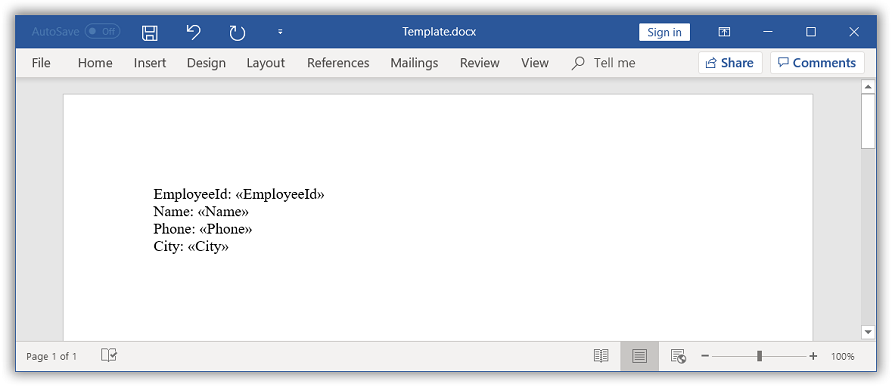
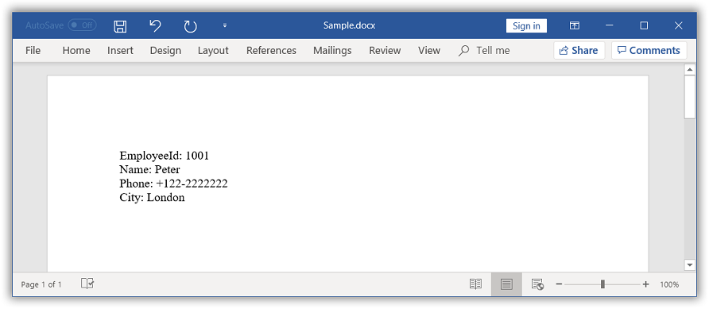

# Simple Mail merge

You can create a Word document template using Microsoft Word application or by adding merge fields in the Word document programmatically. For further information, click [here](https://help.syncfusion.com/file-formats/docio/working-with-mail-merge#create-word-document-template).

## Mail merge with string arrays

The `MailMerge` class provides various overloads for `Execute` method to perform Mail merge from various data sources. The Mail merge operation replaces the matching merge fields with the respective data.

### Create Word document template
The following code example shows how to create a Word template document with merge fields.

  


//Creates an instance of a WordDocument 
WordDocument document = new WordDocument();
//Adds one section and one paragraph to the document
document.EnsureMinimal();
//Sets page margins to the last section of the document
document.LastSection.PageSetup.Margins.All = 72;
//Appends text to the last paragraph.
document.LastParagraph.AppendText("EmployeeId: ");
//Appends merge field to the last paragraph.
document.LastParagraph.AppendField("EmployeeId", FieldType.FieldMergeField);
document.LastParagraph.AppendText("\nName: ");
document.LastParagraph.AppendField("Name", FieldType.FieldMergeField);
document.LastParagraph.AppendText("\nPhone: ");
document.LastParagraph.AppendField("Phone", FieldType.FieldMergeField);
document.LastParagraph.AppendText("\nCity: ");
document.LastParagraph.AppendField("City", FieldType.FieldMergeField);
//Saves and closes the WordDocument instance.
document.Save("Template.docx", FormatType.Docx);
document.Close();



'Creates an instance of a WordDocument 
Dim document As New WordDocument()
'Adds one section and one paragraph to the document
document.EnsureMinimal()
'Sets page margins to the last section of the document
document.LastSection.PageSetup.Margins.All = 72
'Appends text to the last paragraph.
document.LastParagraph.AppendText("EmployeeId: ")
'Appends merge field to the last paragraph.
document.LastParagraph.AppendField("EmployeeId", FieldType.FieldMergeField)
document.LastParagraph.AppendText(vbLf & "Name: ")
document.LastParagraph.AppendField("Name", FieldType.FieldMergeField)
document.LastParagraph.AppendText(vbLf & "Phone: ")
document.LastParagraph.AppendField("Phone", FieldType.FieldMergeField)
document.LastParagraph.AppendText(vbLf & "City: ")
document.LastParagraph.AppendField("City", FieldType.FieldMergeField)
'Saves and closes the WordDocument instance.
document.Save("Template.docx", FormatType.Docx)
document.Close()



//Creates an instance of a WordDocument
WordDocument document = new WordDocument();
//Adds one section and one paragraph to the document
document.EnsureMinimal();
//Sets page margins to the last section of the document
document.LastSection.PageSetup.Margins.All = 72;
//Appends text to the last paragraph
document.LastParagraph.AppendText("EmployeeId: ");
//Appends merge field to the last paragraph
document.LastParagraph.AppendField("EmployeeId", FieldType.FieldMergeField);
document.LastParagraph.AppendText("\nName: ");
document.LastParagraph.AppendField("Name", FieldType.FieldMergeField);
document.LastParagraph.AppendText("\nPhone: ");
document.LastParagraph.AppendField("Phone", FieldType.FieldMergeField);
document.LastParagraph.AppendText("\nCity: ");
document.LastParagraph.AppendField("City", FieldType.FieldMergeField);
//Saves the Word file to MemoryStream
MemoryStream stream = new MemoryStream();
await document.SaveAsync(stream, FormatType.Docx);
//Closes the Word document
document.Close();
//Saves the stream as Word file in local machine
Save(stream, "Template.docx");

//Refer to the following link to save Word document in UWP platform.
//https://help.syncfusion.com/file-formats/docio/create-word-document-in-uwp#save-word-document-in-uwp



//Creates an instance of a WordDocument 
WordDocument document = new WordDocument();
//Adds one section and one paragraph to the document
document.EnsureMinimal();
//Sets page margins to the last section of the document
document.LastSection.PageSetup.Margins.All = 72;
//Appends text to the last paragraph.
document.LastParagraph.AppendText("EmployeeId: ");
//Appends merge field to the last paragraph.
document.LastParagraph.AppendField("EmployeeId", FieldType.FieldMergeField);
document.LastParagraph.AppendText("\nName: ");
document.LastParagraph.AppendField("Name", FieldType.FieldMergeField);
document.LastParagraph.AppendText("\nPhone: ");
document.LastParagraph.AppendField("Phone", FieldType.FieldMergeField);
document.LastParagraph.AppendText("\nCity: ");
document.LastParagraph.AppendField("City", FieldType.FieldMergeField);
//Saves the Word document to MemoryStream
MemoryStream stream = new MemoryStream();
document.Save(stream, FormatType.Docx);
//Closes the Word document
document.Close();
stream.Position = 0;
//Download Word document in the browser
return File(stream, "application/msword", "Template.docx");



//Creates an instance of a WordDocument
WordDocument document = new WordDocument();
//Adds one section and one paragraph to the document
document.EnsureMinimal();
//Sets page margins to the last section of the document
document.LastSection.PageSetup.Margins.All = 72;
//Appends text to the last paragraph
document.LastParagraph.AppendText("EmployeeId: ");
//Appends merge field to the last paragraph
document.LastParagraph.AppendField("EmployeeId", FieldType.FieldMergeField);
document.LastParagraph.AppendText("\nName: ");
document.LastParagraph.AppendField("Name", FieldType.FieldMergeField);
document.LastParagraph.AppendText("\nPhone: ");
document.LastParagraph.AppendField("Phone", FieldType.FieldMergeField);
document.LastParagraph.AppendText("\nCity: ");
document.LastParagraph.AppendField("City", FieldType.FieldMergeField);
//Saves the Word file to MemoryStream
MemoryStream stream = new MemoryStream();
document.Save(stream, FormatType.Docx);
//Closes the Word document
document.Close();
//Save the stream as a file in the device and invoke it for viewing
Xamarin.Forms.DependencyService.Get<ISave>().SaveAndView("Template.docx", "application/msword", stream);

//Download the helper files from the following link to save the stream as file and open the file for viewing in Xamarin platform.
//https://help.syncfusion.com/file-formats/docio/create-word-document-in-xamarin#helper-files-for-xamarin


  

The generated template document looks as follows.

### Execute mail merge

The following code example shows how to perform a simple Mail merge in the generated template document with string array as data source.

  


//Opens the template document
WordDocument document = new WordDocument("Template.docx");
string[] fieldNames = new string[] { "EmployeeId", "Name", "Phone", "City" };
string[] fieldValues = new string[] { "1001", "Peter", "+122-2222222", "London" };
//Performs the mail merge
document.MailMerge.Execute(fieldNames, fieldValues);
//Saves and closes the WordDocument instance
document.Save("Sample.docx", FormatType.Docx);
document.Close();



'Opens the template document
Dim document As New WordDocument("Template.docx")
Dim fieldNames As String() = New String() {"EmployeeId", "Name", "Phone", "City"}
Dim fieldValues As String() = New String() {"1001", "Peter", "+122-2222222", "London"}
'Performs the mail merge
document.MailMerge.Execute(fieldNames, fieldValues)
'Saves and closes the WordDocument instance
document.Save("Sample.docx", FormatType.Docx)
document.Close()



//Creates an instance of a WordDocument
Assembly assembly = typeof(App).GetTypeInfo().Assembly;
WordDocument document = new WordDocument();
document.Open(assembly.GetManifestResourceStream("Sample.Assets.Template.docx"), FormatType.Docx);
string[] fieldNames = new string[] { "EmployeeId", "Name", "Phone", "City" };
string[] fieldValues = new string[] { "1001", "Peter", "+122-2222222", "London" };
//Performs the mail merge
document.MailMerge.Execute(fieldNames, fieldValues);
//Saves the Word file to MemoryStream
MemoryStream stream = new MemoryStream();
await document.SaveAsync(stream, FormatType.Docx);
//Closes the Word document
document.Close();
//Saves the stream as Word file in local machine
Save(stream, "Sample.docx");

//Refer to the following link to save Word document in UWP platform.
//https://help.syncfusion.com/file-formats/docio/create-word-document-in-uwp#save-word-document-in-uwp



//Opens the template document
FileStream fileStreamPath = new FileStream("Template.docx", FileMode.Open, FileAccess.Read, FileShare.ReadWrite);
WordDocument document = new WordDocument(fileStreamPath, FormatType.Docx);
string[] fieldNames = new string[] { "EmployeeId", "Name", "Phone", "City" };
string[] fieldValues = new string[] { "1001", "Peter", "+122-2222222", "London" };
//Performs the mail merge
document.MailMerge.Execute(fieldNames, fieldValues);
//Saves the Word document to MemoryStream
MemoryStream stream = new MemoryStream();
document.Save(stream, FormatType.Docx);
//Closes the Word document
document.Close();
stream.Position = 0;
//Download Word document in the browser
return File(stream, "application/msword", "Sample.docx");



//Opens the template document
Assembly assembly = typeof(App).GetTypeInfo().Assembly;
WordDocument document = new WordDocument(assembly.GetManifestResourceStream("Sample.Assets.Template.docx"), FormatType.Docx);
string[] fieldNames = new string[] { "EmployeeId", "Name", "Phone", "City" };
string[] fieldValues = new string[] { "1001", "Peter", "+122-2222222", "London" };
//Performs the mail merge
document.MailMerge.Execute(fieldNames, fieldValues);
//Saves the Word file to MemoryStream
MemoryStream stream = new MemoryStream();
document.Save(stream, FormatType.Docx);
//Closes the Word document
document.Close();
//Save the stream as a file in the device and invoke it for viewing
Xamarin.Forms.DependencyService.Get<ISave>().SaveAndView("Sample.docx", "application/msword", stream);

//Download the helper files from the following link to save the stream as file and open the file for viewing in Xamarin platform.
//https://help.syncfusion.com/file-formats/docio/create-word-document-in-xamarin#helper-files-for-xamarin


  

The resultant document looks as follows.

