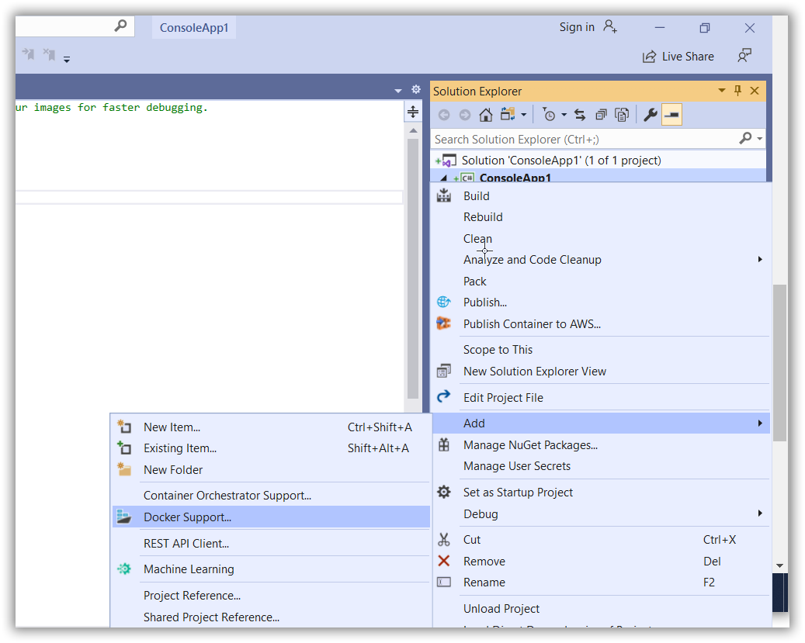
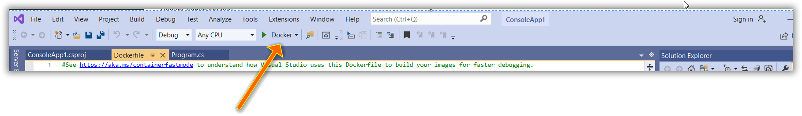

# Word document to PDF Conversion in Linux Docker

## Prerequisites 

* Docker must be installed on your system. For information on how to install Docker on Windows or Mac, refer to the links in the [See Also](https://help.syncfusion.com/file-formats/docio/word-to-pdf-linux-docker#see-also) section.
* Also, note that Visual Studio 2019, .NET Core 3.1 SDK is used in the example, provided below.

## Creating the Console Application
1.	Create simple .NET Core 3.1 targeted console application using Visual Studio.
2.	Add Word to PDF conversion code snippet in the application and install [DocIORenderer](https://www.nuget.org/packages/Syncfusion.DocIORenderer.Net.Core/), [SkiaSharp.NativeAssets.Linux](https://www.nuget.org/packages/SkiaSharp.NativeAssets.Linux/2.80.3-preview.40) packages. 
(Refer-[Word to PDF conversion in Core platform](https://help.syncfusion.com/file-formats/docio/word-to-pdf?cs-save-lang=1&cs-lang=asp.net%20core))
3. Add Docker support to that application by clicking <b>Add -> Docker Support</b>.

4. Open the DockerFile and you can see default simple Docker commands as below,




FROM mcr.microsoft.com/dotnet/aspnet:3.1-buster-slim AS base
WORKDIR /app
EXPOSE 80
EXPOSE 443

FROM mcr.microsoft.com/dotnet/sdk:3.1-buster-slim AS build
WORKDIR /src
COPY ["ConsoleApp1/ConsoleApp1.csproj", "ConsoleApp1/"]
RUN dotnet restore "ConsoleApp1/ConsoleApp1.csproj"
COPY . .
WORKDIR "/src/ConsoleApp1"
RUN dotnet build "ConsoleApp1.csproj" -c Release -o /app/build

FROM build AS publish
RUN dotnet publish "ConsoleApp1.csproj" -c Release -o /app/publish

FROM base AS final
WORKDIR /app
COPY --from=publish /app/publish .
ENTRYPOINT ["dotnet", "ConsoleApp1.dll"]




5. Add below fontconfig line to avoid unwanted exception in Word to PDF conversion.



RUN apt-get update -y && apt-get install fontconfig -y



N> After installing the fontconfig, we can able to perform Word to PDF conversion in Linux Docker with default font DejaVuSans

6. Run the Docker Container application in background.
7. Click Docker option to run the application

8. Word document will converted properly and saved as PDF.

## Docker commands for various Linux distributions

### Alpine:



FROM mcr.microsoft.com/dotnet/aspnet:3.1-alpine3.12 AS base
RUN apk update && apk upgrade && apk add fontconfig
RUN apk add --update ttf-dejavu fontconfig
WORKDIR /app
EXPOSE 80
EXPOSE 443

FROM mcr.microsoft.com/dotnet/sdk:3.1-alpine3.12 AS build
WORKDIR /src
COPY ["ConsoleApp1/ConsoleApp1.csproj", "ConsoleApp1/"]
RUN dotnet restore "ConsoleApp1/ConsoleApp1.csproj"
COPY . .
WORKDIR "/src/ConsoleApp1"
RUN dotnet build "ConsoleApp1.csproj" -c Release -o /app/build

FROM build AS publish
RUN dotnet publish "ConsoleApp1.csproj" -c Release -o /app/publish

FROM base AS final
WORKDIR /app
COPY --from=publish /app/publish .
ENTRYPOINT ["dotnet", "ConsoleApp1.dll"]




### CentOS:




FROM centos:8

Run dnf install dotnet-sdk-3.1 -y
RUN dnf install dotnet-runtime-3.1 -y

RUN dnf install fontconfig -y

ENTRYPOINT ["dotnet" "ConsoleApp1.dll"]




### Debian:




FROM mcr.microsoft.com/dotnet/aspnet:3.1-buster-slim AS base
RUN apt-get update -y && apt-get install fontconfig -y
WORKDIR /app
EXPOSE 80
EXPOSE 443

FROM mcr.microsoft.com/dotnet/sdk:3.1-buster-slim AS build
WORKDIR /src
COPY ["ConsoleApp1/ConsoleApp1.csproj", "ConsoleApp1/"]
RUN dotnet restore "ConsoleApp1/ConsoleApp1.csproj"
COPY . .
WORKDIR "/src/ConsoleApp1"
RUN dotnet build "ConsoleApp1.csproj" -c Release -o /app/build

FROM build AS publish
RUN dotnet publish "ConsoleApp1.csproj" -c Release -o /app/publish

FROM base AS final
WORKDIR /app
COPY --from=publish /app/publish .
ENTRYPOINT ["dotnet", "ConsoleApp1.dll"]




### Fedora:




FROM fedora:latest

Run dnf install dotnet-sdk-3.1 -y
RUN dnf install dotnet-runtime-3.1 -y

RUN dnf install fontconfig -y

ENTRYPOINT ["dotnet" "ConsoleApp1.dll"]




### RHEL - Red Hat Enterprise Linux:




FROM registry.access.redhat.com/ubi8/dotnet-31-runtime AS base
USER root
RUN yum -y install fontconfig --disablerepo=epel
WORKDIR /

FROM registry.access.redhat.com/ubi8/dotnet-31 AS build
WORKDIR /src
COPY ["App1.csproj", ""]
RUN dotnet restore "./App1.csproj"
COPY . .
WORKDIR "/src/."
RUN dotnet build "App1.csproj" -c Release -o /app/build

FROM build AS publish
RUN dotnet publish "App1.csproj" -c Release -o /app/publish

FROM base AS final
WORKDIR /app
COPY --from=publish /app/publish .
ENTRYPOINT ["dotnet", "App1.dll"]




### Ubuntu:




FROM mcr.microsoft.com/dotnet/core/runtime:3.1-bionic AS base
RUN apt-get update -y && apt-get install fontconfig -y
WORKDIR /app

FROM mcr.microsoft.com/dotnet/core/sdk:3.1-bionic AS build
WORKDIR /src
COPY ["UbuntuDocker.csproj", ""]
RUN dotnet restore "./UbuntuDocker.csproj"
COPY . .
WORKDIR "/src/."
RUN dotnet build "UbuntuDocker.csproj" -c Release -o /app/build

FROM build AS publish
RUN dotnet publish "UbuntuDocker.csproj" -c Release -o /app/publish

FROM base AS final
WORKDIR /app
COPY --from=publish /app/publish .
ENTRYPOINT ["dotnet", "UbuntuDocker.dll"]




## See Also:
* [Install Docker Desktop on Windows](https://docs.docker.com/docker-for-windows/install/)
* [Install .NET on Linux](https://docs.microsoft.com/en-us/dotnet/core/install/linux)
