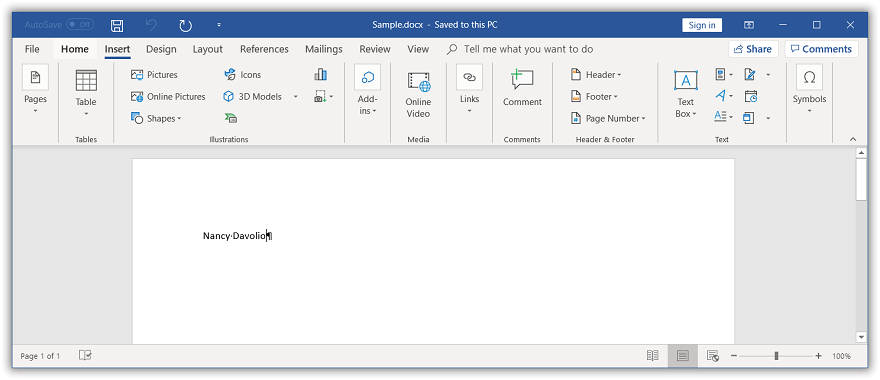

# Working with Mail merge

Mail merge is a process of merging data from data source to a Word template document. The [WMergeField](https://help.syncfusion.com/cr/file-formats/Syncfusion.DocIO.DLS.WMergeField.html) class provides support to bind template document and data source. The [WMergeField](https://help.syncfusion.com/cr/file-formats/Syncfusion.DocIO.DLS.WMergeField.html) instance is replaced with the actual data retrieved from data source for the given merge field name in a template document.

The following data sources are supported by Essential DocIO for performing Mail merge:

* String Arrays
* ADO.NET objects
* Dynamic objects
* .NET objects

## Mail merge process

The mail merge process involves three documents:

1. **Template Word document**: This document contains the static or templated text and graphics along with the merge fields (that are placeholders) for replacing dynamic data.

2. **Data source**: This represents file or database containing data to replace the merge fields in template Word document.

3. **Final merged document**: This resultant document is a combination of the template Word document and the data from data source.

T> 1. You can use conditional fields ([IF](https://support.office.com/en-us/article/Field-codes-IF-field-9f79e82f-e53b-4ff5-9d2c-ae3b22b7eb5e), [Formula](https://support.office.com/en-us/article/field-codes-formula-field-32d5c9de-3516-4ec3-80ed-d1fc2b5bc21d?ui=en-US&rs=en-US&ad=US)) combined with merge fields, when you require intelligent decisions in addition to simple mail merge (replace merge fields with result text). To use conditional fields, execute mail merge and then update fields in the Word document using [UpdateDocumentFields](https://help.syncfusion.com/cr/file-formats/Syncfusion.DocIO.DLS.WordDocument.html#Syncfusion_DocIO_DLS_WordDocument_UpdateDocumentFields) API.
T> 2. You can replace the fields ([IF](https://support.office.com/en-us/article/Field-codes-IF-field-9f79e82f-e53b-4ff5-9d2c-ae3b22b7eb5e), [Formula](https://support.office.com/en-us/article/field-codes-formula-field-32d5c9de-3516-4ec3-80ed-d1fc2b5bc21d?ui=en-US&rs=en-US&ad=US)) combined with merge fields, with its most recent result and **generates the plain Word document** by unlinking the fields. Refer to this [link](https://help.syncfusion.com/file-formats/docio/working-with-fields#unlink-fields) for more information. 

### Create Word document template

You can create a template document with merge fields by using any Word editor application, like Microsoft Word. By using Word editor application, you can take the advantage of the visual interface to design unique layout, formatting, and more for your Word document template interactively. 

The following screenshot shows how to insert a merge field in the Word document by **using the Microsoft Word.**

You need to add a prefix (“Image:”) to the merge field name for merging an image in the place of a merge field.

**For example:** The merge field name should be like “Image:Photo” (<<Image:MergeFieldName>>)

You can **create Word document template programmatically** by adding merge fields to the Word document using Essential DocIO.

The following code example shows how to create a merge field in the Word document.

  


//Creates an instance of a WordDocument 
WordDocument document = new WordDocument();
//Adds a section and a paragraph in the document
document.EnsureMinimal();
//Appends merge field to the last paragraph.
document.LastParagraph.AppendField("FullName", FieldType.FieldMergeField);
//Saves and closes the WordDocument instance.
document.Save("Template.docx");
document.Close();



'Creates an instance of a WordDocument 
Dim document As WordDocument = New WordDocument
'Adds a section and a paragraph in the document
document.EnsureMinimal()
'Appends merge field to the last paragraph.
document.LastParagraph.AppendField("FullName", FieldType.FieldMergeField)
'Saves and closes the WordDocument instance.
document.Save("Template.docx")
document.Close()



//Creates an instance of a WordDocument 
WordDocument document = new WordDocument();
//Adds a section and a paragraph in the document
document.EnsureMinimal();
//Appends merge field to the last paragraph.
document.LastParagraph.AppendField("FullName", FieldType.FieldMergeField);
//Saves the Word file to MemoryStream
MemoryStream stream = new MemoryStream();
await document.SaveAsync(stream, FormatType.Docx);
//Saves the stream as Word file in local machine
Save(stream, "Template.docx");
document.Close();

//Refer to the following link to save Word document in UWP platform.
//https://help.syncfusion.com/file-formats/docio/create-word-document-in-uwp#save-word-document-in-uwp



//Creates an instance of a WordDocument 
WordDocument document = new WordDocument();
//Adds a section and a paragraph in the document
document.EnsureMinimal();
//Appends merge field to the last paragraph.
document.LastParagraph.AppendField("FullName", FieldType.FieldMergeField);
//Saves the Word document to MemoryStream
MemoryStream stream = new MemoryStream();
document.Save(stream, FormatType.Docx);
//Closes the Word document
document.Close();
stream.Position = 0;
//Download Word document in the browser
return File(stream, "application/msword", "Template.docx");



//Creates an instance of a WordDocument 
WordDocument document = new WordDocument();
//Adds a section and a paragraph in the document
document.EnsureMinimal();
//Appends merge field to the last paragraph.
document.LastParagraph.AppendField("FullName", FieldType.FieldMergeField);
//Saves the Word document to  MemoryStream
MemoryStream stream = new MemoryStream();
document.Save(stream, FormatType.Docx);
//Closes the Word document
document.Close();
//Save the stream as a file in the device and invoke it for viewing
Xamarin.Forms.DependencyService.Get<ISave>().SaveAndView("Template.docx", "application/msword", stream);

//Download the helper files from the following link to save the stream as file and open the file for viewing in Xamarin platform.
//https://help.syncfusion.com/file-formats/docio/create-word-document-in-xamarin#helper-files-for-xamarin




You can download a complete working sample from [GitHub](https://github.com/SyncfusionExamples/DocIO-Examples/tree/main/Mail-Merge/Create-merge-field).

### Execute mail merge

The following code example shows how to perform mail merge in above Word document template using string arrays as data source.

  

//Opens the template document
WordDocument document = new WordDocument("Template.docx");
string[] fieldNames = new string[] { "FullName" };
string[] fieldValues = new string[] { "Nancy Davolio" };
//Performs the mail merge
document.MailMerge.Execute(fieldNames, fieldValues);
//Saves and closes the WordDocument instance
document.Save("Sample.docx", FormatType.Docx);
document.Close();



'Opens the template document
Dim document As New WordDocument("Template.docx")
Dim fieldNames As String() = New String() {"FullName"}
Dim fieldValues As String() = New String() {"Nancy Davolio"}
'Performs the mail merge
document.MailMerge.Execute(fieldNames, fieldValues)
'Saves and closes the WordDocument instance
document.Save("Sample.docx", FormatType.Docx)
document.Close()



//Creates an instance of a WordDocument
Assembly assembly = typeof(App).GetTypeInfo().Assembly;
WordDocument document = new WordDocument();
document.Open(assembly.GetManifestResourceStream("Sample.Assets.Template.docx"), FormatType.Docx);
string[] fieldNames = new string[] { "FullName" };
string[] fieldValues = new string[] { "Nancy Davolio" };
//Performs the mail merge
document.MailMerge.Execute(fieldNames, fieldValues);
//Saves the Word file to MemoryStream
MemoryStream stream = new MemoryStream();
await document.SaveAsync(stream, FormatType.Docx);
//Saves the stream as Word file in local machine
Save(stream, "Sample.docx");
document.Close();

//Refer to the following link to save Word document in UWP platform.
//https://help.syncfusion.com/file-formats/docio/create-word-document-in-uwp#save-word-document-in-uwp



//Opens the template document
FileStream fileStreamPath = new FileStream("Template.docx", FileMode.Open, FileAccess.Read, FileShare.ReadWrite);
WordDocument document = new WordDocument(fileStreamPath, FormatType.Docx);
string[] fieldNames = new string[] { "FullName" };
string[] fieldValues = new string[] { "Nancy Davolio" };
//Performs the mail merge
document.MailMerge.Execute(fieldNames, fieldValues);
//Saves the Word document to MemoryStream
MemoryStream stream = new MemoryStream();
document.Save(stream, FormatType.Docx);
//Closes the Word document
document.Close();
stream.Position = 0;
//Download Word document in the browser
return File(stream, "application/msword", "Sample.docx");



//Opens the template document
Assembly assembly = typeof(App).GetTypeInfo().Assembly;
WordDocument document = new WordDocument(assembly.GetManifestResourceStream("Sample.Assets.Template.docx"), FormatType.Docx);
string[] fieldNames = new string[] { "FullName" };
string[] fieldValues = new string[] { "Nancy Davolio" };
//Performs the mail merge
document.MailMerge.Execute(fieldNames, fieldValues);
//Saves the Word file to MemoryStream
MemoryStream stream = new MemoryStream();
document.Save(stream, FormatType.Docx);
//Save the stream as a file in the device and invoke it for viewing
Xamarin.Forms.DependencyService.Get<ISave>().SaveAndView("Sample.docx", "application/msword", stream);
//Closes the document 
document.Close();

//Download the helper files from the following link to save the stream as file and open the file for viewing in Xamarin platform.
//https://help.syncfusion.com/file-formats/docio/create-word-document-in-xamarin#helper-files-for-xamarin



You can download a complete working sample from [GitHub](https://github.com/SyncfusionExamples/DocIO-Examples/tree/main/Mail-Merge/Getting-started-mail-merge).

By executing the previous code example, it generates the resultant Word document as follows.

## Simple Mail merge

The [MailMerge](https://help.syncfusion.com/cr/file-formats/Syncfusion.DocIO.DLS.MailMerge.html) class provides various overloads for the [Execute](https://help.syncfusion.com/cr/file-formats/Syncfusion.DocIO.DLS.MailMerge.html#Syncfusion_DocIO_DLS_MailMerge_Execute_System_String___System_String___) method to perform Mail merge from various data sources. For further information, click [here](https://help.syncfusion.com/file-formats/docio/mail-merge/simple-mail-merge). 

## Performing Mail merge for a group

You can perform Mail merge and append multiple records from data source within a specified region to a template document. For further information, click [here](https://help.syncfusion.com/file-formats/docio/mail-merge/mail-merge-for-group).

## Performing Nested Mail merge for group

You can perform nested Mail merge with relational or hierarchical data source and independent data tables in a template document. For further information, click [here](https://help.syncfusion.com/file-formats/docio/mail-merge/mail-merge-for-nested-groups).

## Performing Mail merge with dynamic objects

Essential DocIO allows you to perform Mail merge with the dynamic objects. For further information, click [here](https://help.syncfusion.com/file-formats/docio/mail-merge/mail-merge-for-nested-groups#mail-merge-with-dynamic-objects).

## Performing Mail merge with business objects

You can perform Mail merge with business objects in a template document. For further information, click [here](https://help.syncfusion.com/file-formats/docio/mail-merge/mail-merge-for-group#mail-merge-with-.NET-objects).

## Performing Nested Mail merge with relational data objects

Essential DocIO supports performing nested Mail merge with implicit relational data objects without any explicit relational commands by using the [ExecuteNestedGroup](https://help.syncfusion.com/cr/file-formats/Syncfusion.DocIO.DLS.MailMerge.html#Syncfusion_DocIO_DLS_MailMerge_ExecuteNestedGroup_Syncfusion_DocIO_DLS_MailMergeDataTable_) overload method. For further information, click [here](https://help.syncfusion.com/file-formats/docio/mail-merge/mail-merge-for-nested-groups#mail-merge-with-implicit-relational-data).

## Event support for mail merge

The [MailMerge](https://help.syncfusion.com/cr/file-formats/Syncfusion.DocIO.DLS.MailMerge.html) class provides event support to customize the document contents and merging image data during the Mail merge process. The following events are supported by Essential DocIO in Mail merge process:

* [MergeField](https://help.syncfusion.com/cr/file-formats/Syncfusion.DocIO.DLS.MergeFieldEventHandler.html): Occurs when a **Mail merge field** except image Mail merge field is encountered.

* [MergeImageField](https://help.syncfusion.com/cr/file-formats/Syncfusion.DocIO.DLS.MergeImageFieldEventHandler.html): Occurs when an **image Mail merge field** is encountered.

* [BeforeClearField](https://help.syncfusion.com/cr/file-formats/Syncfusion.DocIO.DLS.BeforeClearFieldEventHandler.html): Occurs when an **unmerged field** is encountered.

* [BeforeClearGroupField](https://help.syncfusion.com/cr/file-formats/Syncfusion.DocIO.DLS.BeforeClearGroupFieldEventHandler.html): Occurs when an **unmerged group field** is encountered.

### MergeField event

You can customize the merging text during Mail merge process by using the [MergeField](https://help.syncfusion.com/cr/file-formats/Syncfusion.DocIO.DLS.MergeFieldEventHandler.html) event. For further information, click [here](https://help.syncfusion.com/file-formats/docio/mail-merge/mail-merge-events#mergefield-event).

### MergeImageField event

You can customize the merging image during Mail merge process by using the [MergeImageField](https://help.syncfusion.com/cr/file-formats/Syncfusion.DocIO.DLS.MergeImageFieldEventHandler.html) event. For further information, click [here](https://help.syncfusion.com/file-formats/docio/mail-merge/mail-merge-events#mergeimagefield-event).

### BeforeClearField event

You can get the unmerged fields during Mail merge process by using the [BeforeClearField](https://help.syncfusion.com/cr/file-formats/Syncfusion.DocIO.DLS.BeforeClearFieldEventHandler.html) event. For further information, click [here](https://help.syncfusion.com/file-formats/docio/mail-merge/mail-merge-events#beforeclearfield-event).

### BeforeClearGroupField event

You can get the unmerged groups during Mail merge process by using the [BeforeClearGroupField](https://help.syncfusion.com/cr/file-formats/Syncfusion.DocIO.DLS.BeforeClearGroupFieldEventHandler.html) event. For further information, click [here](https://help.syncfusion.com/file-formats/docio/mail-merge/mail-merge-events#beforecleargroupfield-event).

## Mail merge options

The [MailMerge](https://help.syncfusion.com/cr/file-formats/Syncfusion.DocIO.DLS.MailMerge.html) class allows you to customize the Mail merge process with the following options:

### Field mapping

You can automatically map the merge field names with data source column names during Mail merge process. For further information, click [here](https://help.syncfusion.com/file-formats/docio/mail-merge/mail-merge-options#field-mapping).

### Retrieving the merge field names

You can retrieve the merge field names and also merge field group names in the Word document. For further information, click [here](https://help.syncfusion.com/file-formats/docio/mail-merge/mail-merge-options#retrieve-the-merge-field-names).

### Removing empty paragraphs

You can remove the empty paragraphs when the paragraph has a merge field item without any data during Mail merge process. For further information, click [here](https://help.syncfusion.com/file-formats/docio/mail-merge/mail-merge-options#remove-empty-paragraphs).

### Removing empty merge fields

You can remove or keep the unmerged merge fields in the output document based on the [ClearFields](https://help.syncfusion.com/cr/file-formats/Syncfusion.DocIO.DLS.MailMerge.html#Syncfusion_DocIO_DLS_MailMerge_ClearFields) property on each mail merge execution. For further information, click [here](https://help.syncfusion.com/file-formats/docio/mail-merge/mail-merge-options#remove-empty-merge-fields).

### Restart numbering in lists

You can restart the list numbering in a Word document during Mail merge. For further information, click [here](https://help.syncfusion.com/file-formats/docio/mail-merge/mail-merge-options#restart-numbering-in-lists).

## See Also

* [How to mail merge Word document in Azure functions v1](https://www.syncfusion.com/kb/10671/how-to-mail-merge-word-document-in-azure-functions-v1)
* [How to display mail merge result using format switch in the Word document](https://www.syncfusion.com/kb/12849/how-to-display-mail-merge-result-using-format-switch-in-the-word-document)
* [Is this possible to Mail Merge using csv data source](https://www.syncfusion.com/kb/293/is-this-possible-to-mail-merge-using-csv-data-source)
* [How to mail merge Word document in Linux (Mono)](https://www.syncfusion.com/kb/10666/how-to-mail-merge-word-document-in-linux-mono)
* [How to replace merge field with HTML string using Mail merge](https://www.syncfusion.com/kb/11701/how-to-replace-merge-field-with-html-string-using-mail-merge)
* [How to mail merge Word document in Docker](https://www.syncfusion.com/kb/10769/how-to-mail-merge-word-document-in-docker)
