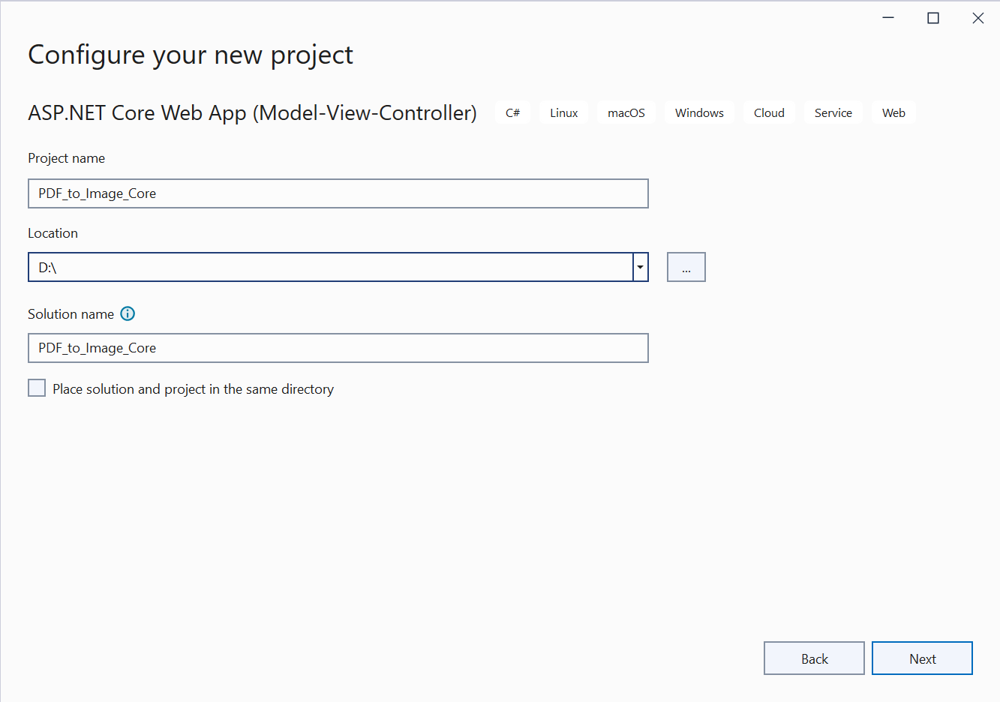

# Convert PDF file to Image in ASP.NET Core

The Syncfusion PDF to Image converter is a .NET library used to convert PDF document to image in ASP.NET Core application.

## Steps to convert PDF document to Image in ASP.NET Core application

Step 1: Create a new C# ASP.NET Core Web Application project.

Step 2:  In configuration windows, name your project and select Next.

Step 3:  Install [Syncfusion.PdfToImageConverter.Net](https://www.nuget.org/packages/Syncfusion.PdfToImageConverter.Net/) NuGet package as reference to your .NET Standard applications from [NuGet.org](https://www.nuget.org/).

N> Starting with v16.2.0.x, if you reference Syncfusion assemblies from trial setup or from the NuGet feed, you also have to add "Syncfusion.Licensing" assembly reference and include a license key in your projects. Please refer to this [link](https://help.syncfusion.com/common/essential-studio/licensing/overview) to know about registering Syncfusion license key in your application to use our components.

Step 4: A default controller with name HomeController.cs gets added on creation of ASP.NET Core MVC project. Include the following namespaces in that HomeController.cs file.



using Syncfusion.PdfToImageConverter;
using System.Drawing;
using System.IO;



Step 5: Add a new button in index.cshtml as shown below.



@{Html.BeginForm("ExportToImage", "Home", FormMethod.Post);
    {
        

            <input type="submit" value="Convert Image" style="width:150px;height:27px" />
        

    }
    Html.EndForm();
}



Step 6: Add a new action method named ExportToImage in HomeController.cs and include the below code example to convert PDF document to Image using Convert method in PdfToImageConverter class.



//Initialize PDF to Image converter.
PdfToImageConverter imageConverter = new PdfToImageConverter();
//Load the PDF document as a stream
FileStream inputStream = new FileStream("Input.pdf", FileMode.Open, FileAccess.ReadWrite);
imageConverter.Load(inputStream);
//Convert PDF to Image.
Stream outputStream = imageConverter.Convert(0, false, false);
return File(outputStream.ToArray(), System.Net.Mime.MediaTypeNames.Image.Png, "sample.png");



By executing the program, you will get the image as follows.
