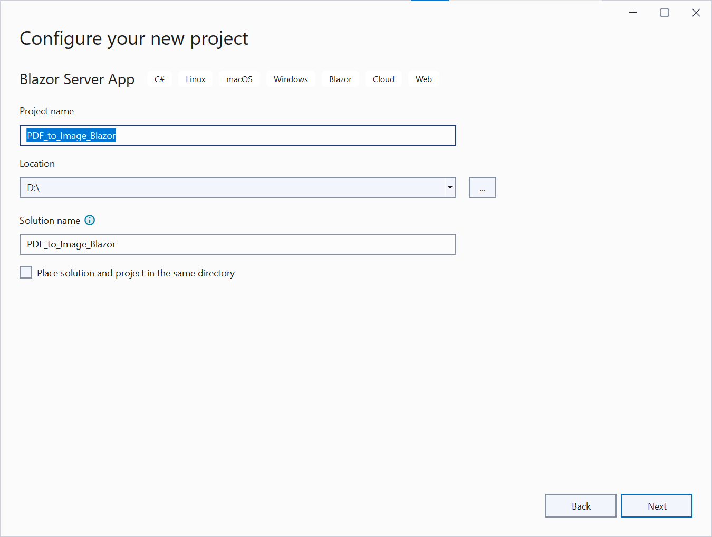
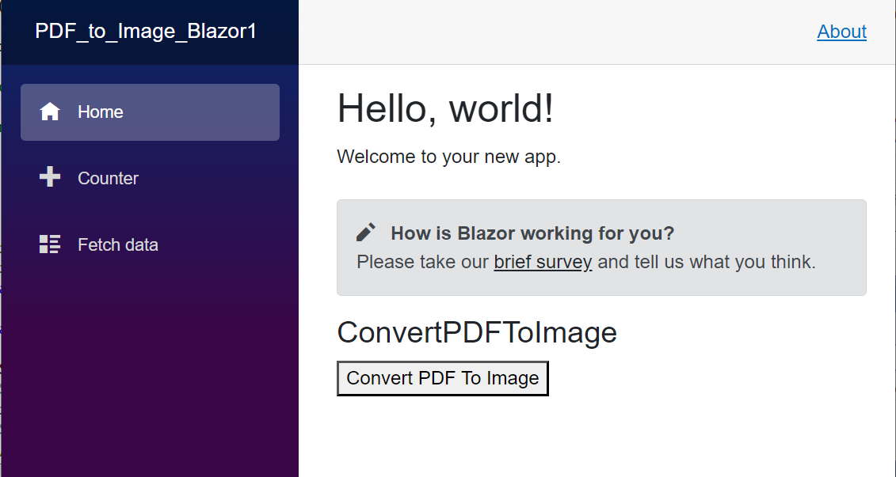

# Convert PDF file to Image in Blazor

The Syncfusion&reg; PDF to Image converter is a .NET library used to convert PDF document to image in Blazor application.

## Steps to convert PDF document to Image in Blazor application

Step 1: Create a new C# Blazor Server Application project.
Select Blazor App from the template and click the Next button.

Step 2:  In configuration windows, name your project and select Create.

Step 3:  Install [Syncfusion.PdfToImageConverter.Net](https://www.nuget.org/packages/Syncfusion.PdfToImageConverter.Net/) NuGet package as reference to your .NET Standard applications from [NuGet.org](https://www.nuget.org/).

N> If you want to use the PdfToImageConverter in the Linux environment, you need to install the [SkiaSharp.NativeAssets.Linux v2.88.6](https://www.nuget.org/packages/SkiaSharp.NativeAssets.Linux/2.88.6) NuGet package as reference to your applications from [NuGet.org](https://www.nuget.org/).

Step 4: Create a new razor component named ConvertPDFToImage under Pages folder. Include the following namespace in that ConvertPDFToImage.razor file.



@using Syncfusion.PdfToImageConverter;



Step 5: Create a new button in ConvertPDFToImage.razor using the following code. 



<button @onclick="ExportToImage">Convert PDF To Image</button>



Step 6: Add the ExportToImage method in ConvertPDFToImage.razor and include the below code example to convert PDF document to Image using Convert method in PdfToImageConverter class.


private void ExportToImage()
{
    //Initialize PDF to Image converter.
    PdfToImageConverter imageConverter = new PdfToImageConverter();
    //Load the PDF document as a stream
    FileStream inputStream = new FileStream("Input.pdf", FileMode.Open, FileAccess.ReadWrite);
    imageConverter.Load(inputStream);
    //Convert PDF to Image.
    Stream outputStream = imageConverter.Convert(0, false, false);
    MemoryStream stream = outputStream as MemoryStream;
    byte[] bytes = stream.ToArray();
    using (FileStream output = new FileStream("output.png", FileMode.OpenOrCreate, FileAccess.ReadWrite))
    {
        output.Write(bytes, 0, bytes.Length);
    }
}



Step 7: Add ConvertPDFToImage.razor file in index.razor.



<ConvertPDFToImage></ConvertPDFToImage>



By executing the program, you will get the following output in the browser.

Click the Convert PDF To Image button, you will get the image as follows.
