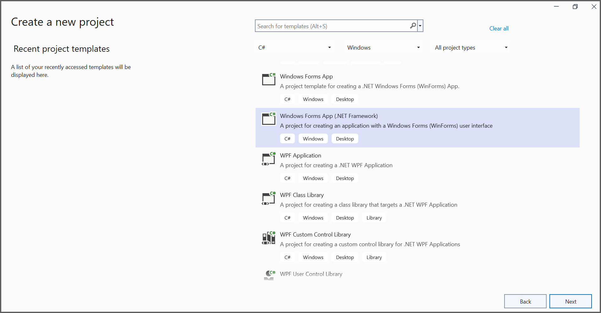
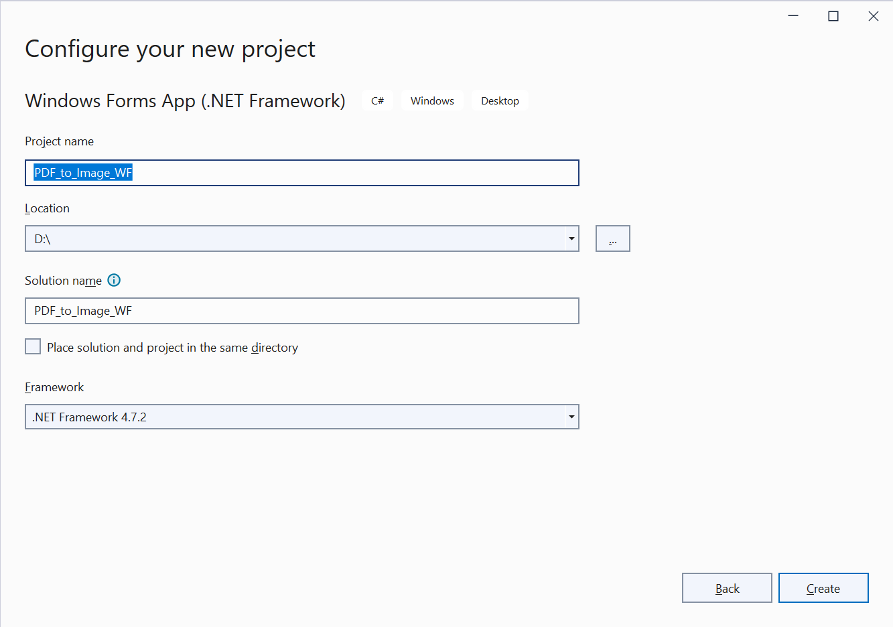

# Convert PDF file to Image in Windows Forms

The Syncfusion&reg;; PDF to Image converter is a .NET library used to convert PDF document to image in WPF application.

## Steps to convert PDF document to Image in Windows Forms

Step 1: Create a new Windows Forms application project.
   

In project configuration window, name your project and select Create.
   

Step 2: Install the [Syncfusion.PdfToImageConverter.WinForms](https://www.nuget.org/packages/Syncfusion.PdfToImageConverter.WinForms/) NuGet package as a reference to your WinForms application [NuGet.org](https://www.nuget.org/).

Step 3: Add the following namespaces into Form1.Designer.cs file.



using System;
using System.Windows.Forms;



Step 4: Add a new button in Form1.Designer.cs to convert PDF document to Image as follows.



private Button btnCreate;
private Label label;
private void InitializeComponent()
{
   btnCreate = new Button();
   label = new Label();

   //Label
   label.Location = new System.Drawing.Point(0, 40);
   label.Size = new System.Drawing.Size(426, 35);
   label.Text = "Click the button to convert PDF file to Image";
   label.TextAlign = System.Drawing.ContentAlignment.MiddleCenter;

   //Button
   btnCreate.Location = new System.Drawing.Point(180, 110);
   btnCreate.Size = new System.Drawing.Size(85, 26);
   btnCreate.Text = "Convert PDF to Image";
   btnCreate.Click += new EventHandler(btnCreate_Click);

   //Create PDF
   ClientSize = new System.Drawing.Size(450, 150);
   Controls.Add(label);
   Controls.Add(btnCreate);
   Text = "Convert PDF to Image";
}



Step 5: Include the following namespaces in the Form1.cs file.



using Syncfusion.PdfToImageConverter;
using System.Drawing;



Step 6: Create the btnCreate_Click event and add the following code in btnCreate_Click to convert PDF document to Image using Convert method in PdfToImageConverter class.



//Initialize PDF to Image converter.
PdfToImageConverter imageConverter = new PdfToImageConverter();
//Load the PDF document as a stream
FileStream inputStream = new FileStream("Input.pdf", FileMode.Open, FileAccess.ReadWrite);
imageConverter.Load(inputStream);
//Convert PDF to Image.
Stream outputStream = imageConverter.Convert(0, false, false);
Bitmap image = new Bitmap(outputStream);
image.Save("sample.png");


By executing the program, you will get the PDF document as follows.

