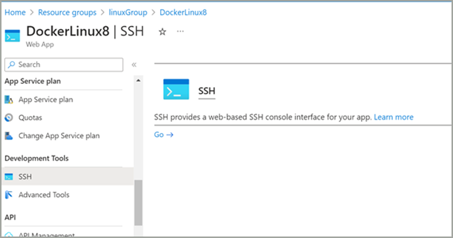
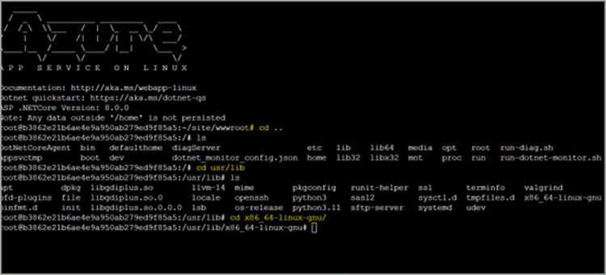
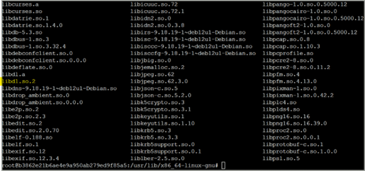
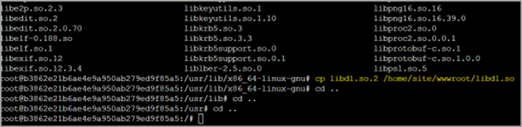
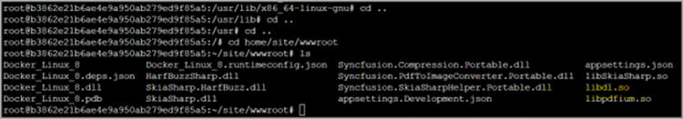

# Run .NET80 PdfToImageConverter Linux application in Azure app service 

To run a .NET 8.0 Linux application with PdfToImageConverter on an Azure App Service, you need the libdl.so file to access the pdfium assembly. However, in Azure App Service, the file is named libdl.so.2 instead of libdl.so. Therefore, to ensure compatibility and functionality, you must manually move and rename libdl.so.2 to libdl.so in the Azure App Service environment for the .NET 8.0 applications. This adjustment allows your .NET 8.0 application to function properly with PdfToImage conversion capabilities.

N> While running the .NET 8.0 PdfToImageConverter Linux application on a Azure app service, you will get the `TypeInitializationException: Type initializer for "Syncfusion.PdfToImageConverter.PdfiumNative" threw an exception`.

## Steps to run the .NET80 PdfToImageConverter Linux application in Azure app service

Step 1: Open the SSH command window which will be present under your Azure app service in [Azure portal](https://portal.azure.com/).

Step 2: Now, navigate back to the home location and then navigate to the usr/lib/x86_64-linux-gnu location in the SSH.

Step 3: List the assemblies present in this location using the `ls` command. You can find the libdl.so.2 assembly in that location instead of libdl.so assembly file.

Step 4: Copy the libdl.so.2 file from this location to the `home\site\wwwroot` folder and rename it to libdl.so using the command `cp libdl.so.2 /home/site/wwwroot/libdl.so`.

Step 5: Then navigate back to the `home\site\wwwroot` folder and ensure whether the copied assembly present in the desired location.

Step 6: Finally, refresh the service page URL and then the application will be work as expected.

N> If still the service is not working properly, stop and start the service again in the Azure portal. The `TypeInitializationException` will no longer be thrown.