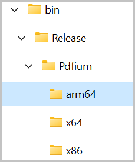
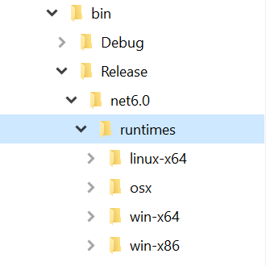

# Convert PDF to image using PDFium

PdfToImageConverter use PDFium to convert pdf document as image. PDFium is used in Google Chrome for rendering PDF files. It provides accurate and robust PDF rendering. 

N> PDFium is not supported in Windows XP operating system.

### How PDFium works with PdfToImageConverter

* On running your application, Syncfusion PdfToImageConverter control generates a folder named `PDFium` in the application output path folder (for example: bin/release or bin/debug) at runtime. 
* Syncfusion PdfToImageConverter control detects the architecture of the running machine automatically.
For WPF, WinForms and MVC, Pdfium folder structure will be generated as below,
* Next, it creates another subfolder named “x64”, “x86” or “arm64” based on the machine architecture.
* Extracts the PDFium binary (PDFium.dll) into the subfolder (x64, x86 or arm64) and consumes it to render PDF files.

For ASP .NET Core and Blazor, Pdfium folder structure will be generated as below,

N> When you include PdfToImageConverter via a NuGet package, PDFium assemblies will automatically be generated in the application's output path folder from the NuGet package during compilation

## How to run PDFium in a restricted access environment

If there is any access restriction applied to the application output folder, then the Syncfusion Pdf To Image Converter cannot able to extract and consume the PDFium engine.

In that situation, you need to add the following steps to consume the PDFium.

* Create a folder where your application can access, create & read files. For example, <b>"d:\ThirdPartyBinaries\"</b>.
* Update the path of this folder to the ReferencePath property of PdfToImageConverter control, like shown in the following code sample.
* If ReferencePath is set, then PdfToImageConverter extracts the PDFium binary inside that specified folder and consume the PDFium rendering engine.




PdfToImageConverter imageConverter = new PdfToImageConverter();
imageConverter.ReferencePath = @"D:\ThirdPartyBinaries\";


