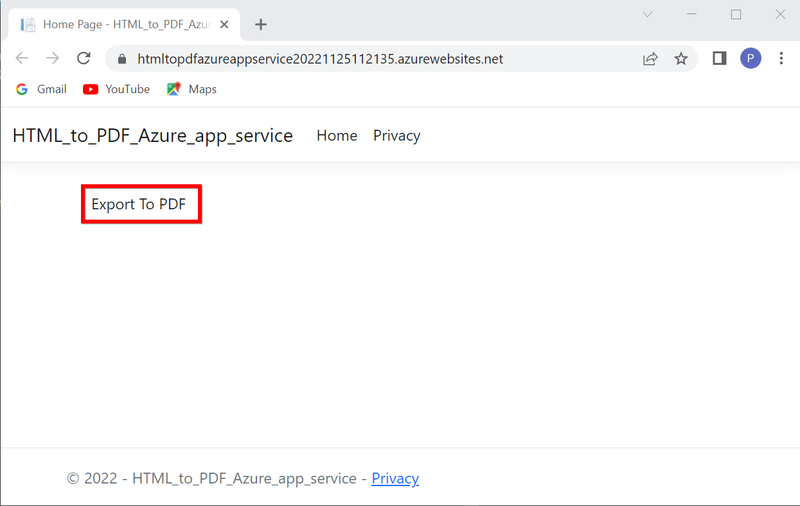
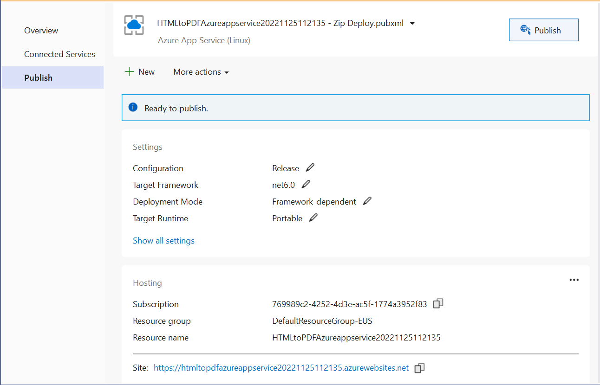

The Syncfusion [HTML to PDF converter](https://www.syncfusion.com/document-processing/pdf-framework/net/html-to-pdf) is a .NET library for converting webpages, SVG, MHTML, and HTML to PDF using C#. It is reliable and accurate. The result preserves all graphics, images, text, fonts, and the layout of the original HTML document or webpage. Using this library, you can convert an HTML to PDF in Azure app service using the Blink with Linux [docker](https://www.docker.com/why-docker) container. 

# Steps to convert HTML to PDF in Azure app service using the Blink with Linux docker container:

Create a new ASP.NET Core application and enable the docker support with Linux as a target OS.

Install the [Syncfusion.HtmlToPdfConverter.Net.Linux](https://www.nuget.org/packages/Syncfusion.HtmlToPdfConverter.Net.Linux/) NuGet package as a reference to your .NET Core application [NuGet.org](https://www.nuget.org/)

Include the following commands in the docker file to install the dependent packages in the docker container.



RUN apt-get update && \
     apt-get install -yq --no-install-recommends \ 
     libasound2 libatk1.0-0 libc6 libcairo2 libcups2 libdbus-1-3 \ 
     libexpat1 libfontconfig1 libgcc1 libgconf-2-4 libgdk-pixbuf2.0-0 libglib2.0-0 libgtk-3-0 libnspr4 \ 
     libpango-1.0-0 libpangocairo-1.0-0 libstdc++6 libx11-6 libx11-xcb1 libxcb1 \ 
     libxcursor1 libxdamage1 libxext6 libxfixes3 libxi6 libxrandr2 libxrender1 libxss1 libxtst6 \ 
     libnss3 libgbm1



Add an Export to the PDF button in the index.cshtml.



    @{ Html.BeginForm("ExportToPDF", "Home", FormMethod.Post);
        {
            <input type="submit" value="Export To PDF" class=" btn" />
        }
}



Include the following namespaces and code samples in the controller for converting HTML to PDF.



using Syncfusion.HtmlConverter;
using Syncfusion.Pdf;
using System.IO





public ActionResult ExportToPDF()
{
     //Initialize HTML to PDF converter. 
     HtmlToPdfConverter htmlConverter = new HtmlToPdfConverter();
 
     BlinkConverterSettings settings = new BlinkConverterSettings();
     
     //Set command line arguments to run without the sandbox.
     settings.CommandLineArguments.Add("--no-sandbox");
     settings.CommandLineArguments.Add("--disable-setuid-sandbox");
     
     //Assign Blink settings to the HTML converter.
     htmlConverter.ConverterSettings = settings;
 
     //Convert URL to PDF.
     PdfDocument document = htmlConverter.Convert("https://www.syncfusion.com");
 
     MemoryStream stream = new MemoryStream();
 
     //Save and close a PDF document. 
     document.Save(stream);
 
     return File(stream.ToArray(), System.Net.Mime.MediaTypeNames.Application.Pdf, "URL_to_PDF.pdf");
}



Build and run the sample in the docker, it will pull the Linux docker image from the docker hub and run the project. Now, the webpage will open in the browser. Click Export to PDF option to convert the Syncfusion webpage to a PDF.

By executing the program, you will get the PDF document as follows.

# Deploy the container to Azure container instance:

Create a publish target to deploy the docker image to Azure. 

Create Azure App Service with resource group, hosting plan, and container registry. 

Publish the docker image to Azure container instance.

It will push the docker image to the Azure container registry and deploy it to the Azure container instance.

After successful deployment, it will open the Azure website in the browser.

Click Export to PDF option to convert the Google webpage to a PDF. You will get the PDF document as follows.
 

A complete work sample can be downloaded from [BlinkLinuxDockerAzureSample.zip.](https://www.syncfusion.com/downloads/support/directtrac/general/ze/BlinkLinuxDockerAzureSample637072917)