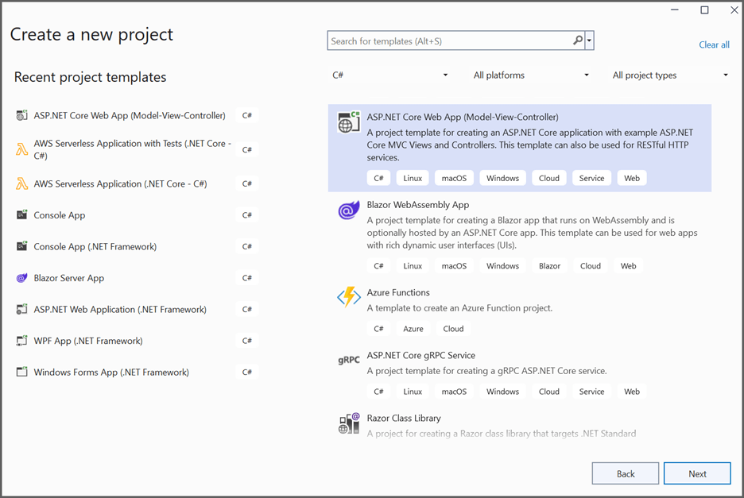
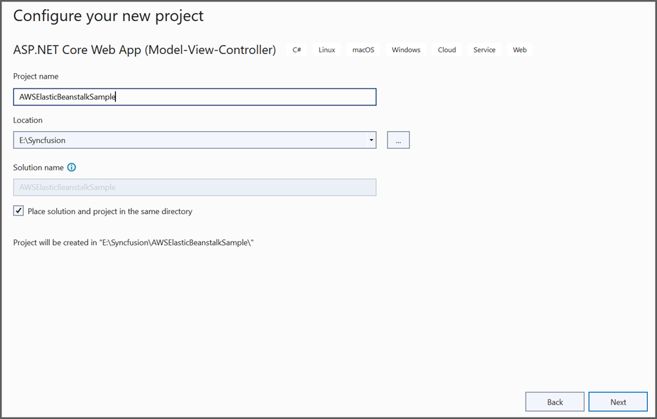
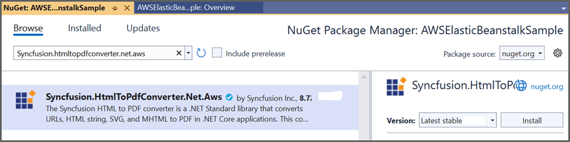
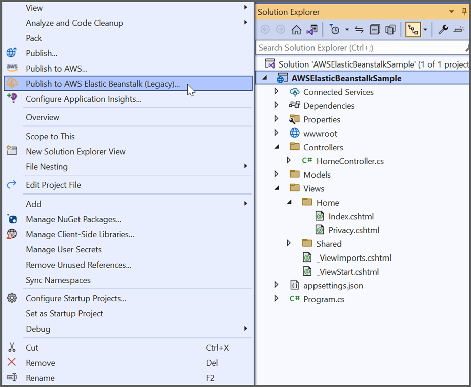
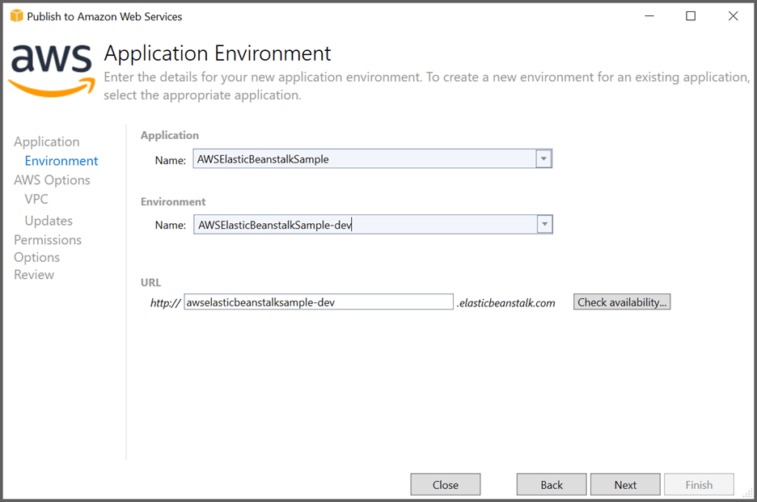
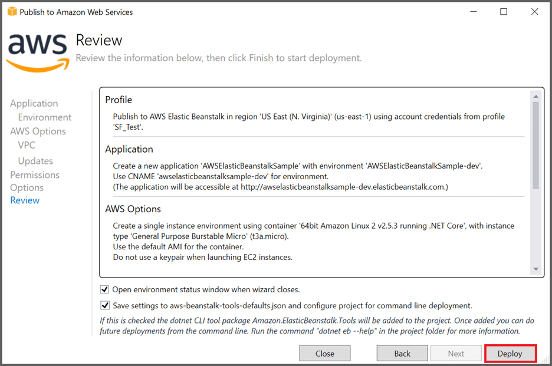
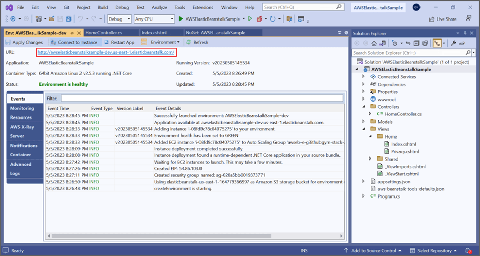
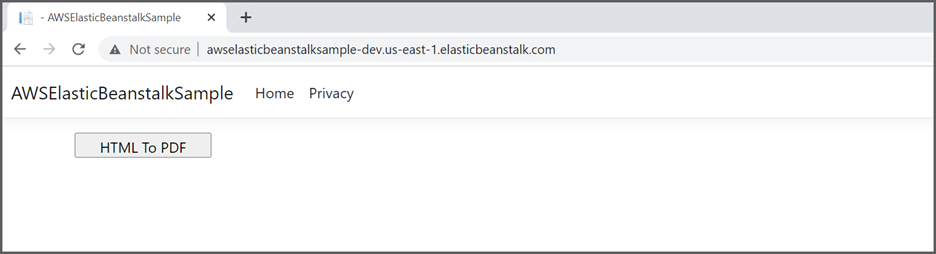
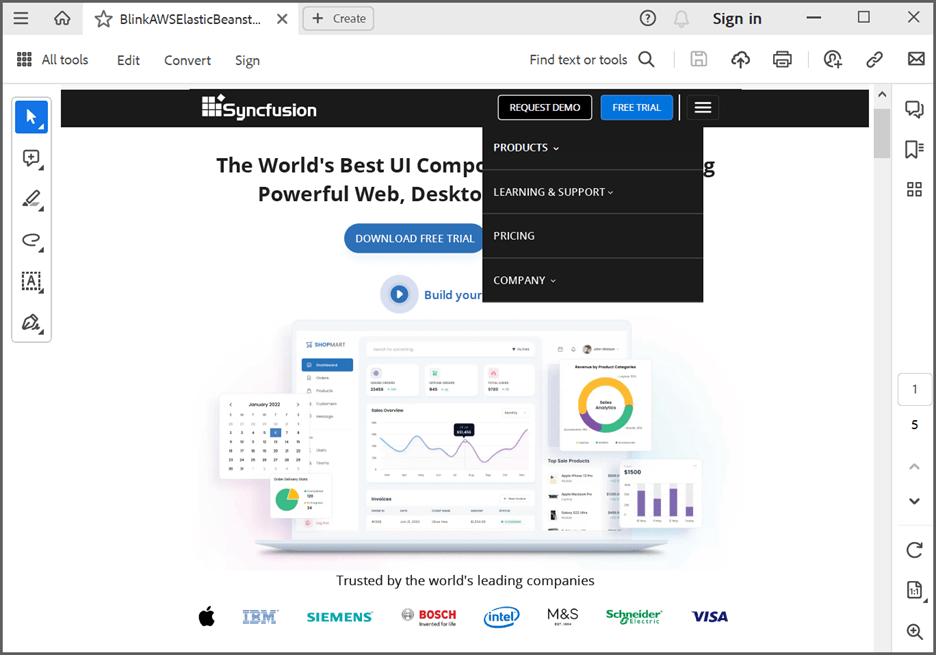

# Convert HTML to PDF file in AWS Elastic Beanstalk

The Syncfusion [HTML to PDF converter](https://www.syncfusion.com/document-processing/pdf-framework/net/html-to-pdf) is a .NET library for converting webpages, SVG, MHTML, and HTML to PDF using C#. Using this library, **convert HTML to PDF document using Blink in AWS Elastic Beanstalk**.

## Steps to convert HTML to PDF using Blink in AWS Elastic Beanstalk

Step 1: Create a new C# ASP.NET Core Web Application project.

Step 2: In configuration windows, name your project and select **Next**.

Step 3: Install the [Syncfusion.HtmlToPdfConverter.Net.Aws](https://www.nuget.org/packages/Syncfusion.HtmlToPdfConverter.Net.Aws/) NuGet package as a reference to your AWS Elastic Beanstalk project from [NuGet.org.](https://www.nuget.org/).

Step 4: A default controller named HomeController.cs gets added to create the ASP.NET Core MVC project. Include the following namespaces in that HomeController.cs file. 


using Syncfusion.Pdf;
using Syncfusion.HtmlConverter;
using System.IO;



Step 5: Add a new button in index.cshtml as follows.



@{
    Html.BeginForm("BlinkToPDF", "Home", FormMethod.Get);
    {
        

            <input type="submit" value="HTML To PDF" style="width:150px;height:27px" />
             
            

                @ViewBag.Message
            

        

    }
    Html.EndForm();
}



Step 6: Add a new action method named BlinkToPDF in HomeController.cs and include the following code example to convert HTML to PDF document using the Convert method in [HtmlToPdfConverter](https://help.syncfusion.com/cr/file-formats/Syncfusion.HtmlConverter.HtmlToPdfConverter.html) class. The HTML content will be scaled based on the given [ViewPortSize](https://help.syncfusion.com/cr/fileformats/Syncfusion.HtmlConverter.BlinkConverterSettings.html#Syncfusion_HtmlConverter_BlinkConverterSettings_ViewPortSize) property of the [BlinkConverterSettings](https://help.syncfusion.com/cr/file-formats/Syncfusion.HtmlConverter.BlinkConverterSettings.html) class.



public IActionResult BlinkToPDF()
{
    //Initialize HTML to PDF converter.
    HtmlToPdfConverter htmlConverter = new HtmlToPdfConverter(HtmlRenderingEngine.Blink);
    BlinkConverterSettings settings = new BlinkConverterSettings();
    //Set command line arguments to run without the sandbox.
    settings.CommandLineArguments.Add("--no-sandbox");
    settings.CommandLineArguments.Add("--disable-setuid-sandbox");
    //Set Blink viewport size.
    settings.ViewPortSize = new Syncfusion.Drawing.Size(1280, 0);
    //Assign Blink settings to the HTML converter.
    htmlConverter.ConverterSettings = settings;
    //Convert URL to PDF document.
    PdfDocument document = htmlConverter.Convert("https://www.syncfusion.com");
    //Create the memory stream.
    MemoryStream stream = new MemoryStream();
    //Save the document to the memory stream.
    document.Save(stream);
    return File(stream.ToArray(), System.Net.Mime.MediaTypeNames.Application.Pdf, "BlinkLinuxDockerAWSBeanstalk.pdf");
}



Step 7: Click the **Publish to AWS Elastic Beanstalk (Legacy)** option by right-clicking the project to
publish the application in the AWS Elastic Beanstalk environment.

Step 8: Select the **Create a new application environment** and click **Next** from Publish to AWS Elastic Beanstalk window.

Step 9: Please give any valid name to the environment and URL text box. Check whether the URL link is available while clicking the **Check availability** option. If the requested link is available means,
click **NEXT** in the Application Environment window.

Step 10: Select **t3a.micro** from the Instance Type text box and select **Next** in the AWS Options
Window.

Step 11: Select the Roles and **Next** option from the Permissions window.

Step 12: Click **Next** from the Application Options window.

Step 13: Click **Deploy** from the Review window.

Step 14: Click the **URL link** to launch the application once the Environment is updated successfully and

Environment status is healthy.
Step 15: Now, the webpage will open in the browser. Click the button to convert the webpage to a PDF document.

By executing the program, you will get a PDF document as follows.

A complete working sample for converting an HTML to PDF using Linux docker in AWS Elastic Beanstalk can be downloaded from [GitHub](https://github.com/SyncfusionExamples/html-to-pdf-csharp-examples/tree/master/AWS/AWSElasticBeanstalkSample).

Click [here](https://www.syncfusion.com/document-processing/pdf-framework/net-core/html-to-pdf) to explore the rich set of Syncfusion HTML to PDF converter library features. 

An online sample link to [convert HTML to PDF document](https://ej2.syncfusion.com/aspnetcore/PDF/HtmltoPDF#/material3) in ASP.NET Core.
