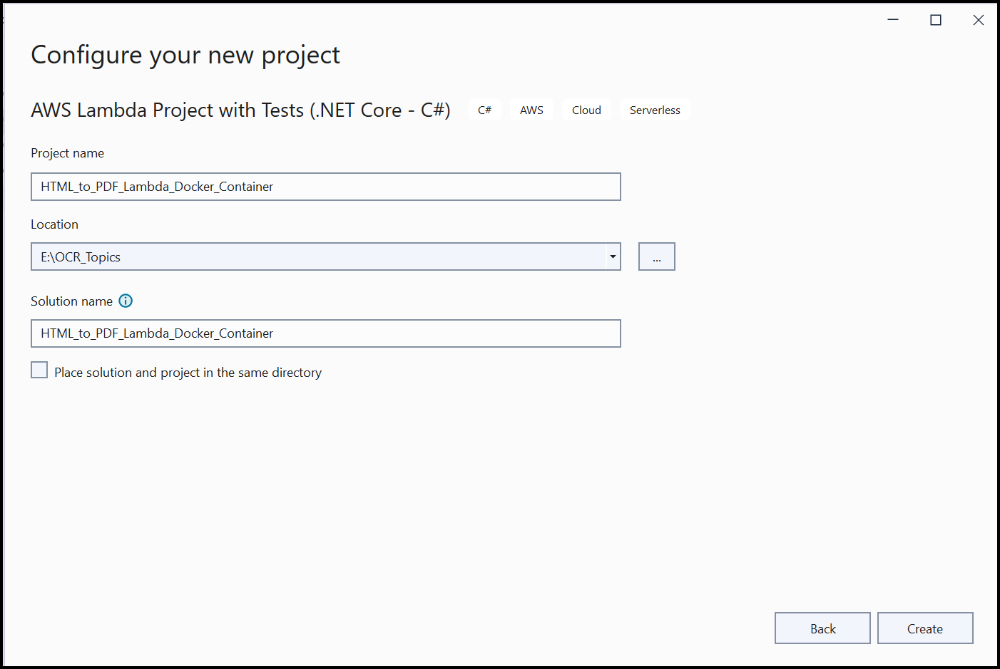
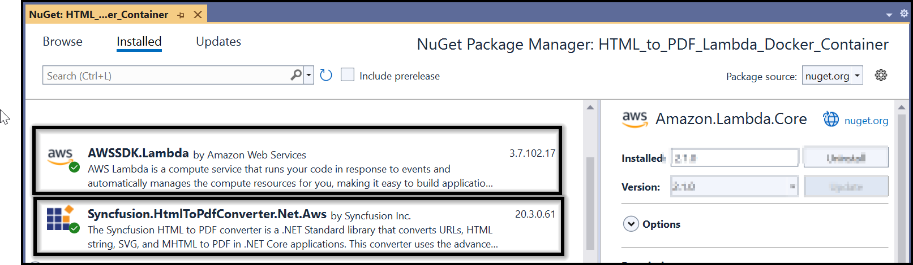
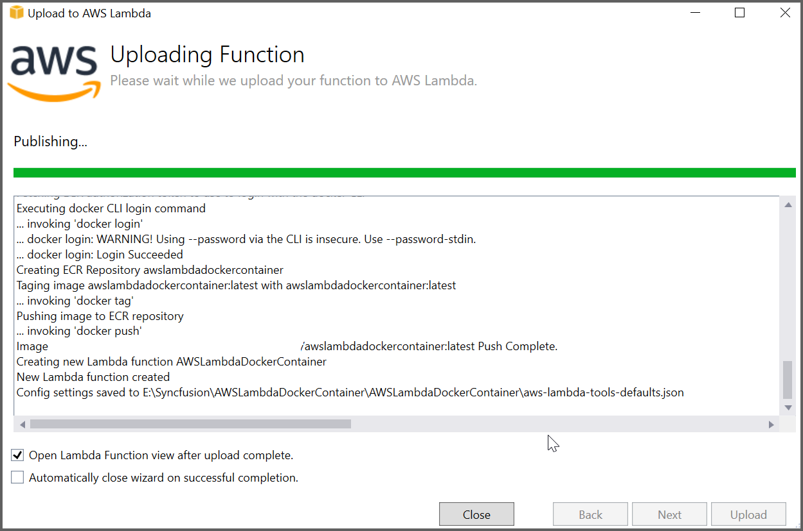

# Convert HTML to PDF file in AWS Lambda with NET 6 container image

The Syncfusion [HTML to PDF converter](https://www.syncfusion.com/pdf-framework/net/html-to-pdf) is a .NET library for converting webpages, SVG, MHTML, and HTML to PDF using C#. Using this library, **convert HTML to PDF document in AWS Lambda with NET 6 container image**.

## Steps to convert HTML to PDF in AWS Lambda with NET 6 container image

Step 1: Create a new AWS Lambda project with Tests as follows.

Step 2: In configuration window, name the project and select Create.

Step 3: Select Blueprint as .NET 6 (Container Image) Function and click Finish.

Step 4: Install the [Syncfusion.HtmlToPdfConverter.Net.Aws](https://www.nuget.org/packages/Syncfusion.HtmlToPdfConverter.Net.Aws/) and [AWSSDK.Lambda](https://www.nuget.org/packages/AWSSDK.Lambda) NuGet package as a reference to your AWS lambda project from [NuGet.org](https://www.nuget.org/).

N> Starting with v16.2.0.x, if you reference Syncfusion assemblies from trial setup or from the NuGet feed, you also have to add "Syncfusion.Licensing" assembly reference and include a license key in your projects. Please refer to this [link](https://help.syncfusion.com/common/essential-studio/licensing/overview) to know about registering Syncfusion license key in your application to use our components.

Step 5: Using the following namespaces in the Function.cs file.



using Syncfusion.HtmlConverter;
using Syncfusion.Pdf;
using System.IO;



Step 6: Add the following code sample in the Function.cs to convert HTML to PDF document using [Convert](https://help.syncfusion.com/cr/file-formats/Syncfusion.HtmlConverter.HtmlToPdfConverter.html#Syncfusion_HtmlConverter_HtmlToPdfConverter_Convert_System_String_) method in [HtmlToPdfConverter](https://help.syncfusion.com/cr/file-formats/Syncfusion.HtmlConverter.HtmlToPdfConverter.html) class. The Blink command line arguments based on the given [CommandLineArguments](https://help.syncfusion.com/cr/file-formats/Syncfusion.HtmlConverter.BlinkConverterSettings.html#Syncfusion_HtmlConverter_BlinkConverterSettings_CommandLineArguments) property of [BlinkConverterSettings](https://help.syncfusion.com/cr/file-formats/Syncfusion.HtmlConverter.BlinkConverterSettings.html) class.



public string FunctionHandler(string input, ILambdaContext context)
{
   //Initialize HTML to a PDF converter with the Blink rendering engine.
   HtmlToPdfConverter htmlConverter = new HtmlToPdfConverter(HtmlRenderingEngine.Blink);
       
   BlinkConverterSettings blinkConverterSettings = new BlinkConverterSettings();
   blinkConverterSettings.BlinkPath = Path.GetFullPath("BlinkBinariesAws");
   blinkConverterSettings.CommandLineArguments.Add("--no-sandbox");
   blinkConverterSettings.CommandLineArguments.Add("--disable-setuid-sandbox");
   blinkConverterSettings.AdditionalDelay = 3000;
   htmlConverter.ConverterSettings = blinkConverterSettings;
 
   //Convert the HTML string to PDF.
   PdfDocument document = htmlConverter.Convert(input, PathToFile());        
 
   //Save the document into a stream.
   MemoryStream memoryStream = new MemoryStream();
   //Save and close the PDFDocument.
   document.Save(memoryStream);
   document.Close(true);
   string base64 = Convert.ToBase64String(memoryStream.ToArray());
   memoryStream.Close();
   memoryStream.Dispose();
 
   return base64;
}

public static string PathToFile()
{
   string? path = System.IO.Path.GetDirectoryName(System.Reflection.Assembly.GetExecutingAssembly().GetName().CodeBase);
   if (string.IsNullOrEmpty(path))
   {
      path = Environment.OSVersion.Platform == PlatformID.Unix ? @"/" : @"\";
   }
   return Environment.OSVersion.Platform == PlatformID.Unix ? string.Concat(path.Substring(5), @"/") : string.Concat(path.Substring(6), @"\");
}



Step 7: Create a new folder as Helper and add a class file as AWSHelper.cs. Add the following namespaces and code samples in the AWSHelper class to invoke the published AWS Lambda function using the function name and access keys.



Using Amazon.Lambda;
using Amazon.Lambda.Model;
using Newtonsoft.Json;

public class AWSHelper
{
   public static async Task<byte[]> RunLambdaFunction(string html)
   {
        try
        {
            var AwsAccessKeyId = "awsaccessKeyID";
            var AwsSecretAccessKey = "awsSecretAccessKey";
 
            AmazonLambdaClient client = new AmazonLambdaClient(AwsAccessKeyId, AwsSecretAccessKey, Amazon.RegionEndpoint.USEast1);
            InvokeRequest invoke = new InvokeRequest
            {
                FunctionName = "AWSLambdaDockerContainer",
                InvocationType = InvocationType.RequestResponse,
                Payload = Newtonsoft.Json.JsonConvert.SerializeObject(html)
            };
            //Get the InvokeResponse from the client InvokeRequest.
            InvokeResponse response = await client.InvokeAsync(invoke);
 
            //Read the response stream.
            Console.WriteLine($"Response: {response.LogResult}");
            Console.WriteLine($"Response: {response.StatusCode}");
            Console.WriteLine($"Response: {response.FunctionError}");
            var stream = new StreamReader(response.Payload);
            JsonReader reader = new JsonTextReader(stream);
            var serilizer = new JsonSerializer();
            var responseText = serilizer.Deserialize(reader);
 
            //Convert Base64String into a PDF document.
            return Convert.FromBase64String(responseText.ToString());
        }
        catch (Exception ex)
        {
            Console.WriteLine($"Exception Occured HTMLToPDFHelper: {ex}");
        }
    return Convert.FromBase64String("");
    }
}



Step 8: Right-click the project and select **Publish to AWS Lambda**.

Step 9: Create a new AWS profile in the Upload Lambda Function Window. After creating the profile, add a name for the Lambda function to publish. Then, click **Next**.  

Step 10: In the Advanced Function Details window, specify the **Role Name** as based on AWS Managed policy. After selecting the role, click the Upload button to deploy your application.

Step 11: After deploying the application, Sign in to your AWS account, and you can see the published Lambda function in the AWS console.

## Steps to invoke the AWS Lambda function from the Test application

Step 12: Add the following code to invoke the AWS lambda function with the HTML string from the Function Test.



public class FunctionTest
{
    [Fact]
    public void HtmlToPDFFunction()
    {
        string path = System.IO.Path.GetDirectoryName(System.Reflection.Assembly.GetExecutingAssembly().GetName().CodeBase);
        string filePath = Environment.OSVersion.Platform == PlatformID.Unix ? string.Concat(path.Substring(5), @"/") : string.Concat(path.Substring(6), @"\");
 
        var html = File.ReadAllText($"{filePath}/HtmlSample.html");
        byte[] base64 = null;
        base64 = AWSHelper.RunLambdaFunction(html).Result;
 
        FileStream file = new FileStream($"{filePath}/file{DateTime.Now.Ticks}.pdf", FileMode.Create, FileAccess.Write);
        var ms = new MemoryStream(base64);
        ms.WriteTo(file);
        file.Close();
        ms.Close();
    }
}



Step 13: Right click the test application and select **Run Tests**.

Step 14: By executing the program, you will get the PDF document as follows.

A complete working sample can be downloaded from [Github](https://github.com/SyncfusionExamples/html-to-pdf-csharp-examples/tree/master/AWS/HTML_to_PDF_Lambda_Docker_Container).
