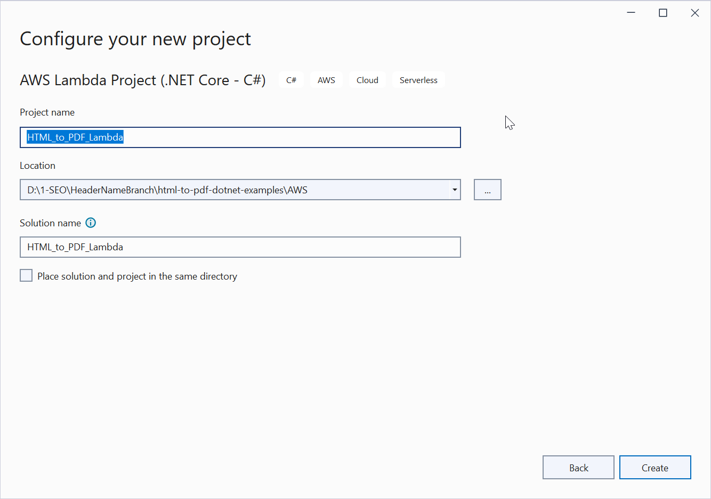
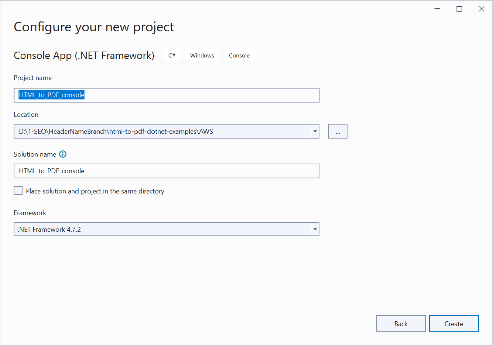
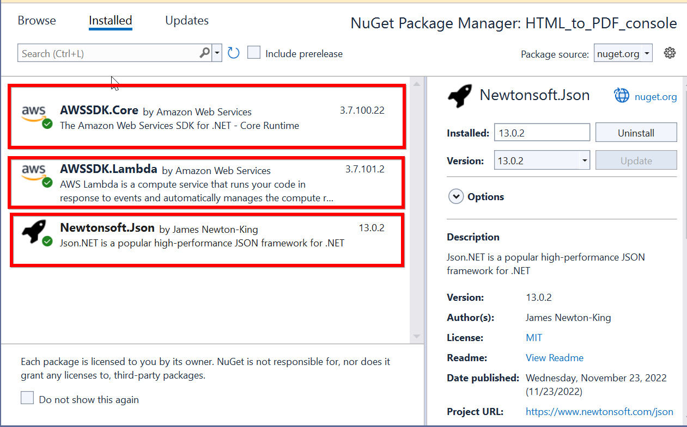

# Convert HTML to PDF file in AWS Lambda

The Syncfusion [HTML to PDF converter](https://www.syncfusion.com/pdf-framework/net/html-to-pdf) is a .NET library for converting webpages, SVG, MHTML, and HTML to PDF using C#. Using this library, **convert HTML to PDF document in AWS Lambda**.

Refer to the following steps to convert HTML to PDF in AWS Lambda

* Create an AWS Lambda function to convert HTML to PDF and publish it to AWS.
* Invoke the AWS Lambda function in your main application using AWS SDKs.

## Steps to convert HTML to PDF in AWS Lambda

Step 1: Create a new AWS Lambda project as follows.

 
Step 2: In configuration window, name the project and select Create.

Step 3: Select Blueprint as Empty Function and click Finish.

Step 4: Install the [Syncfusion.HtmlToPdfConverter.Net.Aws](https://www.nuget.org/packages/Syncfusion.HtmlToPdfConverter.Net.Aws/) NuGet package as a reference to your AWS lambda project from [NuGet.org.](https://www.nuget.org/)

N> Starting with v16.2.0.x, if you reference Syncfusion assemblies from trial setup or from the NuGet feed, you also have to add "Syncfusion.Licensing" assembly reference and include a license key in your projects. Please refer to this [link](https://help.syncfusion.com/common/essential-studio/licensing/overview) to know about registering Syncfusion license key in your application to use our components.

Step 5: Using the following namespaces in the *Function.cs* file.



using Syncfusion.HtmlConverter;
using Syncfusion.Pdf;
using System.IO;



Step 6: Add the following code snippet in Function.cs to convert HTML to PDF document using [Convert](https://help.syncfusion.com/cr/file-formats/Syncfusion.HtmlConverter.HtmlToPdfConverter.html#Syncfusion_HtmlConverter_HtmlToPdfConverter_Convert_System_String_) method in [HtmlToPdfConverter](https://help.syncfusion.com/cr/file-formats/Syncfusion.HtmlConverter.HtmlToPdfConverter.html) class.



//Initialize HTML to PDF converter with Blink rendering engine.
HtmlToPdfConverter htmlConverter = new HtmlToPdfConverter();
//Convert URL to PDF.
PdfDocument document = htmlConverter.Convert(input);
//Save the document into stream.
MemoryStream memoryStream = new MemoryStream();
//Save and Close the PDF Document.
document.Save(memoryStream);
document.Close(true);
return Convert.ToBase64String(memoryStream.ToArray());



Step 7: Right-click the project and select Publish to AWS Lambda. 

Step 8: Create a new AWS profile in the Upload Lambda Function Window. After creating the profile, add a name for the Lambda function to publish. Then, click Next.   
   

Step 9: In the Advanced Function Details window, specify the Role Name as based on AWS Managed policy. After selecting the role, click the Upload button to deploy your application.
     

Step 10: After deploying the application, Sign in your AWS account and you can see the published Lambda function in AWS console. 
    

## Steps to invoke the AWS Lambda function from the console application

Step 1: Create a new console project.  
    

Step 2: In project configuration windows, name the project and select Create.
   

Step 3: Install the [AWSSDK.Core](https://www.nuget.org/packages/AWSSDK.Core), [AWSSDK.Lambda](https://www.nuget.org/packages/AWSSDK.Lambda) and [Newtonsoft.Json package](https://www.nuget.org/packages/Newtonsoft.Json/13.0.2-beta3) as a reference to your main application from the [NuGet.org](https://www.nuget.org/).    
    
 
Step 4: Include the following namespaces in Program.cs file.



using Amazon;
using Amazon.Lambda;
using Amazon.Lambda.Model;
using Newtonsoft.Json;
using System.IO;



Step 5: Add the following code snippet in Program class to invoke the published AWS Lambda function using the function name and access keys.



//Create a new AmazonLambdaClient
AmazonLambdaClient client = new AmazonLambdaClient("awsaccessKeyID", "awsSecreteAccessKey", RegionEndpoint.USEast1);
//Create new InvokeRequest with the published function name
InvokeRequest invoke = new InvokeRequest
{
    FunctionName = "AwsLambdaFunctionHtmlToPdfConversion",
    InvocationType = InvocationType.RequestResponse,
    Payload = "\" https://www.google.co.in/ \""
};
//Get the InvokeResponse from client InvokeRequest
InvokeResponse response = client.Invoke(invoke);
//Read the response stream
var stream = new StreamReader(response.Payload);
JsonReader reader = new JsonTextReader(stream);
var serilizer = new JsonSerializer();
var responseText = serilizer.Deserialize(reader);
//Convert Base64String into PDF document
byte[] bytes = Convert.FromBase64String(responseText.ToString());
FileStream fileStream = new FileStream("Sample.pdf", FileMode.Create);
BinaryWriter writer = new BinaryWriter(fileStream);
writer.Write(bytes, 0, bytes.Length);
writer.Close();
System.Diagnostics.Process.Start("Sample.pdf");


 
By executing the program, you will get the PDF document as follows. 
  

A complete working sample can be downloaded from [Github](https://github.com/SyncfusionExamples/html-to-pdf-csharp-examples/tree/master/AWS).
