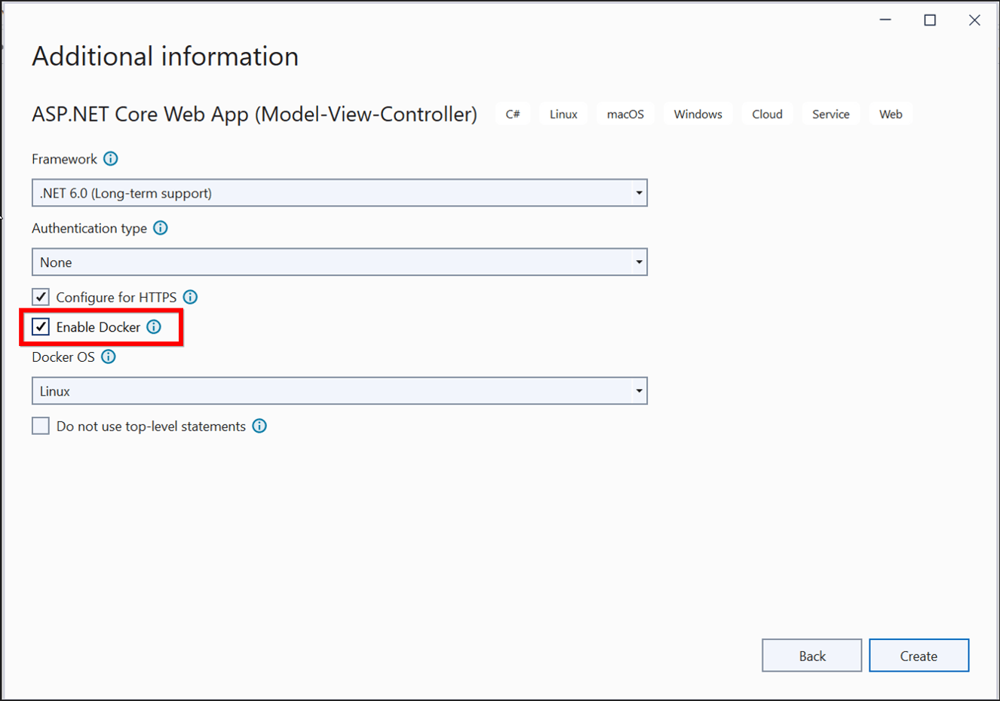
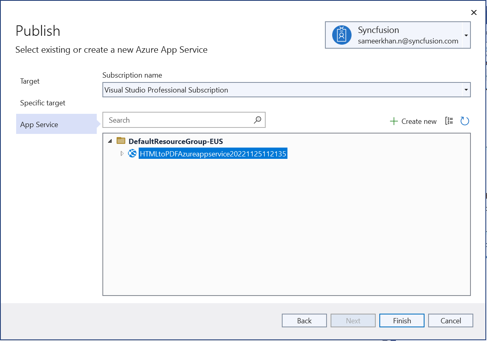

# Convert HTML to PDF in Azure App Service Linux with docker

The Syncfusion [HTML to PDF converter](https://www.syncfusion.com/document-processing/pdf-framework/net/html-to-pdf) is a .NET Core library for converting webpages, SVG, MHTML, and HTML to PDF using C#. The result preserves all graphics, images, text, fonts, and the layout of the original HTML document or webpage. Using this library, you can convert an HTML to PDF using C# with the Blink rendering engine in Azure App Service Linux with docker.

N> HTML to PDF converter is not supported with Azure App Service windows. We internally use Blink rendering engine for the conversion, it uses GDI calls for viewing and rendering the webpages. But Azure app service blocks GDI calls in the Azure website environment. As the Azure website does not have the elevated permission and enough rights, we can not launch the Chrome headless browser in the Azure app service windows (Azure website and Azure function).

## Steps to convert HTML to PDF in Azure app service using Blink with Linux docker container

Step 1: Create a new ASP.NET Core application and enable the docker support with Linux as a target OS.

Step 2: Choose your project's target framework, select Configure for HTTPS and Enable Docker.

Step 3: Install the [Syncfusion.HtmlToPdfConverter.Net.Linux](https://www.nuget.org/packages/Syncfusion.HtmlToPdfConverter.Net.Linux/) NuGet package as a reference to your .NET Core application [NuGet.org](https://www.nuget.org/).

N> Starting with v16.2.0.x, if you reference Syncfusion assemblies from trial setup or from the NuGet feed, you also have to add "Syncfusion.Licensing" assembly reference and include a license key in your projects. Please refer to this [link](https://help.syncfusion.com/common/essential-studio/licensing/overview) to know about registering Syncfusion license key in your application to use our components.

Step 4: Include the following commands in the docker file to install the dependent packages in the docker container.



RUN apt-get update && \
apt-get install -yq --no-install-recommends \ 
libasound2 libatk1.0-0 libc6 libcairo2 libcups2 libdbus-1-3 \ 
libexpat1 libfontconfig1 libgcc1 libgconf-2-4 libgdk-pixbuf2.0-0 libglib2.0-0 libgtk-3-0 libnspr4 \ 
libpango-1.0-0 libpangocairo-1.0-0 libstdc++6 libx11-6 libx11-xcb1 libxcb1 \ 
libxcursor1 libxdamage1 libxext6 libxfixes3 libxi6 libxrandr2 libxrender1 libxss1 libxtst6 \ 
libnss3 libgbm1



 

Step 5: Add a new button in the Index.cshtml file.



    @{ Html.BeginForm("ExportToPDF", "Home", FormMethod.Post);
        {
            <input type="submit" value="Export To PDF" class=" btn" />
        }
     }
 



   

Step 6: Include the following namespaces.



using Syncfusion.HtmlConverter;
using Syncfusion.Pdf;
using System.IO;



Step 7: Add the code samples in the controller to convert HTML to PDF document using [Convert](https://help.syncfusion.com/cr/file-formats/Syncfusion.HtmlConverter.HtmlToPdfConverter.html#Syncfusion_HtmlConverter_HtmlToPdfConverter_Convert_System_String_) method in [HtmlToPdfConverter](https://help.syncfusion.com/cr/file-formats/Syncfusion.HtmlConverter.HtmlToPdfConverter.html) class. The Blink command line arguments based on the given [CommandLineArguments](https://help.syncfusion.com/cr/file-formats/Syncfusion.HtmlConverter.BlinkConverterSettings.html#Syncfusion_HtmlConverter_BlinkConverterSettings_CommandLineArguments) property of [BlinkConverterSettings](https://help.syncfusion.com/cr/file-formats/Syncfusion.HtmlConverter.BlinkConverterSettings.html) class.   



public ActionResult ExportToPDF()
{
    //Initialize HTML to PDF converter. 
    HtmlToPdfConverter htmlConverter = new HtmlToPdfConverter();
    BlinkConverterSettings settings = new BlinkConverterSettings();
    //Set command line arguments to run without the sandbox.
    settings.CommandLineArguments.Add("--no-sandbox");
    settings.CommandLineArguments.Add("--disable-setuid-sandbox");
    //Assign Blink settings to the HTML converter.
    htmlConverter.ConverterSettings = settings;
    //Convert URL to PDF.
    PdfDocument document = htmlConverter.Convert("https://www.syncfusion.com");
    MemoryStream stream = new MemoryStream();
    //Save and close a PDF document. 
    document.Save(stream);
    return File(stream.ToArray(), System.Net.Mime.MediaTypeNames.Application.Pdf, "URL_to_PDF.pdf");
}



Step 8: Build and run the sample in docker, it will pull the Linux docker image from the docker hub and run the project. Now, the webpage will open in the browser and click the button to convert the Syncfusion webpage to a PDF.
 

By executing the program, you will get the PDF document as follows.
 

**Deploy the container to Azure container instance**

Step 1: Create a publish target to deploy the docker image to Azure. 
 

Step 2: Create Azure App Service with resource group, hosting plan, and container registry. 
 

Step 3: Publish the docker image to Azure container instance.
 

Step 4: It will push the docker image to the Azure container registry and deploy it to the Azure container instance.
  

Step 5: After successful deployment, it will open the Azure website in the browser.

Step 6: Click the button to convert Syncfusion webpage to a PDF document. You will get the PDF document as follows. 

A complete work sample can be downloaded from [Github](https://github.com/SyncfusionExamples/html-to-pdf-csharp-examples/tree/master/Azure/HTML_to_PDF_Azure_app_service_docker)

Click [here](https://www.syncfusion.com/document-processing/pdf-framework/net-core/html-to-pdf) to explore the rich set of Syncfusion HTML to PDF converter library features. 

An online sample link to [convert HTML to PDF document](https://ej2.syncfusion.com/aspnetcore/PDF/HtmltoPDF#/bootstrap5) in ASP.NET Core. 