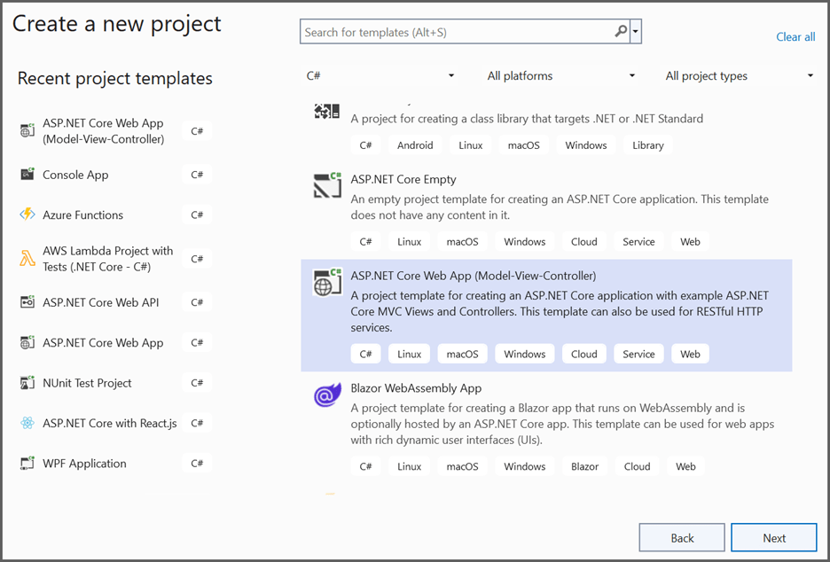
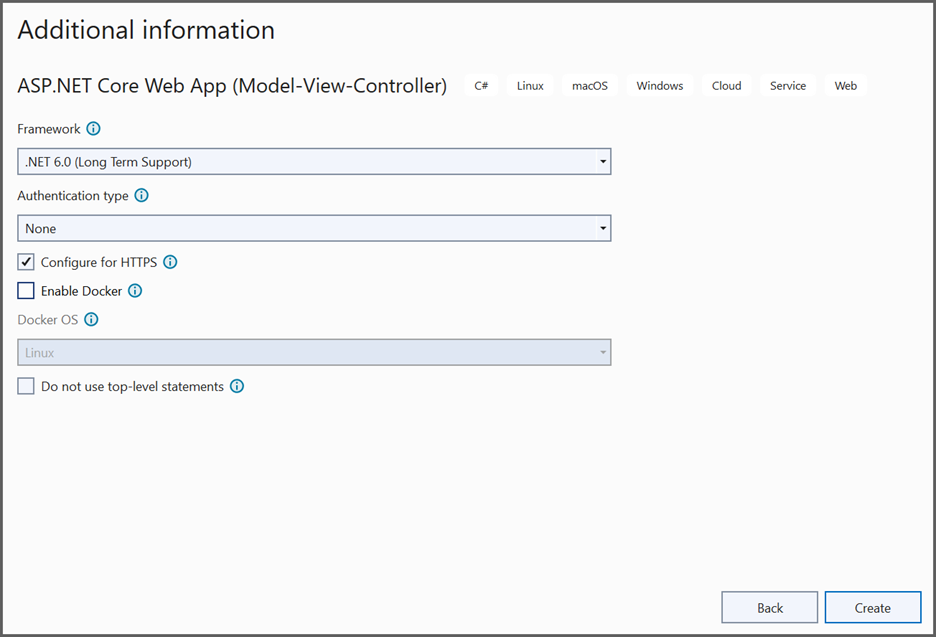
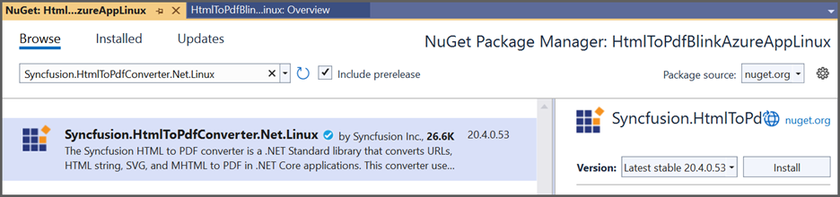
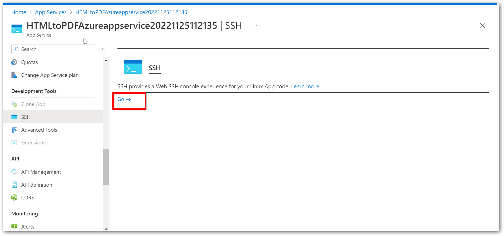
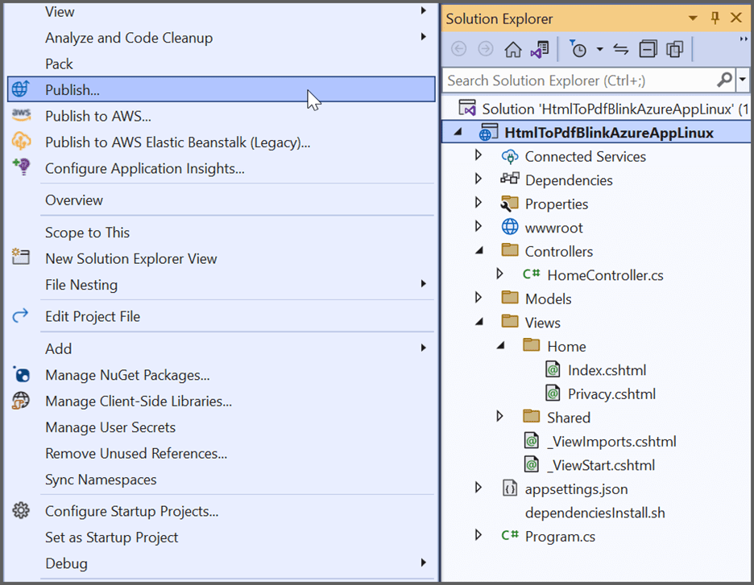
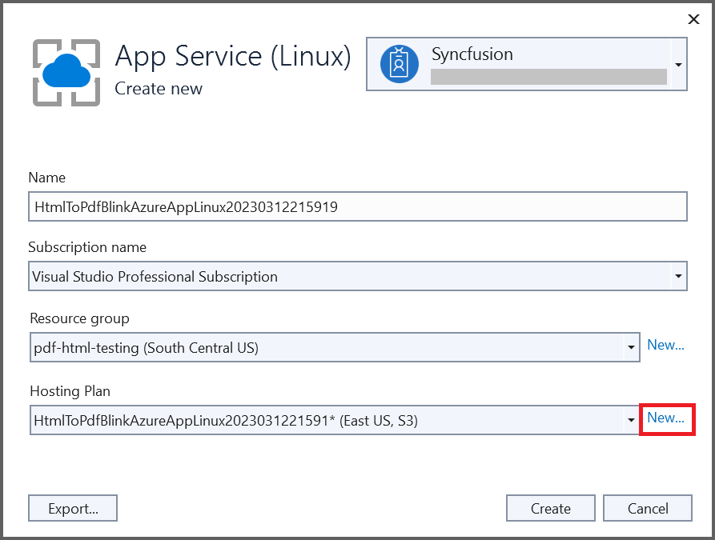
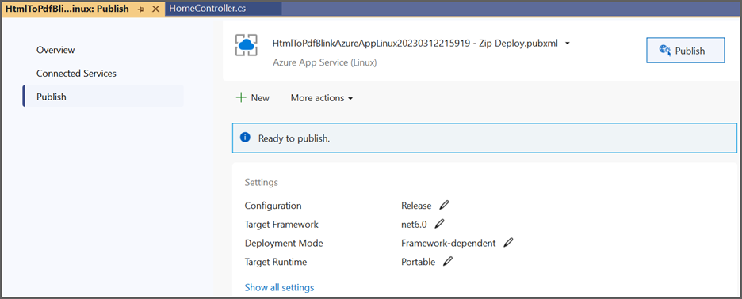

# Convert HTML to PDF in Azure App Service on Linux

The Syncfusion [HTML to PDF converter](https://www.syncfusion.com/document-processing/pdf-framework/net/html-to-pdf) is a .NET Core library for converting webpages, SVG, MHTML, and HTML to PDF using C#. The result preserves all graphics, images, text, fonts, and the layout of the original HTML document or webpage. Using this library, you can convert an HTML to PDF using C# with the Blink rendering engine in Azure App Service on Linux.

N> HTML to PDF converter is not supported with Azure App Service windows. We internally use Blink rendering engine for the conversion, it uses GDI calls for viewing and rendering the webpages. But Azure app service blocks GDI calls in the Azure website environment. As the Azure website does not have the elevated permission and enough rights, we can not launch the Chrome headless browser in the Azure app service windows (Azure website and Azure function).

## Steps to convert HTML to PDF in Azure App Service on Linux

Step 1: Create a new ASP.NET Core MVC application.
  

Step 2: Choose your project's target framework and select Configure for HTTPS.
 

Step 3: Install the [Syncfusion.HtmlToPdfConverter.Net.Linux](https://www.nuget.org/packages/Syncfusion.HtmlToPdfConverter.Net.Linux/) NuGet package as a reference to your .NET Core application [NuGet.org](https://www.nuget.org/).
 

N> Starting with v16.2.0.x, if you reference Syncfusion assemblies from trial setup or from the NuGet feed, you also have to add "Syncfusion.Licensing" assembly reference and include a license key in your projects. Please refer to this [link](https://help.syncfusion.com/common/essential-studio/licensing/overview) to know about registering Syncfusion license key in your application to use our components.

There are two ways to install the dependency packages to Azure server,
* Using SSH from Azure portal.
* By running the commands from C#.

**Using SSH command line**

* After publishing the Web application, login to the Azure portal in a web interface and open the published app service. Under Development Tools Menu, Open the SSH and Click the go link.
 

* From the terminal window, you can install the dependency packages. Use the following single command to install all dependencies packages.



apt-get update && apt-get install -yq --no-install-recommends  libasound2 libatk1.0-0 libc6 libcairo2 libcups2 libdbus-1-3 libexpat1 libfontconfig1 libgcc1 libgconf-2-4 libgdk-pixbuf2.0-0 libglib2.0-0 libgtk-3-0 libnspr4 libpango-1.0-0 libpangocairo-1.0-0 libstdc++6 libx11-6 libx11-xcb1 libxcb1 libxcursor1 libxdamage1 libxext6 libxfixes3 libxi6 libxrandr2 libxrender1 libxss1 libxtst6 libnss3 libgbm1



**Running the commands from C#**

* Create a shell file with the above commands in the project and name it as dependenciesInstall.sh. In this article, these steps have been followed to install dependencies packages. 
 

* Set Copy to Output Directory as "Copy if newer" to the dependenciesInstall.sh file.
 

Step 4: Add an Export to the PDF button in the index.cshtml.



    @{ Html.BeginForm("ExportToPDF", "Home", FormMethod.Post);
        {
            <input type="submit" value="Export To PDF" class=" btn" />
        }
    }



Step 5: Include the following namespaces.



using Syncfusion.HtmlConverter;
using Syncfusion.Pdf;
using System.IO;



Step 6: Add the code samples in the controller to convert HTML to PDF document using [Convert](https://help.syncfusion.com/cr/file-formats/Syncfusion.HtmlConverter.HtmlToPdfConverter.html#Syncfusion_HtmlConverter_HtmlToPdfConverter_Convert_System_String_) method in [HtmlToPdfConverter](https://help.syncfusion.com/cr/file-formats/Syncfusion.HtmlConverter.HtmlToPdfConverter.html) class. The Blink command line arguments based on the given [CommandLineArguments](https://help.syncfusion.com/cr/file-formats/Syncfusion.HtmlConverter.BlinkConverterSettings.html#Syncfusion_HtmlConverter_BlinkConverterSettings_CommandLineArguments) property of [BlinkConverterSettings](https://help.syncfusion.com/cr/file-formats/Syncfusion.HtmlConverter.BlinkConverterSettings.html) class. .



public ActionResult ExportToPDF()
{
    Environment.SetEnvironmentVariable("ASPNETCORE_ENVIRONMENT", "Development");
    //Install the dependencies packages for HTML to PDF conversion in Linux
    string shellFilePath = System.IO.Path.Combine(env.ContentRootPath, "dependenciesInstall.sh");
    InstallDependecies(shellFilePath);
    //Initialize HTML to PDF converter 
    HtmlToPdfConverter htmlConverter = new HtmlToPdfConverter();
    BlinkConverterSettings settings = new BlinkConverterSettings();
    //Set command line arguments to run without sandbox.
    settings.CommandLineArguments.Add("--no-sandbox");
    settings.CommandLineArguments.Add("--disable-setuid-sandbox");
    //Assign WebKit settings to the HTML converter 
    htmlConverter.ConverterSettings = settings;
    //Convert HTML string to PDF
    PdfDocument document = htmlConverter.Convert("http://www.syncfusion.com");
    //Save the document into stream
    MemoryStream stream = new MemoryStream();
    document.Save(stream);
    stream.Position = 0;
    //Close the document
    document.Close(true);
    //Defining the ContentType for pdf file
    string contentType = "application/pdf";
    //Define the file name
    string fileName = "URL_to_PDF.pdf";
    //Creates a FileContentResult object by using the file contents, content type, and file name
    return File(stream, contentType, fileName);
}

private void InstallDependecies(string shellFilePath)
{
    Process process = new Process
    {
        StartInfo = new ProcessStartInfo
        {
            FileName = "/bin/bash",
            Arguments = "-c " + shellFilePath,
            CreateNoWindow = true,
            UseShellExecute = false,
        }
    };
    process.Start();
    process.WaitForExit();
}



**Steps to publish as Azure App Linux**

Step 1: Right-click the project and select Publish.
   

Step 2: Create a new profile in publish target window.
 

Step 3: Create App service using Azure subscription and select a hosting plan.
 

Step 4: HTML to PDF conversion works from basic hosting plan (B1 to P3). So, select the hosting plan as required. HTML to PDF conversion will not work if the hosting plan is Free/Shared.
 

Step 5: After creating a profile, click the publish button.

Now, the published webpage will open in the browser. Click Export to PDF button to convert Syncfusion webpage to PDF document.

A complete work sample for converting an HTML to PDF in Azure App service on Linux can be downloaded from [GitHub](https://github.com/SyncfusionExamples/html-to-pdf-csharp-examples/tree/master/Azure/HTML_to_PDF_Azure_app_service).

Click [here](https://www.syncfusion.com/document-processing/pdf-framework/net-core/html-to-pdf) to explore the rich set of Syncfusion HTML to PDF converter library features. 

An online sample link to [convert HTML to PDF document](https://ej2.syncfusion.com/aspnetcore/PDF/HtmltoPDF#/material3) in ASP.NET Core. 