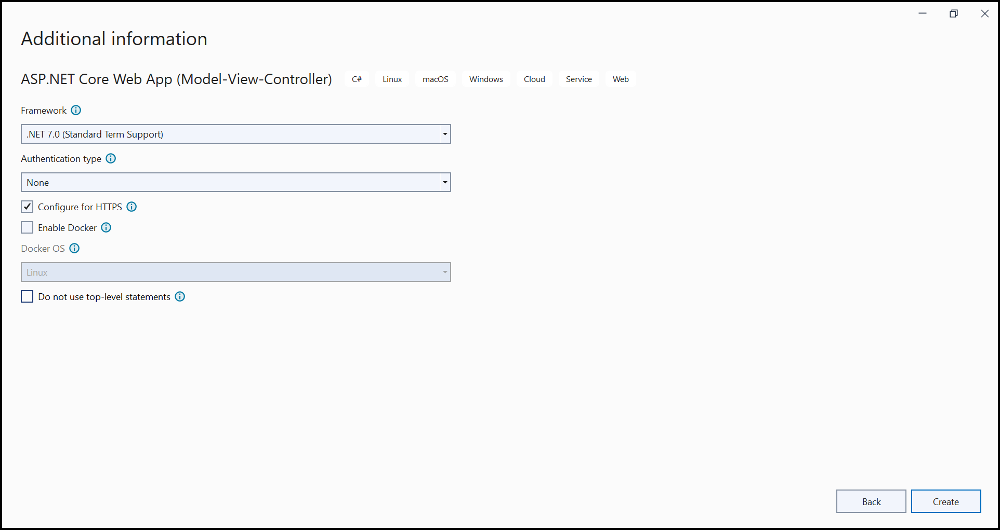
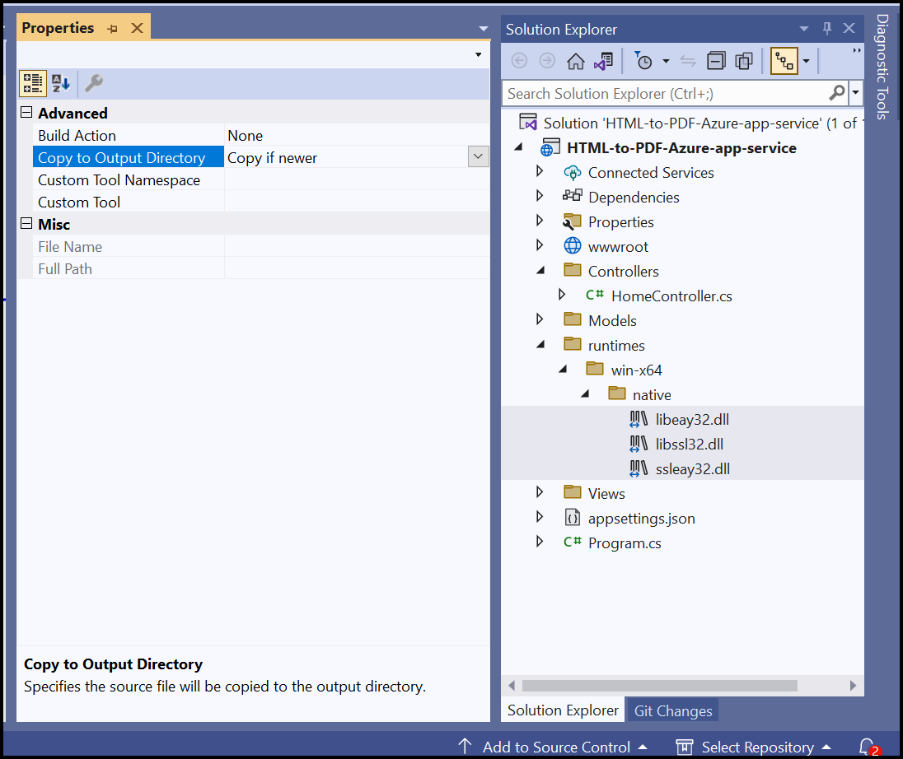
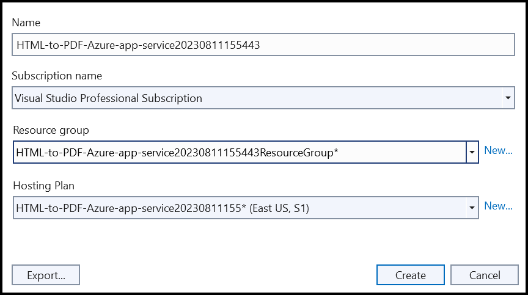
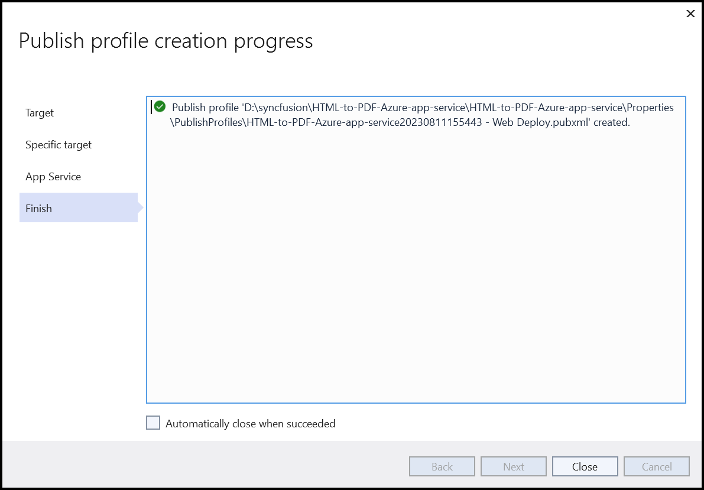
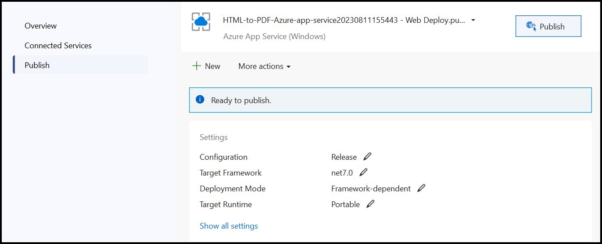
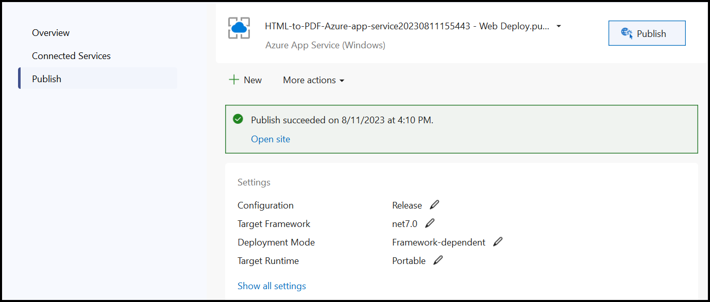

# Convert HTML to PDF file in Azure App Service on Windows

As the Azure Windows platform is a Sandboxed environment, the default HTML rendering engine Blink used in our HTML to PDF conversion is incompatible due to GDI Limitations. It is recommended that you use [Azure web applications in the Linux container.](Convert-HTML-to-PDF-in-Azure-App-Service-Linux.md) For converting HTML to PDF in Azure Windows you can use the following approach that fit your requirement,

* Legacy [WebKit](https://github.com/syncfusion/SfQtWebKit) - this open-source library comes under [LGPL license](https://github.com/syncfusion/SfQtWebKit?tab=License-3-ov-file). It has some known rendering issues and limitations, and some of the advanced Bootstrap CSS styles are not supported.

## Steps to convert HTML to PDF file in Azure App Service on Windows using legacy Webkit

Step 1: Create a new ASP.NET Core Web App (Model-View-Controller).

Step 2: Create a project name and select the location.

Step 3: Click **Create**. 

Step 4: Install the [Syncfusion.HtmlToPdfConverter.QtWebKit.Net.Core](https://www.nuget.org/packages/Syncfusion.HtmlToPdfConverter.QtWebKit.Net.Core/) NuGet package to reference your project using the **Package Manager Console**.

N> Starting with v16.2.0.x, if you reference Syncfusion assemblies from the trial setup or NuGet feed, you also have to add the "Syncfusion.Licensing" assembly reference and include a license key in your projects. Please refer to this [link](https://help.syncfusion.com/common/essential-studio/licensing/overview) to learn about registering the Syncfusion license key in your application to use our components.

Step 5: A default action method named Index will be present in *HomeController.cs*. Right-click on the Index method and select **Go To View**, where you will be directed to its associated view page *Index.cshtml*. Add a new button in the *Index.cshtml* as follows.




@{
    Html.BeginForm("ExportToPDF", "Home", FormMethod.Get);
    {
        

            <input type="submit" value="Export To PDF" style="width:200px;height:27px" />
        

    }
    Html.EndForm();
}




Step 6: Include the following namespaces in *HomeController.cs*.




using Syncfusion.HtmlConverter;
using Syncfusion.Pdf;




Step 7: Add a new action method named ExportToPDF in the HomeController.cs file and include the following code example to convert HTML to PDF document in *HomeController.cs*. 




public IActionResult ExportToPDF() 
{
    //Initialize HTML to PDF converter. 
    HtmlToPdfConverter htmlConverter = new HtmlToPdfConverter(HtmlRenderingEngine.WebKit);         
    //Convert URL to PDF.
    PdfDocument document = htmlConverter.Convert("https://www.google.com");
    //Saving the PDF to the MemoryStream.
    MemoryStream stream = new MemoryStream();
    document.Save(stream);
    return File(stream.ToArray(), System.Net.Mime.MediaTypeNames.Application.Pdf, "Sample.pdf");
}




Step 8: Copy the OpenSSL assemblies and paste them into the **runtimes/win-x64/native** folder containing the HTML_to_PDF_Azure_app_service.csproj file.

N> The OpenSSL libraries can be installed by downloading their setup from this [link.](https://www.syncfusion.com/downloads/support/directtrac/general/ze/OPENSSL-798051511)

Step 9: Set **Copy if newer** for all the OpenSSL assemblies.

## Steps to publish as Azure App Service on Windows 

Step 1: Right-click the project and select the **Publish** option.

Step 2: Click **Add a Publish Profile**.

Step 3: Select the publish target as **Azure**.

Step 4: Select the Specific target as **Azure App Service (Windows)**.

Step 5: Click the **Create new** option to create a new app service.

Step 6: Click **Create** to proceed with **App Service** creation.

Step 7: Click **Finish** to finalize the **App Service** creation.

Step 8: Click **Close**.

Step 9: Click **Publish**.

Step 10: Now, Publish has succeeded.

Step 11: Now, the published webpage will open in the browser.

Step 12: Select a PDF document and click **Export to PDF** to create a PDF document. You will get the output PDF document as follows.

You can download a complete working sample from [GitHub](https://github.com/SyncfusionExamples/html-to-pdf-csharp-examples/tree/master/Azure/HTML-to-PDF-Azure-app-service(Windows)).
