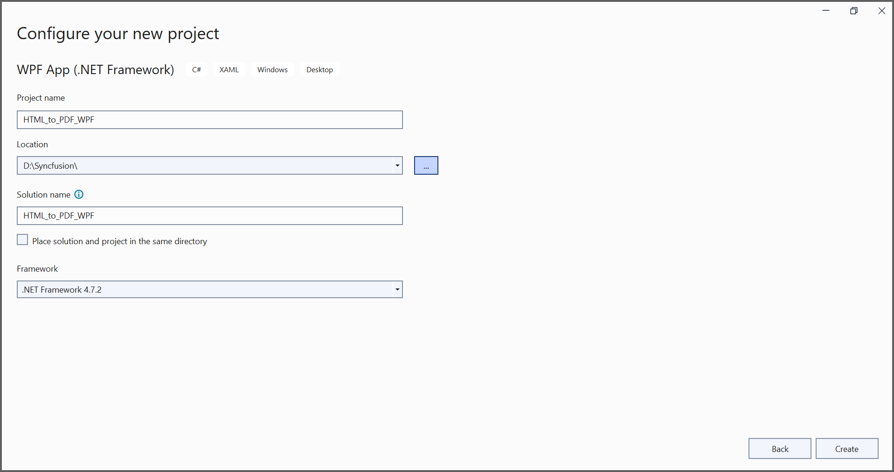
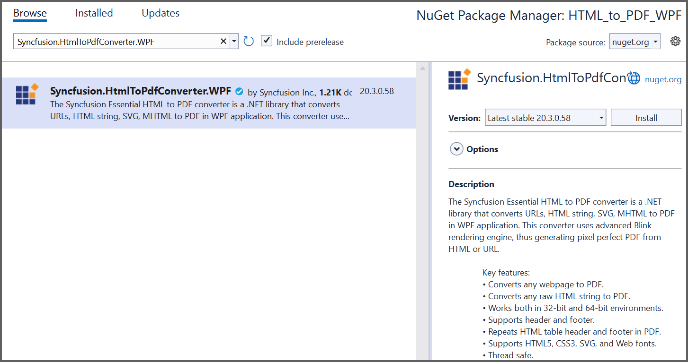

# Convert HTML to PDF file in WPF
## Steps to convert Html to PDF document in WPF:

Create a new WPF application project.

Now, the project configuration window appears. Click Create button to create a new project with the default project configuration.

Install the [Syncfusion.HtmlToPdfConverter.WPF](https://www.nuget.org/packages/Syncfusion.HtmlToPdfConverter.WPF) NuGet package as a reference to your WPF application [NuGet.org](https://www.nuget.org/)

Include the following namespaces in the MainWindow.xaml.cs file.



using System;
using System.IO;
using System.Windows;
using Syncfusion.Pdf;
using Syncfusion.HtmlConverter;



Add a new button in MainWindow.xaml to convert Html to Pdf document as follows.



<Grid HorizontalAlignment="Left" Margin="0,0,0,-0.333" Width="793">
<Button Content="Convert Html ot PDF" HorizontalAlignment="Left" Margin="318,210,0,0" VerticalAlignment="Top" Width="166" Click=" btnCreate_Click " Height="19"/>
<TextBlock HorizontalAlignment="Left" Margin="222,177,0,0" TextWrapping="Wrap" VerticalAlignment="Top" Height="17"/>
<TextBlock HorizontalAlignment="Left" Margin="291,175,0,0" TextWrapping="Wrap" Text="Click the button to convert Htnl to PDF." VerticalAlignment="Top"/>

</Grid>



Add the following code in btnCreate_Click to convert Html to PDF document.



// Initialize HTML to PDF converter.
HtmlToPdfConverter htmlConverter = new HtmlToPdfConverter();

// Convert URL to PDF.
PdfDocument document = htmlConverter.Convert("https://www.syncfusion.com");

FileStream stream = new FileStream("HTML-to-PDF.pdf", FileMode.CreateNew);

//Save the document into stream.
document.Save(stream);

//If the position is not set to '0' then the PDF will be empty.
stream.Position = 0;

//Close the document.
document.Close();
stream.Dispose();



A complete working sample can be downloaded from [WPF-HTML-to-PDF-Demo.zip] (https://www.syncfusion.com/downloads/support/directtrac/general/ze/WPF-HTML-to-PDF-Demo2114579782)

By executing the program, you will get the PDF document as follows.

