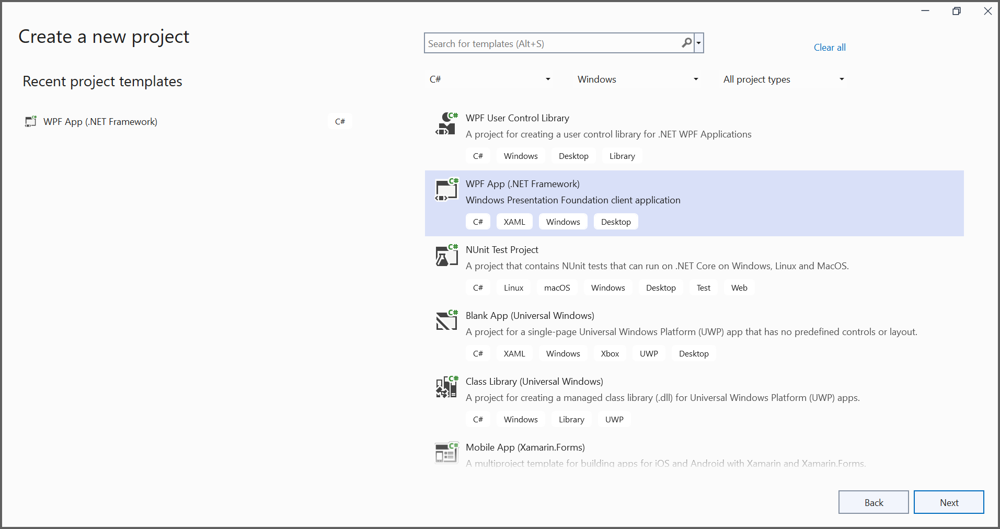
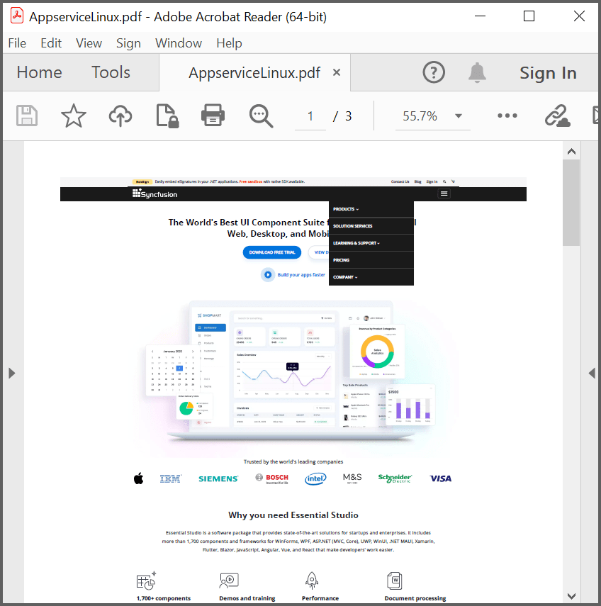

# Convert HTML to PDF file in WPF

The Syncfusion HTML to PDF converter is a .NET library used to convert HTML or web pages to PDF document in WPF application.

## Steps to convert Html to PDF document in WPF

Step 1: Create a new WPF application project.
  

In project configuration window, name your project and select Create.

Step 2: Install the [Syncfusion.HtmlToPdfConverter.WPF](https://www.nuget.org/packages/Syncfusion.HtmlToPdfConverter.WPF) NuGet package as a reference to your WPF application [NuGet.org](https://www.nuget.org/).

N> Starting with v16.2.0.x, if you reference Syncfusion assemblies from trial setup or from the NuGet feed, you also have to add "Syncfusion.Licensing" assembly reference and include a license key in your projects. Please refer to this [link](https://help.syncfusion.com/common/essential-studio/licensing/overview) to know about registering Syncfusion license key in your application to use our components.

Step 3: Include the following namespaces in the MainWindow.xaml.cs file.



using System;
using System.IO;
using System.Windows;
using Syncfusion.Pdf;
using Syncfusion.HtmlConverter;



Step 4: Add a new button in MainWindow.xaml to convert HTML to PDF document as follows.



<Grid HorizontalAlignment="Left" Margin="0,0,0,-0.333" Width="793">
<Button Content="Convert Html to PDF" HorizontalAlignment="Left" Margin="318,210,0,0" VerticalAlignment="Top" Width="166" Click=" btnCreate_Click " Height="19"/>
<TextBlock HorizontalAlignment="Left" Margin="222,177,0,0" TextWrapping="Wrap" VerticalAlignment="Top" Height="17"/>
<TextBlock HorizontalAlignment="Left" Margin="291,175,0,0" TextWrapping="Wrap" Text="Click the button to convert Html to PDF." VerticalAlignment="Top"/>
</Grid>



Step 5: Add the following code in btnCreate_Click to convert HTML to PDF document using [Convert](https://help.syncfusion.com/cr/file-formats/Syncfusion.HtmlConverter.HtmlToPdfConverter.html#Syncfusion_HtmlConverter_HtmlToPdfConverter_Convert_System_String_) method in [HtmlToPdfConverter](https://help.syncfusion.com/cr/file-formats/Syncfusion.HtmlConverter.HtmlToPdfConverter.html) class. The HTML content will be scaled based on the given [ViewPortSize](https://help.syncfusion.com/cr/file-formats/Syncfusion.HtmlConverter.BlinkConverterSettings.html#Syncfusion_HtmlConverter_BlinkConverterSettings_ViewPortSize) property of [BlinkConverterSettings](https://help.syncfusion.com/cr/file-formats/Syncfusion.HtmlConverter.BlinkConverterSettings.html) class.



//Initialize HTML to PDF converter.
HtmlToPdfConverter htmlConverter = new HtmlToPdfConverter();
BlinkConverterSettings blinkConverterSettings = new BlinkConverterSettings();
//Set Blink viewport size.
blinkConverterSettings.ViewPortSize = new System.Drawing.Size(1280, 0);
//Assign Blink converter settings to HTML converter.
htmlConverter.ConverterSettings = blinkConverterSettings;
//Convert URL to PDF document.
PdfDocument document = htmlConverter.Convert("https://www.syncfusion.com");
//Create file stream.
FileStream stream = new FileStream("HTML-to-PDF.pdf", FileMode.CreateNew);
//Save the document into stream.
document.Save(stream);
//If the position is not set to '0' then the PDF will be empty.
stream.Position = 0;
//Close the document.
document.Close();
stream.Dispose();



By executing the program, you will get the PDF document as follows.
 

A complete working sample can be downloaded from [Github](https://github.com/SyncfusionExamples/html-to-pdf-csharp-examples/tree/master/WPF).
   
Click [here](https://www.syncfusion.com/document-processing/pdf-framework/net/html-to-pdf) to explore the rich set of Syncfusion HTML to PDF converter library features. 

An online sample link to [convert HTML to PDF document](https://ej2.syncfusion.com/aspnetcore/PDF/HtmltoPDF#/material3) in ASP.NET Core. 