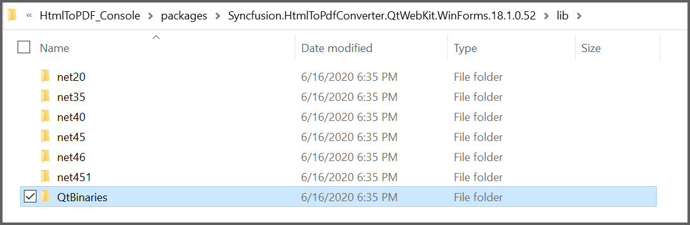
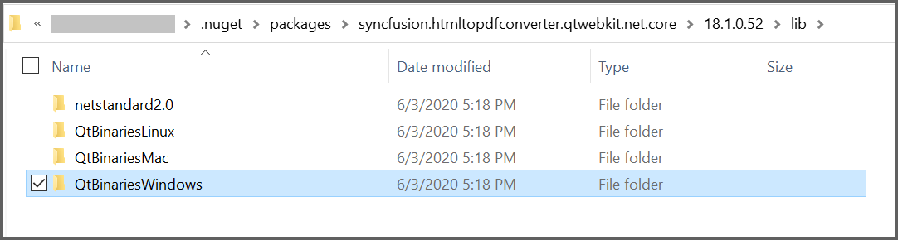
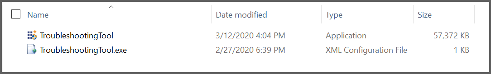
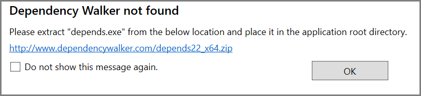
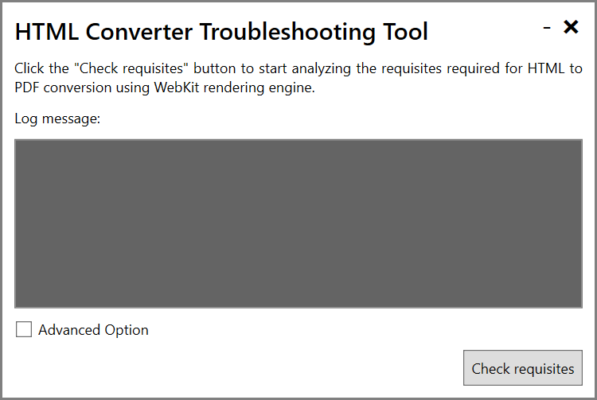
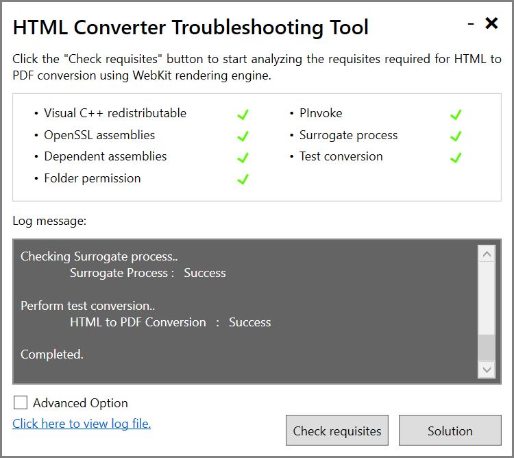
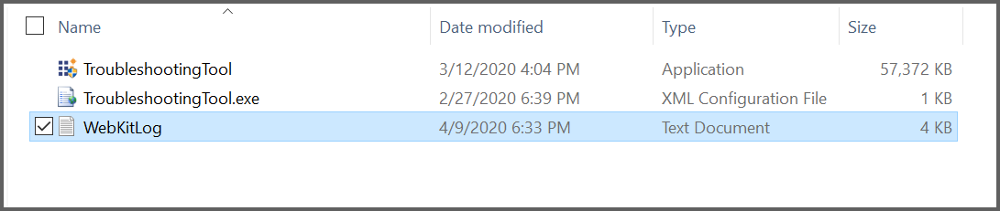
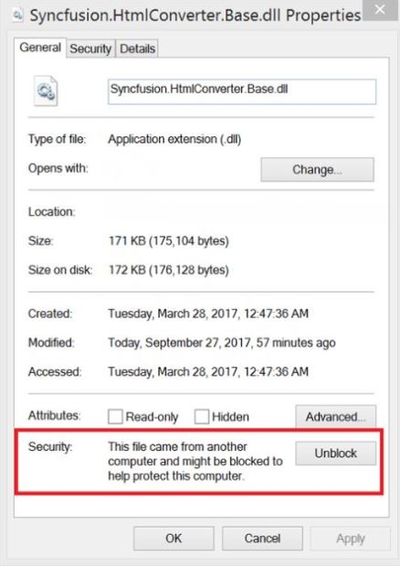

# Conversion using WebKit Rendering


Syncfusion Essential PDF supports HTML to PDF conversion by using the advanced Qt WebKit rendering engine. This converter can be easily integrated into any application on .NET platforms such as Windows Forms, WPF, ASP.NET, ASP.NET MVC and ASP.NET Core to convert URLs, HTML string, SVG and MHTML to PDF, and convert other formats like HTML to MHTML, HTML to SVG, and HTML to image.

Qt WebKit rendering is accurate, and the result preserves all the graphics, images, text, fonts, and the layout of the original HTML document/webpage.

It does not require external dependencies like browsers, printer drivers, or viewers.


## Prerequisites for Windows

* Latest WebKit HTML converter can be download from the below link,

    [https://www.syncfusion.com/downloads/latest-version](https://www.syncfusion.com/downloads/latest-version)

* Supports conversion from .NET Framework 2.0 and .NET Core 2.0.
	
* To convert HTML to PDF in the application using WebKit rendering engine, the following assemblies or NuGet packages should be added as reference to the project.	

<b>Assemblies</b>

<table>
<tr>
<thead>
<th>
Platforms</th>
<th>
Assemblies
</th>
</thead>
</tr>
<tr>
<td> .NET Framework </td>
<td>
<ul>
<li>Syncfusion.Compression.Base.dll</li>
<li>Syncfusion.Pdf.Base.dll</li>
<li>Syncfusion.HtmlConverter.Base.dll</li>
</ul>
</td></tr>
<tr>
<td> .NET Core </td>
<td>
<ul>
<li>Syncfusion.Compression.Portable.dll</li>
<li>Syncfusion.Pdf.Portable.dll</li>
<li>Syncfusion.HtmlConverter.Portable.dll</li>
</ul>
</td></tr>
</table>

<table>
<tr>
<thead>
<th>
Platforms</th>
<th>
QtBinaries
</th>
</thead>
</tr>
<tr>
<td> .NET Framework </td>
<td>
The QtBinaries folder is available in the WebKit HTML converter installed location <span style="color:gray;font-size:14px"><i>($SystemDrive\Program Files (x86)\Syncfusion\WebKitHTMLConverter\xx.x.x.xx\QtBinaries)</i></span>. The physical path of this folder should be set to the <i>WebKitPath</i> property of WebKitConverterSettings.

This is mandatory to set the <i>WebKitPath</i> property with QtBinaries folder. If the <i>WebKitPath</i> is not mentioned, place the QtBinaries folder in bin folder of the project, otherwise the converter will throw <b>WebKit assemblies are missing</b> exception.
</td></tr>
<tr>
<td> .NET Core </td>
<td>
The QtBinariesDotNetCore folder is available in the WebKit HTML converter installed location <span style="color:gray;font-size:14px"><i>($SystemDrive\Program Files (x86)\Syncfusion\WebKitHTMLConverter\xx.x.x.xx\QtBinariesDotNetCore)</i></span>. The physical path of this folder should be set  to the <i>WebKitPath</i> property of WebKitConverterSettings.

This is mandatory to set <i>WebKitPath</i> property with QtBinariesDotNetCore folder, otherwise the converter will throw <b>WebKit assemblies are missing</b> exception.
</td></tr>
</table>

<b>NuGet</b>

<table>
<tr>
<thead>
<th><b>Platform(s)</b></th>
<th><b>NuGet Package</b></th>
</thead>
</tr>
<tr>
<td>
Windows Forms
</td>
<td>
{{'[Syncfusion.HtmlToPdfConverter.QtWebKit.WinForms.nupkg](https://www.nuget.org/packages/Syncfusion.HtmlToPdfConverter.QtWebKit.WinForms/)'| markdownify }}
</td>
</tr>
<tr>
<td>
WPF
</td>
<td>
{{'[Syncfusion.HtmlToPdfConverter.QtWebKit.Wpf.nupkg](https://www.nuget.org/packages/Syncfusion.HtmlToPdfConverter.QtWebKit.Wpf/)'| markdownify }}
</td>
</tr>
<tr>
<td>
ASP.NET
</td>
<td>
{{'[Syncfusion.HtmlToPdfConverter.QtWebKit.AspNet.nupkg](https://www.nuget.org/packages/Syncfusion.HtmlToPdfConverter.QtWebKit.AspNet/)'| markdownify }}
</td>
</tr>
<tr>
<td>
ASP.NET MVC4
</td>
<td>
{{'[Syncfusion.HtmlToPdfConverter.QtWebKit.AspNet.Mvc4.nupkg](https://www.nuget.org/packages/Syncfusion.HtmlToPdfConverter.QtWebKit.AspNet.Mvc4/)'| markdownify }}
</td>
</tr>
<tr>
<td>
ASP.NET MVC5
</td>
<td>
{{'[Syncfusion.HtmlToPdfConverter.QtWebKit.AspNet.Mvc5.nupkg](https://www.nuget.org/packages/Syncfusion.HtmlToPdfConverter.QtWebKit.AspNet.Mvc5/)'| markdownify }}
</td>
</tr>
<tr>
<td>
ASP.NET Core
</td>
<td>
{{'[Syncfusion.HtmlToPdfConverter.QtWebKit.Net.Core.nupkg](https://www.nuget.org/packages/Syncfusion.HtmlToPdfConverter.QtWebKit.Net.Core/)'| markdownify }}
</td>
</tr>
</table>

N> The above mentioned NuGet packages are available in [nuget.org](https://www.nuget.org/)

<table>
<tr>
<thead>
<th>
Platforms</th>
<th>
QtBinaries
</th>
</thead>
</tr>
<tr>
<td> .NET Framework </td>
<td>
The QtBinaries folder is available in the package installed location. Set the path of the QtBinaries folder from package location to the <i>WebKitPath</i> property of WebKitConverterSettings. 

This is mandatory to set <i>WebKitPath</i> property with QtBinaries folder, otherwise the converter will throw <b>WebKit assemblies are missing</b> exception.
<br/>

</td></tr>
<tr>
<td> .NET Core </td>
<td>
The QtBinariesWindows folder is available in the package installed location. Set the path of the QtBinaries folder from package location to the <i>WebKitPath</i> property of WebKitConverterSettings. 

This is mandatory to set <i>WebKitPath</i> property with QtBinaries folder, otherwise the converter will throw <b>WebKit assemblies are missing</b> exception.
<br/>

</td></tr>
</table>

### VC++ Redistributable

* WebKit HTML conversion also requires VC++ 2010 redistributable, this should be installed in the machine where the conversion takes place. Please use below download link to get the installer.
    
    X86 - [https://www.microsoft.com/en-in/download/details.aspx?id=5555](https://www.microsoft.com/en-in/download/details.aspx?id=5555)

	Instead, the required assemblies can be placed in the Windows system folder (for 64-bit machine, it should be place in  <span style="color:gray;font-size:14px"><i>$SystemDrive\Windows\SysWOW64</i></span> and for 32-bit machine, it should be place in  <span style="color:gray;font-size:14px"><i>$SystemDrive\Windows\System32</i></span>),

	1. MSVCP100.dll
	2. MSVCR100.dll

### OPENSSL

* For converting HTTPS sites, the HTML converter requires OPENSSL libraries to be installed in the machine where the conversion takes place. The OPENSSL libraries can be installed by downloading its setup from the below link,

    [http://files2.syncfusion.com/dtsupport/directtrac/general/ze/Win32OpenSSL-1_0_1h1593443064.zip](http://files2.syncfusion.com/dtsupport/directtrac/general/ze/Win32OpenSSL-1_0_1h1593443064.zip) 

	Instead, the below mentioned assemblies can be placed in the Windows system folder (for 64-bit machine, it should be place in <span style="color:gray;font-size:14px"><i>$SystemDrive\Windows\SysWOW64</i></span> and for 32-bit machine, it should be place in <span style="color:gray;font-size:14px"><i>$SystemDrive\Windows\System32</i></span>),

	1. libeay32.dll
	2. libssl32.dll
	3. ssleay32.dll

	
## Prerequisites for Linux

* Supports conversion from [.NET Core 2.0](https://www.microsoft.com/net/learn/get-started/linux/ubuntu16-04). 

* The latest WebKit HTML converter for Linux can be downloaded as ZIP file from the following link,

	[https://www.syncfusion.com/downloads/latest-version](https://www.syncfusion.com/downloads/latest-version)
	
* To convert HTML to PDF in the ASP.NET Core application using WebKit rendering engine, add the following assemblies or NuGet packages as reference to the project.  

	<b>Assemblies</b>
		1. Syncfusion.Compression.Portable.dll
		2. Syncfusion.Pdf.Portable.dll
		3. Syncfusion.HtmlConverter.Portable.dll
		4. QtBinaries
		
* The QtBinaries folder is available in the WebKit HTML converter installed location. The physical path of this folder should be set to the <i>WebKitPath</i> property of WebkitConverterSettings.
		
	<b>NuGet</b>
		 <a href="https://www.nuget.org/packages/Syncfusion.HtmlToPdfConverter.QtWebKit.Net.Core/">Syncfusion.HtmlToPdfConverter.QtWebKit.Net.Core</a>

* The <b>QtBinariesLinux</b> folder is available in the HTML to PDF Converter NuGet package installed location. The physical path of this folder should be set to the <i>WebKitPath</i> property of WebKitConverterSettings. This is mandatory to set the <i>WebKitPath</i> property with QtBinariesLinux folder, otherwise the converter will throw <b>WebKit assemblies are missing</b> exception.

* To convert HTML to PDF in Linux using the WebKit rendering engine, the following packages should be installed in the Linux machine where the conversion takes place.
	1. $ sudo apt-get update 
	2. $ sudo apt-get install xvfb 
	3. $ sudo apt-get install libssl1.0-dev 
	4. $ sudo apt-get install libx11-dev libx11-xcb-dev libxcb-icccm4-dev libxcb-image0-dev libxcb-keysyms1-dev libxcb-randr0-dev libxcb-render-util0-dev libxcb-render0-dev libxcb-shm0-dev libxcb-util0-dev libxcb-xfixes0-dev libxcb-xkb-dev libxcb1-dev libxfixes-dev libxrandr-dev libxrender-dev

## Prerequisites for Mac

* Supports conversion from [.NET Core 2.0](https://www.microsoft.com/net/learn/get-started/macos). 

* The latest WebKit HTML converter for Mac can be downloaded as PKG file from the following link,

	[https://www.syncfusion.com/downloads/latest-version](https://www.syncfusion.com/downloads/latest-version)
  
* To convert HTML to PDF in the ASP.NET Core application using WebKit rendering engine, add the following assemblies or NuGet packages as reference to the project.  

	<b>Assemblies</b>
		1. Syncfusion.Compression.Portable.dll
		2. Syncfusion.Pdf.Portable.dll
		3. Syncfusion.HtmlConverter.Portable.dll
		4. QtBinaries
		
* The QtBinaries folder is available in the WebKit HTML converter installed location. The physical path of this folder should be set to the <i>WebKitPath</i> property of WebkitConverterSettings.
		
	<b>NuGet</b>
		<a href="https://www.nuget.org/packages/Syncfusion.HtmlToPdfConverter.QtWebKit.Net.Core/">Syncfusion.HtmlToPdfConverter.QtWebKit.Net.Core</a>

* The <b>QtBinariesMac</b> folder is available in the HTML to PDF Converter NuGet package installed location. The physical path of this folder should be set to the <i>WebKitPath</i> property of WebKitConverterSettings. This is mandatory to set the <i>WebKitPath</i> property with QtBinariesMac folder, otherwise the converter will throw <b>WebKit assemblies are missing</b> exception.
	
	
## URL to PDF

To convert website URL or local HTML file to PDF using WebKit rendering engine, please refer the below code snippet.

N> Ensure that the OPENSSL assemblies are configured properly for converting HTTPS sites. Refer to the pre-requisites section for more information.





//Initialize HTML to PDF converter 
HtmlToPdfConverter htmlConverter = new HtmlToPdfConverter(HtmlRenderingEngine.WebKit);

WebKitConverterSettings settings = new WebKitConverterSettings();
            
//Set WebKit path
settings.WebKitPath = @"/QtBinaries/";
            
//Assign WebKit settings to HTML converter
htmlConverter.ConverterSettings = settings;

//Convert URL to PDF
PdfDocument document = htmlConverter.Convert("https://www.google.com");

//Save and close the PDF document 
document.Save("Output.pdf");

document.Close(true);





'Initialize HTML to PDF converter 
Dim htmlConverter As New HtmlToPdfConverter(HtmlRenderingEngine.WebKit)

Dim settings As New WebKitConverterSettings()

'Set WebKit path
settings.WebKitPath = "/QtBinaries/"

'Assign WebKit settings to HTML converter
htmlConverter.ConverterSettings = settings

'Convert URL to PDF
Dim document As PdfDocument = htmlConverter.Convert("https://www.google.com")

'Save and close the PDF document 
document.Save("Output.pdf")

document.Close(True)





//Initialize HTML to PDF converter 
HtmlToPdfConverter htmlConverter = new HtmlToPdfConverter();

WebKitConverterSettings settings = new WebKitConverterSettings();

//Set WebKit path
settings.WebKitPath = @"\QtBinariesDotNetCore\";

//Assign WebKit settings to HTML converter
htmlConverter.ConverterSettings = settings;

//Convert URL to PDF
PdfDocument document = htmlConverter.Convert("https://www.google.com");

FileStream fileStream = new FileStream("Sample.pdf", FileMode.CreateNew, FileAccess.ReadWrite);
            
//Save and close the PDF document 
document.Save(fileStream);
document.Close(true);






## HTML string to PDF

WebKit HTML converter provides support for converting HTML string to PDF. While converting HTML string to PDF, converter provides option to specify the base URL.

<b>baseURL:</b> Path of the resources (images, style sheets, scripts.,) used in the input HTML string.

For the below HTML string, the baseURL will be the path of the <font color="blue"><i>syncfusion_logo.gif</i></font> image.

For example, if the above image is in <i>“C:/Temp/ HTMLFiles/syncfusion_logo.gif”</i> location then the baseURL will be as below,

<b>baseURL:</b> C:/Temp/HTMLFiles/

To convert the HTML string to PDF, please refer the below code snippet.
 





//Initialize HTML to PDF converter 
HtmlToPdfConverter htmlConverter = new HtmlToPdfConverter(HtmlRenderingEngine.WebKit);

WebKitConverterSettings settings = new WebKitConverterSettings();

//HTML string and Base URL 
string htmlText = "<html><body><p> Hello World</p></body></html>";

string baseUrl = @"C:/Temp/HTMLFiles/";

//Set WebKit path
settings.WebKitPath = @"/QtBinaries/";

//Assign WebKit settings to HTML converter
htmlConverter.ConverterSettings = settings;

//Convert HTML string to PDF
PdfDocument document = htmlConverter.Convert(htmlText, baseUrl);

//Save and close the PDF document 
document.Save("Output.pdf");

document.Close(true);





'Initialize HTML to PDF converter 
Dim htmlConverter As New HtmlToPdfConverter(HtmlRenderingEngine.WebKit)

Dim settings As New WebKitConverterSettings()

'HTML string and Base URL 
Dim htmlText As String = "<html><body><p> Hello World</p></body></html>"

Dim baseUrl As String = "C:/Temp/HTMLFiles/"

'Set WebKit path
settings.WebKitPath = "/QtBinaries/"

'Assign WebKit settings to HTML converter
htmlConverter.ConverterSettings = settings

'Convert HTML string to PDF
Dim document As PdfDocument = htmlConverter.Convert(htmlText, baseUrl)

'Save and close the PDF document 
document.Save("Output.pdf")

document.Close(True)






//Initialize HTML to PDF converter 
HtmlToPdfConverter htmlConverter = new HtmlToPdfConverter();

WebKitConverterSettings settings = new WebKitConverterSettings();

//HTML string and Base URL 
string htmlText = "<html><body><p> Hello World</p></body></html>";

string baseUrl = @"C:/Temp/HTMLFiles/";

//Set WebKit path
settings.WebKitPath = @"\QtBinariesDotNetCore\";

//Assign WebKit settings to HTML converter
htmlConverter.ConverterSettings = settings;

//Convert HTML string to PDF
PdfDocument document = htmlConverter.Convert(htmlText, baseUrl);

//Save the document into stream.
MemoryStream stream = new MemoryStream();

document.Save(stream);

stream.Position = 0;

//Close the document.
document.Close(true);

//Defining the ContentType for pdf file.
string contentType = "application/pdf";

//Define the file name.
string fileName = " Output.pdf";

//Creates a FileContentResult object by using the file contents, content type, and file name.
return File(stream, contentType, fileName);




<html>
<body>

<p> Hello World</p>
</body>
</html>






## JavaScript

WebKit HTML converter provides support for enabling or disabling the JavaScript while converting HTML to PDF. Please refer the below code snippet,





//Initialize HTML converter with WebKit rendering engine
HtmlToPdfConverter htmlConverter = new HtmlToPdfConverter(HtmlRenderingEngine.WebKit);

WebKitConverterSettings webKitSettings = new WebKitConverterSettings();

//Set WebKit path
webKitSettings.WebKitPath = @"/QtBinaries/";

//Disable JavaScript; By default - true
webKitSettings.EnableJavaScript = false;

//Assign WebKit settings to HTML converter
htmlConverter.ConverterSettings = webKitSettings;

//Convert URL to PDF
PdfDocument document = htmlConverter.Convert("https://www.google.com");

//Save the document.
document.Save("Sample.pdf");

document.Close();





'Initialize HTML converter with WebKit rendering engine
Dim htmlConverter As New HtmlToPdfConverter(HtmlRenderingEngine.WebKit)

Dim webKitSettings As New WebKitConverterSettings()

'Set WebKit path
webKitSettings.WebKitPath = "/QtBinaries/"

'Disable JavaScript; By default True
webKitSettings.EnableJavaScript = False

'Assign WebKit settings to HTML converter
htmlConverter.ConverterSettings = webKitSettings

'Convert URL to PDF
Dim document As PdfDocument = htmlConverter.Convert("https://www.google.com")

'Save the document.
document.Save("Sample.pdf")

document.Close()





//Initialize HTML converter with WebKit rendering engine
HtmlToPdfConverter htmlConverter = new HtmlToPdfConverter();

WebKitConverterSettings webKitSettings = new WebKitConverterSettings();

//Set WebKit path
webKitSettings.WebKitPath = @"\QtBinariesDotNetCore\";

//Disable JavaScript; By default - true
webKitSettings.EnableJavaScript = false;

//Assign WebKit settings to HTML converter
htmlConverter.ConverterSettings = webKitSettings;

//Convert URL to PDF
PdfDocument document = htmlConverter.Convert("https://www.google.com");

//Save the document into stream.
MemoryStream stream = new MemoryStream();

document.Save(stream);

stream.Position = 0;

//Close the document.
document.Close(true);

//Defining the ContentType for pdf file.
string contentType = "application/pdf";

//Define the file name.
string fileName = " Sample.pdf";

//Creates a FileContentResult object by using the file contents, content type, and file name.
return File(stream, contentType, fileName);






## Additional delay

WebKit HTML converter provides option to set the [AdditionalDelay](https://help.syncfusion.com/cr/file-formats/Syncfusion.HtmlConverter.WebKitConverterSettings.html#Syncfusion_HtmlConverter_WebKitConverterSettings_AdditionalDelay), while converting HTML to PDF. Additional delay is the time to wait the converter for loading the external resources (styles, scripts, images, etc.,). Please refer the below code snippet,





//Initialize HTML converter with WebKit rendering engine
HtmlToPdfConverter htmlConverter = new HtmlToPdfConverter(HtmlRenderingEngine.WebKit);

WebKitConverterSettings webKitSettings = new WebKitConverterSettings();

//Set WebKit path
webKitSettings.WebKitPath = @"/QtBinaries/";

//Set additional delay; units in milliseconds;
webKitSettings.AdditionalDelay = 3000;

//Assign WebKit settings to HTML converter
htmlConverter.ConverterSettings = webKitSettings;

//Convert URL to PDF
PdfDocument document = htmlConverter.Convert("https://www.google.com");

//Save the document.
document.Save("Sample.pdf");

document.Close();





'Initialize HTML converter with WebKit rendering engine
Dim htmlConverter As New HtmlToPdfConverter(HtmlRenderingEngine.WebKit)

Dim webKitSettings As New WebKitConverterSettings()

'Set WebKit path
webKitSettings.WebKitPath = "/QtBinaries/"

'Set additional delay; units in milliseconds;
webKitSettings.AdditionalDelay = 3000

'Assign WebKit settings to HTML converter
htmlConverter.ConverterSettings = webKitSettings

'Convert URL to PDF
Dim document As PdfDocument = htmlConverter.Convert("https://www.google.com")

'Save the document.
document.Save("Sample.pdf")

document.Close()





//Initialize HTML converter with WebKit rendering engine
HtmlToPdfConverter htmlConverter = new HtmlToPdfConverter();

WebKitConverterSettings webKitSettings = new WebKitConverterSettings();

//Set WebKit path
webKitSettings.WebKitPath = @"\QtBinariesDotNetCore\";

//Set additional delay; units in milliseconds;
webKitSettings.AdditionalDelay = 3000;

//Assign WebKit settings to HTML converter
htmlConverter.ConverterSettings = webKitSettings;

//Convert URL to PDF
PdfDocument document = htmlConverter.Convert("https://www.google.com/");

//Save the document into stream.
MemoryStream stream = new MemoryStream();

document.Save(stream);

stream.Position = 0;

//Close the document.
document.Close(true);

//Defining the ContentType for pdf file.
string contentType = "application/pdf";

//Define the file name.
string fileName = " Sample.pdf";

//Creates a FileContentResult object by using the file contents, content type, and file name.
return File(stream, contentType, fileName);






## Hyperlinks

WebKit HTML converter provides support for preserving URL links from HTML to PDF.  WebKit HTML converter preserves hyperlinks as Web Link and Document Link annotations in PDF document. Please refer the below code snippet,





//Initialize HTML converter with WebKit rendering engine
HtmlToPdfConverter htmlConverter = new HtmlToPdfConverter(HtmlRenderingEngine.WebKit);

WebKitConverterSettings webKitSettings = new WebKitConverterSettings();

//Set WebKit path
webKitSettings.WebKitPath = @"/QtBinaries/"; 

//Enable hyperlinks; By default - true
webKitSettings.EnableHyperLink = false;
           
//Assign WebKit settings to HTML converter
htmlConverter.ConverterSettings = webKitSettings;

//Convert URL to PDF
PdfDocument document = htmlConverter.Convert("https://www.google.com");  
    
//Save the document.
document.Save("Sample.pdf");

document.Close();





'Initialize HTML converter with WebKit rendering engine
Dim htmlConverter As New HtmlToPdfConverter(HtmlRenderingEngine.WebKit)

Dim webKitSettings As New WebKitConverterSettings()

'Set WebKit path
webKitSettings.WebKitPath = "/QtBinaries/"

'Enable hyperlinks; By default - True
webKitSettings.EnableHyperLink = False

'Assign WebKit settings to HTML converter
htmlConverter.ConverterSettings = webKitSettings

'Convert URL to PDF
Dim document As PdfDocument = htmlConverter.Convert("https://www.google.com")

'Save the document.
document.Save("Sample.pdf")

document.Close()





//Initialize HTML converter with WebKit rendering engine
HtmlToPdfConverter htmlConverter = new HtmlToPdfConverter();

WebKitConverterSettings webKitSettings = new WebKitConverterSettings();

//Set WebKit path
webKitSettings.WebKitPath = @"\QtBinariesDotNetCore\";

//Enable hyperlinks; By default - true
webKitSettings.EnableHyperLink = false;

//Assign WebKit settings to HTML converter
htmlConverter.ConverterSettings = webKitSettings;

//Convert URL to PDF
PdfDocument document = htmlConverter.Convert("https://www.google.com");

//Save the document into stream.
MemoryStream stream = new MemoryStream();

document.Save(stream);

stream.Position = 0;

//Close the document.
document.Close(true);

//Defining the ContentType for pdf file.
string contentType = "application/pdf";

//Define the file name.
string fileName = "Sample.pdf";

//Creates a FileContentResult object by using the file contents, content type, and file name.
return File(stream, contentType, fileName);






## Bookmarks

The WebKit HTML Converter provides support for creating bookmarks automatically by enabling [EnableBookmarks](https://help.syncfusion.com/cr/file-formats/Syncfusion.HtmlConverter.WebKitConverterSettings.html#Syncfusion_HtmlConverter_WebKitConverterSettings_EnableBookmarks) property. 

N> The bookmarks are added from the ```<h>``` tag, it supports from ```<h1>``` to ```<h6>```.

Please refer the below code snippet,





//Initialize HTML converter 

HtmlToPdfConverter htmlConverter = new HtmlToPdfConverter(HtmlRenderingEngine.WebKit);

// WebKit converter settings

WebKitConverterSettings webKitSettings = new WebKitConverterSettings();

//Assign the WebKit binaries path

webKitSettings.WebKitPath = @"/QtBinaries/";

// Enable bookmarks

webKitSettings.EnableBookmarks = true;

//Assign the WebKit settings

htmlConverter.ConverterSettings = webKitSettings;

//Convert HTML to PDF

PdfDocument document = htmlConverter.Convert("input.html");

//Save and close the PDF document

document.Save("Output.pdf");

document.Close(true);





'Initialize HTML converter 

Dim htmlConverter As New HtmlToPdfConverter(HtmlRenderingEngine.WebKit)

'WebKit converter settings 

Dim webKitSettings As New WebKitConverterSettings()

'Assign the WebKit binaries path
 
webKitSettings.WebKitPath = "/QtBinaries/"

'Enable bookmarks

webKitSettings.EnableBookmarks = True

'Assign the WebKit settings 

htmlConverter.ConverterSettings = webKitSettings

'Convert HTML to PDF 

Dim document As PdfDocument = htmlConverter.Convert("input.html")

'Save and close the document

document.Save("Output.pdf")

document.Close()





//Initialize HTML converter 

HtmlToPdfConverter htmlConverter = new HtmlToPdfConverter();

// WebKit converter settings

WebKitConverterSettings webKitSettings = new WebKitConverterSettings();

//Assign the WebKit binaries path

webKitSettings.WebKitPath = @"\QtBinariesDotNetCore\";

// Enable bookmarks

webKitSettings.EnableBookmarks = true;

//Assign the WebKit settings

htmlConverter.ConverterSettings = webKitSettings;

//Convert HTML to PDF

PdfDocument document = htmlConverter.Convert("input.html");

//Save the document into stream.

MemoryStream stream = new MemoryStream();

document.Save(stream);

stream.Position = 0;

//Close the document.

document.Close(true);

//Defining the ContentType for pdf file.

string contentType = "application/pdf";

//Define the file name.

string fileName = " Output.pdf";

//Creates a FileContentResult object by using the file contents, content type, and file name.

return File(stream, contentType, fileName);





<html>
<head>
<style>
body
{
text-align: left;
font-size: large;
padding-left: 5px;
}
</style>
</head>
<body>

<h1>Syncfusion</h1>

<h2>Introduction</h2>
	Syncfusion is the enterprise technology partner of choice for software development, delivering a broad range of web, mobile, and desktop controls coupled with a service-oriented approach throughout the entire application life cycle. 
<h2>Products</h2>
	<h4>WEB</h4>
		The most comprehensive suite for enterprise web development.
	<h4>Desktop</h4>
		Comprehensive suite of over 115 components including the fastest chart and grid components.
	<h4>Mobile</h4>
		Comprehensive suite of components for Xamarin.iOS, Xamarin.Android and Xamarin.Forms including the fastest chart and grid.
<h2>Consulting</h2>
	We can build web, mobile, and desktop applications better and faster than anyone since we build on top of our award-winning suite of components and frameworks, saving you time and money.
<h2>Company</h2>
	<h4>About us</h4>
		Syncfusion has established itself as the trusted partner worldwide for use in mission-critical applications. Founded in 2001 and headquartered in Research Triangle Park, N.C., Syncfusion has more than 12,000 customers, including large financial institutions, Fortune 100 companies, and global IT consultancies.
	<h4>contact us</h4>
		Morrisville Office
		Company Headquarters
		2501 Aerial Center Parkway
		Suite 200
		Morrisville, NC 27560
		USA
</body>
</html>






## Table of Contents

The WebKit HTML Converter provides support for creating a table of contents automatically by using the [EnableToc](https://help.syncfusion.com/cr/file-formats/Syncfusion.HtmlConverter.WebKitConverterSettings.html#Syncfusion_HtmlConverter_WebKitConverterSettings_Toc) property.

N> TOC are added from the ```<h>``` tag, it supports from ```<h1>``` to ```<h6>```.

Refer to the following code snippet.





//Initialize HTML converter 

HtmlToPdfConverter htmlConverter = new HtmlToPdfConverter(HtmlRenderingEngine.WebKit);

// WebKit converter settings

WebKitConverterSettings webKitSettings = new WebKitConverterSettings();

//Assign the WebKit binaries path

webKitSettings.WebKitPath = @"/QtBinaries/";

// Enable table of contents

webKitSettings.EnableToc = true;

//Assign the WebKit settings

htmlConverter.ConverterSettings = webKitSettings;

//Convert HTML to PDF

PdfDocument document = htmlConverter.Convert("input.html");

//Save and close the PDF document

document.Save("Output.pdf");

document.Close(true);





'Initialize HTML converter 

Dim htmlConverter As New HtmlToPdfConverter(HtmlRenderingEngine.WebKit)

'WebKit converter settings 

Dim webKitSettings As New WebKitConverterSettings()

'Assign the WebKit binaries path 

webKitSettings.WebKitPath = "/QtBinaries/"

'Enable table of contents

webKitSettings.EnableToc = True

'Assign the WebKit settings
 
htmlConverter.ConverterSettings = webKitSettings

'Convert HTML to PDF 

Dim document As PdfDocument = htmlConverter.Convert("input.html")

'Save and close the document

document.Save("Output.pdf")

document.Close()





//Initialize HTML converter 

HtmlToPdfConverter htmlConverter = new HtmlToPdfConverter();

// WebKit converter settings

WebKitConverterSettings webKitSettings = new WebKitConverterSettings();

//Assign the WebKit binaries path

webKitSettings.WebKitPath = @"\QtBinariesDotNetCore\";

// Enable table of contents

webKitSettings.EnableToc = true;

//Assign the WebKit settings

htmlConverter.ConverterSettings = webKitSettings;

//Convert HTML to PDF

PdfDocument document = htmlConverter.Convert("input.html");

//Save the document into stream.

MemoryStream stream = new MemoryStream();

document.Save(stream);

stream.Position = 0;

//Close the document.

document.Close(true);

//Defining the ContentType for pdf file.

string contentType = "application/pdf";

//Define the file name.

string fileName = " Output.pdf";

//Creates a FileContentResult object by using the file contents, content type, and file name.

return File(stream, contentType, fileName);





<html>
<head>
<style>
body
{
text-align: left;
font-size: large;
padding-left: 5px;
}
</style>
</head>
<body>

<h1>Syncfusion</h1>

<h2>Introduction</h2>
	Syncfusion is the enterprise technology partner of choice for software development, delivering a broad range of web, mobile, and desktop controls coupled with a service-oriented approach throughout the entire application life cycle. 
<h2>Products</h2>
	<h4>WEB</h4>
		The most comprehensive suite for enterprise web development.
	<h4>Desktop</h4>
		Comprehensive suite of over 115 components including the fastest chart and grid components.
	<h4>Mobile</h4>
		Comprehensive suite of components for Xamarin.iOS, Xamarin.Android and Xamarin.Forms including the fastest chart and grid.
<h2>Consulting</h2>
	We can build web, mobile, and desktop applications better and faster than anyone since we build on top of our award-winning suite of components and frameworks, saving you time and money.
<h2>Company</h2>
	<h4>About us</h4>
		Syncfusion has established itself as the trusted partner worldwide for use in mission-critical applications. Founded in 2001 and headquartered in Research Triangle Park, N.C., Syncfusion has more than 12,000 customers, including large financial institutions, Fortune 100 companies, and global IT consultancies.
	<h4>contact us</h4>
		Morrisville Office
		Company Headquarters
		2501 Aerial Center Parkway
		Suite 200
		Morrisville, NC 27560
		USA
</body>
</html>






### Table of Contents with custom style

The WebKit HTML Converter provides support for customizing the table of contents style. Each header tag style can be customized by using [HtmlToPdfTocStyle](https://help.syncfusion.com/cr/file-formats/Syncfusion.Pdf.HtmlToPdf.HtmlToPdfTocStyle.html). Please refer the below code snippet,





//Initialize HTML to PDF converter with WebKit Rendering Engine.

HtmlToPdfConverter htmlConverter = new HtmlToPdfConverter(HtmlRenderingEngine.WebKit);

//Initialize HTML to PDF converter

WebKitConverterSettings webKitSettings = new WebKitConverterSettings();

//Assign the WebKit binaries path

webKitSettings.WebKitPath = @"/QtBinaries/";

//Enable TOC

webKitSettings.EnableToc = true;

//Set the style for level 1(H1) items in table of contents

HtmlToPdfTocStyle tocstyleH1 = new HtmlToPdfTocStyle();

tocstyleH1.Font = new PdfStandardFont(PdfFontFamily.TimesRoman, 10, PdfFontStyle.Regular);

tocstyleH1.BackgroundColor = new PdfSolidBrush(new PdfColor(Color.FromArgb(68, 114, 196)));

tocstyleH1.ForeColor = PdfBrushes.White;

tocstyleH1.Padding = new PdfPaddings(5, 5, 3, 3);

webKitSettings.Toc.SetItemStyle(1, tocstyleH1);

//Assign the WebKit settings

htmlConverter.ConverterSettings = webKitSettings;

//Convert HTML to PDF

PdfDocument document = htmlConverter.Convert("input.html");

//Save and close the PDF document

document.Save("Output.pdf");

document.Close(true);





'Initialize HTML to PDF converter with WebKit Rendering Engine.

Dim htmlConverter As New HtmlToPdfConverter(HtmlRenderingEngine.WebKit)

'Initialize HTML to PDF converter

Dim webKitSettings As New WebKitConverterSettings()

'Assign the WebKit binaries path

webKitSettings.WebKitPath = "/QtBinaries/"

'Enable TOC

webKitSettings.EnableToc = True

'Set the style for level 1(H1) items in table of contents

Dim tocstyleH1 As New HtmlToPdfTocStyle()

tocstyleH1.Font = New PdfStandardFont(PdfFontFamily.TimesRoman, 10, PdfFontStyle.Regular)

tocstyleH1.BackgroundColor = New PdfSolidBrush(New PdfColor(Color.FromArgb(68, 114, 196)))

tocstyleH1.ForeColor = PdfBrushes.White

tocstyleH1.Padding = New PdfPaddings(5, 5, 3, 3)

webKitSettings.Toc.SetItemStyle(1, tocstyleH1)

'Assign the WebKit settings

htmlConverter.ConverterSettings = webKitSettings

'Convert HTML to PDF

Dim document As PdfDocument = htmlConverter.Convert("input.html")
'Save and close the PDF document

document.Save("Output.pdf")

document.Close(True)





//Initialize HTML to PDF converter with WebKit Rendering Engine.

HtmlToPdfConverter htmlConverter = new HtmlToPdfConverter();

//Initialize HTML to PDF converter

WebKitConverterSettings webKitSettings = new WebKitConverterSettings();

//Assign the WebKit binaries path

webKitSettings.WebKitPath = @"\QtBinariesDotNetCore\";

//Enable TOC

webKitSettings.EnableToc = true;

//Set the style for level 1(H1) items in table of contents

HtmlToPdfTocStyle tocstyleH1 = new HtmlToPdfTocStyle();

tocstyleH1.Font = new PdfStandardFont(PdfFontFamily.TimesRoman, 10, PdfFontStyle.Regular);

tocstyleH1.BackgroundColor = new PdfSolidBrush(new PdfColor(Color.FromArgb(68, 114, 196)));

tocstyleH1.ForeColor = PdfBrushes.Pink;

tocstyleH1.Padding = new PdfPaddings(5, 5, 3, 3);

webKitSettings.Toc.SetItemStyle(1, tocstyleH1);

//Assign the WebKit settings

htmlConverter.ConverterSettings = webKitSettings;

//Convert HTML to PDF

PdfDocument document = htmlConverter.Convert("input.html");

//Save the document into stream.

MemoryStream stream = new MemoryStream();

document.Save(stream);

stream.Position = 0;

//Close the document.

document.Close(true);

//Defining the ContentType for pdf file.

string contentType = "application/pdf";

//Define the file name.

string fileName = " Output.pdf";

//Creates a FileContentResult object by using the file contents, content type, and file name.

return File(stream, contentType, fileName);






## MediaType

WebKit HTML Converter allows selection of media type while converting HTML to PDF. WebKit rendering engine supports <b>Screen</b> and <b>Print</b> media types. Please refer the below code snippet to select Print [MediaType](https://help.syncfusion.com/cr/file-formats/Syncfusion.HtmlConverter.WebKitConverterSettings.html#Syncfusion_HtmlConverter_WebKitConverterSettings_MediaType).






//Initialize HTML converter with WebKit rendering engine
HtmlToPdfConverter htmlConverter = new HtmlToPdfConverter(HtmlRenderingEngine.WebKit);

WebKitConverterSettings webKitSettings = new WebKitConverterSettings();

//Set WebKit path
webKitSettings.WebKitPath = @"/QtBinaries/"; 

//Set print media type
webKitSettings.MediaType = MediaType.Print;
           
//Assign WebKit settings to HTML converter
htmlConverter.ConverterSettings = webKitSettings;

//Convert URL to PDF
PdfDocument document = htmlConverter.Convert("https://www.google.com");  
    
//Save the document.
document.Save("Sample.pdf");

document.Close();





'Initialize HTML converter with WebKit rendering engine
Dim htmlConverter As New HtmlToPdfConverter(HtmlRenderingEngine.WebKit)

Dim webKitSettings As New WebKitConverterSettings()

'Set WebKit path
webKitSettings.WebKitPath = "/QtBinaries/"

'Set print media type
webKitSettings.MediaType = MediaType.Print

'Assign WebKit settings to HTML converter
htmlConverter.ConverterSettings = webKitSettings

'Convert URL to PDF
Dim document As PdfDocument = htmlConverter.Convert("https://www.google.com")

'Save the document.
document.Save("Sample.pdf")

document.Close()





//Initialize HTML converter with WebKit rendering engine
HtmlToPdfConverter htmlConverter = new HtmlToPdfConverter();

WebKitConverterSettings webKitSettings = new WebKitConverterSettings();

//Set WebKit path
webKitSettings.WebKitPath = @"\QtBinariesDotNetCore\";

//Set print media type
webKitSettings.MediaType = MediaType.Print;

//Assign WebKit settings to HTML converter
htmlConverter.ConverterSettings = webKitSettings;

//Convert URL to PDF
PdfDocument document = htmlConverter.Convert("https://www.google.com");

//Save the document into stream.
MemoryStream stream = new MemoryStream();

document.Save(stream);

stream.Position = 0;

//Close the document.
document.Close(true);

//Defining the ContentType for pdf file.
string contentType = "application/pdf";

//Define the file name.
string fileName = " Output.pdf";

//Creates a FileContentResult object by using the file contents, content type, and file name.
return File(stream, contentType, fileName);






## HTML Form to PDF Form

WebKit HTML converter provides support for converting HTML forms to PDF fillable forms. To convert HTML form to PDF form, please refer the below code snippet,





//Initialize HTML converter 

HtmlToPdfConverter htmlConverter = new HtmlToPdfConverter(HtmlRenderingEngine.WebKit);

// WebKit converter settings 

WebKitConverterSettings webKitSettings = new WebKitConverterSettings();

//Assign the WebKit binaries path

webKitSettings.WebKitPath = @"/QtBinaries/";

//Set enable form

webKitSettings.EnableForm = true;

//Assign the WebKit settings

htmlConverter.ConverterSettings = webKitSettings;

//Convert HTML to PDF

PdfDocument document = htmlConverter.Convert("http://asp.syncfusion.com/demos/http_post_get/default.aspx");

//Save and close the PDF document

document.Save("Output.pdf");

document.Close(true);





'Initialize HTML converter 

Dim htmlConverter As New HtmlToPdfConverter(HtmlRenderingEngine.WebKit)

'WebKit converter settings 

Dim webKitSettings As New WebKitConverterSettings()

'Assign the WebKit binaries path 

webKitSettings.WebKitPath = "/QtBinaries/"

'Set enable form

webKitSettings.EnableForm = True

'Assign the WebKit settings
 
htmlConverter.ConverterSettings = webKitSettings

'Convert HTML to PDF 

Dim document As PdfDocument = htmlConverter.Convert("http://asp.syncfusion.com/demos/http_post_get/default.aspx")

'Save and close the PDF document

document.Save("Output.pdf")

document.Close()





//Initialize HTML converter 

HtmlToPdfConverter htmlConverter = new HtmlToPdfConverter();

// WebKit converter settings 

WebKitConverterSettings webKitSettings = new WebKitConverterSettings();

//Assign the WebKit binaries path

webKitSettings.WebKitPath = @"\QtBinariesDotNetCore\";

//Set enable form

webKitSettings.EnableForm = true;

//Assign the WebKit settings

htmlConverter.ConverterSettings = webKitSettings;

//Convert HTML to PDF

PdfDocument document = htmlConverter.Convert("http://asp.syncfusion.com/demos/http_post_get/default.aspx");

//Save the document into stream.

MemoryStream stream = new MemoryStream();

document.Save(stream);

stream.Position = 0;

//Close the document

document.Close(true);

//Defining the ContentType for pdf file.

string contentType = "application/pdf";

//Define the file name.

string fileName = " Output.pdf";

//Creates a FileContentResult object by using the file contents, content type, and file name.

return File(stream, contentType, fileName);






## Windows Authentication

The webpage you want to convert may protected with windows authentication. WebKit rendering engine provides support for converting the Windows Authenticated webpage to PDF document by providing the username and password. Refer to the following code snippet,





//Initialize HTML converter with WebKit rendering engine
HtmlToPdfConverter htmlConverter = new HtmlToPdfConverter(HtmlRenderingEngine.WebKit);

WebKitConverterSettings webKitSettings = new WebKitConverterSettings();

//Set WebKit path
webKitSettings.WebKitPath = @"/QtBinaries/";

webKitSettings.Username = "username";

webKitSettings.Password = "password";

//Assign WebKit settings to HTML converter
htmlConverter.ConverterSettings = webKitSettings;

//Convert URL to PDF
PdfDocument document = htmlConverter.Convert("www.example.com");

//Save the document.
document.Save("Sample.pdf");

document.Close();





'Initialize HTML converter with WebKit rendering engine
Dim htmlConverter As New HtmlToPdfConverter(HtmlRenderingEngine.WebKit)

Dim webKitSettings As New WebKitConverterSettings()

'Set WebKit path
webKitSettings.WebKitPath = "/QtBinaries/"

webKitSettings.Username = "username"

webKitSettings.Password = "password"

'Assign WebKit settings to HTML converter
htmlConverter.ConverterSettings = webKitSettings

'Convert URL to PDF
Dim document As PdfDocument = htmlConverter.Convert("www.example.com")

'Save the document.
document.Save("Sample.pdf")

document.Close()





//Initialize HTML converter with WebKit rendering engine
HtmlToPdfConverter htmlConverter = new HtmlToPdfConverter();

WebKitConverterSettings webKitSettings = new WebKitConverterSettings();

//Set WebKit path
webKitSettings.WebKitPath = @"\QtBinariesDotNetCore\";

webKitSettings.Username = "username";

webKitSettings.Password = "password";

//Assign WebKit settings to HTML converter
htmlConverter.ConverterSettings = webKitSettings;

//Convert URL to PDF
PdfDocument document = htmlConverter.Convert("www.example.com");

//Save the document into stream.
MemoryStream stream = new MemoryStream();

document.Save(stream);

stream.Position = 0;

//Close the document.
document.Close(true);

//Defining the ContentType for pdf file.
string contentType = "application/pdf";

//Define the file name.
string fileName = " Output.pdf";

//Creates a FileContentResult object by using the file contents, content type, and file name.
return File(stream, contentType, fileName);






## Form Authentication

The WebKit HTML Converter provides support for form authentication by using cookies. The cookies will be send to web server for form authentication when the HTML page is requested. Each cookie is represented by a name and a value. Please refer the below code snippet,





//Initialize HTML converter
 
HtmlToPdfConverter htmlConverter = new HtmlToPdfConverter(HtmlRenderingEngine.WebKit);

// WebKit converter settings

WebKitConverterSettings webKitSettings = new WebKitConverterSettings();

//Assign the WebKit binaries path

webKitSettings.WebKitPath = @"/QtBinaries/";

// Add cookies as name and value pair

webKitSettings.Cookies.Add("CookieName1", " CookieValue1");

webKitSettings.Cookies.Add("CookieName2", " CookieValue2");

//Assign the WebKit settings

htmlConverter.ConverterSettings = webKitSettings;

//Convert url to pdf

PdfDocument document = htmlConverter.Convert("https://www.google.com");

//Save and close the PDF document

document.Save("Output.pdf");

document.Close(true);





'Initialize HTML converter 

Dim htmlConverter As New HtmlToPdfConverter(HtmlRenderingEngine.WebKit)

'WebKit converter settings 

Dim webKitSettings As New WebKitConverterSettings()

'Assign the WebKit binaries path 

webKitSettings.WebKitPath = "/QtBinaries/"

'Add cookies

webKitSettings.Cookies.Add("Name1", "Value1")

webKitSettings.Cookies.Add("Name2", "Value2")

'Assign the WebKit settings 

htmlConverter.ConverterSettings = webKitSettings

'Convert HTML to PDF 

Dim document As PdfDocument = htmlConverter.Convert("https://www.google.com ")

'Save and close the document

document.Save("Output.pdf")

document.Close()





//Initialize HTML converter

HtmlToPdfConverter htmlConverter = new HtmlToPdfConverter();

// WebKit converter settings

WebKitConverterSettings webKitSettings = new WebKitConverterSettings();

//Assign the WebKit binaries path

webKitSettings.WebKitPath = @"\QtBinariesDotNetCore\";

// Add cookies as name and value pair

webKitSettings.Cookies.Add("CookieName1", " CookieValue1");

webKitSettings.Cookies.Add("CookieName2", " CookieValue2");

//Assign the WebKit settings

htmlConverter.ConverterSettings = webKitSettings;

//Convert url to pdf

PdfDocument document = htmlConverter.Convert("https://www.google.com");

//Save the document into stream.

MemoryStream stream = new MemoryStream();

document.Save(stream);

stream.Position = 0;

//Close the document.

document.Close(true);

//Defining the ContentType for pdf file.

string contentType = "application/pdf";

//Define the file name.

string fileName = " Output.pdf";

//Creates a FileContentResult object by using the file contents, content type, and file name.

return File(stream, contentType, fileName);






## Token based authentication

The WebKit HTML Converter supports token-based authentication by using the HTTP request headers. The token values will be send to web server when the HTML page is requested. Refer to the following code snippet.





//Initialize HTML to PDF converter 

HtmlToPdfConverter htmlConverter = new HtmlToPdfConverter(HtmlRenderingEngine.WebKit);

WebKitConverterSettings settings = new WebKitConverterSettings();

//Set WebKit path

settings.WebKitPath = @"/QtBinaries/";

//Add a bearer token to login a webpage

settings.HttpRequestHeaders.Add("Authorization", "bearer <<token value here>>");

//Assign WebKit settings to HTML converter

htmlConverter.ConverterSettings = settings;

//Convert URL to PDF

PdfDocument document = htmlConverter.Convert("https://www.example.com");

//Save and close the PDF document 

document.Save("Output.pdf");

document.Close(true);





'Initialize HTML to PDF converter 

Dim htmlConverter As HtmlToPdfConverter = New HtmlToPdfConverter(HtmlRenderingEngine.WebKit)

Dim settings As WebKitConverterSettings = New WebKitConverterSettings

'Set WebKit path

settings.WebKitPath = "/QtBinaries/"

'Add a bearer token to login a webpage

settings.HttpRequestHeaders.Add("Authorization", "bearer <<token value here>>")

'Assign WebKit settings to HTML converter

htmlConverter.ConverterSettings = settings

Dim document As PdfDocument = htmlConverter.Convert("https://www.example.com")

'Save and close the PDF document 

document.Save("Output.pdf")

document.Close(true)





//Initialize HTML to PDF converter 

HtmlToPdfConverter htmlConverter = new HtmlToPdfConverter();

WebKitConverterSettings settings = new WebKitConverterSettings();

//Set WebKit path

settings.WebKitPath = @"\QtBinariesDotNetCore\";

//Add a bearer token to login a webpage

settings.HttpRequestHeaders.Add("Authorization", "bearer <<token value here>>");

//Assign WebKit settings to HTML converter

htmlConverter.ConverterSettings = settings;

//Convert URL to PDF

PdfDocument document = htmlConverter.Convert("https://www.example.com");

//Save the document into stream.

MemoryStream stream = new MemoryStream();

document.Save(stream);

stream.Position = 0;

//Close the document.

document.Close(true);

//Defining the ContentType for pdf file.

string contentType = "application/pdf";

//Define the file name.

string fileName = " Output.pdf";

//Creates a FileContentResult object by using the file contents, content type, and file name.

return File(stream, contentType, fileName);






## Offline conversion

WebKit HTML converter provides support for converting HTML to PDF in offline mode. While converting HTML to PDF in offline mode, the converter does not access the resources from the Internet. This may increase the performance in slow Internet connection. 

N> If an online URL is tried to convert in offline mode, the converter will generate empty PDF as it will not try to load any resource from online.

Please refer the below code snippet,





//Initialize HTML converter with WebKit rendering engine
HtmlToPdfConverter htmlConverter = new HtmlToPdfConverter(HtmlRenderingEngine.WebKit);

WebKitConverterSettings webKitSettings = new WebKitConverterSettings();

//Set WebKit path
webKitSettings.WebKitPath = @"/QtBinaries/"; 

//Enable offline mode
webKitSettings.EnableOfflineMode = true;
           
//Assign WebKit settings to HTML converter
htmlConverter.ConverterSettings = webKitSettings;

//Convert HTML to PDF
PdfDocument document = htmlConverter.Convert("input.html");
    
//Save the document.
document.Save("Sample.pdf");

document.Close();





'Initialize HTML converter with WebKit rendering engine
Dim htmlConverter As New HtmlToPdfConverter(HtmlRenderingEngine.WebKit)

Dim webKitSettings As New WebKitConverterSettings()

'Set WebKit path
webKitSettings.WebKitPath = "/QtBinaries/"

'Enable offline mode
webKitSettings.EnableOfflineMode = True

'Assign WebKit settings to HTML converter
htmlConverter.ConverterSettings = webKitSettings

'Convert HTML to PDF
Dim document As PdfDocument = htmlConverter.Convert("input.html")

'Save the document.
document.Save("Sample.pdf")

document.Close()





//Initialize HTML converter with WebKit rendering engine
HtmlToPdfConverter htmlConverter = new HtmlToPdfConverter();

WebKitConverterSettings webKitSettings = new WebKitConverterSettings();

//Set WebKit path
webKitSettings.WebKitPath = @"\QtBinariesDotNetCore\";

//Enable offline mode
webKitSettings.EnableOfflineMode = true;

//Assign WebKit settings to HTML converter
htmlConverter.ConverterSettings = webKitSettings;

//Convert HTML to PDF
PdfDocument document = htmlConverter.Convert("input.html");

//Save the document into stream.
MemoryStream stream = new MemoryStream();

document.Save(stream);

stream.Position = 0;

//Close the document.
document.Close(true);

//Defining the ContentType for pdf file.
string contentType = "application/pdf";

//Define the file name.
string fileName = " Output.pdf";

//Creates a FileContentResult object by using the file contents, content type, and file name.
return File(stream, contentType, fileName);






## Table Header and Footer

The WebKit HTML Converter supports repeating html table header and footer on every PDF page. This can be enabled by using [EnableRepeatTableHeader](https://help.syncfusion.com/cr/file-formats/Syncfusion.HtmlConverter.WebKitConverterSettings.html#Syncfusion_HtmlConverter_WebKitConverterSettings_EnableRepeatTableHeader) and [EnableRepeatTableFooter](https://help.syncfusion.com/cr/file-formats/Syncfusion.HtmlConverter.WebKitConverterSettings.html#Syncfusion_HtmlConverter_WebKitConverterSettings_EnableRepeatTableFooter) properties. Please refer the below code snippet,





//Initialize HTML converter 

HtmlToPdfConverter htmlConverter = new HtmlToPdfConverter(HtmlRenderingEngine.WebKit);

// WebKit converter settings 

WebKitConverterSettings webKitSettings = new WebKitConverterSettings();

//Assign the WebKit binaries path

webKitSettings.WebKitPath = @"/QtBinaries/";

// Enable html table header repeat on every page.

webKitSettings.EnableRepeatTableHeader = true;

//Enable html table footer repeat on every page.

webKitSettings.EnableRepeatTableFooter = true;

//Assign the WebKit settings

htmlConverter.ConverterSettings = webKitSettings;

//Convert URL to PDF

PdfDocument document = htmlConverter.Convert("input.html");
            
//Save and close the PDF document

document.Save("Output.pdf");

document.Close(true);





'Initialize HTML converter 

Dim htmlConverter As New HtmlToPdfConverter(HtmlRenderingEngine.WebKit)

' WebKit converter settings 

Dim webKitSettings As New WebKitConverterSettings()

'Assign the WebKit binaries path

webKitSettings.WebKitPath = "/QtBinaries/"

' Enable html table header repeat on every page.

webKitSettings.EnableRepeatTableHeader = True

'Enable html table footer repeat on every page.

webKitSettings.EnableRepeatTableFooter = True

'Assign the WebKit settings

htmlConverter.ConverterSettings = webKitSettings

'Convert URL to PDF

Dim document As PdfDocument = htmlConverter.Convert("input.html")

'Save and close the PDF document

document.Save("Output.pdf")

document.Close(True)





//Initialize HTML converter 

HtmlToPdfConverter htmlConverter = new HtmlToPdfConverter();

// WebKit converter settings 

WebKitConverterSettings webKitSettings = new WebKitConverterSettings();

//Assign the WebKit binaries path

webKitSettings.WebKitPath = @"\QtBinariesDotNetCore\";

// Enable html table header repeat on every page.

webKitSettings.EnableRepeatTableHeader = true;

//Enable html table footer repeat on every page.

webKitSettings.EnableRepeatTableFooter = true;

//Assign the WebKit settings

htmlConverter.ConverterSettings = webKitSettings;

//Convert URL to PDF

PdfDocument document = htmlConverter.Convert("input.html");

//Save the document into stream.

MemoryStream stream = new MemoryStream();

document.Save(stream);

stream.Position = 0;

//Close the document.

document.Close(true);

//Defining the ContentType for pdf file.

string contentType = "application/pdf";

//Define the file name.

string fileName = " Output.pdf";

//Creates a FileContentResult object by using the file contents, content type, and file name.

return File(stream, contentType, fileName);





<!DOCTYPE html>
<html>
<head>
<style type="text/css">
    table {font-family: Helvetica, Arial, Verdana; font-size: 14pt
    }
</style>
</head>
<body>
<h2>Repeat Table Header and Footer</h2>
<table border = 3>
<thead>
    <tr>
        <th>Employee ID</th>
        <th>Salary</th>
    </tr>
</thead>
<script>
var count;         
for(count = 1; count <= 100; count++){
	document.write("<tr> <td>" + count + "</td>");
	document.write("<td>" + count * 10000 + "</td></tr>");
}
</script>
<tfoot>
    <tr>
        <th>EOL</th>
        <th>EOL</th>
    </tr>
</tfoot>
</table>
</body>
</html> 






## HTTP GET and POST

WebKit HTML Converter provides support for transmitting the parameter to the webpage. There are two methods to access a webpage. By default, WebKit uses GET method. By using HTTP GET method the parameters can be passed in the query string. In POST method, the parameters can be passed by using [HttpPostFields](https://help.syncfusion.com/cr/file-formats/Syncfusion.HtmlConverter.WebKitConverterSettings.html#Syncfusion_HtmlConverter_WebKitConverterSettings_HttpPostFields) property.
Please refer the below code snippet to access a web page using HTTP POST,





//Initialize HTML converter

HtmlToPdfConverter htmlConverter = new HtmlToPdfConverter(HtmlRenderingEngine.WebKit);

// WebKit converter settings

WebKitConverterSettings webKitSettings = new WebKitConverterSettings();

//Assign the WebKit binaries path

webKitSettings.WebKitPath = @"/QtBinaries/";

//Add post parameters

webKitSettings.HttpPostFields.Add("firstName", "Andrew");

webKitSettings.HttpPostFields.Add("lastName", "Fuller");

//Assign the WebKit settings

htmlConverter.ConverterSettings = webKitSettings;

//Convert HTML to PDF

PdfDocument document = htmlConverter.Convert("http://asp.syncfusion.com/demos/http_post_get/default.aspx");


//Save and close the PDF document

document.Save("Output.pdf");

document.Close(true);





'Initialize HTML converter 

Dim htmlConverter As New HtmlToPdfConverter(HtmlRenderingEngine.WebKit)

'WebKit converter settings 

Dim webKitSettings As New WebKitConverterSettings()

'Assign the WebKit binaries path 

webKitSettings.WebKitPath = "/QtBinaries/"

'Add post parameters

webKitSettings.HttpPostFields.Add("firstName", "Andrew")

webKitSettings.HttpPostFields.Add("lastName", "Fuller")

'Assign the WebKit settings 

htmlConverter.ConverterSettings = webKitSettings

'Convert HTML to PDF
 
Dim document As PdfDocument = htmlConverter.Convert("http://asp.syncfusion.com/demos/http_post_get/default.aspx")

'Save and close the document

document.Save("Output.pdf")

document.Close()





//Initialize HTML converter

HtmlToPdfConverter htmlConverter = new HtmlToPdfConverter();

// WebKit converter settings

WebKitConverterSettings webKitSettings = new WebKitConverterSettings();

//Assign the WebKit binaries path

webKitSettings.WebKitPath = @"\QtBinariesDotNetCore\";

//Add post parameters

webKitSettings.HttpPostFields.Add("firstName", "Andrew");

webKitSettings.HttpPostFields.Add("lastName", "Fuller");

//Assign the WebKit settings

htmlConverter.ConverterSettings = webKitSettings;

//Convert HTML to PDF

PdfDocument document = htmlConverter.Convert("http://asp.syncfusion.com/demos/http_post_get/default.aspx");

//Save the document into stream.

MemoryStream stream = new MemoryStream();

document.Save(stream);

stream.Position = 0;

//Close the document.

document.Close(true);

//Defining the ContentType for pdf file.

string contentType = "application/pdf";

//Define the file name.

string fileName = " Output.pdf";

//Creates a FileContentResult object by using the file contents, content type, and file name.

return File(stream, contentType, fileName);






Use below code snippet to access a webpage using HTTP GET.





//Initialize HTML converter

HtmlToPdfConverter htmlConverter = new HtmlToPdfConverter(HtmlRenderingEngine.WebKit);

// WebKit converter settings

WebKitConverterSettings webKitSettings = new WebKitConverterSettings();

//Assign the WebKit binaries path

webKitSettings.WebKitPath = @"/QtBinaries/";

string url = "http://asp.syncfusion.com/demos/http_post_get/default.aspx";

Uri getMethodUri = new Uri(url);

string httpGetData = getMethodUri.Query.Length > 0 ? "&" : "?" + String.Format("{0}={1}", "firstName", "Andrew");

httpGetData += String.Format("&{0}={1}", "lastName", "Fuller");

string urlToConvert = url + httpGetData;

//Assign the WebKit settings

htmlConverter.ConverterSettings = webKitSettings;

//Convert HTML to PDF

PdfDocument document = htmlConverter.Convert(urlToConvert);

//Save and close the PDF document

document.Save("Output.pdf");

document.Close(true);





'Initialize HTML converter

Dim htmlConverter As New HtmlToPdfConverter(HtmlRenderingEngine.WebKit)


'WebKit converter settings

Dim webKitSettings As New WebKitConverterSettings()

'Assign the WebKit binaries path

webKitSettings.WebKitPath = "/QtBinaries/"

Dim url As String = http://asp.syncfusion.com/demos/http_post_get/default.aspx

Dim getMethodUri As New Uri(url)

Dim httpGetData As String = If(getMethodUri.Query.Length > 0, "&", "?" + [String].Format("{0}={1}", "firstName", "Andrew"))

httpGetData += [String].Format("&{0}={1}", "lastName", "Fuller")

Dim urlToConvert As String = url & httpGetData

'Assign the WebKit settings

htmlConverter.ConverterSettings = webKitSettings

'Convert HTML to PDF

Dim document As PdfDocument = htmlConverter.Convert(urlToConvert)

'Save and close the PDF document

document.Save("Output.pdf")

document.Close(True)





//Initialize HTML converter

HtmlToPdfConverter htmlConverter = new HtmlToPdfConverter();

// WebKit converter settings

WebKitConverterSettings webKitSettings = new WebKitConverterSettings();

//Assign the WebKit binaries path

webKitSettings.WebKitPath = @"\QtBinariesDotNetCore\";

string url = "http://asp.syncfusion.com/demos/http_post_get/default.aspx";

Uri getMethodUri = new Uri(url);

string httpGetData = getMethodUri.Query.Length > 0 ? "&" : "?" + String.Format("{0}={1}", "firstName", "Andrew");

httpGetData += String.Format("&{0}={1}", "lastName", "Fuller");

string urlToConvert = url + httpGetData;

//Assign the WebKit settings

htmlConverter.ConverterSettings = webKitSettings;

//Convert HTML to PDF

PdfDocument document = htmlConverter.Convert(urlToConvert);

//Save the document into stream.

MemoryStream stream = new MemoryStream();

document.Save(stream);

stream.Position = 0;

//Close the document.

document.Close(true);

//Defining the ContentType for pdf file.

string contentType = "application/pdf";

//Define the file name.

string fileName = " Output.pdf";

//Creates a FileContentResult object by using the file contents, content type, and file name.

return File(stream, contentType, fileName);






## System proxy

Please find the steps to set the system proxy settings,

1. Control Panel > Network and Internet > Internet Options 
2. From Internet properties window, open LAN settings under connections tab
3. Then set proxy server address and port in LAN settings window

<b>Please refer below screenshots:</b>
 


 
To convert a web page to PDF using system proxy settings, please refer the below code snippet,





//Initialize HTML converter with WebKit rendering engine
HtmlToPdfConverter htmlConverter = new HtmlToPdfConverter(HtmlRenderingEngine.WebKit);

WebKitConverterSettings webKitSettings = new WebKitConverterSettings();

//Set WebKit path
webKitSettings.WebKitPath = @"/QtBinaries/";

//To use system proxy settings
webKitSettings.ProxySettings.UseSystemProxy = true;

//Assign WebKit settings to HTML converter
htmlConverter.ConverterSettings = webKitSettings;

//Convert URL to PDF
PdfDocument document = htmlConverter.Convert("https://www.google.com");

//Save the document.
document.Save("Sample.pdf");

document.Close();





'Initialize HTML converter with WebKit rendering engine
Dim htmlConverter As New HtmlToPdfConverter(HtmlRenderingEngine.WebKit)

Dim webKitSettings As New WebKitConverterSettings()

'Set WebKit path
webKitSettings.WebKitPath = "/QtBinaries/"

'To use system proxy settings
webKitSettings.ProxySettings.UseSystemProxy = True

'Assign WebKit settings to HTML converter
htmlConverter.ConverterSettings = webKitSettings

'Convert URL to PDF
Dim document As PdfDocument = htmlConverter.Convert("https://www.google.com")

'Save the document.
document.Save("Sample.pdf")

document.Close()






## Manual proxy

To convert a web page to PDF using manual proxy settings, please refer the below code snippet,





//Initialize HTML converter with WebKit rendering engine
HtmlToPdfConverter htmlConverter = new HtmlToPdfConverter(HtmlRenderingEngine.WebKit);

WebKitConverterSettings webKitSettings = new WebKitConverterSettings();

//Set WebKit path
webKitSettings.WebKitPath = @"/QtBinaries/";

//Set manual proxy settings
webKitSettings.ProxySettings.HostName = "127.0.0.1";

webKitSettings.ProxySettings.PortNumber = 8080;

webKitSettings.ProxySettings.Type = WebKitProxyType.Http;

webKitSettings.ProxySettings.Username = "username";

webKitSettings.ProxySettings.Password = "password";

//Assign WebKit settings to HTML converter
htmlConverter.ConverterSettings = webKitSettings;

//Convert URL to PDF
PdfDocument document = htmlConverter.Convert("https://www.google.com");

//Save the document.
document.Save("Sample.pdf");

document.Close();





'Initialize HTML converter with WebKit rendering engine
Dim htmlConverter As New HtmlToPdfConverter(HtmlRenderingEngine.WebKit)

Dim webKitSettings As New WebKitConverterSettings()

'Set WebKit path
webKitSettings.WebKitPath = "/QtBinaries/"

'Set manual proxy settings
webKitSettings.ProxySettings.HostName = "127.0.0.1"

webKitSettings.ProxySettings.PortNumber = 8080

webKitSettings.ProxySettings.Type = WebKitProxyType.Http

webKitSettings.ProxySettings.Username = "username"

webKitSettings.ProxySettings.Password = "password"

'Assign WebKit settings to HTML converter
htmlConverter.ConverterSettings = webKitSettings

'Convert URL to PDF
Dim document As PdfDocument = htmlConverter.Convert("https://www.google.com")

'Save the document.
document.Save("Sample.pdf")

document.Close()






## Viewport

Adjusting HTML content size in PDF is possible by using [WebKitViewPort](https://help.syncfusion.com/cr/file-formats/Syncfusion.HtmlConverter.WebKitConverterSettings.html#Syncfusion_HtmlConverter_WebKitConverterSettings_WebKitViewPort) property of WebKit HTML converter. WebKit viewport size will set to WebKit browser’s window size. 
Please refer the below code snippet to adjust WebKit viewport,





//Initialize HTML converter with WebKit rendering engine
HtmlToPdfConverter htmlConverter = new HtmlToPdfConverter(HtmlRenderingEngine.WebKit);

WebKitConverterSettings webKitSettings = new WebKitConverterSettings();

//Set WebKit path
webKitSettings.WebKitPath = @"/QtBinaries/"; 

//Set WebKit viewport size
webKitSettings.WebKitViewPort = new Size(800,0);
           
//Assign WebKit settings to HTML converter
htmlConverter.ConverterSettings = webKitSettings;

//Convert URL to PDF
PdfDocument document = htmlConverter.Convert("https://www.google.com");  
    
//Save the document.
document.Save("Sample.pdf");

document.Close();





'Initialize HTML converter with WebKit rendering engine
Dim htmlConverter As New HtmlToPdfConverter(HtmlRenderingEngine.WebKit)

Dim webKitSettings As New WebKitConverterSettings()

'Set WebKit path
webKitSettings.WebKitPath = "/QtBinaries/"

'Set WebKit viewport size
webKitSettings.WebKitViewPort = New Size(800, 0)

'Assign WebKit settings to HTML converter
htmlConverter.ConverterSettings = webKitSettings

'Convert URL to PDF
Dim document As PdfDocument = htmlConverter.Convert("https://www.google.com")

'Save the document.
document.Save("Sample.pdf")

document.Close()





//Initialize HTML converter with WebKit rendering engine
HtmlToPdfConverter htmlConverter = new HtmlToPdfConverter();

WebKitConverterSettings webKitSettings = new WebKitConverterSettings();

//Set WebKit path
webKitSettings.WebKitPath = @"\QtBinariesDotNetCore\";

//Set WebKit viewport size
webKitSettings.WebKitViewPort = new Size(800, 0);

//Assign WebKit settings to HTML converter
htmlConverter.ConverterSettings = webKitSettings;

//Convert URL to PDF
PdfDocument document = htmlConverter.Convert("http://www.google.com");

//Save the document into stream.
MemoryStream stream = new MemoryStream();

document.Save(stream);

stream.Position = 0;

//Close the document.
document.Close(true);

//Defining the ContentType for pdf file.
string contentType = "application/pdf";

//Define the file name.
string fileName = "Sample.pdf";

//Creates a FileContentResult object by using the file contents, content type, and file name.
return File(stream, contentType, fileName);






## Partial webpage to PDF

WebKit rendering engine provides support for converting only the part of the HTML document like a table, div, or image elements from the URL/HTML string. You can convert the particular HTML element by specifying the element ID, refer to the following code snippet.





//Initialize HTML converter
HtmlToPdfConverter htmlConverter = new HtmlToPdfConverter(HtmlRenderingEngine.WebKit);

// WebKit converter settings
WebKitConverterSettings webKitSettings = new WebKitConverterSettings();

//Assign the WebKit binaries path
webKitSettings.WebKitPath = @"/QtBinaries/";

//Assign the WebKit settings
htmlConverter.ConverterSettings = webKitSettings;

//Convert Partial webpage to PDF
PdfDocument document = htmlConverter.ConvertPartialHtml("input.html", "pic");

//Save and close the PDF document
document.Save("Output.pdf");

document.Close(true);





'Initialize HTML converter
Dim htmlConverter As New HtmlToPdfConverter(HtmlRenderingEngine.WebKit)

' WebKit converter settings
Dim webKitSettings As New WebKitConverterSettings()

'Assign the WebKit binaries path
webKitSettings.WebKitPath = "/QtBinaries/"

'Assign the WebKit settings
htmlConverter.ConverterSettings = webKitSettings

'Convert Partial webpage to PDF
Dim document As PdfDocument = htmlConverter.ConvertPartialHtml("input.html", "pic")

'Save and close the PDF document
document.Save("Output.pdf")

document.Close(True)





//Initialize HTML converter
HtmlToPdfConverter htmlConverter = new HtmlToPdfConverter();

// WebKit converter settings
WebKitConverterSettings webKitSettings = new WebKitConverterSettings();

//Assign the WebKit binaries path
webKitSettings.WebKitPath = @"\QtBinariesDotNetCore\";

//Assign the WebKit settings
htmlConverter.ConverterSettings = webKitSettings;

//Convert Partial webpage to PDF
PdfDocument document = htmlConverter.ConvertPartialHtml("input.html", "pic");

//Save the document into stream
MemoryStream stream = new MemoryStream();

document.Save(stream);

stream.Position = 0;

//Close the document
document.Close(true);

//Defining the ContentType for pdf file
string contentType = "application/pdf";

//Define the file name
string fileName = "Sample.pdf";

//Creates a FileContentResult object by using the file contents, content type, and file name
return File(stream, contentType, fileName);






<html>
<head>
</head>
<body>
Hello world
	<div id="pic">
		<br>
		This is a Syncfusion Logo
	</div>
	<div>
		Hello world
	</div>
</body>
</html>





## HTML to single PDF page

By using this option, you can render the whole HTML content into a single PDF page. The PDF page size is limited to 14400 points. There are two options to enable this feature, since this is disabled by default.

	1. FitWidth
	2. FitHeight

<b>Fit width option:</b> Using this option HTML converter adjust the PDF page height based on the HTML content height. PDF page width remains constant for this option. 
<b>Fit height option:</b> Using this option HTML converter scale the HTML content and PDF page width to render the whole HTML content within the height. PDF page height remains constant for this option. 

Refer to the following code snippet.





//Initialize HTML to PDF converter 
HtmlToPdfConverter htmlConverter = new HtmlToPdfConverter(HtmlRenderingEngine.WebKit);

WebKitConverterSettings settings = new WebKitConverterSettings();

//Set WebKit path
settings.WebKitPath = @"/QtBinaries/";

//Set singlePageLayout option to render the whole HTML content in a single PDF page
settings.SinglePageLayout = SinglePageLayout.FitWidth;

//Assign WebKit settings to HTML converter
htmlConverter.ConverterSettings = settings;

//Convert URL to PDF
PdfDocument document = htmlConverter.Convert("https://www.google.com");

//Save and close the PDF document 
document.Save("Output.pdf");
document.Close(true);





'Initialize HTML converter
Dim htmlConverter As HtmlToPdfConverter = New HtmlToPdfConverter(HtmlRenderingEngine.WebKit)

Dim settings As WebKitConverterSettings = New WebKitConverterSettings

'Set WebKit path
settings.WebKitPath = "/QtBinaries/"

'Set singlePageLayout option to render the whole HTML content in a single PDF page
settings.SinglePageLayout = SinglePageLayout.FitWidth

'Assign WebKit settings to HTML converter
htmlConverter.ConverterSettings = settings

'Convert URL to PDF
Dim document As PdfDocument = htmlConverter.Convert("https://www.google.com")

'Save and close the PDF document 
document.Save("Output.pdf")
document.Close(true)





//Initialize HTML to PDF converter 
HtmlToPdfConverter htmlConverter = new HtmlToPdfConverter();

WebKitConverterSettings settings = new WebKitConverterSettings();

//Set WebKit path
settings.WebKitPath = @"\QtBinariesDotNetCore\";

//Set singlePageLayout option to render the whole HTML content in a single PDF page
settings.SinglePageLayout = SinglePageLayout.FitWidth;

//Assign WebKit settings to HTML converter
htmlConverter.ConverterSettings = settings;

//Convert URL to PDF
PdfDocument document = htmlConverter.Convert("https://www.google.com");

//Save the document into stream
MemoryStream stream = new MemoryStream();

document.Save(stream);

stream.Position = 0;

//Close the document
document.Close(true);

//Defining the ContentType for pdf file
string contentType = "application/pdf";

//Define the file name
string fileName = "Sample.pdf";

//Creates a FileContentResult object by using the file contents, content type, and file name
return File(stream, contentType, fileName);





## Layout Result

Getting height of the HTML content in PDF document is possible by using the ```PdfLayoutResult```. Using this result, you can add contents after converting HTML to PDF. Refer to the following code snippet.





//Initialize HTML to PDF converter 
HtmlToPdfConverter htmlConverter = new HtmlToPdfConverter(HtmlRenderingEngine.WebKit);
WebKitConverterSettings settings = new WebKitConverterSettings();

//Set WebKit path
settings.WebKitPath = @"/QtBinaries/";

//Assign WebKit settings to HTML converter
htmlConverter.ConverterSettings = settings;

PdfLayoutResult layoutResult = null;

//Convert URL to PDF
PdfDocument document = htmlConverter.Convert("https://www.google.com", out layoutResult);

//Draw the text at the end of HTML content
PdfFont font = new PdfStandardFont(PdfFontFamily.Helvetica, 11);

document.Pages[document.Pages.Count - 1].Graphics.DrawString("End of HTML content", font, PdfBrushes.Red, new PointF(0, layoutResult.Bounds.Bottom));

//Save and close the PDF document 
document.Save("Output.pdf");
document.Close(true);





'Initialize HTML converter
Dim htmlConverter As HtmlToPdfConverter = New HtmlToPdfConverter(HtmlRenderingEngine.WebKit)
Dim settings As WebKitConverterSettings = New WebKitConverterSettings

'Set WebKit path
settings.WebKitPath = "/QtBinaries/"

'Assign WebKit settings to HTML converter
htmlConverter.ConverterSettings = settings

Dim layoutResult As PdfLayoutResult = Nothing

Dim document As PdfDocument = htmlConverter.Convert("https://www.google.com", layoutResult)

Dim font As PdfFont = New PdfStandardFont(PdfFontFamily.Helvetica, 11)
document.Pages((document.Pages.Count - 1)).Graphics.DrawString("End of HTML content", font, PdfBrushes.Red, New PointF(0, layoutResult.Bounds.Bottom))

'Save and close the PDF document 
document.Save("Output.pdf")
document.Close(true)






## Windows status

The windows status can be used instead of addition delay. In additional delay, the amount of time required for loading the resources is unpredictable. This behavior can be avoiding by using windows status. 

N> This feature requires changes in the HTML file.

If windows status does not match in code and HTML, then the converter will meet with deadlock.
Please refer the below code snippet,





//Initialize HTML converter 

HtmlToPdfConverter htmlConverter = new HtmlToPdfConverter(HtmlRenderingEngine.WebKit);

// WebKit converter settings

WebKitConverterSettings webKitSettings = new WebKitConverterSettings();

//Assign the WebKit binaries path

webKitSettings.WebKitPath = @"/QtBinaries/";

// Set windows status.

webKitSettings.WindowStatus = "completed";

//Assign the WebKit settings

htmlConverter.ConverterSettings = webKitSettings;

//Convert HTML to PDF

PdfDocument document = htmlConverter.Convert("input.html");

//Save and close the PDF document

document.Save("Output.pdf");

document.Close(true);





'Initialize HTML converter
 
Dim htmlConverter As New HtmlToPdfConverter(HtmlRenderingEngine.WebKit)

'WebKit converter settings

Dim webKitSettings As New WebKitConverterSettings()

'Assign the WebKit binaries path

webKitSettings.WebKitPath = "/QtBinaries/"

'Set windows status.

webKitSettings.WindowStatus = "completed"

'Assign the WebKit settings

htmlConverter.ConverterSettings = webKitSettings

'Convert HTML to PDF

Dim document As PdfDocument = htmlConverter.Convert("input.html")

'Save and close the PDF document

document.Save("Output.pdf")

document.Close()





//Initialize HTML converter 

HtmlToPdfConverter htmlConverter = new HtmlToPdfConverter();

// WebKit converter settings

WebKitConverterSettings webKitSettings = new WebKitConverterSettings();

//Assign the WebKit binaries path

webKitSettings.WebKitPath = @"\QtBinariesDotNetCore\";

// Set windows status.

webKitSettings.WindowStatus = "completed";

//Assign the WebKit settings

htmlConverter.ConverterSettings = webKitSettings;

//Convert HTML to PDF

PdfDocument document = htmlConverter.Convert("input.html");

//Save the document into stream

MemoryStream stream = new MemoryStream();

document.Save(stream);

stream.Position = 0;

//Close the document

document.Close(true);

//Defining the ContentType for pdf file

string contentType = "application/pdf";

//Define the file name

string fileName = "Sample.pdf";

//Creates a FileContentResult object by using the file contents, content type, and file name

return File(stream, contentType, fileName);





<html>
<head>
</head>
<body >
    <div id="message">
        Wait for 2 Seconds
    </div>
    <script type="text/javascript">  
        setTimeout(function () {
            document.getElementById("message").innerHTML = "Hello World!!";
            window.status = "completed";
        }, 2000);
    </script>
</body>
</html>





## Temporary Path

The WebKit HTML converter internally creates temporary files in the temporary folder to perform the conversion. So, the temporary folder requires read/write/execute permission for the respective user group.

By default, HTML converter takes system temporary path (C:\Users\<<username>>\AppData\Local\Temp or C:\Windows\Temp) to perform the conversion. If the temporary folder does not have the required permission, then the converter may throw access denied exception. . 

The temporary path can be changed by using the [TempPath](https://help.syncfusion.com/cr/file-formats/Syncfusion.HtmlConverter.WebKitConverterSettings.html#Syncfusion_HtmlConverter_WebKitConverterSettings_TempPath) property of [WebKitConverterSettings](https://help.syncfusion.com/cr/file-formats/Syncfusion.HtmlConverter.WebKitConverterSettings.html). If this property has been set, then the converter use the provided path to perform the conversion. Refer to the following code snippet.





//Initialize HTML to PDF converter 
HtmlToPdfConverter htmlConverter = new HtmlToPdfConverter(HtmlRenderingEngine.WebKit);

WebKitConverterSettings settings = new WebKitConverterSettings();

//Set WebKit path
settings.WebKitPath = @"/QtBinaries/";

//Set Temporary Path to generate temporary files
settings.TempPath = @"C:/HtmlConversion/Temp/";

//Assign WebKit settings to HTML converter
htmlConverter.ConverterSettings = settings;

//Convert URL to PDF
PdfDocument document = htmlConverter.Convert("https://www.google.com");

//Save and close the PDF document 
document.Save("Output.pdf");
document.Close(true);





'Initialize HTML converter with WebKit rendering engine
Dim htmlConverter As HtmlToPdfConverter = New HtmlToPdfConverter(HtmlRenderingEngine.WebKit)

Dim settings As WebKitConverterSettings = New WebKitConverterSettings

'Set WebKit path
settings.WebKitPath = "/QtBinaries/"

'Set Temporary Path to generate temporary files
settings.TempPath = "C:/HtmlConversion/Temp/"

'Assign WebKit settings to HTML converter
htmlConverter.ConverterSettings = settings

'Convert URL to PDF
Dim document As PdfDocument = htmlConverter.Convert("https://www.google.com")

'Save and close the PDF document 
document.Save("Output.pdf")
document.Close(true)





//Initialize HTML to PDF converter 
HtmlToPdfConverter htmlConverter = new HtmlToPdfConverter();

WebKitConverterSettings settings = new WebKitConverterSettings();

//Set WebKit path
settings.WebKitPath = @"\QtBinariesDotNetCore\";

//Set Temporary Path to generate temporary files
settings.TempPath = @"C:/HtmlConversion/Temp/";

//Assign WebKit settings to HTML converter
htmlConverter.ConverterSettings = settings;

//Convert URL to PDF
PdfDocument document = htmlConverter.Convert("https://www.google.com");

//Save the document into stream.
MemoryStream stream = new MemoryStream();

document.Save(stream);

stream.Position = 0;

//Close the document.
document.Close(true);

//Defining the ContentType for pdf file.
string contentType = "application/pdf";

//Define the file name.
string fileName = " Output.pdf";

//Creates a FileContentResult object by using the file contents, content type, and file name.
return File(stream, contentType, fileName);






## Split Text

The WebKit HTML converter supports avoiding text split between the PDF pages when converting HTML to PDF. You can prevent the text split by disabling the ```SplitTextLines``` property available in the ```WebKitConverterSettings```.Refer to the following code snippet.





//Initialize HTML to PDF converter
HtmlToPdfConverter htmlConverter = new HtmlToPdfConverter(HtmlRenderingEngine.WebKit);

WebKitConverterSettings settings = new WebKitConverterSettings();

//Set WebKit path
settings.WebKitPath = @"/QtBinaries/";

//Set the SplitTextLines property
settings.SplitTextLines = false;

//Assign WebKit settings to HTML converter
htmlConverter.ConverterSettings = settings;

//Convert URL to PDF
PdfDocument document = htmlConverter.Convert("input.html");

//Save and close the PDF document
document.Save("Output.pdf");
document.Close(true);





'Initialize HTML converter with WebKit rendering engine
Dim htmlConverter As HtmlToPdfConverter = New HtmlToPdfConverter(HtmlRenderingEngine.WebKit)

Dim settings As WebKitConverterSettings = New WebKitConverterSettings

'Set WebKit path
settings.WebKitPath = "/QtBinaries/"

'Set SplitTextLines property
settings.SplitTextLines = false

'Assign WebKit settings to HTML converter
htmlConverter.ConverterSettings = settings

'Convert URL to PDF
Dim document As PdfDocument = htmlConverter.Convert("input.html")

'Save and close the PDF document
document.Save("Output.pdf")
document.Close(true)





//Initialize HTML to PDF converter
HtmlToPdfConverter htmlConverter = new HtmlToPdfConverter();

WebKitConverterSettings settings = new WebKitConverterSettings();

//Set WebKit path
settings.WebKitPath = @"\QtBinariesDotNetCore\";

//Set SplitTextLines property
settings.SplitTextLines = false;

//Assign WebKit settings to HTML converter
htmlConverter.ConverterSettings = settings;

//Convert URL to PDF
PdfDocument document = htmlConverter.Convert("input.html");

//Save the document into stream
MemoryStream stream = new MemoryStream();

document.Save(stream);

stream.Position = 0;

//Close the document
document.Close(true);

//Defining the ContentType for pdf file.
string contentType = "application/pdf";

//Define the file name
string fileName = " Output.pdf";

//Creates a FileContentResult object by using the file contents, content type, and file name
return File(stream, contentType, fileName);





## Split image

The WebKit HTML converter supports avoiding image split between the PDF pages when converting HTML to PDF. You can prevent the image split by disabling the ```SplitImages``` property available in the ```WebKitConverterSettings```. Refer to the following code snippet.





//Initialize HTML to PDF converter
HtmlToPdfConverter htmlConverter = new HtmlToPdfConverter(HtmlRenderingEngine.WebKit);

WebKitConverterSettings settings = new WebKitConverterSettings();

//Set WebKit path
settings.WebKitPath = @"/QtBinaries/";

//Set the SplitImages property
settings.SplitImages = false;

//Assign WebKit settings to HTML converter
htmlConverter.ConverterSettings = settings;

//Convert URL to PDF
PdfDocument document = htmlConverter.Convert("input.html");

//Save and close the PDF document
document.Save("Output.pdf");
document.Close(true);





'Initialize HTML converter with WebKit rendering engine
Dim htmlConverter As HtmlToPdfConverter = New HtmlToPdfConverter(HtmlRenderingEngine.WebKit)

Dim settings As WebKitConverterSettings = New WebKitConverterSettings

'Set WebKit path
settings.WebKitPath = "/QtBinaries/"

'Set the SplitImages property
settings.SplitImages = false

'Assign WebKit settings to HTML converter
htmlConverter.ConverterSettings = settings

'Convert URL to PDF
Dim document As PdfDocument = htmlConverter.Convert("input.html")

'Save and close the PDF document
document.Save("Output.pdf")
document.Close(true)





//Initialize HTML to PDF converter
HtmlToPdfConverter htmlConverter = new HtmlToPdfConverter();

WebKitConverterSettings settings = new WebKitConverterSettings();

//Set WebKit path
settings.WebKitPath = @"\QtBinariesDotNetCore\";

//Set the SplitImages property
settings.SplitImages=false;

//Assign WebKit settings to HTML converter
htmlConverter.ConverterSettings = settings;

//Convert URL to PDF
PdfDocument document = htmlConverter.Convert("input.html");

//Save the document into stream
MemoryStream stream = new MemoryStream();

document.Save(stream);

stream.Position = 0;

//Close the document
document.Close(true);

//Defining the ContentType for pdf file
string contentType = "application/pdf";

//Define the file name
string fileName = " Output.pdf";

//Creates a FileContentResult object by using the file contents, content type, and file name.
return File(stream, contentType, fileName);






## Troubleshooting

<table>
<th style="font-size:14px">Exception</th>
<th style="font-size:14px">WebKit assemblies are missing</th>
<tr>
<th style="font-size:14px">Reason
</th>
<td>When QtBinaries are not available in the <i>WebKitPath</i> mentioned location.
</td>
</tr>
<tr>
<th style="font-size:14px">Solution</th>
<td>
Set the path of the QtBinaries folder to the WebKitPath property of WebKitConverterSettings. 
<br/><br/>
(Or)
<br/><br/>
Place the QtBinaries folder in bin folder of the project. (This option is only applicable for .NET Framework projects. The <i>WebKitPath</i> property should be set explicitly for .NET Core projects.) 
<br/><br/>
The QtBinaries will be available in the WebKitHTMLConverter installed location <span style="color:gray;font-size:14px"><i>($SystemDrive\Program Files (x86)\Syncfusion\WebKitHTMLConverter\xx.x.x.xx\QtBinaries)</i> </span>

</td>
</tr>

<tr>
<th style="font-size:14px">Mapping QtBinaries in Web Application</th>
<td>


//To refer QtBinaries from Project location
settings.WebKitPath = Server.MapPath("QtBinaries");

//or

// To refer QtBinaries from bin folder of the Project
settings.WebKitPath = Server.MapPath("~/bin/QtBinaries");



</td>
</tr>
</table>

<table>
<th style="font-size:14px">Exception</th>
<th style="font-size:14px">Unable to load DLL 'Syncfusion.WebKitWrapper.dll': The specified module could not be found.</th>
<tr>
<th style="font-size:14px">Reason
</th>
<td>When VC++ 2010 redistributable is not present in the machine where the conversion take place.
</td>
</tr>

<tr>
<th style="font-size:14px">Solution</th>
<td>
Install the VC++ and OpenSSL packages from the below mentioned download links, 
<br/><br/>
X86 - <a href="https://www.microsoft.com/en-in/download/details.aspx?id=5555#">https://www.microsoft.com/en-in/download/details.aspx?id=5555</a>
<br/><br/>
X64 - <a href="https://www.microsoft.com/en-in/download/details.aspx?id=14632#">https://www.microsoft.com/en-in/download/details.aspx?id=14632</a>
<br/><br/>
Instead, the required assemblies can be added in the Windows system folder.
(for 64-bit machine, it should be place in <span style="color:gray;font-size:14px"><i>$SystemDrive\Windows\SysWOW64</i></span> and 
 for 32-bit machine, it should be place in <span style="color:gray;font-size:14px"><i>$SystemDrive\Windows\System32</i></span>), 
<br/><br/>
<ul>
<li>MSVCP100.dll</li>
<li>MSVCR100.dll</li>
</ul>

</td>
</tr>
</table>

Syncfusion provides troubleshooting utility tool to find out the missing prerequisites. The tool is available in the HTML converter installed location: <span style="color:gray;font-size:14px"><i>($SystemDrive\Program Files (x86)\Syncfusion\HTMLConverter\xx.x.x.xx\WebKitUtility)</i></span>

If the HTML converter installer is not installed in your machine, you can get the troubleshooting utility tool from the following link,

<a href="https://www.syncfusion.com/downloads/support/directtrac/general/ze/TroubleshootingTool458452100.zip">TroubleshootingTool</a>

<b>Steps to run the troubleshooting tool.</b>
<ol>
<li>Run the Troubleshooting tool application from the HTMLConverter installed location or from the download folder.</li>

<br/>
<li>Download and extract the <b>Dependency Walker</b> files into this root directory. If you need to find the dependency missing issue.</li>

<br/>
<li>Click the <b>Check requisites</b> button to start analyzing the requisites required for the HTML to PDF conversion using the WebKit rendering engine.</li>

<br/>
<li>After checking all the requisites, you can find the success and failure categories from the troubleshooting result window.</li>

<br/>
<li>Finally, the troubleshooting logs will be stored in a text file on an application folder location. You can check the logs with issues and solutions.</li>

</ol>
If the provided solutions did not resolve the issue, please contact Syncfusion <a href="https://www.syncfusion.com/support/directtrac/incidents/newincident">support</a> with troubleshooting logs and the screenshot.

Please follow the below instructions for manual troubleshooting.

<table>
<th style="font-size:14px">WebKit Converter may create PDF with blank pages under the following cases
</th>

<tr>
<td>

<table>
<tr>
<th style="font-size:14px">Reason
</th>
<td style="font-size:14px">
<b>When the web page (html) is not available/accessible</b>
</td>
</tr>
<tr>
<th style="font-size:14px">Solution
</th>
<td>Please check the Internet connection and if the HTML page is available in the mentioned location.
</td>
</tr>
</table>

<table>
<tr>
<th style="font-size:14px">Reason
</th>
<td style="font-size:14px">
<b>When OpenSSL package is not installed in the machine.</b>
</td>
</tr>
<tr>
<th style="font-size:14px">Solution
</th>
<td>
For converting HTTPS sites, it requires OPENSSL libraries to be installed in the machine. The OPENSSL library can be installed by downloading its setup from the below link, 
<br/><br/>
<a href="http://www.syncfusion.com/downloads/support/directtrac/general/ze/Win32OpenSSL-1_0_1h1593443064">OpenSSL</a>

<br/><br/>
Instead, the required assemblies can added in the Windows system folder (for 64 bit machine, it should be place in <p style="color:gray;font-size:14px"><i>$SystemDrive\Windows\SysWOW64</i></p> and for 32 bit machine, it should be place in <p style="color:gray;font-size:14px"><i>$SystemDrive\Windows\System32</i></p>),
<br/><br/>
<ul>
<li>libeay32.dll</li>
<li>libssl32.dll</li>
<li>ssleay32.dll</li>
</ul>
</td>
</tr>
</table>

<table>
<tr>
<th style="font-size:14px">Reason
</th>
<td style="font-size:14px">
<b>When OpenSSL (libssl) shared objects are not added in Linux docker 3.0 or above.</b>
</td>
</tr>
<tr>
<th style="font-size:14px">Solution
</th>
<td>
For converting HTTPS sites in Linux docker 3.0 or above, the HTML converter requires OPENSSL (libssl) shared objects to be placed in the QtBinariesLinux folder . The OPENSSL shared object files can be downloaded from the below link, 
<br/><br/>
<a href="https://www.syncfusion.com/downloads/support/directtrac/general/ze/SSL384615687.zip">LibSSL</a>

<br/><br/>
Instead, the above attached shared object files can be copied to this linux system folder <span style="color:gray;font-size:14px"><i>/usr/lib/x86_64-linux-gnu</i></span> by using below command in docker file,
<br/><br/>
<table>
<tr>
<td>
COPY /libssl/ /usr/lib/x86_64-linux-gnu/
</td>
</tr>
</table>
</td>
</tr>
</table>

</td>
</tr>
</table>

<table>
<th style="font-size:14px">
Issue
</th>
<th style="font-size:14px">Images or other contents in the HTML are missing in the resultant PDF document
</th>
<tr>
<th style="font-size:14px">Reason
</th>
<td>The issue may be due to the slow Internet connection or due to the behavior that the conversion completed before the page is loaded completely.
</td>
</tr>
<tr>
<th style="font-size:14px">Solution
</th>
<td>To overcome this issue, add suitable delay for the conversion using AdditionalDelay property of the HTMLConverter.
</td>
</tr>
<tr>
<th style="font-size:14px">Reason
</th>
<td>While converting HTML string to PDF, the invalid resource path (Base URL).
</td>
</tr>
<tr>
<th style="font-size:14px">Solution
</th>
<td>This can be overcome by passing the valid base URL (path of the resources) along with HTML string.
</td>
</tr>
</table>

<table>
<th style="font-size:14px">Issue
</th>
<th style="font-size:14px">HTML conversion fails in Azure website, but it works in development machine.
</th>
<tr>
<th style="font-size:14px">Reason
</th>
<td>HTML conversion may fail in Azure website due to the lack of administrator privilege and few other restrictions on Free or Shared hosting plan of Azure website.
</td>
</tr>
<tr>
<th style="font-size:14px">Solution
</th>
<td>To overcome this failure, use Basic hosting plan or above. If the website is already hosted under Free or Shared hosting plan, this can be scaled up to Basic or above in the Azure portal. 
</td>
</tr>
</table>

<table>
<th style="font-size:14px">Issue
</th>
<th style="font-size:14px">Text preservation issue in HTML to PDF conversion with Windows Docker using .NET Framework.
</th>
<tr>
<th style="font-size:14px">Reason
</th>
<td>This issue may occurs due to missing of fonts in docker container.
</td>
</tr>
<tr>
<th style="font-size:14px">Solution
</th>
<td>To overcome this issue, you have to add the required fonts to docker container’s fonts directory. Kindly follow the below steps to resolve the text preservation issue in HTML to PDF conversion,
</br>
    1. Add the required true type fonts (.ttf files) in your project.<b>You need to add all the required/used fonts to the docker image.</b> Otherwise, the text may not preserve properly.
	</br>
	2. Copy the files from your project directory to docker containers font directory <i>(C:\Windows\Fonts)</i>.
	</br>
	3. Then we need to update the font details in docker image registry.
	</br>
		<ul>
			<li>Open the PowerShell window of docker container.</li>
			<li>Go to the fonts directory in your project.</li>
			<li>Run the below command in PowerShell window to update the font in registry.</li>
			</br>
				<table>
					<tr>
						<td>
						Set-ItemProperty "HKLM:\SOFTWARE\Microsoft\Windows NT\CurrentVersion\Fonts" -name "Times New Roman (TrueType)" -value "times.ttf" -type STRING 
						</br>
						Set-ItemProperty "HKLM:\SOFTWARE\Microsoft\Windows NT\CurrentVersion\Fonts" -name "Arial (TrueType)" -value "arial.ttf" -type STRING 
						</br>
						</td>
					</tr>
				</table>
			</br>
			<li>After updating the fonts in registry, the text will be preserved properly.</li>
		</ul>
</br>
N> If you are using web fonts in HTML file/URL, then there is no need to install the fonts in docker. The HTML converter will automatically get the fonts from the URL and embeds it to the PDF document. So the text with web fonts will preserve without adding the fonts to docker image. 

</td>
</tr>
</table>

<table>
	<tr>
		<th style="font-size:14px" colspan="2">HTML conversion support in Azure</th>
	</tr>
	<tr>
		<th style="font-size:14px">Azure App Service</th>
		<td>Yes (Except Free/Shared plan)</td>
	</tr>
	<tr>
		<th style="font-size:14px">Azure Functions</th>
		<td>Yes (Except consumption plan)</td>
	</tr>
	<tr>
		<th style="font-size:14px">Azure Cloud Service</th>
		<td>Yes</td>
	</tr>
</table>

<table>
<th style="font-size:14px">Issue
</th>
<th style="font-size:14px">Failed to convert Webpage Exception in Server
</th>

<tr>
<th style="font-size:14px">Reason
</th>
<td>If the <i>Syncfusion.HtmlConverter.Base.dll</i> assembly is blocked in the machine, then the converter may throw this exception.
</td>
</tr>

<tr>
<th style="font-size:14px">Solution
</th>
<td>Unblock the assembly if it is blocked by referring to the following screenshot of <i>Syncfusion.HtmlConverter.Base.dll</i>.
<br/>

</td>
</tr>

<tr>
<th style="font-size:14px">Reason
</th>
<td>This exception may occur if the assemblies and QtBinaries are used from different version of WebKit installers.
</td>
</tr>

<tr>
<th style="font-size:14px">Solution
</th>
<td>Make sure to use the Syncfusion assemblies and QtBinaries from the same WebKit Installer since there will be some changes in the assemblies and QtBinaries for every release.The assemblies and QtBinaries for a specific version can be get by installing the WebKit HTML converter. 
<br/><br/>
<b>WebKit HTML converter:</b> <a href="https://www.syncfusion.com/downloads/version-history">https://www.syncfusion.com/downloads/version-history</a>
</td>
</tr>

<tr>
<th style="font-size:14px">Reason
</th>
<td>While converting HTML to PDF, WebKit HTML converter internally creates temporary files in temp folder for conversion. 
<br/><br/>
If the temporary folder does not have elevated permission for the respective user then the WebKit HTML converter may throw this exception.
</td>
</tr>

<tr>
<th style="font-size:14px">Solution
</th>
<td>By default, WebKit HTML converter gets system temporary folder to create temporary files for conversion. Please refer to the following examples of default temporary folder.
<br/><br/>
<ul>
<li>C:\Users\User_Name\AppData\Local\Temp</li>
<li>C:\Windows\Temp</li>
</ul>
<br/>
Make sure that the previous paths have elevated permission for respective user. 
<br/><br/>(Or)<br/><br/>
The WebKit HTML converter has support for setting temporary path. Using the TempPath property, you can set any folder path that has read/write/execute permission. Then, the converter uses this path for creating temporary files. Refer below code snippet to set temp folder.



WebKitConverterSettings settings = new WebKitConverterSettings();
settings.TempPath = "D://MyProject//bin";



</td>
</tr>

<tr>
<th style="font-size:14px">Reason
</th>
<td>Sometimes exception occurs even if the user have elevated permission
</td>
</tr>

<tr>
<th style="font-size:14px">Solution
</th>
<td>Try hosting an application in different user account of the server and check the conversion.
</td>
</tr>

<tr>
<th style="font-size:14px">Reason
</th>
<td>WebKit HTML converter may throw this exception if the Web Application is published in a network shared location. 
</td>
</tr>

<tr>
<th style="font-size:14px">Solution
</th>
<td>To avoid this exception, publish the application in the server’s local disk, where it will be hosted. Please do not publish the website to shared network location.
</td>
</tr>

<tr>
<th style="font-size:14px">Reason
</th>
<td>WebKit rendering engine internally creates surrogate process in a temporary folder (temporary executable with different name for every conversion) and launches it for converting HTML to PDF. So, the converter requires read/write/execute permission for  temporary folder to execute the temporary executable from the code. 
<br/>
<br/>
<ul>
<li>Server may block the temporary executables due to group policy/Third Party Software.
</li>
<li>The temporary path may do not have the required (read/write/execute) permission.
</li>
</ul>
</td>
</tr>

<tr>
<th style="font-size:14px">Solution
</th>
<td>1.The temporary executables can be whitelisted in the server by the following ways:
<br/>
<br/>
<ul>
<li>Set the path of a folder in server as the temporary executables path by setting the TempPath property of WebkitConverterSettings and add that folder’s path in the exception list of group policy/Third Party Softwares.


//Set temporary path to generate temporary files 
webkitConverterSettings.TempPath = @"C:/HtmlConversion/Temp/";
   

</li>
<li>Set a name for the executable in the server by setting TempFileName property of WebkitConverterSettings and add that name in the exception list of group policy/Third Party Softwares.


//Set temporary file name to generate temporary files 
webkitConverterSettings.TempFileName = "Syncfusion";
   

</li>
</ul>
2. Enable the read/write/execute permission of the temporary path for the respective group.   
</td>
</tr>

<tr>
<th style="font-size:14px">Reason
</th>
<td>Sometimes this exception occurs for only particular URL
</td>
</tr>

<tr>
<th style="font-size:14px">Solution
</th>
<td>Please contact Syncfusion <a href="https://www.syncfusion.com/support/directtrac/incidents/newincident">support</a> with input HTML, code snippet, and environment details (OS, culture settings, bit version etc.,).
</td>
</tr>


</table>
