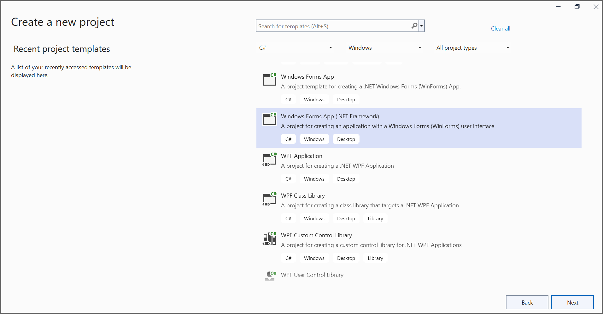
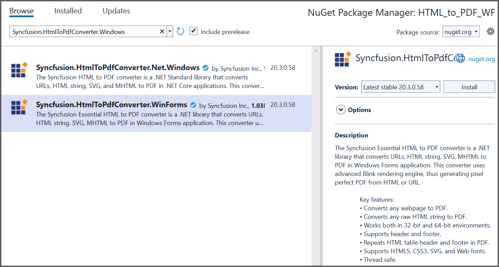

# Convert HTML to PDF file in Windows Forms

The Syncfusion HTML to PDF converter is a .NET library used to convert HTML or web pages to PDF. Using this library can convert HTML to PDF in Windows Forms application.

## Steps to convert Html to PDF document in Windows Forms:

1. Create a new Windows Forms application project.

Now, the project configuration window appears. Click Create button to create a new project with the default project configuration.

2. Install the [Syncfusion.HtmlToPdfConverter.WinForms](https://www.nuget.org/packages/Syncfusion.HtmlToPdfConverter.WinForms) NuGet package as a reference to your WinForms application [NuGet.org](https://www.nuget.org/)

3. Add the following namespaces into Form1.Designer.cs file.



using System;
using System.Windows.Forms;



Add a new button in Form1.Designer.cs to convert Html to Pdf document as follows.



private Button btnCreate;
private Label label;
private void InitializeComponent()
{
btnCreate = new Button();
label = new Label();
//Label
label.Location = new System.Drawing.Point(0, 40);
label.Size = new System.Drawing.Size(426, 35);
label.Text = "Click the button to convert Html to PDF file";
label.TextAlign = System.Drawing.ContentAlignment.MiddleCenter;
//Button
btnCreate.Location = new System.Drawing.Point(180, 110);
btnCreate.Size = new System.Drawing.Size(85, 26);
btnCreate.Text = "Convert Html to PDF";
btnCreate.Click += new EventHandler(btnCreate_Click);
//Create PDF
ClientSize = new System.Drawing.Size(450, 150);
Controls.Add(label);
Controls.Add(btnCreate);
Text = "Convert Html to PDF";
}



Include the following namespaces in the Form1.cs file.



using Syncfusion.HtmlConverter;
using Syncfusion.Pdf;
using System;



Create the btnCreate_Click event and add the following code in btnCreate_Click to convert Html to pdf document.



// Initialize HTML to PDF converter.
HtmlToPdfConverter htmlConverter = new HtmlToPdfConverter();
BlinkConverterSettings blinkConverterSettings = new BlinkConverterSettings();
//Set Blink viewport size.
blinkConverterSettings.ViewPortSize = new System.Drawing.Size(1280, 0);
//Assign Blink converter settings to HTML converter.
htmlConverter.ConverterSettings = blinkConverterSettings;
// Convert URL to PDF.
PdfDocument document = htmlConverter.Convert("https://www.syncfusion.com");
//Load the PDF document.
FileStream stream = new FileStream("HTML-to-PDF.pdf", FileMode.CreateNew);
//Save the document into stream.
document.Save(stream);
//If the position is not set to '0' then the PDF will be empty.
stream.Position = 0;
//Close the document.
document.Close();
stream.Dispose();



A complete working sample can be downloaded from [WinForms-HTML-to-PDF-Demo.zip](https://www.syncfusion.com/downloads/support/directtrac/general/ze/WinForms-HTML-to-PDF-Demo-819812860)

By executing the program, you will get the PDF document as follows.

