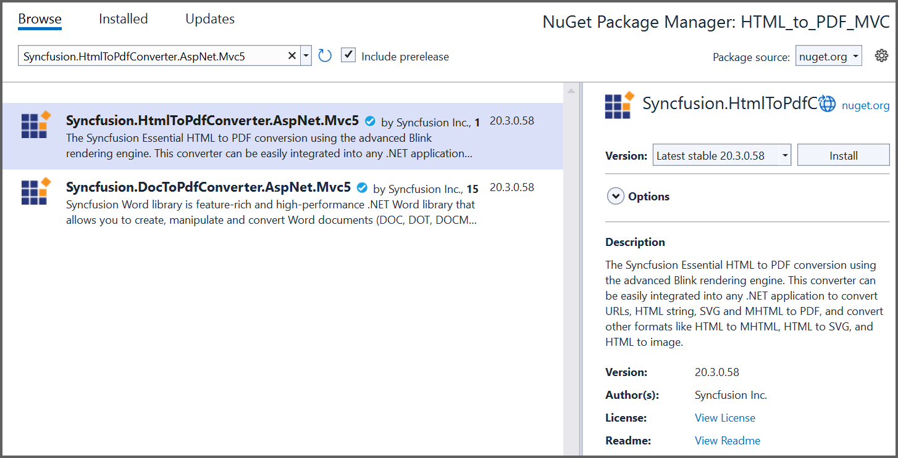

# Convert HTML to PDF file in ASP.NET MVC

The Syncfusion HTML to PDF converter is a .NET library used to convert HTML or web pages to PDF document in ASP.NET MVC application.  

## Steps to convert HTML to PDF document in ASP.NET MVC

Step 1: Create a new C# ASP.NET Web Application (.NET Framework) project.
   

Step 2: In the project configuration windows, name your project and select Create.
   
   

Step 3: Install [Syncfusion.HtmlToPdfConverter.AspNet.Mvc5](https://www.nuget.org/packages/Syncfusion.HtmlToPdfConverter.AspNet.Mvc5)  NuGet package as reference to your .NET applications from [NuGet.org](https://www.nuget.org/).
   

Step 4: Include the following namespaces in the HomeController.cs file.

   

   using Syncfusion.Pdf;
   using Syncfusion.HtmlConverter;
   using System.IO;

   

Step 5: Add a new button in the Index.cshtml as shown below.

   

   @{Html.BeginForm("ExportToPDF", "Home", FormMethod.Post);
      {
         

            <input type="submit" value="Convert PDF" style="width:150px;height:27px" />
         

      }
      Html.EndForm();
   }

   

Step 6: Add a new action method named ExportToPDF in HomeController.cs and include the below code snippet to convert HTML to PDF document.

   

   //Initialize HTML to PDF converter.
   HtmlToPdfConverter htmlConverter = new HtmlToPdfConverter();
   BlinkConverterSettings blinkConverterSettings = new BlinkConverterSettings();
   //Set Blink viewport size.
   blinkConverterSettings.ViewPortSize = new System.Drawing.Size(1280, 0);
   //Assign Blink converter settings to HTML converter.
   htmlConverter.ConverterSettings = blinkConverterSettings;
   //Convert URL to PDF document.
   PdfDocument document = htmlConverter.Convert("https://www.syncfusion.com");
   //Create memory stream.
   MemoryStream stream = new MemoryStream();
   //Save the document to memory stream.
   document.Save(stream);
   return File(stream.ToArray(), System.Net.Mime.MediaTypeNames.Application.Pdf, "HTML-to-PDF.pdf");

   

   By executing the program, you will get the PDF document as follows.
   

   A complete working sample can be downloaded from [Github](https://github.com/SyncfusionExamples/html-to-pdf-csharp-examples/tree/master/ASP.NET%20MVC).
   