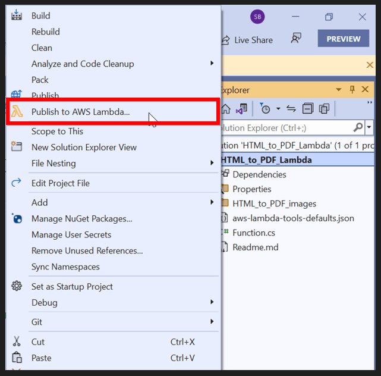
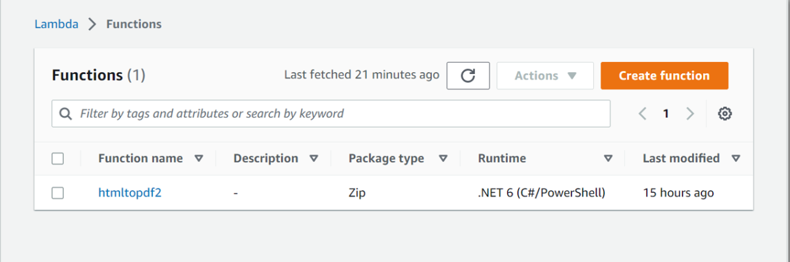

The Syncfusion [HTML to PDF converter](https://www.syncfusion.com/pdf-framework/net/html-to-pdf) is a .NET library for converting webpages, SVG, MHTML, and HTML to PDF using C#. It is reliable and accurate. Using this library, you can convert HTML to PDF in AWS using Blink.

# Setting up the AWS Toolkit for Visual Studio:

You can create an AWS account by referring to this [link.](https://aws.amazon.com/) 
Download and install the AWS Toolkit for Visual Studio, you can download the AWS toolkit from this [link](https://aws.amazon.com/visualstudio/). The Toolkit can be installed from Tools/Extension and updates options in Visual Studio. 

## Refer to the following steps to convert HTML to PDF in AWS Lambda:

Create an AWS Lambda function to convert HTML to PDF and publish it to AWS.
Invoke the AWS Lambda function in your main application using AWS SDKs.

## Steps to convert HTML to PDF in AWS Lambda:

Create a new AWS Lambda project as follows:
 
 
Create a project name and select location.
 

Select Blueprint as Empty Function and click Finish.
 

Install the [Syncfusion.HtmlToPdfConverter.Net.Aws](https://www.nuget.org/packages/Syncfusion.HtmlToPdfConverter.Net.Aws/) NuGet package as a reference to your AWS lambda project from [NuGet.org.](https://www.nuget.org/)
 

Using the following namespaces in the Function.cs file.



using Syncfusion.HtmlConverter;
using Syncfusion.Pdf;
using System.IO;



Add the following code snippet in Function.cs to create a PDF document.



//Initialize HTML to PDF converter with Blink rendering engine.
HtmlToPdfConverter htmlConverter = new HtmlToPdfConverter();

//Convert URL to PDF.
PdfDocument document = htmlConverter.Convert(input);

//Save the document into stream.
MemoryStream memoryStream = new MemoryStream();

//Save and Close the PDFDocument.
document.Save(memoryStream);
document.Close(true);

return Convert.ToBase64String(memoryStream.ToArray());



Right-click the project and select Publish to AWS Lambda. 
  

Create a new AWS profile in the Upload Lambda Function Window. After creating the profile, add a name for the Lambda function to publish. Then, click Next.   
     

In the Advanced Function Details window, specify the Role Name as based on AWS Managed policy. After selecting the role, click the Upload button to deploy your application.
   

After deploying the application, Sign in your AWS account and you can see the published Lambda function in AWS console. 

## Refer to the following steps to invoke the AWS Lambda function from the console application:

Create a new console project.  

Create a project name and select folder path. 
   

Install the AWSSDK.Core, AWSSDK.Lambda and Newtonsoft.Json package as a reference to your main application from the NuGet.org.    
  
 
Include the following namespaces in Program.cs file.



using Amazon;
using Amazon.Lambda;
using Amazon.Lambda.Model;
using Newtonsoft.Json;
using System.IO;



Add the following code snippet in Program class to invoke the published AWS Lambda function using the function name and access keys.



//Create a new AmazonLambdaClient
AmazonLambdaClient client = new AmazonLambdaClient("awsaccessKeyID", "awsSecreteAccessKey", RegionEndpoint.USEast1);

//Create new InvokeRequest with the published function name
InvokeRequest invoke = new InvokeRequest
{
  FunctionName = "AwsLambdaFunctionHtmlToPdfConversion",
  InvocationType = InvocationType.RequestResponse,
  Payload = "\" https://www.google.co.in/ \""
};
//Get the InvokeResponse from client InvokeRequest
InvokeResponse response = client.Invoke(invoke);

//Read the response stream
var stream = new StreamReader(response.Payload);
JsonReader reader = new JsonTextReader(stream);
var serilizer = new JsonSerializer();
var responseText = serilizer.Deserialize(reader);

//Convert Base64String into PDF document
byte[] bytes = Convert.FromBase64String(responseText.ToString());
FileStream fileStream = new FileStream("Sample.pdf", FileMode.Create);
BinaryWriter writer = new BinaryWriter(fileStream);
writer.Write(bytes, 0, bytes.Length);
writer.Close();
System.Diagnostics.Process.Start("Sample.pdf");


 
By executing the program, you will get the PDF document as follows. 
 

A complete working sample can be downloaded from below links
AWS Lambda: [HtmlToPDFAWSLambdaBlink.zip](https://www.syncfusion.com/downloads/support/directtrac/general/ze/HtmlToPDFAWSLambdaBlink-1145438247)
Console sample: [ClientHtmlToPDFConversion.zip](https://www.syncfusion.com/downloads/support/directtrac/general/ze/ClientHtmlToPDFConversion-1236563355.zip)

