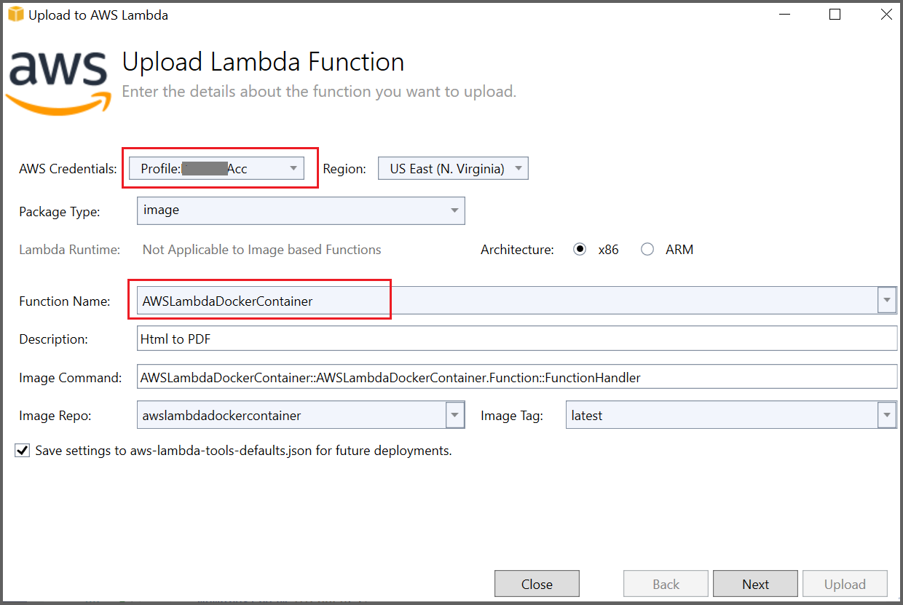

# Convert HTML to PDF file in AWS using c#

The Syncfusion [HTML to PDF converter](https://www.syncfusion.com/pdf-framework/net/html-to-pdf) is a .NET library for converting webpages, SVG, MHTML, and HTML to PDF using C#. The result preserves all graphics, images, text, fonts, and the layout of the original HTML document or webpage. Using this library, you can convert HTML to PDF using C# with Blink rendering engine in AWS.

## Setting up the AWS Toolkit for Visual Studio

* You can create an AWS account by referring to this [link.](https://aws.amazon.com/) 
* Download and install the AWS Toolkit for Visual Studio, you can download the AWS toolkit from this [link](https://aws.amazon.com/visualstudio/).
* The Toolkit can be installed from Tools/Extension and updates options in Visual Studio. 

Refer to the following steps to convert HTML to PDF in AWS Lambda

* Create an AWS Lambda function to convert HTML to PDF and publish it to AWS.
* Invoke the AWS Lambda function in your main application using AWS SDKs.

## AWS Lambda

**Steps to convert HTML to PDF in AWS Lambda**

Step 1: Create a new AWS Lambda project as follows.
 
 
Step 2: In configuration window, name the project and select Create.
  

Step 3: Select Blueprint as Empty Function and click Finish.
 

Step 4: Install the [Syncfusion.HtmlToPdfConverter.Net.Aws](https://www.nuget.org/packages/Syncfusion.HtmlToPdfConverter.Net.Aws/) NuGet package as a reference to your AWS lambda project from [NuGet.org.](https://www.nuget.org/)
 

Step 5: Using the following namespaces in the Function.cs file.



using Syncfusion.HtmlConverter;
using Syncfusion.Pdf;
using System.IO;



Step 6: Add the following code snippet in Function.cs to convert HTML to PDF document.



//Initialize HTML to PDF converter with Blink rendering engine.
HtmlToPdfConverter htmlConverter = new HtmlToPdfConverter();
//Convert URL to PDF.
PdfDocument document = htmlConverter.Convert(input);
//Save the document into stream.
MemoryStream memoryStream = new MemoryStream();
//Save and Close the PDF Document.
document.Save(memoryStream);
document.Close(true);
return Convert.ToBase64String(memoryStream.ToArray());



Step 7: Right-click the project and select Publish to AWS Lambda. 
   

Step 8: Create a new AWS profile in the Upload Lambda Function Window. After creating the profile, add a name for the Lambda function to publish. Then, click Next.   
     

Step 9: In the Advanced Function Details window, specify the Role Name as based on AWS Managed policy. After selecting the role, click the Upload button to deploy your application.
   

Step 10: After deploying the application, Sign in your AWS account and you can see the published Lambda function in AWS console. 
 

**Steps to invoke the AWS Lambda function from the console application**

Step 1: Create a new console project.  
 

Step 2: In project configuration windows, name the project and select Create.
   

Step 3: Install the [AWSSDK.Core](https://www.nuget.org/packages/AWSSDK.Core), [AWSSDK.Lambda](https://www.nuget.org/packages/AWSSDK.Lambda) and [Newtonsoft.Json package](https://www.nuget.org/packages/Newtonsoft.Json/13.0.2-beta3) as a reference to your main application from the [NuGet.org](https://www.nuget.org/).    
   
 
Step 4: Include the following namespaces in Program.cs file.



using Amazon;
using Amazon.Lambda;
using Amazon.Lambda.Model;
using Newtonsoft.Json;
using System.IO;



Step 5: Add the following code snippet in Program class to invoke the published AWS Lambda function using the function name and access keys.



//Create a new AmazonLambdaClient
AmazonLambdaClient client = new AmazonLambdaClient("awsaccessKeyID", "awsSecreteAccessKey", RegionEndpoint.USEast1);
//Create new InvokeRequest with the published function name
InvokeRequest invoke = new InvokeRequest
{
    FunctionName = "AwsLambdaFunctionHtmlToPdfConversion",
    InvocationType = InvocationType.RequestResponse,
    Payload = "\" https://www.google.co.in/ \""
};
//Get the InvokeResponse from client InvokeRequest
InvokeResponse response = client.Invoke(invoke);
//Read the response stream
var stream = new StreamReader(response.Payload);
JsonReader reader = new JsonTextReader(stream);
var serilizer = new JsonSerializer();
var responseText = serilizer.Deserialize(reader);
//Convert Base64String into PDF document
byte[] bytes = Convert.FromBase64String(responseText.ToString());
FileStream fileStream = new FileStream("Sample.pdf", FileMode.Create);
BinaryWriter writer = new BinaryWriter(fileStream);
writer.Write(bytes, 0, bytes.Length);
writer.Close();
System.Diagnostics.Process.Start("Sample.pdf");


 
By executing the program, you will get the PDF document as follows. 
 

A complete working sample can be downloaded from [Github](https://github.com/SyncfusionExamples/html-to-pdf-csharp-examples/tree/master/AWS).

## AWS Lambda with NET 6 container image

**Steps to convert HTML to PDF in AWS Lambda with NET 6 container image**

Step 1: Create a new AWS Lambda project with Tests as follows.

Step 2: Create a project name and select the location.

Step 3: Select Blueprint as .NET 6 (Container Image) Function and click Finish.

Step 4: Install the [Syncfusion.HtmlToPdfConverter.Net.Aws](https://www.nuget.org/packages/Syncfusion.HtmlToPdfConverter.Net.Aws/) and [AWSSDK.Lambda](https://www.nuget.org/packages/AWSSDK.Lambda) NuGet package as a reference to your AWS lambda project from [NuGet.org](https://www.nuget.org/).

Step 5: Using the following namespaces in the Function.cs file.



using Syncfusion.HtmlConverter;
using Syncfusion.Pdf;
using System.IO;



Step 6: Add the following code sample in the Function.cs to create a PDF document.



public string FunctionHandler(string input, ILambdaContext context)
{
   //Initialize HTML to a PDF converter with the Blink rendering engine.
   HtmlToPdfConverter htmlConverter = new HtmlToPdfConverter(HtmlRenderingEngine.Blink);
       
   BlinkConverterSettings blinkConverterSettings = new BlinkConverterSettings();
   blinkConverterSettings.BlinkPath = Path.GetFullPath("BlinkBinariesAws");
   blinkConverterSettings.CommandLineArguments.Add("--no-sandbox");
   blinkConverterSettings.CommandLineArguments.Add("--disable-setuid-sandbox");
   blinkConverterSettings.AdditionalDelay = 3000;
   htmlConverter.ConverterSettings = blinkConverterSettings;
 
   //Convert the HTML string to PDF.
   PdfDocument document = htmlConverter.Convert(input, PathToFile());        
 
   //Save the document into a stream.
   MemoryStream memoryStream = new MemoryStream();
 
   //Save and close the PDFDocument.
   document.Save(memoryStream);
   document.Close(true);
 
   string base64 = Convert.ToBase64String(memoryStream.ToArray());
   memoryStream.Close();
   memoryStream.Dispose();
 
   return base64;
}

public static string PathToFile()
{
   string? path = System.IO.Path.GetDirectoryName(System.Reflection.Assembly.GetExecutingAssembly().GetName().CodeBase);
   if (string.IsNullOrEmpty(path))
   {
      path = Environment.OSVersion.Platform == PlatformID.Unix ? @"/" : @"\";
   }
   return Environment.OSVersion.Platform == PlatformID.Unix ? string.Concat(path.Substring(5), @"/") : string.Concat(path.Substring(6), @"\");
}



Step 7: Create a new folder as Helper and add a class file as AWSHelper.cs. Add the following namespaces and code samples in the AWSHelper class to invoke the published AWS Lambda function using the function name and access keys.



Using Amazon.Lambda;
using Amazon.Lambda.Model;
using Newtonsoft.Json;

public class AWSHelper
{
   public static async Task<byte[]> RunLambdaFunction(string html)
   {
      try
      {
         var AwsAccessKeyId = "awsaccessKeyID";
         var AwsSecretAccessKey = "awsSecretAccessKey";
 
         AmazonLambdaClient client = new AmazonLambdaClient(AwsAccessKeyId, AwsSecretAccessKey, Amazon.RegionEndpoint.USEast1);
         InvokeRequest invoke = new InvokeRequest
         {
            FunctionName = "AWSLambdaDockerContainer",
            InvocationType = InvocationType.RequestResponse,
            Payload = Newtonsoft.Json.JsonConvert.SerializeObject(html)
         };
         //Get the InvokeResponse from the client InvokeRequest.
         InvokeResponse response = await client.InvokeAsync(invoke);
 
         //Read the response stream.
         Console.WriteLine($"Response: {response.LogResult}");
         Console.WriteLine($"Response: {response.StatusCode}");
         Console.WriteLine($"Response: {response.FunctionError}");
         var stream = new StreamReader(response.Payload);
         JsonReader reader = new JsonTextReader(stream);
         var serilizer = new JsonSerializer();
         var responseText = serilizer.Deserialize(reader);
 
         //Convert Base64String into a PDF document.
         return Convert.FromBase64String(responseText.ToString());
      }
      catch (Exception ex)
      {
          Console.WriteLine($"Exception Occured HTMLToPDFHelper: {ex}");
      }
   return Convert.FromBase64String("");
   }
}



Step 8: Right-click the project and select **Publish to AWS Lambda**.

Step 9: Create a new AWS profile in the Upload Lambda Function Window. After creating the profile, add a name for the Lambda function to publish. Then, click **Next**.  

Step 10: In the Advanced Function Details window, specify the **Role Name** as based on AWS Managed policy. After selecting the role, click the Upload button to deploy your application.

Step 11: After deploying the application, Sign in to your AWS account, and you can see the published Lambda function in the AWS console.

**Steps to invoke the AWS Lambda function from the Test application**:

Step 12: Add the following code to invoke the AWS lambda function with the HTML string from the Function Test.



public class FunctionTest
{
    [Fact]
    public void HtmlToPDFFunction()
    {
        string path = System.IO.Path.GetDirectoryName(System.Reflection.Assembly.GetExecutingAssembly().GetName().CodeBase);
        string filePath = Environment.OSVersion.Platform == PlatformID.Unix ? string.Concat(path.Substring(5), @"/") : string.Concat(path.Substring(6), @"\");
 
        var html = File.ReadAllText($"{filePath}/HtmlSample.html");
        byte[] base64 = null;
        base64 = AWSHelper.RunLambdaFunction(html).Result;
 
        FileStream file = new FileStream($"{filePath}/file{DateTime.Now.Ticks}.pdf", FileMode.Create, FileAccess.Write);
        var ms = new MemoryStream(base64);
        ms.WriteTo(file);
        file.Close();
        ms.Close();
    }
}



Step 13: Right click the test application and select **Run Tests**.

Step 14: By executing the program, you will get the PDF document as follows.

A complete working sample can be downloaded from Github.

