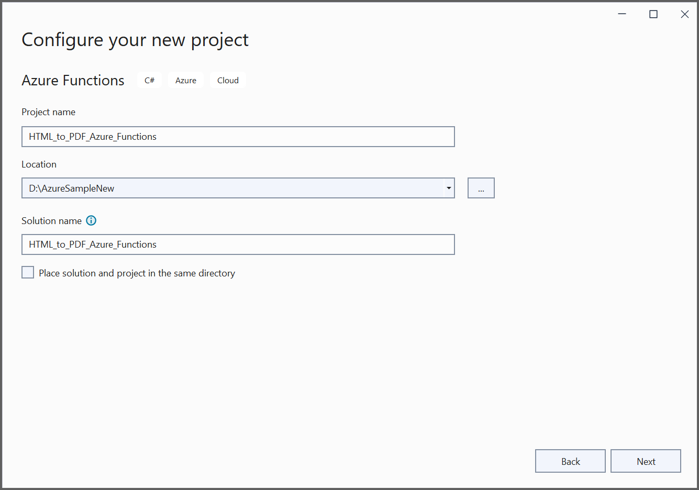
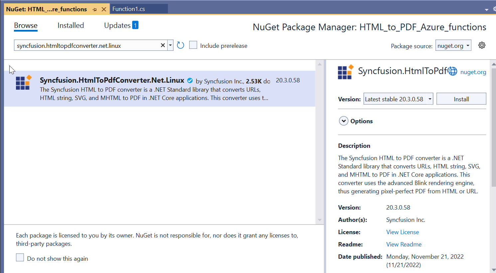
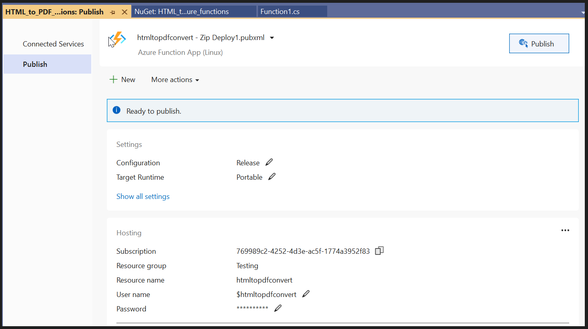

# Convert HTML to PDF file in Azure

The Syncfusion [HTML to PDF converter](https://www.syncfusion.com/document-processing/pdf-framework/net/html-to-pdf) is a .NET library for converting webpages, SVG, MHTML, and HTML to PDF using C#. It is reliable and accurate. The result preserves all graphics, images, text, fonts, and the layout of the original HTML document or webpage. Using this library, you can convert an HTML to PDF using C# with the Blink rendering engine in Azure App Service on Linux, Azure app service using the Linux [docker](https://www.docker.com/why-docker) container and Azure Function Application Linux.

## Azure App Service Linux

### Steps to convert HTML to PDF in Azure App service on Linux:

1. Create a new ASP.NET Core MVC application.

2. Choose your project's target framework and select Configure for HTTPS.

3. Install the [Syncfusion.HtmlToPdfConverter.Net.Linux](https://www.nuget.org/packages/Syncfusion.HtmlToPdfConverter.Net.Linux/) NuGet package as a reference to your .NET Core application [NuGet.org](https://www.nuget.org/).

## There are two ways to install the dependency packages to Azure server:
1. Using SSH from Azure portal.
2. By running the commands from C#.

### Using SSH command line:

1. After publishing the Web application, login to the Azure portal in a web interface and open the published app service.
Under Development Tools Menu, Open the SSH and Click the go link.

2. From the terminal window, you can install the dependency packages. Use the following single command to install all dependencies packages.

   

   apt-get update && apt-get install -yq --no-install-recommends  libasound2 libatk1.0-0 libc6 libcairo2 libcups2 libdbus-1-3 libexpat1 libfontconfig1 libgcc1 libgconf-2-4 libgdk-pixbuf2.0-0 libglib2.0-0 libgtk-3-0 libnspr4 libpango-1.0-0 libpangocairo-1.0-0 libstdc++6 libx11-6 libx11-xcb1 libxcb1 libxcursor1 libxdamage1 libxext6 libxfixes3 libxi6 libxrandr2 libxrender1 libxss1 libxtst6 libnss3 libgbm1

   

### Running the commands from C#

1. Create a shell file with the above commands in the project and name it as dependenciesInstall.sh. In this article, these steps have been followed to install dependencies packages. 

2. Set Copy to output directory as Copy if newer to the dependenciesInstall.sh file.

3. Include the following code snippet to install the dependencies code in Configure method in startup.cs file.

   

   //Install the dependencies packages for HTML to PDF conversion in Linux
   string shellFilePath = System.IO.Path.Combine(env.ContentRootPath, "dependenciesInstall.sh");
   InstallDependecies(shellFilePath);

   

   

   // [C# Code]
private void InstallDependecies(string shellFilePath) 
{
      Process process = new Process
      {
            StartInfo = new ProcessStartInfo
            {
                  FileName = "/bin/bash",
                  Arguments = "-c " + shellFilePath,
                  CreateNoWindow = true,
                  UseShellExecute = false,
             }
      };
      process.Start();
      process.WaitForExit();
}

   

   Add an Export to the PDF button in the index.cshtml.

   

   

    @{ Html.BeginForm("ExportToPDF", "Home", FormMethod.Post);
        {
            <input type="submit" value="Export To PDF" class=" btn" />
        }
   }
   

   

   Include the following namespaces and code samples in the controller for converting HTML to PDF.

   

   using Syncfusion.HtmlConverter;
   using Syncfusion.Pdf;
   using System.IO

   

   

   public ActionResult ExportToPDF()
{
     Environment.SetEnvironmentVariable("ASPNETCORE_ENVIRONMENT", "Development"); 
	//Initialize HTML to PDF converter 
	HtmlToPdfConverter htmlConverter = new HtmlToPdfConverter();
	BlinkConverterSettings settings = new BlinkConverterSettings();
	//Set command line arguments to run without sandbox.
	settings.CommandLineArguments.Add("--no-sandbox");
	settings.CommandLineArguments.Add("--disable-setuid-sandbox");
	//Assign WebKit settings to the HTML converter 
	htmlConverter.ConverterSettings = settings;
	//Convert HTML string to PDF
	PdfDocument document = htmlConverter.Convert("http://www.syncfusion.com");
	//Save the document into stream
	MemoryStream stream = new MemoryStream();
	document.Save(stream);
	stream.Position = 0;
	//Close the document
	document.Close(true);
	//Defining the ContentType for pdf file
	string contentType = "application/pdf";
	//Define the file name
	string fileName = "URL_to_PDF.pdf";
	//Creates a FileContentResult object by using the file contents, content type, and file name
	return File(stream, contentType, fileName);
   }

   

## Refer to the following steps to publish as Azure App Linux:

1. Right-click the project and select Publish.

2. Create a new profile in publish target window.

3. Create App service using Azure subscription and select a hosting plan.

4. HTML to PDF conversion works from basic hosting plan (B1 to P3). So, select the hosting plan as required. HTML to PDF conversion will not work if the hosting plan is Free/Shared.

5. After creating a profile, click the publish button.

6. Now, the published webpage will open in the browser. Click Export to PDF to convert the Syncfusion webpage to a PDF.

A complete work sample for converting an HTML to PDF in Azure App service on Linux can be downloaded from [AzureAppLinux_CoreSample.zip.](https://www.syncfusion.com/downloads/support/directtrac/general/ze/AzureAppLinux_CoreSample-2144256654)

## Azure App Service Linux with docker

### Steps to convert HTML to PDF in Azure app service using the Blink with Linux docker container:

1. Create a new ASP.NET Core application and enable the docker support with Linux as a target OS.

2. Choose your project's target framework, then select Configure for HTTPS and Enable Docker.

3. Install the [Syncfusion.HtmlToPdfConverter.Net.Linux](https://www.nuget.org/packages/Syncfusion.HtmlToPdfConverter.Net.Linux/) NuGet package as a reference to your .NET Core application [NuGet.org](https://www.nuget.org/).

4. Include the following commands in the docker file to install the dependent packages in the docker container.

   

   RUN apt-get update && \
     apt-get install -yq --no-install-recommends \ 
     libasound2 libatk1.0-0 libc6 libcairo2 libcups2 libdbus-1-3 \ 
     libexpat1 libfontconfig1 libgcc1 libgconf-2-4 libgdk-pixbuf2.0-0 libglib2.0-0 libgtk-3-0 libnspr4 \ 
     libpango-1.0-0 libpangocairo-1.0-0 libstdc++6 libx11-6 libx11-xcb1 libxcb1 \ 
     libxcursor1 libxdamage1 libxext6 libxfixes3 libxi6 libxrandr2 libxrender1 libxss1 libxtst6 \ 
     libnss3 libgbm1

   

5. Add an Export to the PDF button in the index.cshtml.

   

   

    @{ Html.BeginForm("ExportToPDF", "Home", FormMethod.Post);
        {
            <input type="submit" value="Export To PDF" class=" btn" />
        }
    }
   

   

6. Include the following namespaces and code samples in the controller for converting HTML to PDF.

   

   using Syncfusion.HtmlConverter;
   using Syncfusion.Pdf;
   using System.IO

   

   

   public ActionResult ExportToPDF()
{
     //Initialize HTML to PDF converter. 
     HtmlToPdfConverter htmlConverter = new HtmlToPdfConverter();
     BlinkConverterSettings settings = new BlinkConverterSettings();
     //Set command line arguments to run without the sandbox.
     settings.CommandLineArguments.Add("--no-sandbox");
     settings.CommandLineArguments.Add("--disable-setuid-sandbox");
     //Assign Blink settings to the HTML converter.
     htmlConverter.ConverterSettings = settings;
     //Convert URL to PDF.
     PdfDocument document = htmlConverter.Convert("https://www.syncfusion.com");
     MemoryStream stream = new MemoryStream();
     //Save and close a PDF document. 
     document.Save(stream);
     return File(stream.ToArray(), System.Net.Mime.MediaTypeNames.Application.Pdf, "URL_to_PDF.pdf");
}

   

7. Build and run the sample in the docker, it will pull the Linux docker image from the docker hub and run the project. Now, the webpage will open in the browser. Click Export to PDF option to convert the Syncfusion webpage to a PDF.

8. By executing the program, you will get the PDF document as follows.

## Deploy the container to Azure container instance:

1. Create a publish target to deploy the docker image to Azure. 

2. Create Azure App Service with resource group, hosting plan, and container registry. 

3. Publish the docker image to Azure container instance.

4. It will push the docker image to the Azure container registry and deploy it to the Azure container instance.

5. After successful deployment, it will open the Azure website in the browser.

6. Click Export to PDF option to convert the Google webpage to a PDF. You will get the PDF document as follows.
 

A complete work sample can be downloaded from [BlinkLinuxDockerAzureSample.zip.](https://www.syncfusion.com/downloads/support/directtrac/general/ze/BlinkLinuxDockerAzureSample637072917)

## Azure App Function Linux

### Steps to convert HTML to PDF in the Azure Functions using the Blink rendering engine
1. Create the Azure function project.

2. Select the Azure Functions type and .NET Core version.

3. Install the [Syncfusion.HtmlToPdfConverter.Net.Linux](https://www.nuget.org/packages/Syncfusion.HtmlToPdfConverter.Net.Linux/) NuGet package as a reference to your .NET Core application [NuGet.org](https://www.nuget.org/).

4. Include the following namespaces in Function1.cs file.

   

   using Syncfusion.HtmlConverter;
   using Syncfusion.Pdf;
   using System.Runtime.InteropServices;

   

5. Add the following code snippet in the Function1 class to convert HTML to PDF using the Blink HTML converter in the Azure Functions Linux.

   

   [FunctionName("Function1")]
public static async Task<IActionResult> Run([HttpTrigger(AuthorizationLevel.Function, "get", "post", Route = null)] HttpRequest req, ILogger log, ExecutionContext executionContext)
{
     string blinkBinariesPath = string.Empty;
     try
     {
         blinkBinariesPath = SetupBlinkBinaries(executionContext);
     }
     catch
     {
         throw new Exception("BlinkBinaries initialization failed");
     }
     string url = req.Query["url"];
     //Initialize the HTML to PDF converter with the Blink rendering engine.
     HtmlToPdfConverter htmlConverter = new HtmlToPdfConverter(HtmlRenderingEngine.Blink);
     BlinkConverterSettings settings = new BlinkConverterSettings();
     //Set command line arguments to run without sandbox.
     settings.CommandLineArguments.Add("--no-sandbox");
     settings.CommandLineArguments.Add("--disable-setuid-sandbox");
     settings.BlinkPath = blinkBinariesPath;
     //Assign WebKit settings to the HTML converter 
     htmlConverter.ConverterSettings = settings;
     //Convert URL to PDF
     PdfDocument document = htmlConverter.Convert(url);
     MemoryStream ms = new MemoryStream();
     //Save and close the PDF document  
     document.Save(ms);
     document.Close();
     ms.Position = 0;
     return new FileStreamResult(ms, "application/pdf");
  }

   

6. Add the following helper methods to copy and set permission to the BlinkBinariesLinux folder.

   

   private static string SetupBlinkBinaries(ExecutionContext executionContext)
   {
   string blinkAppDir = Path.Combine(executionContext.FunctionAppDirectory, "BlinkBinariesLinux");
   string tempBlinkDir = Path.GetTempPath();
   string chromePath = Path.Combine(tempBlinkDir, "chrome");
   if (!File.Exists(chromePath))
   {
     CopyFilesRecursively(blinkAppDir, tempBlinkDir);
     SetExecutablePermission(tempBlinkDir);
   }
   return tempBlinkDir;
   }
   private static void CopyFilesRecursively(string sourcePath, string targetPath)
   {
   //Create all the directories from the source to the destination path.
   foreach (string dirPath in Directory.GetDirectories(sourcePath, "*", SearchOption.AllDirectories))
   {
       Directory.CreateDirectory(dirPath.Replace(sourcePath, targetPath));
   }
   //Copy all the files from the source path to the destination path.
   foreach (string newPath in Directory.GetFiles(sourcePath, "*.*", SearchOption.AllDirectories))
   {
       File.Copy(newPath, newPath.Replace(sourcePath, targetPath), true);
   }
   }
   [DllImport("libc", SetLastError = true, EntryPoint = "chmod")]
   internal static extern int Chmod(string path, FileAccessPermissions mode);
   private static void SetExecutablePermission(string tempBlinkDir)
   {
   FileAccessPermissions ExecutableFilePermissions = FileAccessPermissions.UserRead | FileAccessPermissions.UserWrite | FileAccessPermissions.UserExecute |
   FileAccessPermissions.GroupRead | FileAccessPermissions.GroupExecute | FileAccessPermissions.OtherRead | FileAccessPermissions.OtherExecute;
   string[] executableFiles = new string[] { "chrome", "chrome_sandbox" };
   foreach (string executable in executableFiles)
   {
       var execPath = Path.Combine(tempBlinkDir, executable);
       if (File.Exists(execPath))
       {
          var code = Function1.Chmod(execPath, ExecutableFilePermissions);
           if (code != 0)
           {
               throw new Exception("Chmod operation failed");
           }
       }
    }

       

7. Include the below enum in the Function1.cs file. 

   

   [Flags]
   internal enum FileAccessPermissions : uint
   {
   OtherExecute = 1,
   OtherWrite = 2,
   OtherRead = 4,
   GroupExecute = 8,
   GroupWrite = 16,
   GroupRead = 32,
   UserExecute = 64,
   UserWrite = 128,
   UserRead = 256
   }

   

## Publish to Azure Functions Linux

1. Right-click the project and select Publish. Then, create a new profile in the Publish Window. The Blink rendering engine will work in consumption plan. So, you can create the Azure Function App service with a consumption plan.

2. After creating the profile, click the Publish button.

3. Now, go to the Azure portal and select the App Services. After running the service, click Get function URL > Copy. Include the URL as a query string in the URL. Then, paste it into the new browser tab. You will get the PDF document as follows.
Example: https://htmltopdfazurefunctionblink.azurewebsites.net/api/Function1?code=aYCeymbJeHMGIwEEIuCIcNe….&url=https://www.syncfusion.com

A complete working sample can be downloaded from [HtmlToPdfBlinkAzureFunction.zip.](https://www.syncfusion.com/downloads/support/directtrac/general/ze/HtmlToPdfBlinkAzureFunction-1844632251)