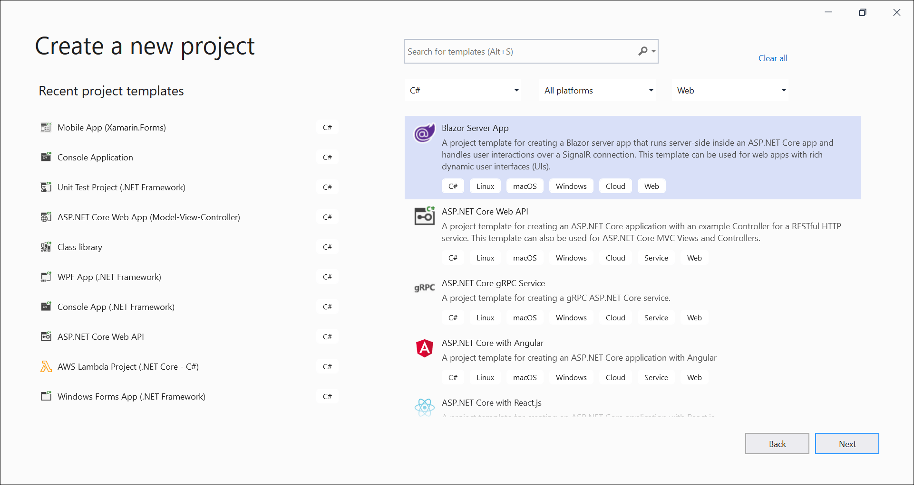
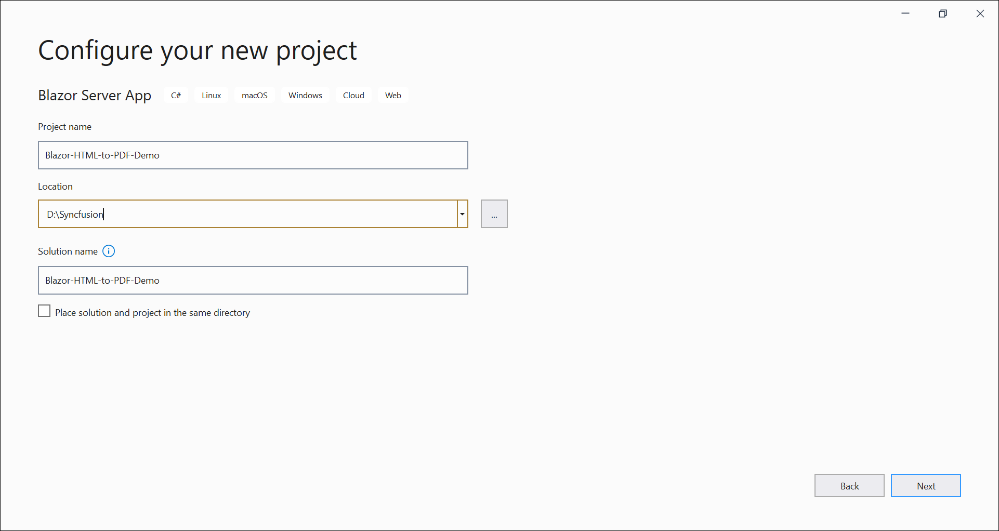
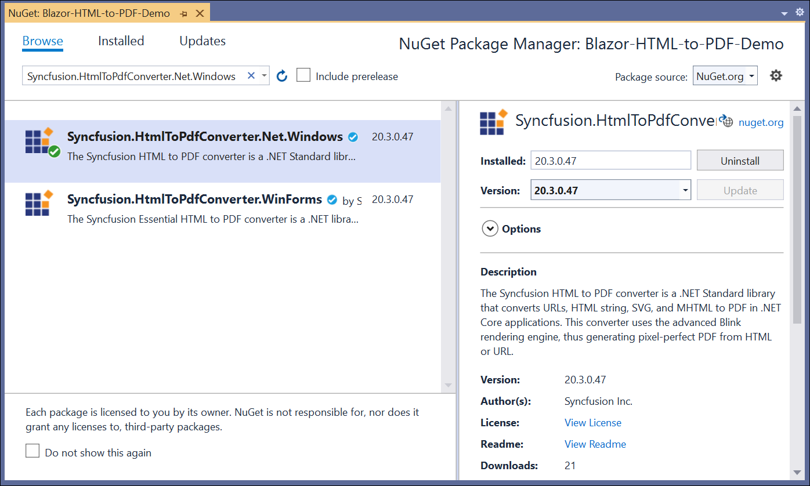
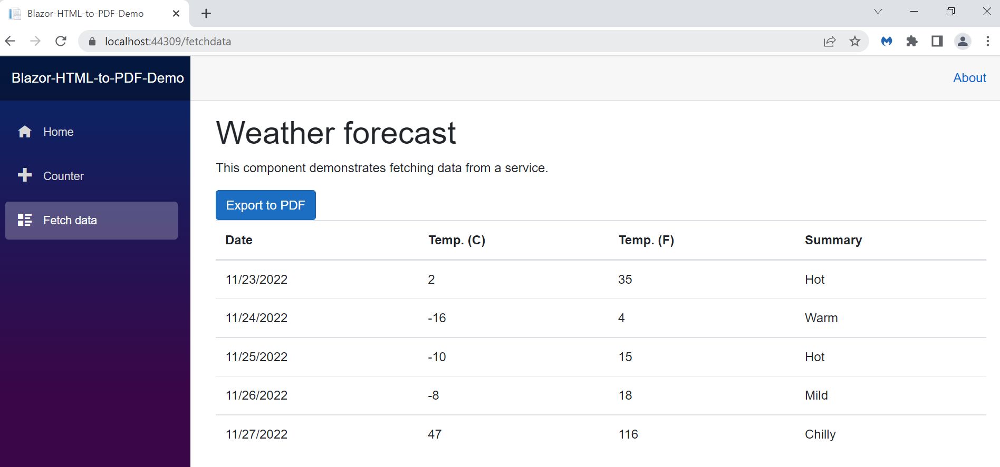

# Convert HTML to PDF file in Blazor

Steps to convert HTML to PDF in Blazor application

Create a new C# Blazor application project. Select Blazor App from the template and click the Next button.

Now, the project configuration window appears. Click Create button to create a new project with the default project configuration.

Install the [Syncfusion.HtmlToPdfConverter.Net.Windows](https://www.nuget.org/packages/Syncfusion.HtmlToPdfConverter.Net.Windows/) NuGet package as a reference to your Blazor application from [NuGet.org](https://www.nuget.org/).

Create a new cs file named ExportService under Data folder and include the following namespaces in the file.



using Syncfusion.HtmlConverter;
using Syncfusion.Pdf;
using System.IO;



Add the following method in the ExportService class



public MemoryStream CreatePdf()
{
    //Initialize HTML to PDF converter.
    HtmlToPdfConverter htmlConverter = new HtmlToPdfConverter();
    //Convert URL to PDF.
    PdfDocument document = htmlConverter.Convert("https://www.syncfusion.com");
    MemoryStream stream = new MemoryStream();
    document.Save(stream);
    return stream;
}



Register your service in the ConfigureServices method available in the Startup.cs class as follows.



public void ConfigureServices(IServiceCollection services)
{
    services.AddRazorPages();
    services.AddServerSideBlazor();
    services.AddSingleton<WeatherForecastService>();
    services.AddSingleton<ExportService>();
}



Inject ExportService in-to FetchData.razor using the following code.



@inject ExportToFileService exportService
@inject Microsoft.JSInterop.IJSRuntime JS
@using  System.IO;



Create a button in the FetchData.razor using the following code.



<button class="btn btn-primary" @onclick="@ExportToPdf">Export to PDF</button>



Add the ExportToPdf method in FetchData.razor page to call the export service.



@functions
{
 
    protected async Task ExportToPdf()
    {
        using (MemoryStream excelStream =exportService.CreatePdf(forecasts))
        {
            await JS.SaveAs("HTMLToPDF.pdf", excelStream.ToArray());
        }
    }
}



Create a class file with FileUtil name and add the following code to invoke the JavaScript action to download the file in the browser.



public static class FileUtil
{
    public static ValueTask<object> SaveAs(this IJSRuntime js, string filename, byte[] data)
       => js.InvokeAsync<object>(
           "saveAsFile",
           filename,
           Convert.ToBase64String(data));
}



Add the following JavaScript function in the _Host.cshtml available under the Pages folder.





By executing the program, you will get the following output in the browser.

Click the Export to PDF button, and you will get the PDF document with the following output.

A complete work sample for converting an HTML to PDF in the Blazor framework can be downloaded from [Blazor-HTML-to-PDF-Demo.zip ](https://www.syncfusion.com/downloads/support/directtrac/general/ze/Blazor-HTML-to-PDF-Demo-899009860)
