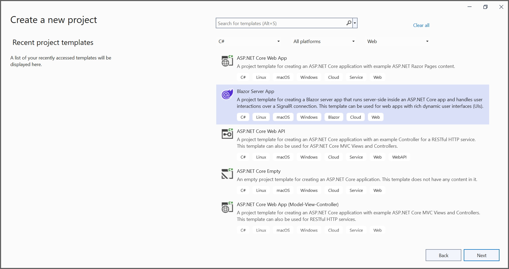
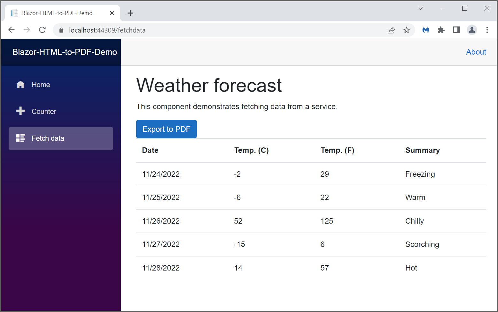

# Convert HTML to PDF file in Blazor

The Syncfusion HTML to PDF converter is a .NET library used to convert HTML or web pages to PDF document in Blazor application.

## Steps to convert HTML to PDF in Blazor application

Step 1: Create a new C# Blazor Server application project. Select Blazor App from the template and click the Next button.
   

   In the project configuration window, name your project and select Create.
   
   

Step 2: Install the [Syncfusion.HtmlToPdfConverter.Net.Windows](https://www.nuget.org/packages/Syncfusion.HtmlToPdfConverter.Net.Windows/) NuGet package as a reference to your Blazor Server application from [NuGet.org](https://www.nuget.org/).
   

Step 3: Create a new class file named ExportService under Data folder and include the following namespaces in the file.

   

   using Syncfusion.HtmlConverter;
   using Syncfusion.Pdf;
   using System.IO;

   

Step 4: Add the following code to convert HTML to PDF document in ExportService class.

   

   public MemoryStream CreatePdf()
   {
      //Initialize HTML to PDF converter.
      HtmlToPdfConverter htmlConverter = new HtmlToPdfConverter();
      BlinkConverterSettings blinkConverterSettings = new BlinkConverterSettings();
      //Set Blink viewport size.
      blinkConverterSettings.ViewPortSize = new Syncfusion.Drawing.Size(1280, 0);
      //Assign Blink converter settings to HTML converter.
      htmlConverter.ConverterSettings = blinkConverterSettings;
      //Convert URL to PDF document.
      PdfDocument document = htmlConverter.Convert("https://www.syncfusion.com");
      //Create memory stream.
      MemoryStream stream = new MemoryStream();
      //Save the document to memory stream.
      document.Save(stream);
      return stream;
   }

   

Step 5: Register your service in the ConfigureServices method available in the Startup.cs class as follows.

   

   public void ConfigureServices(IServiceCollection services)
   {
      services.AddRazorPages();
      services.AddServerSideBlazor();
      services.AddSingleton<WeatherForecastService>();
      services.AddSingleton<ExportService>();
   }

   

Step 6: Inject ExportService into FetchData.razor using the following code.

   

   @inject ExportService exportService
   @inject Microsoft.JSInterop.IJSRuntime JS
   @using  System.IO;

   

Step 7: Create a button in the FetchData.razor using the following code.

   

   <button class="btn btn-primary" @onclick="@ExportToPdf">Export to PDF</button>

   

Step 8: Add the ExportToPdf method in FetchData.razor page to call the export service.

   

   @functions
   {
      protected async Task ExportToPdf()
      {
         ExportService exportService = new ExportService();
         using (MemoryStream excelStream = exportService.CreatePdf())
         {
            await JS.SaveAs("HTMLToPDF.pdf", excelStream.ToArray());
         }
      }
   }

   

Step 9: Create a class file with FileUtil name and add the following code to invoke the JavaScript action to download the file in the browser.

   

   public static class FileUtil
   {
      public static ValueTask<object> SaveAs(this IJSRuntime js, string filename, byte[] data)
       => js.InvokeAsync<object>(
           "saveAsFile",
           filename,
           Convert.ToBase64String(data));
   }

   

Step 10: Add the following JavaScript function in the _Host.cshtml available under the Pages folder.

   

   

   

   By executing the program, you will get the following output in the browser.
   

   Click the Export to PDF button, and you will get the PDF document with the following output.
   
    
   A complete working sample for converting an HTML to PDF in the Blazor framework can be downloaded from [Github](https://github.com/SyncfusionExamples/html-to-pdf-csharp-examples/tree/master/Blazor).
    