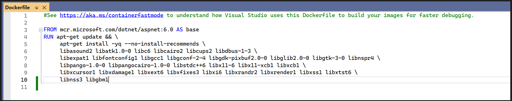

# Convert HTML to PDF file in Linux docker container

The Syncfusion HTML to PDF converter is a .NET library that converts HTML or web pages to PDF.  This library converts an HTML to PDF in a Linux [docker](https://www.docker.com/why-docker/) container.

## Steps to convert HTML to PDF in Linux docker container

1. Create a new ASP.NET Core application and enable the docker support with Linux as a target OS.

2. Install the [Syncfusion.HtmlToPdfConverter.Net.Linux](https://www.nuget.org/packages/Syncfusion.HtmlToPdfConverter.Net.Linux/) NuGet package as a reference to your .NET Core application [NuGet.org](https://www.nuget.org/).

3. Include the following commands in the docker file to install the dependent packages in the docker container.



RUN apt-get update && \
     apt-get install -yq --no-install-recommends \ 
     libasound2 libatk1.0-0 libc6 libcairo2 libcups2 libdbus-1-3 \ 
     libexpat1 libfontconfig1 libgcc1 libgconf-2-4 libgdk-pixbuf2.0-0 libglib2.0-0 libgtk-3-0 libnspr4 \ 
     libpango-1.0-0 libpangocairo-1.0-0 libstdc++6 libx11-6 libx11-xcb1 libxcb1 \ 
     libxcursor1 libxdamage1 libxext6 libxfixes3 libxi6 libxrandr2 libxrender1 libxss1 libxtst6 \ 
     libnss3 libgbm1



4. Add an Export to the PDF button in the index.cshtml.



    @{ Html.BeginForm("ExportToPDF", "Home", FormMethod.Post);
        {
            <input type="submit" value="Export To PDF" class=" btn" />
        }
}



5. Include the following namespaces and code samples in the controller for converting HTML to PDF.



using Syncfusion.HtmlConverter;
using Syncfusion.Pdf;
using System.IO





public ActionResult ExportToPDF()
{
     //Initialize HTML to PDF converter. 
     HtmlToPdfConverter htmlConverter = new HtmlToPdfConverter(); 
     BlinkConverterSettings settings = new BlinkConverterSettings();     
     //Set command line arguments to run without the sandbox.
     settings.CommandLineArguments.Add("--no-sandbox");
     settings.CommandLineArguments.Add("--disable-setuid-sandbox");     
     //Assign Blink settings to the HTML converter.
     htmlConverter.ConverterSettings = settings; 
     //Convert URL to PDF document.
     PdfDocument document = htmlConverter.Convert("https://www.syncfusion.com"); 
     //Create memory stream.
     MemoryStream stream = new MemoryStream(); 
     //Save the document to memory stream. 
     document.Save(stream); 
     return File(stream.ToArray(), System.Net.Mime.MediaTypeNames.Application.Pdf, "HTML-to-PDF.pdf");
}



Build and run the sample in the docker. It will pull the Linux docker image from the docker hub and run the project. Now, the webpage will open in the browser. Click the Export to PDF option to convert the webpage to a PDF.

By executing the program, you will get the PDF document as follows.

A complete demo for converting an HTML to PDF in the Linux docker container can be downloaded from [Docker-HTML-to-PDF-Demo](https://www.syncfusion.com/downloads/support/directtrac/general/ze/Docker-HTML-to-PDF-Demo-799181742).