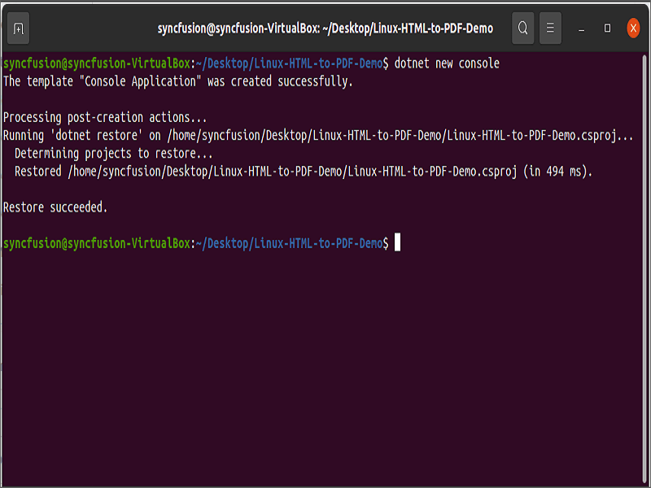
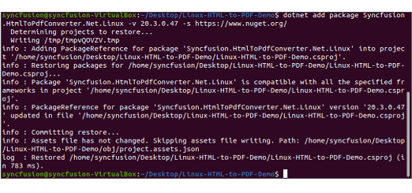
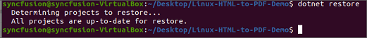
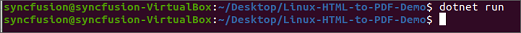
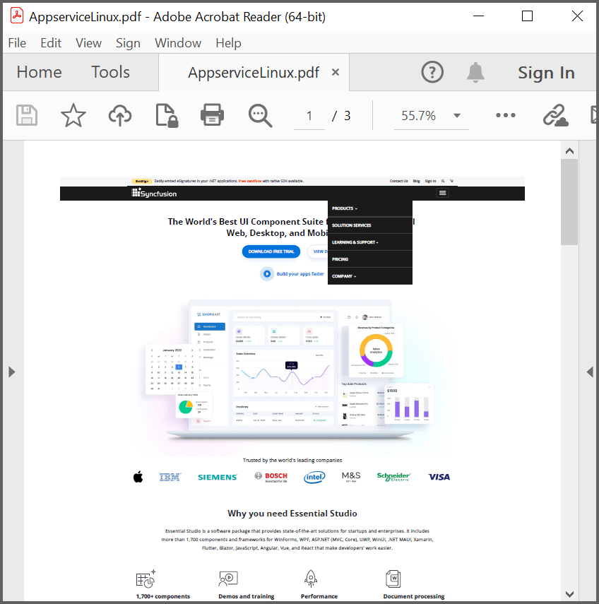

# Convert HTML to PDF file in Linux

The Syncfusion HTML to PDF converter is a .NET library that converts HTML or web pages to PDF document in Linux.
## Pre-requisites

  The following Linux dependencies should be installed where the conversion takes place. 

   

   $ sudo apt-get update

   $ sudo apt-get install libasound2 libatk1.0-0 libc6 libcairo2 libcups2 libdbus-1-3 libexpat1 libfontconfig1 libgcc1 libgconf-2-4 libgdk-pixbuf2.0-0 libglib2.0-0 libgtk-3-0 libnspr4 libpango-1.0-0 libpangocairo-1.0-0 libstdc++6 libx11-6 libx11-xcb1 libxcb1 libxcursor1 libxdamage1 libxext6 libxfixes3 libxi6 libxrandr2 libxrender1 libxss1 libxtst6 libnss3 libgbm1

   

## Steps to convert HTML to PDF in .NET Core application on Linux

1. Execute the following command in the Linux terminal to create a new .NET Core Console application.

   

   dotnet new console

   

     

2. Install the [Syncfusion.HtmlToPdfConverter.Net.Linux](https://www.nuget.org/packages/Syncfusion.HtmlToPdfConverter.Net.Linux/) NuGet package as a reference to your project from [NuGet.org](https://www.nuget.org/) by executing the following command.

   

   dotnet add package Syncfusion.HtmlToPdfConverter.Net.Linux -v xx.x.x.xx -s https://www.nuget.org/

   

     

3. Include the following namespaces.

   

   using Syncfusion.HtmlConverter;
   using Syncfusion.Pdf;
   using System.IO;

   

4.  Add code samples in Program.cs file.

   

            //Initialize HTML to PDF converter. 
            HtmlToPdfConverter htmlConverter = new HtmlToPdfConverter();
            BlinkConverterSettings settings = new BlinkConverterSettings();
            //Set command line arguments to run without the sandbox. 
            settings.CommandLineArguments.Add("--no-sandbox");
            settings.CommandLineArguments.Add("--disable-setuid-sandbox");
            //Assign Blink settings to the HTML converter.
            htmlConverter.ConverterSettings = settings;
            //Convert URL to PDF.
            PdfDocument document = htmlConverter.Convert("https://www.syncfusion.com");
            FileStream fileStream = new FileStream("HTML-to-PDF.pdf", FileMode.CreateNew, FileAccess.ReadWrite);
            //Save and close a PDF document. 
            document.Save(fileStream);
            document.Close(true);

   

5. Execute the following command to restore the NuGet packages.

   

   dotnet restore

   

     
6. Execute the following command in the terminal to run the application.

   

   dotnet run

   

        

   By executing the program, you will get the PDF document as follows. The output will be saved in parallel to the program.cs file.
        

   A complete working sample can be downloaded from [Github](https://github.com/SyncfusionExamples/html-to-pdf-csharp-examples/blob/master/Linux)
  
