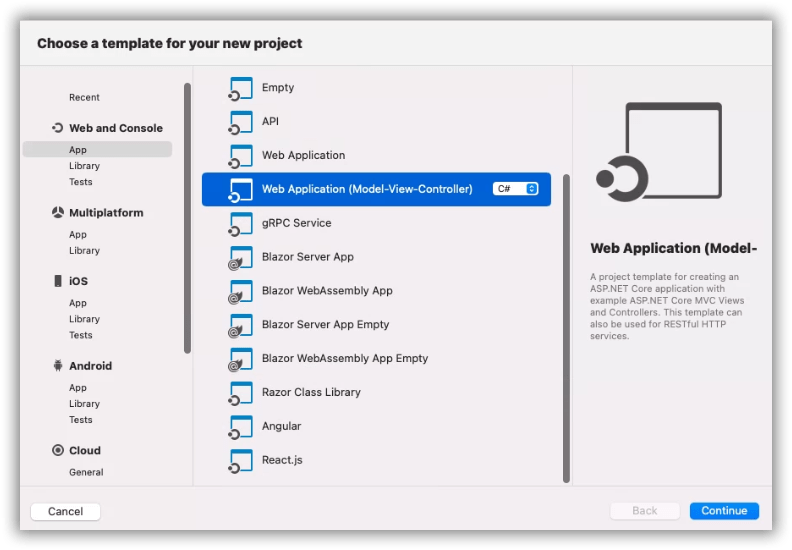
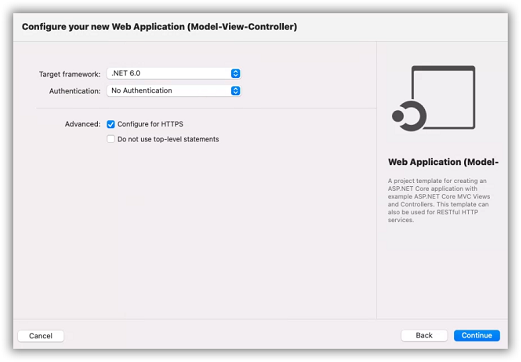
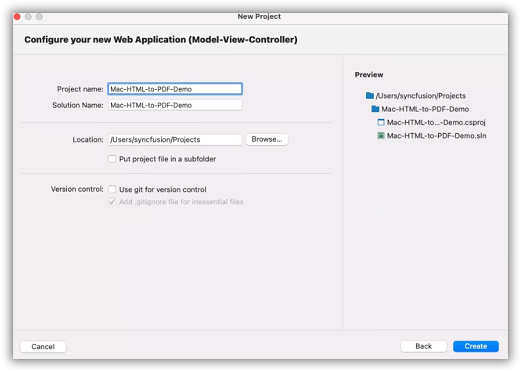
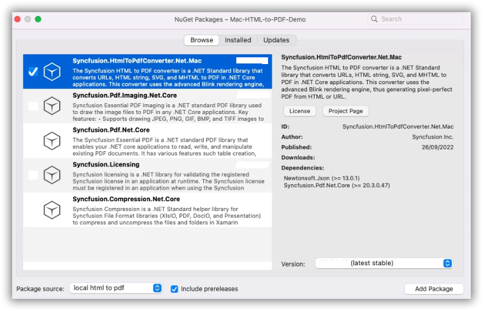
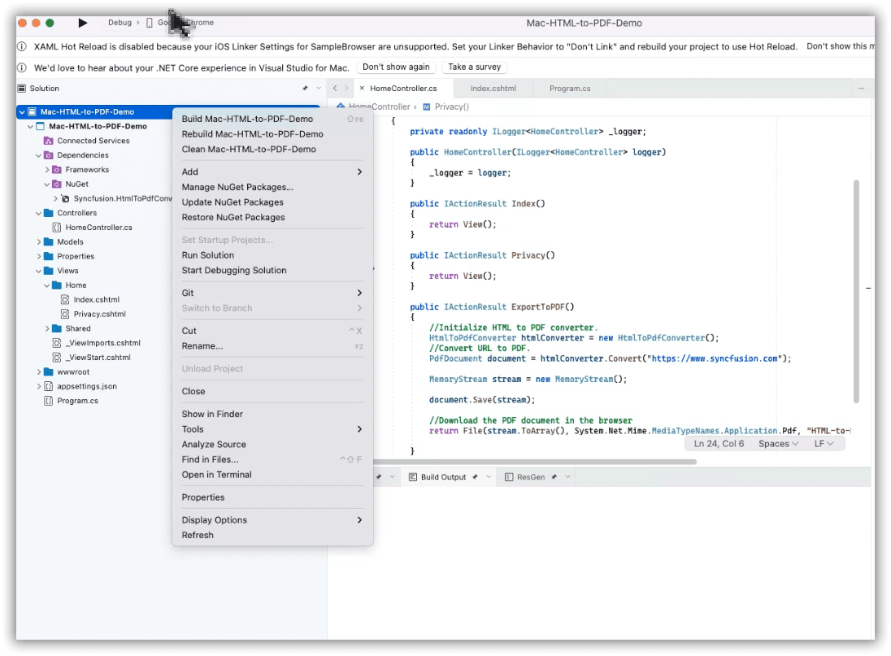
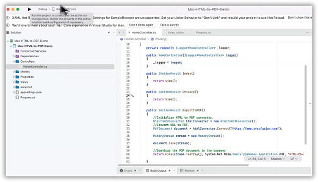

# Convert HTML to PDF file in Mac using c#

The Syncfusion [HTML to PDF converter](https://www.syncfusion.com/pdf-framework/net/html-to-pdf) is a .NET library for converting webpages, SVG, MHTML, and HTML to PDF using C#. It is reliable and accurate. Using this library, you can convert HTML to PDF document in Mac.

## Steps to convert HTML to PDF in ASP.NET Core MVC

1. Create a new C# ASP.NET Core Web Application project.
     
2. Select the Target Framework of your project.
     

3. Configure your application and click Create.
     )

4. Install the [Syncfusion.HtmlToPdfConverter.Net.Mac](https://www.nuget.org/packages/Syncfusion.HtmlToPdfConverter.Net.Mac) NuGet package as reference to your .NET Standard applications from [NuGet.org](https://www.nuget.org/).
     

5. A default controller with name HomeController.cs gets added on creation of ASP.NET MVC project. Include the following namespaces in that HomeController.cs file.

    

   using Syncfusion.Pdf;
   using Syncfusion.HtmlConverter;
   using System.IO;
   using Microsoft.AspNetCore.Hosting;

    

6. A default action method named Index will be present in HomeController.cs. Right click on Index method and select Go To View where you will be directed to its associated view page Index.cshtml.

   Add a new button in the Index.cshtml as shown below.

    

   @{Html.BeginForm("ExportToPDF", "Home", FormMethod.Post);
   {
     

      <input type="submit" value="Convert PDF" style="width:150px;height:27px" />
     

   }
   Html.EndForm();
   }

    

7. Add a new action method ExportToPDF in HomeController.cs and include the below code snippet to convert HTML to PDF file and download it.

   

        public IActionResult ExportToPDF()
        {
            //Initialize HTML to PDF converter.
            HtmlToPdfConverter htmlConverter = new HtmlToPdfConverter();
            //Convert URL to PDF.
            PdfDocument document = htmlConverter.Convert("https://www.syncfusion.com");
            MemoryStream stream = new MemoryStream();
            document.Save(stream);
            //Download the PDF document in the browser
            return File(stream.ToArray(), System.Net.Mime.MediaTypeNames.Application.Pdf, "HTML-to-PDF.pdf");
        }

   

8. Right click the project and select Build.
     

9. After Build succeeded. Run the application.
     

   By executing the program, you will get the PDF document as follows.
     

A complete working sample can be downloaded from [Mac-HTML-to-PDF-Demo.zip](https://www.syncfusion.com/downloads/support/directtrac/general/ze/Mac-HTML-to-PDF-Demo514297355).
