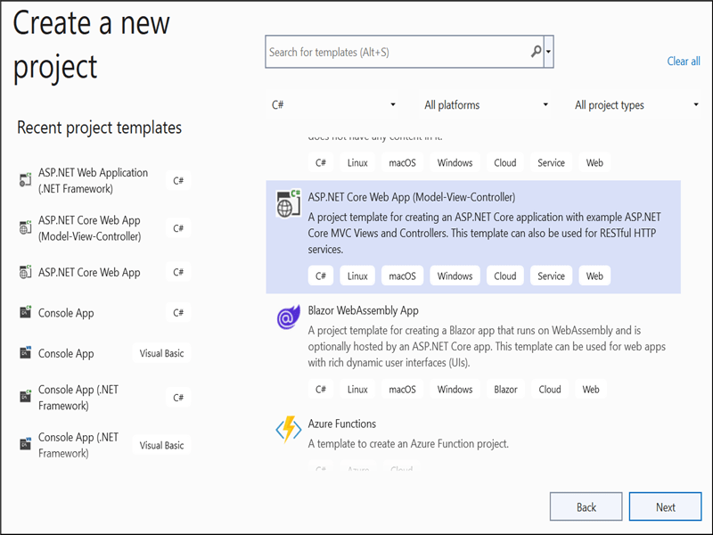
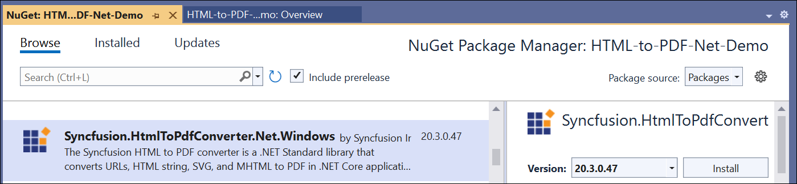

# Convert HTML to PDF file in ASP.NET Core

The Syncfusion HTML to PDF converter is a .NET library used to convert HTML or web pages to PDF document in ASP.NET Core application.  

## Steps to convert HTML to PDF in ASP.NET Core application

1. Create a new C# ASP.NET Core Web Application project.
   

2. Install [Syncfusion.HtmlToPdfConverter.Net.Windows](https://www.nuget.org/packages/Syncfusion.HtmlToPdfConverter.Net.Windows) NuGet package as reference to your .NET Standard applications from [NuGet.org](https://www.nuget.org/).
   

3. A default controller with name HomeController.cs gets added on creation of ASP.NET Core MVC project. Include the following namespaces in that HomeController.cs file.

   

   using Syncfusion.Pdf;
   using Syncfusion.HtmlConverter;
   using System.IO;

   

4. Add a new button in index.cshtml as shown below.

   

   @{Html.BeginForm("ExportToPDF", "Home", FormMethod.Post);
       {
          

              <input type="submit" value="Convert PDF" style="width:150px;height:27px" />
          

       }
       Html.EndForm();
   }

   

5. Add a new action method named ExportToPDF in HomeController.cs and include the below code snippet to convert HTML to PDF file and download it.

   

   //Initialize HTML to PDF converter.
   HtmlToPdfConverter htmlConverter = new HtmlToPdfConverter();
   BlinkConverterSettings blinkConverterSettings = new BlinkConverterSettings();
   //Set Blink viewport size.
   blinkConverterSettings.ViewPortSize = new Syncfusion.Drawing.Size(1280, 0);
   //Assign Blink converter settings to HTML converter.
   htmlConverter.ConverterSettings = blinkConverterSettings;
   //Convert URL to PDF document.
   PdfDocument document = htmlConverter.Convert("https://www.syncfusion.com");
   //Create memory stream.
   MemoryStream stream = new MemoryStream();
   //Save and close the document. 
   document.Save(stream);
   document.Close(); 
   return File(stream.ToArray(), System.Net.Mime.MediaTypeNames.Application.Pdf, "HTML-to-PDF.pdf");

   

   By executing the program, you will get the PDF document as follows.
   

   A complete demo can be downloaded from [Github](https://github.com/SyncfusionExamples/html-to-pdf-dotnet-examples/blob/master/ASP.NET%20Core)  

