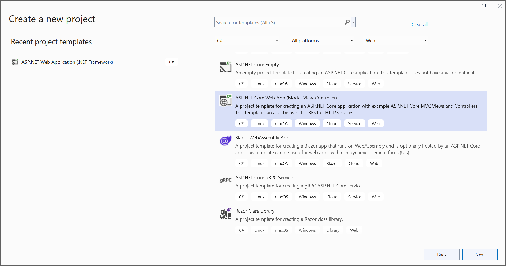

# Convert HTML to PDF file in ASP.NET Core

The Syncfusion HTML to PDF converter is a .NET library used to convert HTML or web pages to PDF document in ASP.NET Core application.  

To quickly get started with converting HTML to PDF in ASP.NET Core using the HTML-to-PDF Library. Please, check this video:


## Steps to convert HTML to PDF in ASP.NET Core application

Step 1: Create a new C# ASP.NET Core Web Application project.

Step 2:  In configuration windows, name your project and select Next.

Step 3:  Install [Syncfusion.HtmlToPdfConverter.Net.Windows](https://www.nuget.org/packages/Syncfusion.HtmlToPdfConverter.Net.Windows) NuGet package as reference to your .NET Standard applications from [NuGet.org](https://www.nuget.org/).   

N> Starting with v16.2.0.x, if you reference Syncfusion assemblies from trial setup or from the NuGet feed, you also have to add "Syncfusion.Licensing" assembly reference and include a license key in your projects. Please refer to this [link](https://help.syncfusion.com/common/essential-studio/licensing/overview) to know about registering Syncfusion license key in your application to use our components.

Step 4: A default controller with name HomeController.cs gets added on creation of ASP.NET Core MVC project. Include the following namespaces in that HomeController.cs file.



using Syncfusion.Pdf;
using Syncfusion.HtmlConverter;
using System.IO;



Step 5: Add a new button in index.cshtml as shown below.



@{Html.BeginForm("ExportToPDF", "Home", FormMethod.Post);
    {
        

            <input type="submit" value="Convert HTML to PDF" style="width:150px;height:27px" />
        

    }
    Html.EndForm();
}



Step 6: Add a new action method named ExportToPDF in HomeController.cs and include the below code example to convert HTML to PDF document using [Convert](https://help.syncfusion.com/cr/file-formats/Syncfusion.HtmlConverter.HtmlToPdfConverter.html#Syncfusion_HtmlConverter_HtmlToPdfConverter_Convert_System_String_) method in [HtmlToPdfConverter](https://help.syncfusion.com/cr/file-formats/Syncfusion.HtmlConverter.HtmlToPdfConverter.html) class. The HTML content will be scaled based on the given [ViewPortSize](https://help.syncfusion.com/cr/file-formats/Syncfusion.HtmlConverter.BlinkConverterSettings.html#Syncfusion_HtmlConverter_BlinkConverterSettings_ViewPortSize) property of [BlinkConverterSettings](https://help.syncfusion.com/cr/file-formats/Syncfusion.HtmlConverter.BlinkConverterSettings.html) class.



//Initialize HTML to PDF converter.
HtmlToPdfConverter htmlConverter = new HtmlToPdfConverter();
BlinkConverterSettings blinkConverterSettings = new BlinkConverterSettings();
//Set Blink viewport size.
blinkConverterSettings.ViewPortSize = new Syncfusion.Drawing.Size(1280, 0);
//Assign Blink converter settings to HTML converter.
htmlConverter.ConverterSettings = blinkConverterSettings;
//Convert URL to PDF document.
PdfDocument document = htmlConverter.Convert("https://www.syncfusion.com");
//Create memory stream.
MemoryStream stream = new MemoryStream();
//Save and close the document. 
document.Save(stream);
document.Close(); 
return File(stream.ToArray(), System.Net.Mime.MediaTypeNames.Application.Pdf, "HTML-to-PDF.pdf");



By executing the program, you will get the PDF document as follows.

 
A complete working sample can be downloaded from [Github](https://github.com/SyncfusionExamples/html-to-pdf-csharp-examples/tree/master/ASP.NET%20Core).

Click [here](https://www.syncfusion.com/document-processing/pdf-framework/net-core) to explore the rich set of Syncfusion HTML to PDF converter library features. 

An online sample link to [convert HTML to PDF document](https://ej2.syncfusion.com/aspnetcore/PDF/HtmltoPDF#/bootstrap5) in ASP.NET Core. 
   