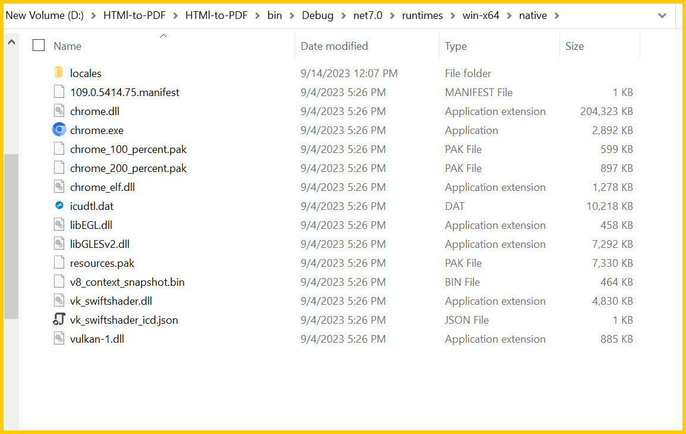
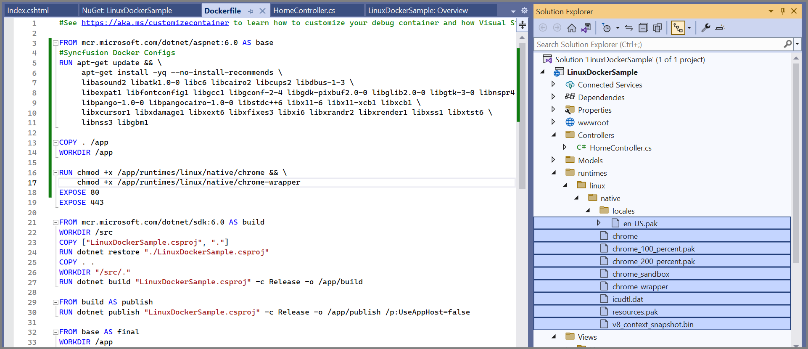
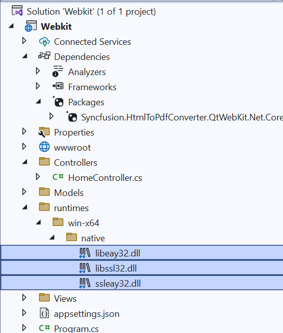

# Troubleshooting and FAQ

## Blink files are missing

<table>
<th style="font-size:14px" width="100px">Exception</th>
<th style="font-size:14px">Blink files are missing</th>
<tr>
<th style="font-size:14px" width="100px">Reason
</th>
<td>The exception may occur if the <i>'runtimes'</i> folder is not copied correctly from the NuGet folder.
</td>
</tr>
<tr>
<th style="font-size:14px" width="100px">Solution</th>
<td>
Ensure that the runtimes folder is copied properly to bin folder of the application from NuGet package location.
  
Please refer to the below screenshot,
  

  
(Or)
  
You can set the runtimes folder path explicitly in BlinkPath property in BlinkConverterSettings class.
  
Ex path: <i>C:\HtmlConversion\HTMl-to-PDF\HTMl-to-PDF\bin\Debug\net7.0\runtimes\win-x64\native\</i>
  


//Initialize the HTML to PDF converter.
HtmlToPdfConverter htmlConverter = new HtmlToPdfConverter();
BlinkConverterSettings blinkConverterSettings = new BlinkConverterSettings();
//Set Blink the binaries path.
blinkConverterSettings.BlinkPath = @"C:/HtmlConversion/BlinkBinaries/";
//Assign the Blink converter settings to HTML converter.
htmlConverter.ConverterSettings = blinkConverterSettings;
//Convert the URL to PDF document.
PdfDocument document = htmlConverter.Convert("https://www.syncfusion.com");
//Create a file stream to save the PDF document. 
FileStream fileStream = new FileStream("HTML-to-PDF.pdf", FileMode.CreateNew, FileAccess.ReadWrite);
//Save and close the PDF document.
document.Save(fileStream);
document.Close(true);


</td>
</tr>

</table>

## BlinkBinaries access is denied in server

<table>
<th style="font-size:14px" width="100px">Exception
</th>
<th style="font-size:14px">BlinkBinaries access is denied in server.
</th>

<tr>
<th style="font-size:14px" width="100px">Reason
</th>
<td>If the BlinkBinaries folder does not have elevated permission for the respective user, then the Blink HTML converter may throw this exception.
</td>
</tr>

<tr>
<th style="font-size:14px" width="100px">Solution
</th>
<td>You can add read/write/execute permission to for the BlinkBinaries folder for the respective user group.
</td>
</tr>
</table>

## Blink rendering engine only supported from .NET Framework 4.5

<table>

<th style="font-size:14px" width="100px">Exception
</th>
<th style="font-size:14px">Blink rendering engine only supported from .NET Framework 4.5.
</th>

<tr>
<th style="font-size:14px" width="100px">Reason
</th>
<td>HTML conversion using blink is only supported from .NET framework 4.5 or above. 
</td>
</tr>

<tr>
<th style="font-size:14px" width="100px">Solution
</th>
<td>The application should target .NET Framework 4.5 or above to convert the HTML using the Blink rendering engine. 
</td>
</tr>

</table>

## Failed to convert Webpage Exception

<table>
<th style="font-size:14px" width="100px">Exception
</th>
<th style="font-size:14px">Failed to convert Webpage Exception
</th>

<tr>
<th style="font-size:14px" width="100px">Reason
</th>
<td>Missing or mismatch of <a href="https://www.nuget.org/packages/Newtonsoft.Json/13.0.2">Newtonsoft.Json</a> package in the project.
</td>
</tr>
<tr>
<th style="font-size:14px" width="100px">Solution
</th>
<td>For converting HTML to PDF in Blink, you need to refer to the Newtonsoft.Json assembly or NuGet package with current version is 13.0.2 in the application, otherwise conversion will get failed.
</td>
</tr>

<tr>
<th style="font-size:14px" width="100px">Reason
</th>
<td>The exception may occur if the Newtonsoft.Json assembly or NuGet package with current version is 13.0.2.
</td>
</tr>
<tr>
<th style="font-size:14px" width="100px">Solution
</th>
<td>The Newtonsoft.Json package version with current version is 13.0.2, then include the following assembly binding redirection in the app.config/web.config file.	
  


<runtime>
    <assemblyBinding xmlns="urn:schemas-microsoft-com:asm.v1">
      <dependentAssembly>
        <assemblyIdentity name="Newtonsoft.Json" publicKeyToken="30ad4fe6b2a6aeed" culture="neutral" />
        <bindingRedirect oldVersion="0.0.0.0-8.0.0.0" newVersion="8.0.0.0" />
      </dependentAssembly>
    </assemblyBinding>
</runtime>


</td>
</tr>

<tr>
<th style="font-size:14px" width="100px">Reason
</th>
<td>If the temporary folder does not have elevated permission for the respective user, then the Blink HTML converter may throw this exception.
</td>
</tr>
<tr>
<th style="font-size:14px" width="100px">Solution
</th>
<td>The Blink HTML converter has support for setting the temporary path. Using the <i>TempPath</i> property, you can set any folder path that has read/write/execute permission. Then, the converter uses this path for creating temporary files. Refer to the following code snippet to set temp folder.
  


BlinkConverterSettings settings = new BlinkConverterSettings();
settings.TempPath = "D://MyProject//bin";


</td>
</tr>

<tr>
<th style="font-size:14px" width="100px">Reason
</th>
<td>The exception may occur in Windows 7/Windows server 2008 environment due to limitation of <i>ClientWebSocket</i> implementation.
</td>
</tr>
<tr>
<th style="font-size:14px" width="100px">Solution
</th>
<td>To overcome the exception in Windows 7/Windows server 2008 environment, add the <a href="https://www.nuget.org/packages/System.Buffers/">System.Buffers.4.5.0</a> NuGet package in the sample for conversion. 
</td>
</tr>

<tr>
<th style="font-size:14px" width="100px">Reason
</th>
<td>The exception may occur in Linux CentOS/Docker environment due to the chrome browser unable to launch from sandbox mode in CentOS.
</td>
</tr>
<tr>
<th style="font-size:14px" width="100px">Solution
</th>
<td>To overcome the exception in Linux CentOS/Docker environment, provide the execute permission for chrome and chrome-wrapper file inside the BlinkBinaries folder.
 
<b>Refer to the following screenshot:</b>
 

 

 
Also, please add the below command line arguments in our converter setting,
 
<table>
<tr>
<td>


//Set command line arguments to run without sandbox.
blinkConverterSettings.CommandLineArguments.Add("--no-sandbox");
blinkConverterSettings.CommandLineArguments.Add("--disable-setuid-sandbox");


</td>
</tr>
</table>
 
</td>
</tr>

<tr>
<th style="font-size:14px" width="100px">Reason
</th>
<td>Including both packages (Blink and Webkit) in the application might lead to the occurrence of the exception.
</td>
</tr>
<tr>
<th style="font-size:14px" width="100px">Solution
</th>
<td>In order to resolve the exception, it's necessary to eliminate one of the packages (Webkit or Blink) from the application and then perform a thorough cleaning and rebuilding process.
</td>
</tr>

<tr>
<th style="font-size:14px" width="100px">Reason
</th>
<td>Sometimes this exception occurs for only particular URL
</td>
</tr>
<tr>
<th style="font-size:14px" width="100px">Solution
</th>
<td>Please contact Syncfusion <a href="https://www.syncfusion.com/support/directtrac/incidents/newincident">support</a> with input HTML, code snippet, and environment details (OS, culture settings, bit version etc.,).
</td>
</tr>

</table>

## Blink converter may create PDF with blank pages

<table>
<th style="font-size:14px" width="100px">Issue
</th>
<th style="font-size:14px">Blink converter may create PDF with blank pages.
</th>

<tr>
<th style="font-size:14px" width="100px">Reason
</th>
<td>When the webpage (HTML) is not available or accessible.
</td>
</tr>

<tr>
<th style="font-size:14px" width="100px">Solution
</th>
<td>Please check the internet connection and the HTML page is available in the mentioned location.
  
Check the HTML file or URL is rendered properly in Chrome browser's print preview. 
</td>
</tr>
</table>

## Failed to convert webpage exception in Linux Docker

<table>
<th style="font-size:14px" width="100px">Exception
</th>
<th style="font-size:14px">Failed to convert webpage exception in Linux Docker.
</th>

<tr>
<th style="font-size:14px" width="100px">Reason
</th>
<td>This exception might arise because the Blink binary files lack sufficient permissions to be launched from the specified BlinkPath location.
</td>
</tr>

<tr>
<th style="font-size:14px" width="100px">Solution
</th>
<td>To overcome this exception, you can provide a execute permission for chrome and chrome-wrapper file inside the runtimes/linux/native folder by using the docker command.
  

  


COPY . /app
WORKDIR /app

RUN chmod +x /app/runtimes/linux/native/chrome && \
    chmod +x /app/runtimes/linux/native/chrome-wrapper


</td>
</tr>
</table>

## Images or other contents in the HTML are missing in the resultant PDF document

<table>
<th style="font-size:14px" width="100px">Issue
</th>
<th style="font-size:14px">Images or other contents in the HTML are missing in the resultant PDF document.
</th>

<tr>
<th style="font-size:14px" width="100px">Reason
</th>
<td>The issue may be due to the slow internet connection or due to the behavior that the conversion completed before the page is loaded completely.
</td>
</tr>
<tr>
<th style="font-size:14px" width="100px">Solution
</th>
<td>To overcome this issue, add suitable delay for the conversion using the <a href="https://help.syncfusion.com/cr/file-formats/Syncfusion.HtmlConverter.BlinkConverterSettings.html#Syncfusion_HtmlConverter_BlinkConverterSettings_AdditionalDelay">AdditionalDelay</a> property of the HTMLConverter. 
  


BlinkConverterSettings settings = new BlinkConverterSettings();
settings.AdditionalDelay = 2000;


</td>
</tr>

<tr>
<th style="font-size:14px" width="100px">Reason
</th>
<td>While converting HTML string to PDF, the resources may be missed due to the invalid Base URL.
</td>
</tr>
<tr>
<th style="font-size:14px" width="100px">Solution
</th>
<td>Overcome this issue by passing the valid base URL (path of the resources) along with the HTML string.
</td>
</tr>

</table>

## Blink conversion failed in Azure app service (Windows)

<table>
<th style="font-size:14px" width="100px">Issue
</th>
<th style="font-size:14px">Blink conversion failed in Azure app service (Windows).
<i>“The process was terminated due to an unhandled exception”</i>
</th>

<tr>
<th style="font-size:14px" width="100px">Reason
</th>
<td>Blink rendering engine uses GDI calls for viewing and rendering the webpages. But Azure app service blocks GDI calls in Azure website environment. As azure website does not have the elevated permission and enough rights, so we could not launch the Chrome headless browser in Azure app service (Azure website and Azure function).
</td>
</tr>

<tr>
<th style="font-size:14px" width="100px">Solution
</th>
<td>You can convert HTML to PDF using the Blink rendering engine in Azure cloud service (which has the elevated permission and rights to access the GDI calls). 
Refer to this <a href="https://www.syncfusion.com/kb/10258/how-to-convert-html-to-pdf-in-azure-using-blink">link</a> for more information. 
</td>
</tr>
</table>

## Unable to convert unsecured https URL to PDF using Blink

<table>
<th style="font-size:14px" width="100px">Issue
</th>
<th style="font-size:14px">Unable to convert unsecured https URL to PDF using Blink.
</th>

<tr>
<th style="font-size:14px" width="100px">Reason
</th>
<td>The issue is happen due to invalid SSL certificate errors in unsecured sites.
</td>
</tr>

<tr>
<th style="font-size:14px" width="100px">Solution
</th>
<td>You can able to bypass the invalid SSL certificate errors using the command line arguments property of Blink converter settings.
  


BlinkConverterSettings settings = new BlinkConverterSettings();
settings.CommandLineArguments.Add("--ignore-certificate-errors");


</td>
</tr>
</table>

## Conversion failure in windows server 2012 R2

<table>
<th style="font-size:14px" width="100px">Issue
</th>
<th style="font-size:14px">Conversion failure in windows server 2012 R2.
</th>

<tr>
<th style="font-size:14px" width="100px">Reason
</th>
<td>The issue may happen due to windows server environment permission restriction.
</td>
</tr>

<tr>
<th style="font-size:14px" width="100px">Solution
</th>
<td>We can resolve this permission related failure in the Blink rendering engine using below command line arguments in our converter settings. 
  


//Set command line arguments to run without sandbox.
blinkConverterSettings.CommandLineArguments.Add("--no-sandbox");
blinkConverterSettings.CommandLineArguments.Add("--disable-setuid-sandbox");


</td>
</tr>
</table>

## Converting the HTML to PDF fails in x32 bit windows system environment

<table>
<th style="font-size:14px" width="100px">Exception
</th>
<th style="font-size:14px">Converting the HTML to PDF fails in x32 bit windows system environment.
</th>

<tr>
<th style="font-size:14px" width="100px">Reason
</th>
<td>The existing x64 bit Blink binaries windows are not compatible with x32 bit windows system architecture.
</td>
</tr>

<tr>
<th style="font-size:14px" width="100px">Solution
</th>
<td>To overcome this issue, we can use the x32 bit blink binaries. The x32 bit windows blink binaries are compatible with the x32 bit windows system environment. Please download the x32 bit blink binaries for windows <a href="https://www.syncfusion.com/downloads/support/directtrac/general/ze/BLINKB~1124441598">here</a> and replace these binaries in the existing x64 bit blink binaries folder.
</td>
</tr>
</table>

## ERROR:The specified module could not be found in windows server 2012 R2

<table>
<th style="font-size:14px" width="100px">Exception
</th>
<th style="font-size:14px">The specified module could not be found in windows server 2012 R2.
</th>

<tr>
<th style="font-size:14px" width="100px">Reason
</th>
<td>The issue happened because the Windows Server Essentials Media Pack was missing in the Windows server 2012 R2.
</td>
</tr>

<tr>
<th style="font-size:14px" width="100px">Solution
</th>
<td>We can resolve this issue by installing the Windows Server Essentials Media Pack.
To install the Windows Server Essentials Media Pack, first install the Windows Server Essentials. 
1.	Open the Server Manager in the Taskbar. 
2.	Click Manage in the Server Manager and select Add Roles and Features option. 
3.	Select the Role-based or feature-based installation option and click next. 
4.	In the left side menu, select server roles, then Windows Server Essentials Experience in the server roles and then click next. 
5.	Now, the Windows Server Essentials will be installed. 
6.	After successful installation, install the Windows Server Essentials Media Pack. 
Go to the <a href="https://www.microsoft.com/en-us/download/details.aspx?id=40837">official website</a> to download and Install the Windows Server Essentials Media Pack.  

{{'**Note:**'| markdownify }}This version is only applicable to Windows Server 2012 R2 Standard.

</td>
</tr>
</table>

## How to Exclude BlinkBinaries or Runtime Files in Build or Deployment

The runtime files, or blink binaries, will be copied into a bin or published folder while building and publishing the application.

By including the <b><ExcludeAssets>native</ExcludeAssets></b> option in the package reference of the csproj file, you can exclude the runtime files or blink binaries from being copied into the bin or publish folder while building and publishing the application. But you need to place the BlinkBinaries in the server disk and set the BlinkPath in the BlinkConverterSettings to perform the conversion. 

{{'**Note:**'| markdownify }}Using this approach, you can reduce the deployment size on your own servers.

Refer to the following package reference:

 

## HTML conversion support in Azure

<table>
	<tr>
		<th style="font-size:14px" colspan="2">HTML conversion support in Azure</th>
	</tr>
	<tr>
		<th style="font-size:14px">Azure App Service (Linux)</th>
		<td>Yes</td>
	</tr>
	<tr>
		<th style="font-size:14px">Azure Functions (Linux)</th>
		<td>Yes</td>
	</tr>
	<tr>
		<th style="font-size:14px">Azure Cloud Service</th>
		<td>Yes</td>
	</tr>
		<tr>
		<th style="font-size:14px">Azure App Service with Linux docker</th>
		<td>Yes</td>
	</tr>
</table>

## Image rendering issue occurs while converting HTML to PDF using WebKit

<table>
<th style="font-size:14px" width="100px">Issue
</th>
<th style="font-size:14px">Image rendering issue occurs while converting HTML(HTTPS sites) to PDF using Webkit rendering engine in location machine/Azure App Service. 
</th>

<tr>
<th style="font-size:14px" width="100px">Reason
</th>
<td>When the OPENSSL assemblies are missing in your machine.
</td>
</tr>

<tr>
<th style="font-size:14px" width="100px">Solution
</th>
<td>
Our WebKit rendering engine necessitates OPENSSL assemblies to access resources from HTTPS URLs. If your project involves accessing resources from HTTPS sites, please make sure to include the following assemblies,
  
  
You can get the OPENSSL assemblies from the below link,
<a href="https://www.syncfusion.com/downloads/support/directtrac/general/ze/OPENSSL-798051511">https://www.syncfusion.com/downloads/support/directtrac/general/ze/OPENSSL-798051511</a>
  
</td>
</tr>
</table>

## Failed to convert Webpage exception with Linux docker in Mac M1 machine.

<table>
<th style="font-size:14px" width="100px">Exception
</th>
<th style="font-size:14px">Failed to convert Webpage exception using Linux Docker in Mac M1 system environment.
</th>

<tr>
<th style="font-size:14px" width="100px">Reason
</th>
<td>The existing x64-bit Blink binaries for Linux are not compatible with the x64 ARM Mac M1 system architecture with Linux Docker.
</td>
</tr>

<tr>
<th style="font-size:14px" width="100px">Solution
</th>
<td>
To resolve this issue, we can install the chromium using the docker file and set the Blink Path to the location where chromium is installed.
  
Docker File:  




	FROM mcr.microsoft.com/dotnet/aspnet:7.0 AS base 

	RUN apt-get update && apt-get install -y \ 

    libasound2 libatk1.0-0 libc6 libcairo2 libcups2 libdbus-1-3 \ 

    libexpat1 libfontconfig1 libgcc1 libgconf-2-4 libgdk-pixbuf2.0-0 libglib2.0-0 libgtk-3-0 libnspr4 \ 

    libpango-1.0-0 libpangocairo-1.0-0 libstdc++6 libx11-6 libx11-xcb1 libxcb1 \ 

    libxcursor1 libxdamage1 libxext6 libxfixes3 libxi6 libxrandr2 libxrender1 libxss1 libxtst6 \ 

    libnss3 libgbm1 chromium 

	WORKDIR /app 

	EXPOSE 80 

	EXPOSE 443 



Code snippet:



	BlinkConverterSettings settings = new BlinkConverterSettings();  

	//To utilize the Blink binaries from the arm64-based chromium installed using the docker file, execute the following command.   

	settings.BlinkPath = @"/usr/lib/chromium/chromium";





</td>
</tr>
</table>