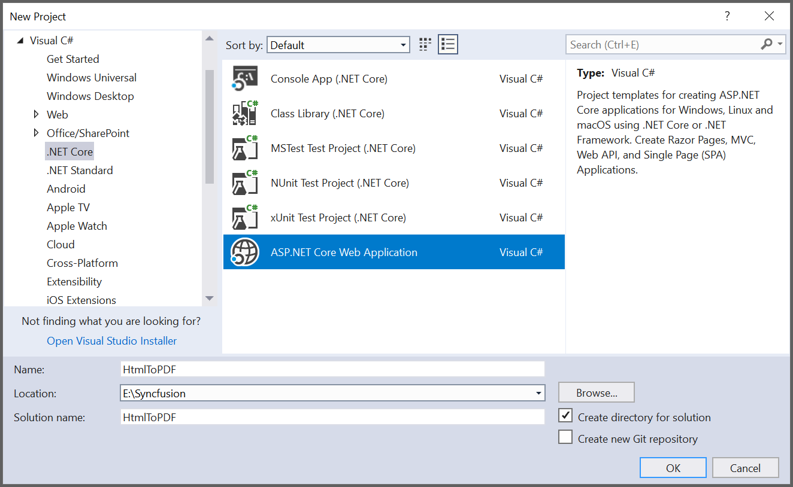
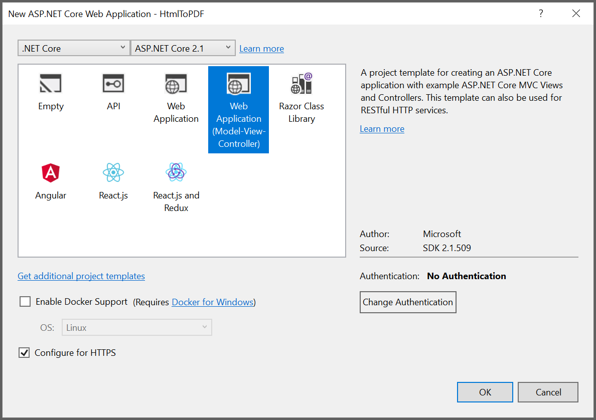
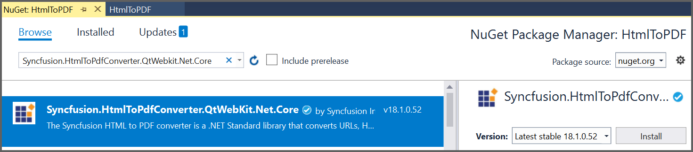
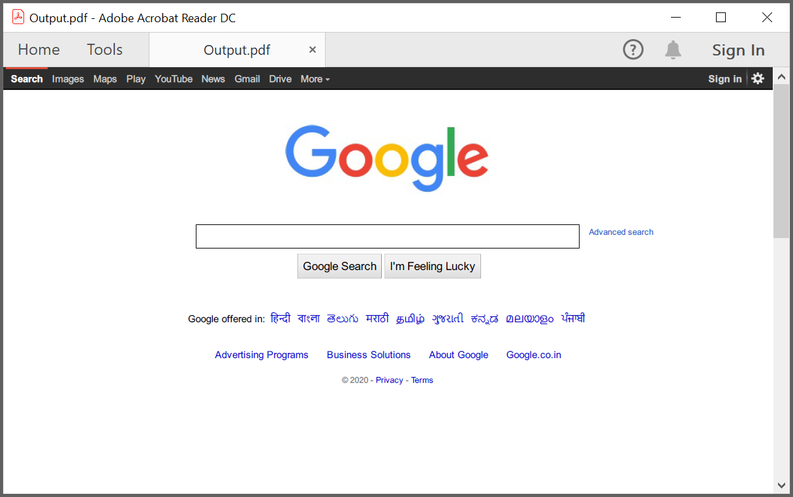
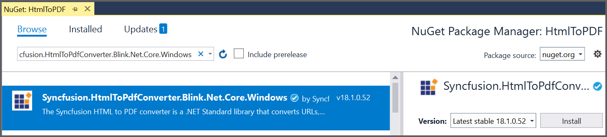
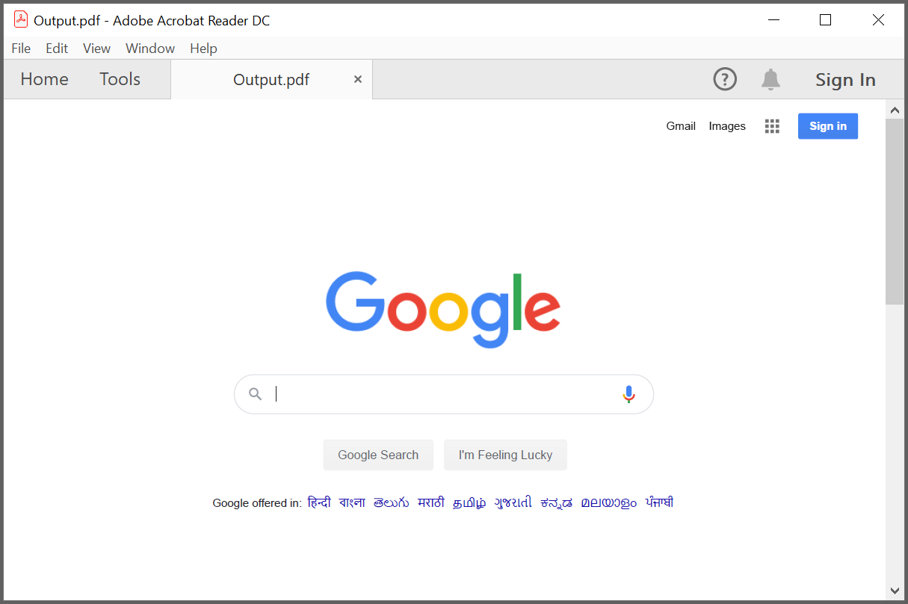

# Convert HTML to PDF file in ASP.NET Core

In your ASP.NET Core application, add the following assemblies to use Essential PDF:

* Syncfusion.Compression.Portable.dll
* Syncfusion.Pdf.Portable.dll
* Syncfusion.HtmlConverter.Portable.dll

For more details, refer to this [Assemblies Required](/File-Formats/PDF/Assemblies-Required) documentation.

## Steps to convert HTML to PDF document using WebKit in ASP.NET Core

Create a new C# ASP.NET Core Web Application project.

Select Web Application pattern (Model-View-Controller) for the project.

Install the [Syncfusion.HtmlToPdfConverter.QtWebKit.Net.Core](https://www.nuget.org/packages/Syncfusion.HtmlToPdfConverter.QtWebKit.Net.Core/) [NuGet package](https://help.syncfusion.com/file-formats/nuget-packages) as reference to your .NET Standard applications from [NuGet.org](https://www.nuget.org/).

A default controller with name HomeController.cs gets added on creation of ASP.NET MVC project. Include the following namespaces in that HomeController.cs file.



using Syncfusion.Pdf;
using Syncfusion.HtmlConverter;
using System.IO;
using Microsoft.AspNetCore.Hosting;



A default action method named Index will be present in HomeController.cs. Right click on Index method and select Go To View where you will be directed to its associated view page Index.cshtml.

Add a new button in the Index.cshtml as shown below.



@{Html.BeginForm("ExportToPDF", "Home", FormMethod.Post);
{

    <input type="submit" value="Convert PDF" style="width:150px;height:27px" />

}
Html.EndForm();
}


Add a new action method ExportToPDF in HomeController.cs and include the below code snippet to convert HTML to PDF file and download it.



//Initialize HTML to PDF converter 
HtmlToPdfConverter htmlConverter = new HtmlToPdfConverter(HtmlRenderingEngine.WebKit);

WebKitConverterSettings settings = new WebKitConverterSettings();

//Set WebKit path
settings.WebKitPath = Path.Combine(_hostingEnvironment.ContentRootPath, "QtBinariesWindows");

//Assign WebKit settings to HTML converter
htmlConverter.ConverterSettings = settings;

//Convert URL to PDF
PdfDocument document = htmlConverter.Convert("https://www.google.com");

//Saving the PDF to the MemoryStream
MemoryStream stream = new MemoryStream();

document.Save(stream);

//Download the PDF document in the browser
return File(stream.ToArray(), System.Net.Mime.MediaTypeNames.Application.Pdf, "Output.pdf");



A complete work sample can be downloaded from [HtmlToPDF.zip](https://www.syncfusion.com/downloads/support/directtrac/general/ze/HtmlToPDF-1867801507)

By executing the program, you will get the PDF document as follows.

## Steps to convert HTML to PDF document using Blink in ASP.NET Core

Create a new C# ASP.NET Core Web Application project.

Select Web Application pattern (Model-View-Controller) for the project.

Install the [Syncfusion.HtmlToPdfConverter.Blink.Net.Core.Windows](https://www.nuget.org/packages/Syncfusion.HtmlToPdfConverter.Blink.Net.Core.Windows/) NuGet package as reference to your .NET Standard applications from [NuGet.org](https://www.nuget.org/).

A default controller with name HomeController.cs gets added on creation of ASP.NET MVC project. Include the following namespaces in that HomeController.cs file.



using Syncfusion.Pdf;
using Syncfusion.HtmlConverter;
using System.IO;
using Microsoft.AspNetCore.Hosting;



A default action method named Index will be present in HomeController.cs. Right click on Index method and select Go To View where you will be directed to its associated view page Index.cshtml.

Add a new button in the Index.cshtml as shown below.



@{Html.BeginForm("ExportToPDF", "Home", FormMethod.Post);
{

    <input type="submit" value="Convert PDF" style="width:150px;height:27px" />

}
Html.EndForm();
}


Add a new action method ExportToPDF in HomeController.cs and include the below code snippet to convert HTML to PDF file and download it.



//Initialize HTML to PDF converter with Blink rendering engine 
HtmlToPdfConverter htmlConverter = new HtmlToPdfConverter(HtmlRenderingEngine.Blink);
            
BlinkConverterSettings settings = new BlinkConverterSettings();
            
//Set the BlinkBinaries folder path 
settings.BlinkPath = Path.Combine(_hostingEnvironment.ContentRootPath, "BlinkBinariesWindows");
            
//Assign Blink settings to HTML converter
htmlConverter.ConverterSettings = settings;

//Convert URL to PDF
PdfDocument document = htmlConverter.Convert("https://www.google.com");

//Saving the PDF to the MemoryStream
MemoryStream stream = new MemoryStream();

document.Save(stream);

//Download the PDF document in the browser
return File(stream.ToArray(), System.Net.Mime.MediaTypeNames.Application.Pdf, "Output.pdf");



A complete work sample can be downloaded from [HtmlToPDF.zip](https://www.syncfusion.com/downloads/support/directtrac/general/ze/HtmlToPDF-956622777)

By executing the program, you will get the PDF document as follows.
