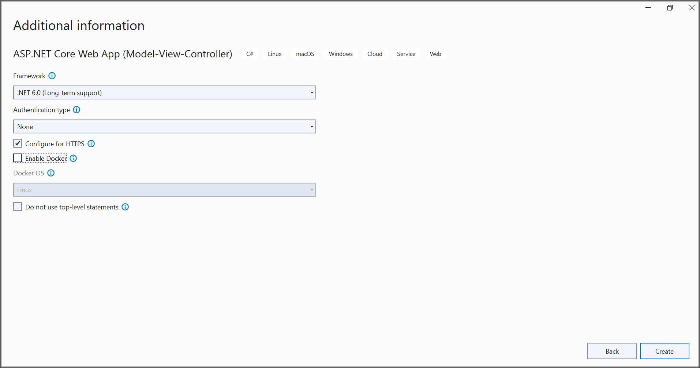

# Convert HTML to PDF file in ASP.NET Core

The Syncfusion HTML to PDF converter is a .NET Core library used to convert HTML or web pages to PDF document in ASP.NET Core application.  

To include the HTML Converter library into your ASP.NET Core application, please refer to the [NuGet Packages Required](https://help.syncfusion.com/file-formats/pdf/converting-html-to-pdf#nuget-packages-required-recommended) or [Assemblies Required](https://help.syncfusion.com/file-formats/pdf/converting-html-to-pdf#assemblies-required) documentation. 

## Steps to convert HTML to PDF in ASP.NET Core application

Step 1: Create a new C# ASP.NET Core Web Application project.
 

Step 2: In configuration window, name your project and select Next.
 

Step 3: Install [Syncfusion.HtmlToPdfConverter.Net.Windows](https://www.nuget.org/packages/Syncfusion.HtmlToPdfConverter.Net.Windows) NuGet package as reference to your .NET Standard applications from [NuGet.org](https://www.nuget.org/).   
 

Step 4: A default controller with name HomeController.cs gets added on creation of ASP.NET Core MVC project. Include the following namespaces in that HomeController.cs file.



using Syncfusion.Pdf;
using Syncfusion.HtmlConverter;
using System.IO;



Step 5: A default action method named Index will be present in HomeController.cs. Right click on Index method and select Go To View where you will be directed to its associated view page Index.cshtml. Add a new button in index.cshtml as shown below.



@{Html.BeginForm("ExportToPDF", "Home", FormMethod.Post);
    {
        

            <input type="submit" value="Convert PDF" style="width:150px;height:27px" />
        

    }
    Html.EndForm();
}



Step 6: Add a new action method named ExportToPDF in HomeController.cs and include the below code snippet to convert HTML to PDF file and download it.



//Initialize HTML to PDF converter
HtmlToPdfConverter htmlConverter = new HtmlToPdfConverter();
BlinkConverterSettings blinkConverterSettings = new BlinkConverterSettings();
//Set Blink viewport size
blinkConverterSettings.ViewPortSize = new Syncfusion.Drawing.Size(1280, 0);
//Assign Blink converter settings to HTML converter
htmlConverter.ConverterSettings = blinkConverterSettings;
//Convert URL to PDF document
PdfDocument document = htmlConverter.Convert("https://www.syncfusion.com");
//Create memory stream
MemoryStream stream = new MemoryStream();
//Save and close the document
document.Save(stream);
document.Close(); 
return File(stream.ToArray(), System.Net.Mime.MediaTypeNames.Application.Pdf, "HTML-to-PDF.pdf");



By executing the program, you will get the PDF document as follows.
 
 
A complete working sample can be downloaded from [Github](https://github.com/SyncfusionExamples/html-to-pdf-csharp-examples/tree/master/ASP.NET%20Core). 