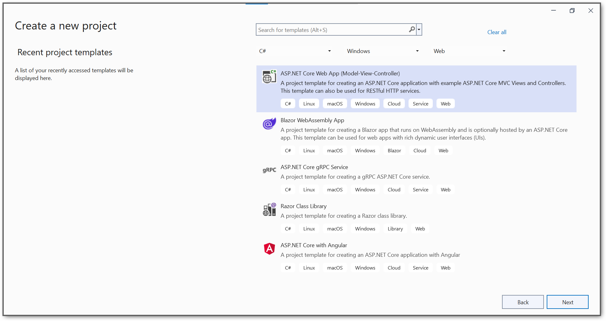
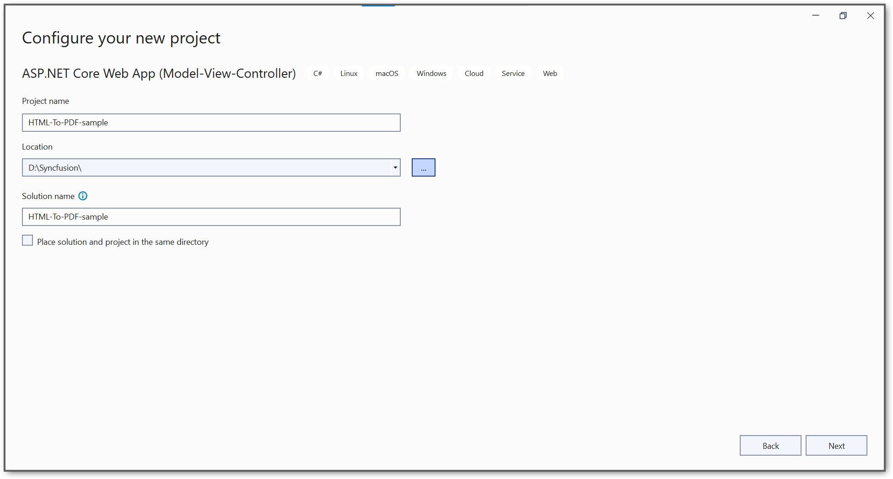
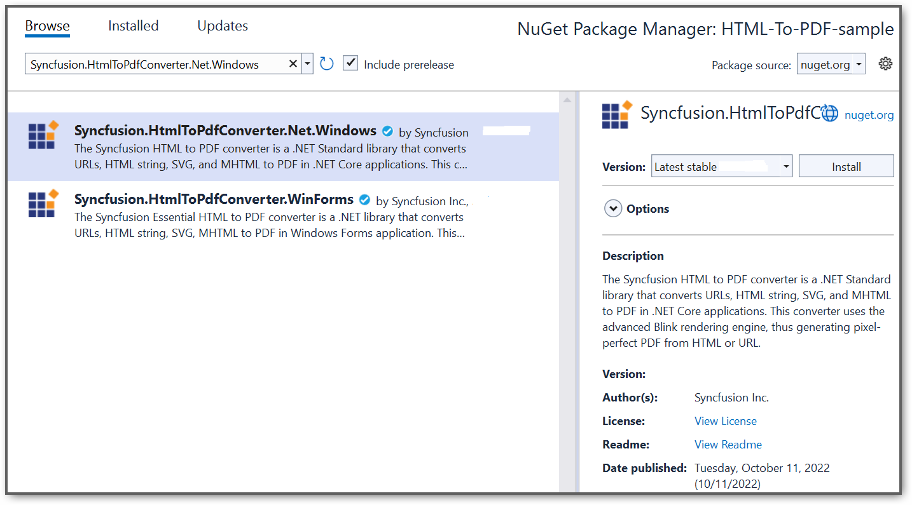
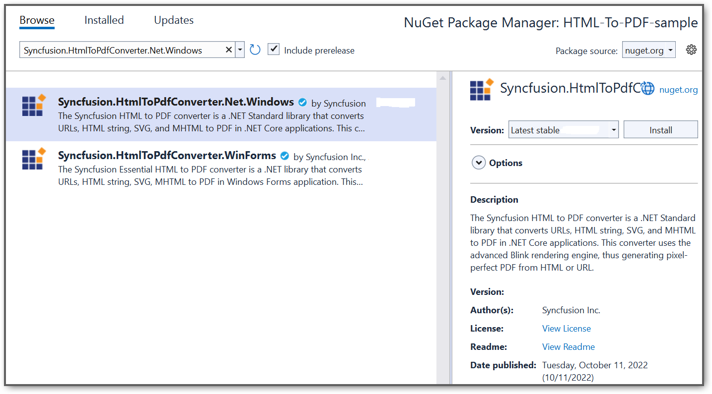
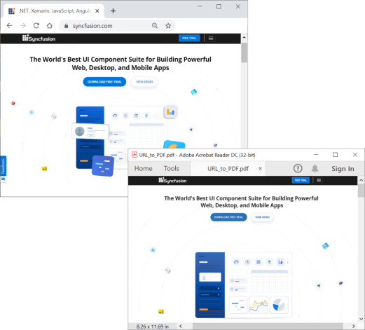

# Convert HTML to PDF file in ASP.NET Core

The Syncfusion HTML to PDF converter is a .NET Core library used to convert HTML or web pages to PDF document. Using this library you can convert HTML to PDF in ASP.NET Core application.  

To include the HTML Converter library into your ASP.NET Core application, please refer to the [NuGet Packages Required](https://help.syncfusion.com/file-formats/pdf/converting-html-to-pdf#nuget-packages-required-recommended) or [Assemblies Required](https://help.syncfusion.com/file-formats/pdf/converting-html-to-pdf#assemblies-required) documentation. 

## Steps to convert HTML to PDF document using WebKit in ASP.NET Core

Create a new C# ASP.NET Core Web Application project.

Set the project name, location and .NET version for your ASP.NET Core application. 

Install the [Syncfusion.HtmlToPdfConverter.Net.Windows](https://www.nuget.org/packages/Syncfusion.HtmlToPdfConverter.Net.Windows) as a reference to your .NET Standard applications from [NuGet.org](https://www.nuget.org/).

A default controller with name HomeController.cs gets added on creation of ASP.NET Core project. Include the following namespaces in that HomeController.cs file.



using Syncfusion.HtmlConverter;
using Syncfusion.Pdf;



A default action method named Index will be present in HomeController.cs. Right click on Index method and select Go To View where you will be directed to its associated view page Index.cshtml.

Add a new button in the Index.cshtml as shown below.



@{Html.BeginForm("ExportToPDF", "Home", FormMethod.Post);
{

    <input type="submit" value="Convert HTML to PDF" style="width:250px;height:27px" />

}
Html.EndForm();
}


Add a new action method ExportToPDF in HomeController.cs and include the below code snippet to convert HTML to PDF file and download it.



//Initialize HTML to PDF converter
HtmlToPdfConverter htmlConverter = new HtmlToPdfConverter();

//Convert URL to PDF document
PdfDocument document = htmlConverter.Convert("https://www.syncfusion.com");

//Create memory stream
MemoryStream stream = new MemoryStream();

//Save the document
document.Save(stream);

return File(stream.ToArray(), System.Net.Mime.MediaTypeNames.Application.Pdf, "HTML-to-PDF.pdf");



A complete working sample can be downloaded from [HtmlToPDFSample.zip](https://www.syncfusion.com/downloads/support/directtrac/general/ze/HTML-To-PDF-sample840126948).

By executing the program, you will get the PDF document as follows.

