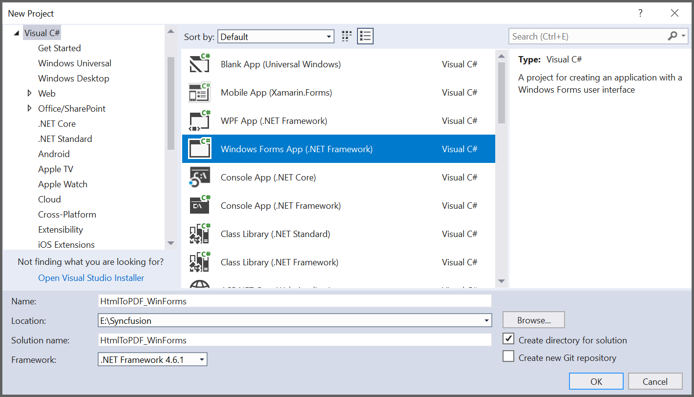
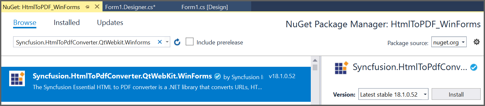
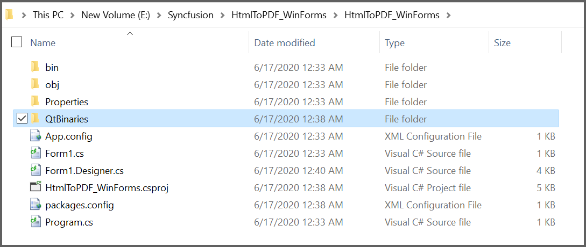
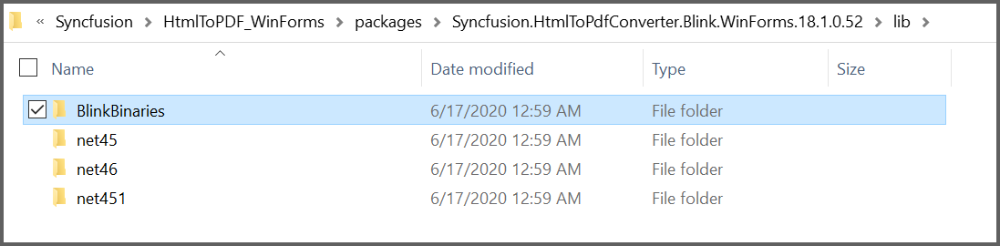
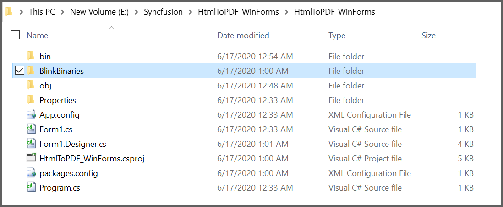
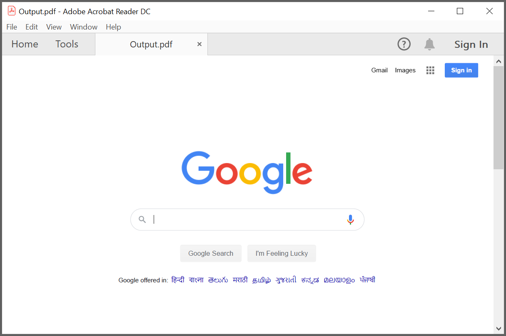

---
title: Convert a HTML to PDF file in Windows Forms | Syncfusion
description: Learn how to convert a HTML to PDF file in Windows Forms with easy steps using Syncfusion .NET PDF library.
platform: file-formats
control: PDF
documentation: UG
--- 

# Convert a HTML to PDF file in Windows Forms

 In your Windows Forms application, add the following assemblies to use Essential PDF:  

* Syncfusion.Pdf.Base
* Syncfusion.Compression.Base
* Syncfusion.HtmlConverter.Base

For more details, refer to this [Assemblies Required](/File-Formats/PDF/Assemblies-Required) documentation.

## Steps to convert a HTML to PDF document using WebKit in Window Forms:

Create a new Windows Forms application project.

Install the [Syncfusion.HtmlToPdfConverter.QtWebKit.WinForms](https://www.nuget.org/packages/Syncfusion.HtmlToPdfConverter.QtWebKit.Winforms/) NuGet package as a reference to your  .NET Framework applications from [NuGet.org](https://www.nuget.org/).

Copy the QtBinaries folder from the installed HtmlToPdfConverter package and paste it into the folder which contains the HtmlToPDF_WinForms.csproj file.

Include the following namespaces in the Form1.Designer.cs file.



using Syncfusion.Pdf;
using Syncfusion.HtmlConverter;



Add a new button in Form1.Designer.cs to Convert PDF document as follows.



private Button btnCreate;
private Label label;
  
private void InitializeComponent()
{
  btnCreate = new Button();
  label = new Label();
  
  //Label
  label.Location = new System.Drawing.Point(0, 40);
  label.Size = new System.Drawing.Size(426, 35);
  label.Text = "Click the button to generate PDF file by Essential PDF";
  label.TextAlign = System.Drawing.ContentAlignment.MiddleCenter;
  
  //Button
  btnCreate.Location = new System.Drawing.Point(180, 110);
  btnCreate.Size = new System.Drawing.Size(85, 26);
  btnCreate.Text = "Create PDF";
  btnCreate.Click += new EventHandler(btnCreate_Click); 
                               
  //Create PDF
  ClientSize = new System.Drawing.Size(450, 150);
  Controls.Add(label);
  Controls.Add(btnCreate);
  Text = "Create PDF";
}



Create the btnCreate_Click event and add the following code in btnCreate_Click to convert simple URL to PDF file using WebKit.


 
//Initialize HTML to PDF converter 
HtmlToPdfConverter htmlConverter = new HtmlToPdfConverter(HtmlRenderingEngine.WebKit);

WebKitConverterSettings settings = new WebKitConverterSettings();

//Set WebKit path
settings.WebKitPath = @"../../QtBinaries/";

//Assign WebKit settings to HTML converter
htmlConverter.ConverterSettings = settings;

//Convert URL to PDF
PdfDocument document = htmlConverter.Convert("https://www.google.com");

//Save the document
document.Save("Output.pdf");



A complete working sample can be downloaded from [HtmlToPDF-WinForms.zip](https://www.syncfusion.com/downloads/support/directtrac/general/ze/HtmlToPDF_WinForms319058844)

By executing the program, you will get the PDF document as follows.

## Steps to convert a HTML to PDF document using Blink in Window Forms:

Create a new Windows Forms application project.

Install the [Syncfusion.HtmlToPdfConverter.Blink.WinForms](https://www.nuget.org/packages/Syncfusion.HtmlToPdfConverter.Blink.Winforms/) NuGet package as a reference to your  .NET Framework applications from [NuGet.org](https://www.nuget.org/).

Copy the BlinkBinaries folder from the installed HtmlToPdfConverter package and paste it into the folder which contains the HtmlToPDF_WinForms.csproj file.

Include the following namespaces in the Form1.Designer.cs file.



using Syncfusion.Pdf;
using Syncfusion.HtmlConverter;



Add a new button in Form1.Designer.cs to Convert PDF document as follows.



private Button btnCreate;
private Label label;
  
private void InitializeComponent()
{
  btnCreate = new Button();
  label = new Label();
  
  //Label
  label.Location = new System.Drawing.Point(0, 40);
  label.Size = new System.Drawing.Size(426, 35);
  label.Text = "Click the button to generate PDF file by Essential PDF";
  label.TextAlign = System.Drawing.ContentAlignment.MiddleCenter;
  
  //Button
  btnCreate.Location = new System.Drawing.Point(180, 110);
  btnCreate.Size = new System.Drawing.Size(85, 26);
  btnCreate.Text = "Create PDF";
  btnCreate.Click += new EventHandler(btnCreate_Click); 
                               
  //Create PDF
  ClientSize = new System.Drawing.Size(450, 150);
  Controls.Add(label);
  Controls.Add(btnCreate);
  Text = "Create PDF";
}



Create the btnCreate_Click event and add the following code in btnCreate_Click to convert simple URL to PDF file using Blink.


 
//Initialize HTML to PDF converter 
HtmlToPdfConverter htmlConverter = new HtmlToPdfConverter(HtmlRenderingEngine.Blink);

BlinkConverterSettings settings = new BlinkConverterSettings();

//Set Blink path
settings.BlinkPath = @"../../BlinkBinaries/";

//Assign Blink settings to HTML converter
htmlConverter.ConverterSettings = settings;

//Convert URL to PDF
PdfDocument document = htmlConverter.Convert("https://www.google.com");

//Save the document
document.Save("Output.pdf");



A complete working sample can be downloaded from [HtmlToPDF-WinForms.zip](https://www.syncfusion.com/downloads/support/directtrac/general/ze/HtmlToPDF_WinForms1802160002)

By executing the program, you will get the PDF document as follows.

