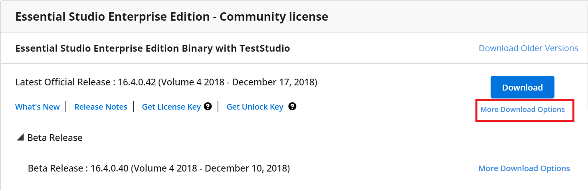
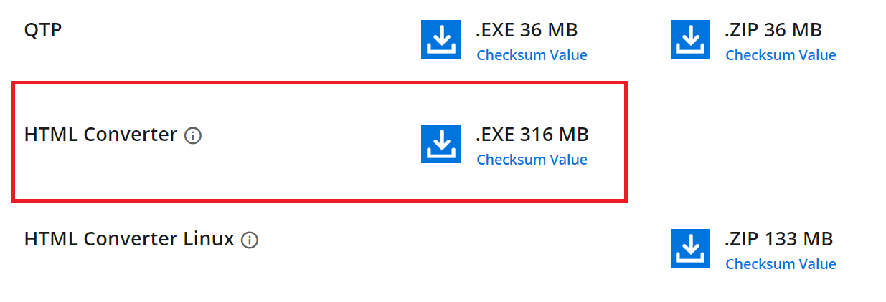

# Converting HTML to PDF

Essential PDF supports converting HTML pages to PDF document. The converter offers full support for HTML tags, HTML5, CSS3, JavaScript, SVG and page breaks. The following are the three rendering engines:

* WebKit rendering
* Blink rendering
* IE rendering

N> * Starting with v20.1.0.x, if you reference Syncfusion HTML converter assemblies from trial setup or from the NuGet feed, include a license key in your projects. Refer to [link](https://help.syncfusion.com/file-formats/licensing/licensing) to learn how to generate and register a Syncfusion license key in your application to use the components without trail message.

## Steps to download the HTML converter installer

* The latest version of Essential HTML converter can be downloaded from 

    [https://www.syncfusion.com/downloads/latest-version](https://www.syncfusion.com/downloads/latest-version)
	

* Click more downloads option from the required product version. Refer to the following screenshot.  
	
	
* The HTML converter is available under the Add-On section. Refer to the following screenshot.
	

	
## Getting Started

Essential PDF supports converting HTML contents to PDF. To add the HTML to PDF conversion functionality, add the following assemblies as reference to the project.

<table>
  <tr>
    <th>Assembly Name</th>
    <th>Description</th>
  </tr>
    <tr>
    <td>Syncfusion.HtmlConverter.Base</td>
    <td>This is required for converting HTML to PDF.</td>
  </tr>
  <tr>
    <td>Syncfusion.Pdf.Base</td>
    <td>Contains the core feature for creating, manipulating, and saving PDF documents.</td>
  </tr>
  <tr>
    <td>Syncfusion.Compression.Base</td>
    <td>This is required for compressing the internal contents of a PDF document.</td>
  </tr>
</table>

Include the following namespaces in your .cs or .vb file as follows.



using Syncfusion.Pdf;
using Syncfusion.HtmlConverter;



Imports Syncfusion.Pdf
Imports Syncfusion.HtmlConverter



using Syncfusion.Pdf;
using Syncfusion.HtmlConverter;




### Converting HTML to PDF using WebKit rendering engine

To convert website URL or local HTML file to PDF using WebKit rendering engine, refer to the following code snippet. Click the following link for more details to convert the HTML to PDF using WebKit rendering engine.

[Conversion using WebKit Rendering](/file-formats/pdf/convert-html-to-pdf/webkit "Conversion using WebKit Rendering")





//Initialize the HTML to PDF converter 
HtmlToPdfConverter htmlConverter = new HtmlToPdfConverter(HtmlRenderingEngine.WebKit);

WebKitConverterSettings settings = new WebKitConverterSettings();
            
//Set WebKit path
settings.WebKitPath = @"/QtBinaries/";
            
//Assign WebKit settings to HTML converter
htmlConverter.ConverterSettings = settings;

//Convert URL to PDF
PdfDocument document = htmlConverter.Convert("https://www.google.com");

//Save and close the PDF document 
document.Save("Output.pdf");

document.Close(true);





'Initialize the HTML to PDF converter 
Dim htmlConverter As New HtmlToPdfConverter(HtmlRenderingEngine.WebKit)

Dim settings As New WebKitConverterSettings()

'Set WebKit path
settings.WebKitPath = "/QtBinaries/"

'Assign WebKit settings to HTML converter
htmlConverter.ConverterSettings = settings

'Convert URL to PDF
Dim document As PdfDocument = htmlConverter.Convert("https://www.google.com")

'Save and close the PDF document 
document.Save("Output.pdf")

document.Close(True)





//Initialize the HTML to PDF converter 
HtmlToPdfConverter htmlConverter = new HtmlToPdfConverter();

WebKitConverterSettings settings = new WebKitConverterSettings();

//Set WebKit path
settings.WebKitPath = @"\QtBinariesDotNetCore\";

//Assign WebKit settings to HTML converter
htmlConverter.ConverterSettings = settings;

//Convert URL to PDF
PdfDocument document = htmlConverter.Convert("https://www.google.com");

FileStream fileStream = new FileStream("Sample.pdf", FileMode.CreateNew, FileAccess.ReadWrite);
            
//Save and close the PDF document 
document.Save(fileStream);
document.Close(true);





### Converting HTML to PDF using Blink rendering engine

To convert website URL or local HTML file to PDF using Blink rendering engine, refer to the following code snippet. Click the following link for more details to convert the HTML to PDF using Blink rendering engine.

[Conversion using Blink Rendering](/file-formats/pdf/convert-html-to-pdf/blink "Conversion using Blink Rendering")





//Initialize the HTML to PDF converter with Blink rendering engine
HtmlToPdfConverter htmlConverter = new HtmlToPdfConverter(HtmlRenderingEngine.Blink);

BlinkConverterSettings blinkConverterSettings = new BlinkConverterSettings();

//Set the BlinkBinaries folder path
blinkConverterSettings.BlinkPath = @"/BlinkBinaries/";

//Assign Blink converter settings to HTML converter
htmlConverter.ConverterSettings = blinkConverterSettings;

//Convert URL to PDF
PdfDocument document = htmlConverter.Convert("https://www.google.com");

//Save and close the PDF document 
document.Save("Output.pdf");

document.Close(true);





'Initialize the HTML to PDF converter with Blink rendering engine
Dim htmlConverter As HtmlToPdfConverter = New HtmlToPdfConverter(HtmlRenderingEngine.Blink)

Dim blinkConverterSettings As BlinkConverterSettings = New BlinkConverterSettings()

'Set the BlinkBinaries folder path
blinkConverterSettings.BlinkPath = "/BlinkBinaries/"

'Assign Blink converter settings to HTML converter
htmlConverter.ConverterSettings = blinkConverterSettings

'Convert URL to PDF
Dim document As PdfDocument = htmlConverter.Convert("https://www.google.com")

'Save and close the PDF document 
document.Save("Output.pdf")

document.Close(True)





//Initialize HTML to PDF converter with Blink rendering engine
HtmlToPdfConverter htmlConverter = new HtmlToPdfConverter(HtmlRenderingEngine.Blink);

BlinkConverterSettings blinkConverterSettings = new BlinkConverterSettings();

//Set the BlinkBinaries folder path
blinkConverterSettings.BlinkPath = @"/BlinkBinaries/";

//Assign Blink converter settings to HTML converter
htmlConverter.ConverterSettings = blinkConverterSettings;

//Convert URL to PDF
PdfDocument document = htmlConverter.Convert("https://www.google.com");

FileStream fileStream = new FileStream("Sample.pdf", FileMode.CreateNew, FileAccess.ReadWrite);

//Save and close the PDF document 
document.Save(fileStream);
document.Close(true);





### Converting HTML to PDF using IE rendering engine

To convert website URL or local HTML file to PDF using IE rendering engine, refer to the following code snippet. Click the following link for more details to convert the HTML to PDF using IE rendering engine.

[Conversion using IE Rendering](/file-formats/pdf/convert-html-to-pdf/ie "Conversion using IE Rendering")





//Initialize the HTML to PDF converter 
 HtmlToPdfConverter htmlConverter = new HtmlToPdfConverter(HtmlRenderingEngine.IE);

IEConverterSettings settings = new IEConverterSettings();
            
//Assign IE settings to HTML converter
htmlConverter.ConverterSettings = settings;

//Convert URL to PDF
PdfDocument document = htmlConverter.Convert("https://www.google.com");

//Save and close the PDF document 
document.Save("Output.pdf");

document.Close(true);




'Initialize the HTML to PDF converter 
Dim htmlConverter As New HtmlToPdfConverter(HtmlRenderingEngine.IE)

Dim settings As New IEConverterSettings()

'Assign IE settings to HTML converter
htmlConverter.ConverterSettings = settings

'Convert URL to PDF
Dim document As PdfDocument = htmlConverter.Convert("https://www.google.com")

'Save and close the PDF document 
document.Save("Output.pdf")

document.Close(True)




//Currently, IE rendering engine does not support conversion in .NET Core platform




### Steps to disable IE warning while performing HTML To PDF using the IE rendering engine

By default, the PDF document generated with the IE rendering engine comes with the following warning message.

Please refer to the below code snippet to use the DisableIEWarning API to remove the default IE warning from the PDF document.





//Initialize the HTML to PDF converter 
 HtmlToPdfConverter htmlConverter = new HtmlToPdfConverter(HtmlRenderingEngine.IE);

IEConverterSettings settings = new IEConverterSettings();

//Disable Default IE warning message.
settings.DisableIEWarning = true;
            
//Assign IE settings to HTML converter
htmlConverter.ConverterSettings = settings;

//Convert URL to PDF
PdfDocument document = htmlConverter.Convert("https://www.google.com");

//Save and close the PDF document 
document.Save("Output.pdf");

document.Close(true);




'Initialize the HTML to PDF converter 
Dim htmlConverter As New HtmlToPdfConverter(HtmlRenderingEngine.IE)

Dim settings As New IEConverterSettings()

'Disable Default IE Warning Message
settings.DisableIEWarning = true

'Assign IE settings to HTML converter
htmlConverter.ConverterSettings = settings

'Convert URL to PDF
Dim document As PdfDocument = htmlConverter.Convert("https://www.google.com")

'Save and close the PDF document 
document.Save("Output.pdf")

document.Close(True)




//Currently, IE rendering engine does not support conversion in .NET Core platform




N>Please try our [Blink](https://help.syncfusion.com/file-formats/pdf/convert-html-to-pdf/blink) or [WebKit](https://help.syncfusion.com/file-formats/pdf/convert-html-to-pdf/webkit) engines to improve the quality and accuracy of the HTML to PDF conversion.

## Steps to apply the patch for HTML converter.

Download and extract the patch provided in the incident. Before applying the patch assemblies, the older assemblies should be removed from the GAC.

N> You can uninstall or remove the specific version assemblies in GAC using the Syncfusion Assembly Manager Utility. Refer to the following Assembly Manager Documentation link for more information.
https://help.syncfusion.com/common/essential-studio/utilities#assembly-manager

### Steps to replace the patch assemblies, if a customer using the HTML converter installer

This patch should replace the files HTML Converter patch assemblies under the following folder.

$system drive:\ Files\Syncfusion\Essential Studio\$Version # \precompiledassemblies\$Version#\4.6

Eg: $system drive:\Program Files\Syncfusion\Essential Studio\XX.X.X.XX\precompiledassemblies\XX.X.X.XX\4.6

The provided patch assembly should be used in your application. 

### Steps to replace the patch assemblies, if a customer using NuGet packages

1.	Uninstall the HTML to PDF converter NuGet package from the application.
2.	Download and extract the provided patch NuGet package. 
3.	Now, you can install the required package in the .NET Framework or .Net Core application by using the NuGet package manager.
4.	Refer to this documentation link for installing NuGet packages.

### Steps to update patch for QtBinaries or BinkBinaries folders

1.	Download and extract the Patch file for QtBinaries or BlinkBinaries folder. 
2.	Copy the files from the Patch folder and replace or copy the files into the existing QtBinaries or BlinkBinaries folder.
3.	The patch applied QtBinaries or BlinkBinaries should be used in the applications to resolve the issue or the latest features. 

<b>WebKit</b>
Eg: $system drive:\Program Files\Syncfusion\HTMLConverter\version\QtBinaries\

<b>Blink</b>
Eg: $system drive:\Program Files\Syncfusion\HTMLConverter\version\BlinkBinaries\

## Supported and Unsupported Features by Rendering Engines

The following table shows the WebKit, Blink and IE rendering engines supported features:

<table>
<th style="font-size:14px">Feature</th>
<th style="font-size:14px">WebKit Renderer</th>
<th style="font-size:14px">Blink Renderer</th>
<th style="font-size:14px">IE Renderer</th>
<tr>
<td>Convert URLs to PDF</td>
<td></td>
<td></td>
<td></td>
</tr>

<tr>
<td>Convert HTML string to PDF</td>
<td></td>
<td></td>
<td></td>
</tr>

<tr>
<td>Images</td>
<td></td>
<td></td>
<td></td>
</tr>

<tr>
<td>Hyperlinks</td>
<td></td>
<td></td>
<td></td>
</tr>

<tr>
<td>CSS</td>
<td></td>
<td></td>
<td></td>
</tr>

<tr>
<td>JavaScript</td>
<td></td>
<td></td>
<td></td>
</tr>

<tr>
<td>ActiveX plugin</td>
<td></td>
<td></td>
<td></td>
</tr>

<tr>
<td>HTML 5</td>
<td></td>
<td></td>
<td></td>
</tr>

<tr>
<td>Page breaks</td>
<td></td>
<td></td>
<td></td>
</tr>

<tr>
<td>Vector Graphics (Selectable/searchable text)</td>
<td></td>
<td></td>
<td>HTML 5 pages are rendered as bitmap.</td>
</tr>

<tr>
<td>Handling image and text split across pages</td>
<td></td>
<td></td>
<td></td>
</tr>

<tr>
<td>Pdf A1-B</td>
<td></td>
<td></td>
<td></td>
</tr>

<tr>
<td>Tagged PDF</td>
<td></td>
<td></td>
<td></td>
</tr>

<tr>
<td>Page settings</td>
<td></td>
<td></td>
<td></td>
</tr>

<tr>
<td>Header and Footer</td>
<td></td>
<td></td>
<td></td>
</tr>

<tr>
<td>Windows Authentication</td>
<td></td>
<td></td>
<td></td>
</tr>

<tr>
<td>Form Authentication</td>
<td></td>
<td></td>
<td></td>
</tr>

<tr>
<td>HTML to Image</td>
<td></td>
<td></td>
<td></td>
</tr>

<tr>
<td>HTML to SVG</td>
<td></td>
<td></td>
<td></td>
</tr>

<tr>
<td>HTML to MHTML</td>
<td></td>
<td></td>
<td></td>
</tr>

<tr>
<td>SVG to PDF</td>
<td></td>
<td></td>
<td></td>
</tr>

<tr>
<td>HTML Form to PDF Form</td>
<td></td>
<td></td>
<td></td>
</tr>

<tr>
<td>HTTP GET and POST</td>
<td></td>
<td></td>
<td></td>
</tr>

<tr>
<td>Partial HTML to PDF</td>
<td></td>
<td></td>
<td></td>
</tr>

<tr>
<td>Bookmarks</td>
<td></td>
<td></td>
<td></td>
</tr>

<tr>
<td>Repeat HTML Table Header and Footer</td>
<td></td>
<td>(Works only with print media)</td>
<td></td>
</tr>

<tr>
<td>Auto Create Table of Contents</td>
<td></td>
<td></td>
<td></td>
</tr>

<tr>
<td>Windows status</td>
<td></td>
<td></td>
<td></td>
</tr>

<tr>
<td>Print Media Type</td>
<td></td>
<td></td>
<td></td>
</tr>

<tr>
<td>Offline mode conversion</td>
<td></td>
<td></td>
<td></td>
</tr>

<tr>
<td>System proxy</td>
<td></td>
<td></td>
<td></td>
</tr>

<tr>
<td>Manual proxy</td>
<td></td>
<td></td>
<td></td>
</tr>

<tr>
<td>Azure App Service</td>
<td>(Except free and shared plan)</td>
<td>(Works in Azure App Service on Linux)</td>
<td></td>
</tr>

<tr>
<td>Azure Cloud Service</td>
<td></td>
<td></td>
<td></td>
</tr>

<tr>
<td>Azure Function</td>
<td>(Except consumption plan)</td>
<td>(Works in Azure Function on Linux)</td>
<td></td>
</tr>

<tr>
<td>Azure App Service with Linux docker</td>
<td></td>
<td></td>
<td></td>
</tr>

</table>
