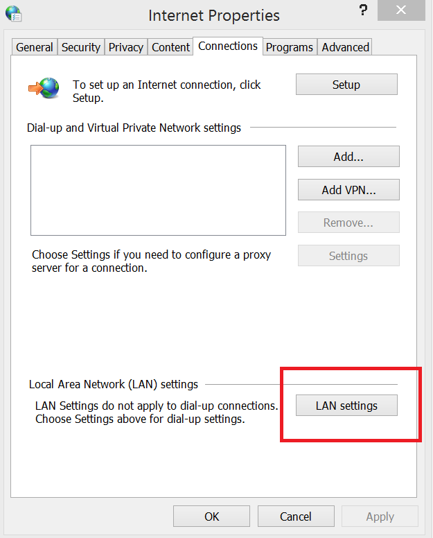

# Converting HTML to PDF

Essential PDF provides support for converting HTML pages to PDF document. The converter offers full support for HTML tags, HTML5, CSS3, JavaScript, SVG and page breaks. There are two rendering engines available. They are

* WebKit Rendering
* IE Rendering

## Conversion using WebKit Rendering


Syncfusion Essential PDF supports HTML to PDF conversion by using the advanced Qt WebKit rendering engine. This converter can be easily integrated into any application on .NET platforms such as Windows Forms, WPF, ASP.NET, and ASP.NET MVC to convert URLs, HTML string, SVG and MHTML to PDF, and convert other formats like HTML to MHTML, HTML to SVG, and HTML to image.

Qt WebKit rendering is accurate, and the result preserves all the graphics, images, texts, fonts, and the layout of the original HTML document/webpage.

It does not require external dependencies like browsers, printer drivers, or viewers.


## Prerequisites and set up for HTML to PDF conversion in Windows

* Latest WebKit HTML converter can be download from the below link,

    [https://www.syncfusion.com/downloads/latest-version](https://www.syncfusion.com/downloads/latest-version)

* To convert HTML to PDF in the application using WebKit rendering engine, the following assemblies needs to be added as reference to the project.	
<table>
<tr>
<thead>
<th>
Platforms</th>
<th>
Assemblies
</th>
</thead>
</tr>
<tr>
<td> .NET Framework </td>
<td>
<ul>
<li>Syncfusion.Compression.Base.dll</li>
<li>Syncfusion.Pdf.Base.dll</li>
<li>Syncfusion.HtmlConverter.Base.dll</li>
</ul>
</td></tr>
<tr>
<td> .NET Core </td>
<td>
<ul>
<li>Syncfusion.Compression.Portable.dll</li>
<li>Syncfusion.Pdf.Portable.dll</li>
<li>Syncfusion.HtmlConverter.Portable.dll</li>
</ul>
</td></tr>
</table>

<table>
<tr>
<thead>
<th>
Platforms</th>
<th>
QtBinaries
</th>
</thead>
</tr>
<tr>
<td> .NET Framework </td>
<td>
The QtBinaries folder available in the WebKit HTML Converter installed location <span style="color:gray;font-size:14px"><i>($SystemDrive\Program Files (x86)\Syncfusion\WebKitHTMLConverter\xx.x.x.xx\QtBinaries)</i></span>. The physical path of this folder should be set  to the <i>WebKitPath</i> property of WebKitConverterSettings.
</td></tr>
<tr>
<td> .NET Core </td>
<td>
The QtBinariesDotNetCore folder available in the WebKit HTML Converter installed location <span style="color:gray;font-size:14px"><i>($SystemDrive\Program Files (x86)\Syncfusion\WebKitHTMLConverter\xx.x.x.xx\QtBinariesDotNetCore)</i></span>. The physical path of this folder should be set  to the <i>WebKitPath</i> property of WebKitConverterSettings.
</td></tr>
</table>

* WebKit HTML conversion also requires VC++ 2010 redistributable, this should to be installed in the machine where the conversion takes place. Please use below download link to get the installer.
    
    X86 - [https://www.microsoft.com/en-in/download/details.aspx?id=5555](https://www.microsoft.com/en-in/download/details.aspx?id=5555)
    
    X64 - [https://www.microsoft.com/en-in/download/details.aspx?id=14632](https://www.microsoft.com/en-in/download/details.aspx?id=14632)

	Instead, the required assemblies can be placed in the Windows system folder (for 64-bit machine, it should be place in  <span style="color:gray;font-size:14px"><i>$SystemDrive\Windows\SysWOW64</i></span> and for 32-bit machine, it should be place in  <span style="color:gray;font-size:14px"><i>$SystemDrive\Windows\System32</i></span>),

	1. MSVCP100.dll
	2. MSVCR100.dll

* For converting HTTPS sites, HTML converter requires OPENSSL libraries to be installed in the machine where the conversion takes place. The OPENSSL libraries can be installed by downloading its setup from the below link,

    [http://files2.syncfusion.com/dtsupport/directtrac/general/ze/Win32OpenSSL-1_0_1h1593443064.zip](http://files2.syncfusion.com/dtsupport/directtrac/general/ze/Win32OpenSSL-1_0_1h1593443064.zip) 

	Instead, the below mentioned assemblies can be placed in the Windows system folder (for 64-bit machine, it should be place in <span style="color:gray;font-size:14px"><i>$SystemDrive\Windows\SysWOW64</i></span> and for 32-bit machine, it should be place in <span style="color:gray;font-size:14px"><i>$SystemDrive\Windows\System32</i></span>),

	1. libeay32.dll
	2. libssl32.dll
	3. ssleay32.dll

	
## Prerequisites and set up for HTML to PDF conversion in Linux

* [.NET Core 2.0](https://www.microsoft.com/net/download/linux-package-manager/ubuntu16-04/sdk-current) should be installed in the Linux machine where the conversion takes place. 

* The latest WebKit HTML converter for Linux can be downloaded as ZIP file from the following link,

	[https://www.syncfusion.com/downloads/latest-version](https://www.syncfusion.com/downloads/latest-version)
	
* To convert HTML to PDF in the ASP.NET application using WebKit rendering engine, add the following assemblies or NuGet packages as reference to the project.  

	<b>Assemblies</b>
		1. Syncfusion.Compression.Portable.dll
		2. Syncfusion.Pdf.Portable.dll
		3. Syncfusion.HtmlConverter.Portable.dll
	<b>NuGet</b>
		1. Syncfusion.HtmlConverter.NETStandard
		   [http://nuget.syncfusion.com/nuget_aspnetcore/nuget/getsyncfusionpackages/aspnetcore](http://nuget.syncfusion.com/nuget_aspnetcore/nuget/getsyncfusionpackages/aspnetcore)

* The QtBinaries folder is available in the WebKit HTML Converter installed location. The physical path of this folder should be set to the <i>WebKitPath</i> property of WebKitConverterSettings. 

* To convert HTML to PDF in Linux using the WebKit rendering engine, the following packages should be installed in the Linux machine where the conversion takes place.
	1. $ sudo apt-get update 
	2. $ sudo apt-get install xvfb 
	3. $ sudo apt-get install libssl-dev 
	4. $ sudo apt-get install libx11-dev libx11-xcb-dev libxcb-icccm4-dev libxcb-image0-dev libxcb-keysyms1-dev libxcb-randr0-dev libxcb-render-util0-dev libxcb-render0-dev libxcb-shm0-dev libxcb-util0-dev libxcb-xfixes0-dev libxcb-xkb-dev libxcb1-dev libxfixes-dev libxrandr-dev libxrender-dev

## Prerequisites and set up for HTML to PDF conversion in Mac

* .NET Core 2.0 should be installed in the machine where the conversion takes place. 

* The latest WebKit HTML converter for Mac can be downloaded as PKG file from the following link,

	[https://www.syncfusion.com/downloads/latest-version](https://www.syncfusion.com/downloads/latest-version)
  
* To convert HTML to PDF in the ASP.NET application using WebKit rendering engine, add the following assemblies or NuGet packages as reference to the project.  

	<b>Assemblies</b>
		1. Syncfusion.Compression.Portable.dll
		2. Syncfusion.Pdf.Portable.dll
		3. Syncfusion.HtmlConverter.Portable.dll
	<b>NuGet</b>
		1. Syncfusion.HtmlConverter.NETStandard
		   [http://nuget.syncfusion.com/nuget_aspnetcore/nuget/getsyncfusionpackages/aspnetcore](http://nuget.syncfusion.com/nuget_aspnetcore/nuget/getsyncfusionpackages/aspnetcore)
	
* The QtBinaries folder is available in the WebKit HTML Converter installed location. The physical path of this folder should be set to the <i>WebKitPath</i> property of WebKitConverterSettings.
	
	
## URL to PDF

To convert website URL or local HTML file to PDF using WebKit rendering engine, please refer the below code snippet.





//Initialize HTML to PDF converter 
HtmlToPdfConverter htmlConverter = new HtmlToPdfConverter(HtmlRenderingEngine.WebKit);

WebKitConverterSettings settings = new WebKitConverterSettings();
            
//Set WebKit path
settings.WebKitPath = @"/QtBinaries/";
            
//Assign WebKit settings to HTML converter
htmlConverter.ConverterSettings = settings;

//Convert URL to PDF
PdfDocument document = htmlConverter.Convert("https://www.syncfusion.com");

//Save and close the PDF document 
document.Save("Output.pdf");

document.Close(true);





'Initialize HTML to PDF converter 
Dim htmlConverter As New HtmlToPdfConverter(HtmlRenderingEngine.WebKit)

Dim settings As New WebKitConverterSettings()

'Set WebKit path
settings.WebKitPath = "/QtBinaries/"

'Assign WebKit settings to HTML converter
htmlConverter.ConverterSettings = settings

'Convert URL to PDF
Dim document As PdfDocument = htmlConverter.Convert("https://www.syncfusion.com")

'Save and close the PDF document 
document.Save("Output.pdf")

document.Close(True)





//Initialize HTML to PDF converter 
HtmlToPdfConverter htmlConverter = new HtmlToPdfConverter();

WebKitConverterSettings settings = new WebKitConverterSettings();

//Set WebKit path
settings.WebKitPath = @"\QtBinariesDotNetCore\";

//Assign WebKit settings to HTML converter
htmlConverter.ConverterSettings = settings;

//Convert URL to PDF
PdfDocument document = htmlConverter.Convert("https://www.google.com");

FileStream fileStream = new FileStream("Sample.pdf", FileMode.CreateNew, FileAccess.ReadWrite);
            
//Save and close the PDF document 
document.Save(fileStream);
document.Close(true);






## HTML string to PDF

WebKit HTML converter provides support for converting HTML string to PDF. While converting HTML string to PDF, converter provides option to specify the base URL.

<b>baseURL:</b> Path of the resources (images, style sheets, scripts.,) used in the input HTML string.

For the below HTML string, the baseURL will be the path of the <font color="blue"><i>syncfusion_logo.gif</i></font> image.

For example, if the above image is in <i>“C:/Temp/ HTMLFiles/syncfusion_logo.gif”</i> location then the baseURL will be as below,

<b>baseURL:</b> C:/Temp/HTMLFiles/

To convert the HTML string to PDF, please refer the below code snippet.
 





//Initialize HTML to PDF converter 
HtmlToPdfConverter htmlConverter = new HtmlToPdfConverter(HtmlRenderingEngine.WebKit);

WebKitConverterSettings settings = new WebKitConverterSettings();

//HTML string and Base URL 
string htmlText = "<html><body><p> Hello World</p></body></html>";

string baseUrl = @"C:/Temp/HTMLFiles/";

//Set WebKit path
settings.WebKitPath = @"/QtBinaries/";

//Assign WebKit settings to HTML converter
htmlConverter.ConverterSettings = settings;

//Convert HTML string to PDF
PdfDocument document = htmlConverter.Convert(htmlText, baseUrl);

//Save and close the PDF document 
document.Save("Output.pdf");

document.Close(true);





'Initialize HTML to PDF converter 
Dim htmlConverter As New HtmlToPdfConverter(HtmlRenderingEngine.WebKit)

Dim settings As New WebKitConverterSettings()

'HTML string and Base URL 
Dim htmlText As String = "<html><body><p> Hello World</p></body></html>"

Dim baseUrl As String = "C:/Temp/HTMLFiles/"

'Set WebKit path
settings.WebKitPath = "/QtBinaries/"

'Assign WebKit settings to HTML converter
htmlConverter.ConverterSettings = settings

'Convert HTML string to PDF
Dim document As PdfDocument = htmlConverter.Convert(htmlText, baseUrl)

'Save and close the PDF document 
document.Save("Output.pdf")

document.Close(True)




<html>
<body>

<p> Hello World</p>
</body>
</html>






## JavaScript

WebKit HTML converter provides support for enabling or disabling the JavaScript while converting HTML to PDF. Please refer the below code snippet,





//Initialize HTML converter with WebKit rendering engine
HtmlToPdfConverter htmlConverter = new HtmlToPdfConverter(HtmlRenderingEngine.WebKit);

WebKitConverterSettings webKitSettings = new WebKitConverterSettings();

//Set WebKit path
webKitSettings.WebKitPath = @"/QtBinaries/";

//Disable JavaScript; By default - true
webKitSettings.EnableJavaScript = false;

//Assign WebKit settings to HTML converter
htmlConverter.ConverterSettings = webKitSettings;

//Convert URL to PDF
PdfDocument document = htmlConverter.Convert("https://www.syncfusion.com");

//Save the document.
document.Save("Sample.pdf");

document.Close();





'Initialize HTML converter with WebKit rendering engine
Dim htmlConverter As New HtmlToPdfConverter(HtmlRenderingEngine.WebKit)

Dim webKitSettings As New WebKitConverterSettings()

'Set WebKit path
webKitSettings.WebKitPath = "/QtBinaries/"

'Disable JavaScript; By default True
webKitSettings.EnableJavaScript = False

'Assign WebKit settings to HTML converter
htmlConverter.ConverterSettings = webKitSettings

'Convert URL to PDF
Dim document As PdfDocument = htmlConverter.Convert("https://www.syncfusion.com")

'Save the document.
document.Save("Sample.pdf")

document.Close()






## Additional delay

WebKit HTML converter provides option to set the AdditionalDelay, while converting HTML to PDF. Additional delay is the time to wait the converter for loading the external resources (styles, scripts, images, etc.,). Please refer the below code snippet,





//Initialize HTML converter with WebKit rendering engine
HtmlToPdfConverter htmlConverter = new HtmlToPdfConverter(HtmlRenderingEngine.WebKit);

WebKitConverterSettings webKitSettings = new WebKitConverterSettings();

//Set WebKit path
webKitSettings.WebKitPath = @"/QtBinaries/";

//Set additional delay; units in milliseconds;
webKitSettings.AdditionalDelay = 3000;

//Assign WebKit settings to HTML converter
htmlConverter.ConverterSettings = webKitSettings;

//Convert URL to PDF
PdfDocument document = htmlConverter.Convert("https://www.syncfusion.com");

//Save the document.
document.Save("Sample.pdf");

document.Close();





'Initialize HTML converter with WebKit rendering engine
Dim htmlConverter As New HtmlToPdfConverter(HtmlRenderingEngine.WebKit)

Dim webKitSettings As New WebKitConverterSettings()

'Set WebKit path
webKitSettings.WebKitPath = "/QtBinaries/"

'Set additional delay; units in milliseconds;
webKitSettings.AdditionalDelay = 3000

'Assign WebKit settings to HTML converter
htmlConverter.ConverterSettings = webKitSettings

'Convert URL to PDF
Dim document As PdfDocument = htmlConverter.Convert("https://www.syncfusion.com")

'Save the document.
document.Save("Sample.pdf")

document.Close()






## Hyperlinks

WebKit HTML converter provides support for preserving URL links from HTML to PDF.  WebKit HTML converter preserves hyperlinks as Web Link and Document Link annotations in PDF document. Please refer the below code snippet,





//Initialize HTML converter with WebKit rendering engine
HtmlToPdfConverter htmlConverter = new HtmlToPdfConverter(HtmlRenderingEngine.WebKit);

WebKitConverterSettings webKitSettings = new WebKitConverterSettings();

//Set WebKit path
webKitSettings.WebKitPath = @"/QtBinaries/"; 

//Enable hyperlinks; By default - true
webKitSettings.EnableHyperLink = false;
           
//Assign WebKit settings to HTML converter
htmlConverter.ConverterSettings = webKitSettings;

//Convert URL to PDF
PdfDocument document = htmlConverter.Convert("https://www.syncfusion.com");  
    
//Save the document.
document.Save("Sample.pdf");

document.Close();





'Initialize HTML converter with WebKit rendering engine
Dim htmlConverter As New HtmlToPdfConverter(HtmlRenderingEngine.WebKit)

Dim webKitSettings As New WebKitConverterSettings()

'Set WebKit path
webKitSettings.WebKitPath = "/QtBinaries/"

'Enable hyperlinks; By default - True
webKitSettings.EnableHyperLink = False

'Assign WebKit settings to HTML converter
htmlConverter.ConverterSettings = webKitSettings

'Convert URL to PDF
Dim document As PdfDocument = htmlConverter.Convert("https://www.syncfusion.com")

'Save the document.
document.Save("Sample.pdf")

document.Close()






## Bookmarks

The WebKit HTML Converter provides support for creating bookmarks automatically by enabling <i>EnableBookmarks</i> option. 

<b>Note:</b> The bookmarks are calculated from the ```<h>``` tag, it supports from ```<h1>``` to ```<h6>```.

Please refer the below code snippet,





//Initialize HTML converter 

HtmlToPdfConverter htmlConverter = new HtmlToPdfConverter(HtmlRenderingEngine.WebKit);

// WebKit converter settings

WebKitConverterSettings webKitSettings = new WebKitConverterSettings();

//Assign the WebKit binaries path

webKitSettings.WebKitPath = @"/QtBinaries/";

// Enable bookmarks

webKitSettings.EnableBookmarks = true;

//Assign the WebKit settings

htmlConverter.ConverterSettings = webKitSettings;

//Convert HTML to PDF

PdfDocument document = htmlConverter.Convert("input.html");

//Save and close the PDF document

document.Save("Output.pdf");

document.Close(true);





'Initialize HTML converter 

Dim htmlConverter As New HtmlToPdfConverter(HtmlRenderingEngine.WebKit)

'WebKit converter settings 

Dim webKitSettings As New WebKitConverterSettings()

'Assign the WebKit binaries path
 
webKitSettings.WebKitPath = "/QtBinaries/"

'Enable bookmarks

webKitSettings.EnableBookmarks = True

'Assign the WebKit settings 

htmlConverter.ConverterSettings = webKitSettings

'Convert HTML to PDF 

Dim document As PdfDocument = htmlConverter.Convert("input.html")

'Save and close the document

document.Save("Output.pdf")

document.Close()





<html>
<head>
<style>
body
{
text-align: left;
font-size: large;
padding-left: 5px;
}
</style>
</head>
<body>

<h1>Syncfusion</h1>

<h2>Introduction</h2>
	Syncfusion is the enterprise technology partner of choice for software development, delivering a broad range of web, mobile, and desktop controls coupled with a service-oriented approach throughout the entire application life cycle. 
<h2>Products</h2>
	<h4>WEB</h4>
		The most comprehensive suite for enterprise web development.
	<h4>Desktop</h4>
		Comprehensive suite of over 115 components including the fastest chart and grid components.
	<h4>Mobile</h4>
		Comprehensive suite of components for Xamarin.iOS, Xamarin.Android and Xamarin.Forms including the fastest chart and grid.
<h2>Consulting</h2>
	We can build web, mobile, and desktop applications better and faster than anyone since we build on top of our award-winning suite of components and frameworks, saving you time and money.
<h2>Company</h2>
	<h4>About us</h4>
		Syncfusion has established itself as the trusted partner worldwide for use in mission-critical applications. Founded in 2001 and headquartered in Research Triangle Park, N.C., Syncfusion has more than 12,000 customers, including large financial institutions, Fortune 100 companies, and global IT consultancies.
	<h4>contact us</h4>
		Morrisville Office
		Company Headquarters
		2501 Aerial Center Parkway
		Suite 200
		Morrisville, NC 27560
		USA
</body>
</html>






## Table of Contents

The WebKit HTML Converter provides support for creating a table of contents automatically by <i>EnableToc</i> property.

<b>Note:</b> TOC are calculated from the ```<h>``` tag, it supports from ```<h1>``` to ```<h6>```.

Please refer the below code snippet,





//Initialize HTML converter 

HtmlToPdfConverter htmlConverter = new HtmlToPdfConverter(HtmlRenderingEngine.WebKit);

// WebKit converter settings

WebKitConverterSettings webKitSettings = new WebKitConverterSettings();

//Assign the WebKit binaries path

webKitSettings.WebKitPath = @"/QtBinaries/";

// Enable table of contents

webKitSettings.EnableToc = true;

//Assign the WebKit settings

htmlConverter.ConverterSettings = webKitSettings;

//Convert HTML to PDF

PdfDocument document = htmlConverter.Convert("input.html");

//Save and close the PDF document

document.Save("Output.pdf");

document.Close(true);





'Initialize HTML converter 

Dim htmlConverter As New HtmlToPdfConverter(HtmlRenderingEngine.WebKit)

'WebKit converter settings 

Dim webKitSettings As New WebKitConverterSettings()

'Assign the WebKit binaries path 

webKitSettings.WebKitPath = "/QtBinaries/"

'Enable table of contents

webKitSettings.EnableToc = True

'Assign the WebKit settings
 
htmlConverter.ConverterSettings = webKitSettings

'Convert HTML to PDF 

Dim document As PdfDocument = htmlConverter.Convert("input.html")

'Save and close the document

document.Save("Output.pdf")

document.Close()





<html>
<head>
<style>
body
{
text-align: left;
font-size: large;
padding-left: 5px;
}
</style>
</head>
<body>

<h1>Syncfusion</h1>

<h2>Introduction</h2>
	Syncfusion is the enterprise technology partner of choice for software development, delivering a broad range of web, mobile, and desktop controls coupled with a service-oriented approach throughout the entire application life cycle. 
<h2>Products</h2>
	<h4>WEB</h4>
		The most comprehensive suite for enterprise web development.
	<h4>Desktop</h4>
		Comprehensive suite of over 115 components including the fastest chart and grid components.
	<h4>Mobile</h4>
		Comprehensive suite of components for Xamarin.iOS, Xamarin.Android and Xamarin.Forms including the fastest chart and grid.
<h2>Consulting</h2>
	We can build web, mobile, and desktop applications better and faster than anyone since we build on top of our award-winning suite of components and frameworks, saving you time and money.
<h2>Company</h2>
	<h4>About us</h4>
		Syncfusion has established itself as the trusted partner worldwide for use in mission-critical applications. Founded in 2001 and headquartered in Research Triangle Park, N.C., Syncfusion has more than 12,000 customers, including large financial institutions, Fortune 100 companies, and global IT consultancies.
	<h4>contact us</h4>
		Morrisville Office
		Company Headquarters
		2501 Aerial Center Parkway
		Suite 200
		Morrisville, NC 27560
		USA
</body>
</html>






### Table of Contents with custom style

The WebKit HTML Converter provides support for customizing the table of contents style. Each header tag style can be customizing by using <i>HtmlToPdfTocStyle</i>. Please refer the below code snippet,





//Initialize HTML to PDF converter with WebKit Rendering Engine.

HtmlToPdfConverter htmlConverter = new HtmlToPdfConverter(HtmlRenderingEngine.WebKit);

//Initialize HTML to PDF converter

WebKitConverterSettings webKitSettings = new WebKitConverterSettings();

//Assign the WebKit binaries path

webKitSettings.WebKitPath = @"/QtBinaries/";

//Enable TOC

webKitSettings.EnableToc = true;

//Set the style for level 1(H1) items in table of contents

HtmlToPdfTocStyle tocstyleH1 = new HtmlToPdfTocStyle();

tocstyleH1.Font = new PdfStandardFont(PdfFontFamily.TimesRoman, 10, PdfFontStyle.Regular);

tocstyleH1.BackgroundColor = new PdfSolidBrush(new PdfColor(Color.FromArgb(68, 114, 196)));

tocstyleH1.ForeColor = PdfBrushes.White;

tocstyleH1.Padding = new PdfPaddings(5, 5, 3, 3);

webKitSettings.Toc.SetItemStyle(1, tocstyleH1);

//Assign the WebKit settings

htmlConverter.ConverterSettings = webKitSettings;

//Convert HTML to PDF

PdfDocument document = htmlConverter.Convert("input.html");

//Save and close the PDF document

document.Save("Output.pdf");

document.Close(true);





'Initialize HTML to PDF converter with WebKit Rendering Engine.

Dim htmlConverter As New HtmlToPdfConverter(HtmlRenderingEngine.WebKit)

'Initialize HTML to PDF converter

Dim webKitSettings As New WebKitConverterSettings()

'Assign the WebKit binaries path

webKitSettings.WebKitPath = "/QtBinaries/"

'Enable TOC

webKitSettings.EnableToc = True

'Set the style for level 1(H1) items in table of contents

Dim tocstyleH1 As New HtmlToPdfTocStyle()

tocstyleH1.Font = New PdfStandardFont(PdfFontFamily.TimesRoman, 10, PdfFontStyle.Regular)

tocstyleH1.BackgroundColor = New PdfSolidBrush(New PdfColor(Color.FromArgb(68, 114, 196)))

tocstyleH1.ForeColor = PdfBrushes.White

tocstyleH1.Padding = New PdfPaddings(5, 5, 3, 3)

webKitSettings.Toc.SetItemStyle(1, tocstyleH1)

'Assign the WebKit settings

htmlConverter.ConverterSettings = webKitSettings

'Convert HTML to PDF

Dim document As PdfDocument = htmlConverter.Convert("input.html")
'Save and close the PDF document

document.Save("Output.pdf")

document.Close(True)






## MediaType

WebKit HTML Converter allows selection of media type while converting HTML to PDF. 
Please refer the below code snippet to select Print MediaType.






//Initialize HTML converter with WebKit rendering engine
HtmlToPdfConverter htmlConverter = new HtmlToPdfConverter(HtmlRenderingEngine.WebKit);

WebKitConverterSettings webKitSettings = new WebKitConverterSettings();

//Set WebKit path
webKitSettings.WebKitPath = @"/QtBinaries/"; 

//Set print media type
webKitSettings.MediaType = MediaType.Print;
           
//Assign WebKit settings to HTML converter
htmlConverter.ConverterSettings = webKitSettings;

//Convert URL to PDF
PdfDocument document = htmlConverter.Convert("https://www.syncfusion.com");  
    
//Save the document.
document.Save("Sample.pdf");

document.Close();





'Initialize HTML converter with WebKit rendering engine
Dim htmlConverter As New HtmlToPdfConverter(HtmlRenderingEngine.WebKit)

Dim webKitSettings As New WebKitConverterSettings()

'Set WebKit path
webKitSettings.WebKitPath = "/QtBinaries/"

'Set print media type
webKitSettings.MediaType = MediaType.Print

'Assign WebKit settings to HTML converter
htmlConverter.ConverterSettings = webKitSettings

'Convert URL to PDF
Dim document As PdfDocument = htmlConverter.Convert("https://www.syncfusion.com")

'Save the document.
document.Save("Sample.pdf")

document.Close()






## HTML Form to PDF Form

WebKit HTML converter provides support for converting HTML forms to PDF fillable forms. To convert HTML form to PDF form, please refer the below code snippet,





//Initialize HTML converter 

HtmlToPdfConverter htmlConverter = new HtmlToPdfConverter(HtmlRenderingEngine.WebKit);

// WebKit converter settings 

WebKitConverterSettings webKitSettings = new WebKitConverterSettings();

//Assign the WebKit binaries path

webKitSettings.WebKitPath = @"/QtBinaries/";

//Set enable form

webKitSettings.EnableForm = true;

//Assign the WebKit settings

htmlConverter.ConverterSettings = webKitSettings;

//Convert HTML to PDF

PdfDocument document = htmlConverter.Convert("http://asp.syncfusion.com/demos/http_post_get/default.aspx");

//Save and close the PDF document

document.Save("Output.pdf");

document.Close(true);





'Initialize HTML converter 

Dim htmlConverter As New HtmlToPdfConverter(HtmlRenderingEngine.WebKit)

'WebKit converter settings 

Dim webKitSettings As New WebKitConverterSettings()

'Assign the WebKit binaries path 

webKitSettings.WebKitPath = "/QtBinaries/"

'Set enable form

webKitSettings.EnableForm = True

'Assign the WebKit settings
 
htmlConverter.ConverterSettings = webKitSettings

'Convert HTML to PDF 

Dim document As PdfDocument = htmlConverter.Convert("http://asp.syncfusion.com/demos/http_post_get/default.aspx")

'Save and close the PDF document

document.Save("Output.pdf")

document.Close()






## Windows Authentication

To convert the Windows Authenticated web page to PDF document by providing the username and password, please refer the below code snippet,





//Initialize HTML converter with WebKit rendering engine
HtmlToPdfConverter htmlConverter = new HtmlToPdfConverter(HtmlRenderingEngine.WebKit);

WebKitConverterSettings webKitSettings = new WebKitConverterSettings();

//Set WebKit path
webKitSettings.WebKitPath = @"/QtBinaries/";

webKitSettings.Username = "username";

webKitSettings.Password = "password";

//Assign WebKit settings to HTML converter
htmlConverter.ConverterSettings = webKitSettings;

//Convert URL to PDF
PdfDocument document = htmlConverter.Convert("www.example.com");

//Save the document.
document.Save("Sample.pdf");

document.Close();





'Initialize HTML converter with WebKit rendering engine
Dim htmlConverter As New HtmlToPdfConverter(HtmlRenderingEngine.WebKit)

Dim webKitSettings As New WebKitConverterSettings()

'Set WebKit path
webKitSettings.WebKitPath = "/QtBinaries/"

webKitSettings.Username = "username"

webKitSettings.Password = "password"

'Assign WebKit settings to HTML converter
htmlConverter.ConverterSettings = webKitSettings

'Convert URL to PDF
Dim document As PdfDocument = htmlConverter.Convert("www.example.com")

'Save the document.
document.Save("Sample.pdf")

document.Close()






## Form Authentication

The WebKit HTML Converter provides support for form authentication by using cookies. The cookies will be send to web server for form authentication when the HTML page is requested. Each cookie is represented by a name and a value. Please refer the below code snippet,





//Initialize HTML converter
 
HtmlToPdfConverter htmlConverter = new HtmlToPdfConverter(HtmlRenderingEngine.WebKit);

// WebKit converter settings

WebKitConverterSettings webKitSettings = new WebKitConverterSettings();

//Assign the WebKit binaries path

webKitSettings.WebKitPath = @"/QtBinaries/";

// Add cookies as name and value pair

webKitSettings.Cookies.Add("CookieName1", " CookieValue1");

webKitSettings.Cookies.Add("CookieName2", " CookieValue2");

//Assign the WebKit settings

htmlConverter.ConverterSettings = webKitSettings;

//Convert url to pdf

PdfDocument document = htmlConverter.Convert("https://www.syncfusion.com");

//Save and close the PDF document

document.Save("Output.pdf");

document.Close(true);





'Initialize HTML converter 

Dim htmlConverter As New HtmlToPdfConverter(HtmlRenderingEngine.WebKit)

'WebKit converter settings 

Dim webKitSettings As New WebKitConverterSettings()

'Assign the WebKit binaries path 

webKitSettings.WebKitPath = "/QtBinaries/"

'Add cookies

webKitSettings.Cookies.Add("Name1", "Value1")

webKitSettings.Cookies.Add("Name2", "Value2")

'Assign the WebKit settings 

htmlConverter.ConverterSettings = webKitSettings

'Convert HTML to PDF 

Dim document As PdfDocument = htmlConverter.Convert("https://www.syncfusion.com ")

'Save and close the document

document.Save("Output.pdf")

document.Close()






## Token based authentication

The WebKit HTML Converter supports token-based authentication by using the HTTP request headers. The token values will be send to web server when the HTML page is requested. Refer to the following code snippet.





//Initialize HTML to PDF converter 

HtmlToPdfConverter htmlConverter = new HtmlToPdfConverter(HtmlRenderingEngine.WebKit);

WebKitConverterSettings settings = new WebKitConverterSettings();

//Set WebKit path

settings.WebKitPath = @"/QtBinaries/";

//Add a bearer token to login a webpage

settings.HttpRequestHeaders.Add("Authorization", "bearer <<token value here>>");

//Assign WebKit settings to HTML converter

htmlConverter.ConverterSettings = settings;

//Convert URL to PDF

PdfDocument document = htmlConverter.Convert("https://www.example.com");

//Save and close the PDF document 

document.Save("Output.pdf");

document.Close(true);





'Initialize HTML to PDF converter 

Dim htmlConverter As HtmlToPdfConverter = New HtmlToPdfConverter(HtmlRenderingEngine.WebKit)

Dim settings As WebKitConverterSettings = New WebKitConverterSettings

'Set WebKit path

settings.WebKitPath = "/QtBinaries/"

'Add a bearer token to login a webpage

settings.HttpRequestHeaders.Add("Authorization", "bearer <<token value here>>")

'Assign WebKit settings to HTML converter

htmlConverter.ConverterSettings = settings

Dim document As PdfDocument = htmlConverter.Convert("https://www.example.com")

'Save and close the PDF document 

document.Save("Output.pdf")

document.Close(true)






## Offline conversion

WebKit HTML converter provides support for converting HTML to PDF in offline mode. While converting HTML to PDF in offline mode, the converter does not access the resources from the Internet. This may increase the performance in slow Internet connection. 

<b>Note:</b> If an online URL is tried to convert in offline mode, the converter will generate empty PDF as it will not try to load any resource from online.

Please refer the below code snippet,





//Initialize HTML converter with WebKit rendering engine
HtmlToPdfConverter htmlConverter = new HtmlToPdfConverter(HtmlRenderingEngine.WebKit);

WebKitConverterSettings webKitSettings = new WebKitConverterSettings();

//Set WebKit path
webKitSettings.WebKitPath = @"/QtBinaries/"; 

//Enable offline mode
webKitSettings.EnableOfflineMode = true;
           
//Assign WebKit settings to HTML converter
htmlConverter.ConverterSettings = webKitSettings;

//Convert HTML to PDF
PdfDocument document = htmlConverter.Convert("input.html");
    
//Save the document.
document.Save("Sample.pdf");

document.Close();





'Initialize HTML converter with WebKit rendering engine
Dim htmlConverter As New HtmlToPdfConverter(HtmlRenderingEngine.WebKit)

Dim webKitSettings As New WebKitConverterSettings()

'Set WebKit path
webKitSettings.WebKitPath = "/QtBinaries/"

'Enable offline mode
webKitSettings.EnableOfflineMode = True

'Assign WebKit settings to HTML converter
htmlConverter.ConverterSettings = webKitSettings

'Convert HTML to PDF
Dim document As PdfDocument = htmlConverter.Convert("input.html")

'Save the document.
document.Save("Sample.pdf")

document.Close()






## Table Header and Footer

The WebKit HTML Converter supports repeating html table header and footer on every PDF page. This can be enabled by using <i>EnableRepeatTableHeader</i> and <i>EnableRepeatTableFooter</i> properties. Please refer the below code snippet,





//Initialize HTML converter 

HtmlToPdfConverter htmlConverter = new HtmlToPdfConverter(HtmlRenderingEngine.WebKit);

// WebKit converter settings 

WebKitConverterSettings webKitSettings = new WebKitConverterSettings();

//Assign the WebKit binaries path

webKitSettings.WebKitPath = @"/QtBinaries/";

// Enable html table header repeat on every page.

webKitSettings.EnableRepeatTableHeader = true;

//Enable html table footer repeat on every page.

webKitSettings.EnableRepeatTableFooter = true;

//Assign the WebKit settings

htmlConverter.ConverterSettings = webKitSettings;

//Convert URL to PDF

PdfDocument document = htmlConverter.Convert("input.html");
            
//Save and close the PDF document

document.Save("Output.pdf");

document.Close(true);





'Initialize HTML converter 

Dim htmlConverter As New HtmlToPdfConverter(HtmlRenderingEngine.WebKit)

' WebKit converter settings 

Dim webKitSettings As New WebKitConverterSettings()

'Assign the WebKit binaries path

webKitSettings.WebKitPath = "/QtBinaries/"

' Enable html table header repeat on every page.

webKitSettings.EnableRepeatTableHeader = True

'Enable html table footer repeat on every page.

webKitSettings.EnableRepeatTableFooter = True

'Assign the WebKit settings

htmlConverter.ConverterSettings = webKitSettings

'Convert URL to PDF

Dim document As PdfDocument = htmlConverter.Convert("input.html")

'Save and close the PDF document

document.Save("Output.pdf")

document.Close(True)





<!DOCTYPE html>
<html>
<head>
<style type="text/css">
    table {font-family: Helvetica, Arial, Verdana; font-size: 14pt
    }
</style>
</head>
<body>
<h2>Repeat Table Header and Footer</h2>
<table border = 3>
<thead>
    <tr>
        <th>Employee ID</th>
        <th>Salary</th>
    </tr>
</thead>
<script>
var count;         
for(count = 1; count <= 100; count++){
	document.write("<tr> <td>" + count + "</td>");
	document.write("<td>" + count * 10000 + "</td></tr>");
}
</script>
<tfoot>
    <tr>
        <th>EOL</th>
        <th>EOL</th>
    </tr>
</tfoot>
</table>
</body>
</html> 






## HTTP GET and POST

WebKit HTML Converter provides support for transmitting the parameter to the webpage. There are two methods to access a webpage. By default, WebKit uses GET method. By using HTTP GET method the parameters can be passed in the query string. In POST method, the parameters can be passed by using <i>HttpPostFields</i> property.
Please refer the below code snippet to access a web page using HTTP POST,





//Initialize HTML converter

HtmlToPdfConverter htmlConverter = new HtmlToPdfConverter(HtmlRenderingEngine.WebKit);

// WebKit converter settings

WebKitConverterSettings webKitSettings = new WebKitConverterSettings();

//Assign the WebKit binaries path

webKitSettings.WebKitPath = @"/QtBinaries/";

//Add post parameters

webKitSettings.HttpPostFields.Add("firstName", "Andrew");

webKitSettings.HttpPostFields.Add("lastName", "Fuller");

//Assign the WebKit settings

htmlConverter.ConverterSettings = webKitSettings;

//Convert HTML to PDF

PdfDocument document = htmlConverter.Convert("http://asp.syncfusion.com/demos/http_post_get/default.aspx");


//Save and close the PDF document

document.Save("Output.pdf");

document.Close(true);





'Initialize HTML converter 

Dim htmlConverter As New HtmlToPdfConverter(HtmlRenderingEngine.WebKit)

'WebKit converter settings 

Dim webKitSettings As New WebKitConverterSettings()

'Assign the WebKit binaries path 

webKitSettings.WebKitPath = "/QtBinaries/"

'Add post parameters

webKitSettings.HttpPostFields.Add("firstName", "Andrew")

webKitSettings.HttpPostFields.Add("lastName", "Fuller")

'Assign the WebKit settings 

htmlConverter.ConverterSettings = webKitSettings

'Convert HTML to PDF
 
Dim document As PdfDocument = htmlConverter.Convert("http://asp.syncfusion.com/demos/http_post_get/default.aspx")

'Save and close the document

document.Save("Output.pdf")

document.Close()






Use below code snippet to access a webpage using HTTP GET.





//Initialize HTML converter

HtmlToPdfConverter htmlConverter = new HtmlToPdfConverter(HtmlRenderingEngine.WebKit);

// WebKit converter settings

WebKitConverterSettings webKitSettings = new WebKitConverterSettings();

//Assign the WebKit binaries path

webKitSettings.WebKitPath = @"/QtBinaries/";

string url = "http://asp.syncfusion.com/demos/http_post_get/default.aspx";

Uri getMethodUri = new Uri(url);

string httpGetData = getMethodUri.Query.Length > 0 ? "&" : "?" + String.Format("{0}={1}", "firstName", "Andrew");

httpGetData += String.Format("&{0}={1}", "lastName", "Fuller");

string urlToConvert = url + httpGetData;

//Assign the WebKit settings

htmlConverter.ConverterSettings = webKitSettings;

//Convert HTML to PDF

PdfDocument document = htmlConverter.Convert(urlToConvert);

//Save and close the PDF document

document.Save("Output.pdf");

document.Close(true);





'Initialize HTML converter

Dim htmlConverter As New HtmlToPdfConverter(HtmlRenderingEngine.WebKit)


'WebKit converter settings

Dim webKitSettings As New WebKitConverterSettings()

'Assign the WebKit binaries path

webKitSettings.WebKitPath = "/QtBinaries/"

Dim url As String = http://asp.syncfusion.com/demos/http_post_get/default.aspx

Dim getMethodUri As New Uri(url)

Dim httpGetData As String = If(getMethodUri.Query.Length > 0, "&", "?" + [String].Format("{0}={1}", "firstName", "Andrew"))

httpGetData += [String].Format("&{0}={1}", "lastName", "Fuller")

Dim urlToConvert As String = url & httpGetData

'Assign the WebKit settings

htmlConverter.ConverterSettings = webKitSettings

'Convert HTML to PDF

Dim document As PdfDocument = htmlConverter.Convert(urlToConvert)

'Save and close the PDF document

document.Save("Output.pdf")

document.Close(True)






## System proxy

Please find the steps to set the system proxy settings,

1. Control Panel -> Network and Internet -> Internet Options 
2. From Internet properties window, open LAN settings under connections tab
3. Then set proxy server address and port in LAN settings window

<b>Please refer below screenshots:</b>
 



 
To convert a web page to PDF using system proxy settings, please refer the below code snippet,





//Initialize HTML converter with WebKit rendering engine
HtmlToPdfConverter htmlConverter = new HtmlToPdfConverter(HtmlRenderingEngine.WebKit);

WebKitConverterSettings webKitSettings = new WebKitConverterSettings();

//Set WebKit path
webKitSettings.WebKitPath = @"/QtBinaries/";

//To use system proxy settings
webKitSettings.ProxySettings.UseSystemProxy = true;

//Assign WebKit settings to HTML converter
htmlConverter.ConverterSettings = webKitSettings;

//Convert URL to PDF
PdfDocument document = htmlConverter.Convert("https://www.syncfusion.com");

//Save the document.
document.Save("Sample.pdf");

document.Close();





'Initialize HTML converter with WebKit rendering engine
Dim htmlConverter As New HtmlToPdfConverter(HtmlRenderingEngine.WebKit)

Dim webKitSettings As New WebKitConverterSettings()

'Set WebKit path
webKitSettings.WebKitPath = "/QtBinaries/"

'To use system proxy settings
webKitSettings.ProxySettings.UseSystemProxy = True

'Assign WebKit settings to HTML converter
htmlConverter.ConverterSettings = webKitSettings

'Convert URL to PDF
Dim document As PdfDocument = htmlConverter.Convert("https://www.syncfusion.com")

'Save the document.
document.Save("Sample.pdf")

document.Close()






## Manual proxy

To convert a web page to PDF using manual proxy settings, please refer the below code snippet,





//Initialize HTML converter with WebKit rendering engine
HtmlToPdfConverter htmlConverter = new HtmlToPdfConverter(HtmlRenderingEngine.WebKit);

WebKitConverterSettings webKitSettings = new WebKitConverterSettings();

//Set WebKit path
webKitSettings.WebKitPath = @"/QtBinaries/";

//Set manual proxy settings
webKitSettings.ProxySettings.HostName = "127.0.0.1";

webKitSettings.ProxySettings.PortNumber = 8080;

webKitSettings.ProxySettings.Type = WebKitProxyType.Http;

webKitSettings.ProxySettings.Username = "username";

webKitSettings.ProxySettings.Password = "password";

//Assign WebKit settings to HTML converter
htmlConverter.ConverterSettings = webKitSettings;

//Convert URL to PDF
PdfDocument document = htmlConverter.Convert("https://www.syncfusion.com");

//Save the document.
document.Save("Sample.pdf");

document.Close();





'Initialize HTML converter with WebKit rendering engine
Dim htmlConverter As New HtmlToPdfConverter(HtmlRenderingEngine.WebKit)

Dim webKitSettings As New WebKitConverterSettings()

'Set WebKit path
webKitSettings.WebKitPath = "/QtBinaries/"

'Set manual proxy settings
webKitSettings.ProxySettings.HostName = "127.0.0.1"

webKitSettings.ProxySettings.PortNumber = 8080

webKitSettings.ProxySettings.Type = WebKitProxyType.Http

webKitSettings.ProxySettings.Username = "username"

webKitSettings.ProxySettings.Password = "password"

'Assign WebKit settings to HTML converter
htmlConverter.ConverterSettings = webKitSettings

'Convert URL to PDF
Dim document As PdfDocument = htmlConverter.Convert("https://www.syncfusion.com")

'Save the document.
document.Save("Sample.pdf")

document.Close()






## Viewport

Adjusting HTML content size in PDF is possible by using <i>WebKitViewPort</i> property of WebKit HTML converter. WebKit viewport size will set to WebKit browser’s window size. 
Please refer the below code snippet to adjust WebKit viewport,





//Initialize HTML converter with WebKit rendering engine
HtmlToPdfConverter htmlConverter = new HtmlToPdfConverter(HtmlRenderingEngine.WebKit);

WebKitConverterSettings webKitSettings = new WebKitConverterSettings();

//Set WebKit path
webKitSettings.WebKitPath = @"/QtBinaries/"; 

//Set WebKit viewport size
webKitSettings.WebKitViewPort = new Size(800,0);
           
//Assign WebKit settings to HTML converter
htmlConverter.ConverterSettings = webKitSettings;

//Convert URL to PDF
PdfDocument document = htmlConverter.Convert("https://www.syncfusion.com");  
    
//Save the document.
document.Save("Sample.pdf");

document.Close();





'Initialize HTML converter with WebKit rendering engine
Dim htmlConverter As New HtmlToPdfConverter(HtmlRenderingEngine.WebKit)

Dim webKitSettings As New WebKitConverterSettings()

'Set WebKit path
webKitSettings.WebKitPath = "/QtBinaries/"

'Set WebKit viewport size
webKitSettings.WebKitViewPort = New Size(800, 0)

'Assign WebKit settings to HTML converter
htmlConverter.ConverterSettings = webKitSettings

'Convert URL to PDF
Dim document As PdfDocument = htmlConverter.Convert("https://www.syncfusion.com")

'Save the document.
document.Save("Sample.pdf")

document.Close()






## Partial webpage to PDF

The WebKit HTML Converter provides support for converting partial webpage to PDF. Please refer the below code snippet.





//Initialize HTML converter
HtmlToPdfConverter htmlConverter = new HtmlToPdfConverter(HtmlRenderingEngine.WebKit);

// WebKit converter settings
WebKitConverterSettings webKitSettings = new WebKitConverterSettings();

//Assign the WebKit binaries path
webKitSettings.WebKitPath = @"/QtBinaries/";

//Assign the WebKit settings
htmlConverter.ConverterSettings = webKitSettings;

//Convert Partial webpage to PDF
PdfDocument document = htmlConverter.ConvertPartialHtml("input.html", "pic");

//Save and close the PDF document
document.Save("Output.pdf");

document.Close(true);





'Initialize HTML converter
Dim htmlConverter As New HtmlToPdfConverter(HtmlRenderingEngine.WebKit)

' WebKit converter settings
Dim webKitSettings As New WebKitConverterSettings()

'Assign the WebKit binaries path
webKitSettings.WebKitPath = "/QtBinaries/"

'Assign the WebKit settings
htmlConverter.ConverterSettings = webKitSettings

'Convert Partial webpage to PDF
Dim document As PdfDocument = htmlConverter.ConvertPartialHtml("input.html", "pic")

'Save and close the PDF document
document.Save("Output.pdf")

document.Close(True)





<html>
<head>
</head>
<body>
Hello world
	<div id="pic">
		<br>
		This is a Syncfusion Logo
	</div>
	<div>
		Hello world
	</div>
</body>
</html>





## HTML to single PDF page

By using this option, you can render the whole HTML content into a single PDF page. The PDF page size is limited to 14400 points. There are two options to enable this feature, since this is disabled by default.

	1. FitWidth
	2. FitHeight

<b>Fit width option:</b> Using this option HTML converter adjust the PDF page height based on the HTML content height. PDF page width remains constant for this option. 
<b>Fit height option:</b> Using this option HTML converter scale the HTML content and PDF page width to render the whole HTML content within the height. PDF page height remains constant for this option. 

Refer to the following code snippet.





//Initialize HTML to PDF converter 
HtmlToPdfConverter htmlConverter = new HtmlToPdfConverter(HtmlRenderingEngine.WebKit);

WebKitConverterSettings settings = new WebKitConverterSettings();

//Set WebKit path
settings.WebKitPath = @"/QtBinaries/";

//Set singlePageLayout option to render the whole HTML content in a single PDF page
settings.SinglePageLayout = SinglePageLayout.FitWidth;

//Assign WebKit settings to HTML converter
htmlConverter.ConverterSettings = settings;

//Convert URL to PDF
PdfDocument document = htmlConverter.Convert("https://www.syncfusion.com");

//Save and close the PDF document 
document.Save("Output.pdf");
document.Close(true);





'Initialize HTML converter
Dim htmlConverter As HtmlToPdfConverter = New HtmlToPdfConverter(HtmlRenderingEngine.WebKit)

Dim settings As WebKitConverterSettings = New WebKitConverterSettings

'Set WebKit path
settings.WebKitPath = "/QtBinaries/"

'Set singlePageLayout option to render the whole HTML content in a single PDF page
settings.SinglePageLayout = SinglePageLayout.FitWidth

'Assign WebKit settings to HTML converter
htmlConverter.ConverterSettings = settings

'Convert URL to PDF
Dim document As PdfDocument = htmlConverter.Convert("https://www.syncfusion.com")

'Save and close the PDF document 
document.Save("Output.pdf")
document.Close(true)





## Layout Result

Getting height of the HTML content in PDF document is possible by using the PdfLayoutResult. Using this result, you can add contents after converting HTML to PDF. Refer to the following code snippet.





//Initialize HTML to PDF converter 
HtmlToPdfConverter htmlConverter = new HtmlToPdfConverter(HtmlRenderingEngine.WebKit);
WebKitConverterSettings settings = new WebKitConverterSettings();

//Set WebKit path
settings.WebKitPath = @"/QtBinaries/";

//Assign WebKit settings to HTML converter
htmlConverter.ConverterSettings = settings;

PdfLayoutResult layoutResult = null;

//Convert URL to PDF
PdfDocument document = htmlConverter.Convert("https://www.syncfusion.com", out layoutResult);

//Draw the text at the end of HTML content
PdfFont font = new PdfStandardFont(PdfFontFamily.Helvetica, 11);

document.Pages[document.Pages.Count - 1].Graphics.DrawString("End of HTML content", font, PdfBrushes.Red, new PointF(0, layoutResult.Bounds.Bottom));

//Save and close the PDF document 
document.Save("Output.pdf");
document.Close(true);





'Initialize HTML converter
Dim htmlConverter As HtmlToPdfConverter = New HtmlToPdfConverter(HtmlRenderingEngine.WebKit)
Dim settings As WebKitConverterSettings = New WebKitConverterSettings

'Set WebKit path
settings.WebKitPath = "/QtBinaries/"

'Assign WebKit settings to HTML converter
htmlConverter.ConverterSettings = settings

Dim layoutResult As PdfLayoutResult = Nothing

Dim document As PdfDocument = htmlConverter.Convert("https://www.syncfusion.com", layoutResult)

Dim font As PdfFont = New PdfStandardFont(PdfFontFamily.Helvetica, 11)
document.Pages((document.Pages.Count - 1)).Graphics.DrawString("End of HTML content", font, PdfBrushes.Red, New PointF(0, layoutResult.Bounds.Bottom))

'Save and close the PDF document 
document.Save("Output.pdf")
document.Close(true)






## Windows status

The windows status can be used instead of addition delay. In additional delay, the amount of time required for loading the resources is unpredictable. This behavior can be avoiding by using windows status. 

<b>Note:</b> This feature requires changes in the HTML file.

If windows status does not match in code and HTML, then the converter will meet with deadlock.
Please refer the below code snippet,





//Initialize HTML converter 

HtmlToPdfConverter htmlConverter = new HtmlToPdfConverter(HtmlRenderingEngine.WebKit);

// WebKit converter settings

WebKitConverterSettings webKitSettings = new WebKitConverterSettings();

//Assign the WebKit binaries path

webKitSettings.WebKitPath = @"/QtBinaries/";

// Set windows status.

webKitSettings.WindowStatus = "completed";

//Assign the WebKit settings

htmlConverter.ConverterSettings = webKitSettings;

//Convert HTML to PDF

PdfDocument document = htmlConverter.Convert("input.html");

//Save and close the PDF document

document.Save("Output.pdf");

document.Close(true);





'Initialize HTML converter
 
Dim htmlConverter As New HtmlToPdfConverter(HtmlRenderingEngine.WebKit)

'WebKit converter settings

Dim webKitSettings As New WebKitConverterSettings()

'Assign the WebKit binaries path

webKitSettings.WebKitPath = "/QtBinaries/"

'Set windows status.

webKitSettings.WindowStatus = "completed"

'Assign the WebKit settings

htmlConverter.ConverterSettings = webKitSettings

'Convert HTML to PDF

Dim document As PdfDocument = htmlConverter.Convert("input.html")

'Save and close the PDF document

document.Save("Output.pdf")

document.Close()





<html>
<head>
</head>
<body >
    <div id="message">
        Wait for 2 Seconds
    </div>
    <script type="text/javascript">  
        setTimeout(function () {
            document.getElementById("message").innerHTML = "Hello World!!";
            window.status = "completed";
        }, 2000);
    </script>
</body>
</html>





## Temporary Path

The WebKit HTML converter internally creates temporary files in the temporary folder to perform the conversion. So, the temporary folder requires read/write/execute permission for the respective user group.

By default, HTML converter takes system temporary path (C:\Users\<<username>>\AppData\Local\Temp or C:\Windows\Temp) to perform the conversion. If the temporary folder does not have the required permission, then the converter may throw access denied exception. . 

The temporary path can be changed by using the TempPath property of WebKitConverterSettings. If this property has been set, then the converter use the provided path to perform the conversion. Refer to the following code snippet.





//Initialize HTML to PDF converter 
HtmlToPdfConverter htmlConverter = new HtmlToPdfConverter(HtmlRenderingEngine.WebKit);

WebKitConverterSettings settings = new WebKitConverterSettings();

//Set WebKit path
settings.WebKitPath = @"/QtBinaries/";

//Set Temporary Path to generate temporary files
settings.TempPath = @"C:/HtmlConversion/Temp/";

//Assign WebKit settings to HTML converter
htmlConverter.ConverterSettings = settings;

//Convert URL to PDF
PdfDocument document = htmlConverter.Convert("https://www.syncfusion.com");

//Save and close the PDF document 
document.Save("Output.pdf");
document.Close(true);





'Initialize HTML converter with WebKit rendering engine
Dim htmlConverter As HtmlToPdfConverter = New HtmlToPdfConverter(HtmlRenderingEngine.WebKit)

Dim settings As WebKitConverterSettings = New WebKitConverterSettings

'Set WebKit path
settings.WebKitPath = "/QtBinaries/"

'Set Temporary Path to generate temporary files
settings.TempPath = "C:/HtmlConversion/Temp/"

'Assign WebKit settings to HTML converter
htmlConverter.ConverterSettings = settings

'Convert URL to PDF
Dim document As PdfDocument = htmlConverter.Convert("https://www.syncfusion.com")

'Save and close the PDF document 
document.Save("Output.pdf")
document.Close(true)






## Troubleshooting

<table>
<th style="font-size:14px">Exception</th>
<th style="font-size:14px">WebKit assemblies are missing</th>
<tr>
<th style="font-size:14px">Reason
</th>
<td>When QtBinaries are not available in the <i>WebKitPath</i> mentioned location.
</td>
</tr>
<tr>
<th style="font-size:14px">Solution</th>
<td>
Set the path of the QtBinaries folder to the WebKitPath property of WebKitConverterSettings. 
<br/><br/>
(Or)
<br/><br/>
Place the QtBinaries folder in bin folder of the project.
<br/><br/>
The QtBinaries will be available in the WebKitHTMLConverter installed location <span style="color:gray;font-size:14px"><i>($SystemDrive\Program Files (x86)\Syncfusion\WebKitHTMLConverter\xx.x.x.xx\QtBinaries)</i> </span>

</td>
</tr>

<tr>
<th style="font-size:14px">Mapping QtBinaries in Web Application</th>
<td>


//To refer QtBinaries from Project location
settings.WebKitPath = Server.MapPath("QtBinaries");

//or

// To refer QtBinaries from bin folder of the Project
settings.WebKitPath = Server.MapPath("~/bin/QtBinaries");



</td>
</tr>
</table>

<table>
<th style="font-size:14px">Exception</th>
<th style="font-size:14px">Unable to load DLL 'Syncfusion.WebKitWrapper.dll': The specified module could not be found.</th>
<tr>
<th style="font-size:14px">Reason
</th>
<td>When VC++ 2010 redistributable is not present in the machine where the conversion take place.
</td>
</tr>

<tr>
<th style="font-size:14px">Solution</th>
<td>
Install the VC++ and OpenSSL packages from the below mentioned download links, 
<br/><br/>
X86 - <a href="https://www.microsoft.com/en-in/download/details.aspx?id=5555#">https://www.microsoft.com/en-in/download/details.aspx?id=5555</a>
<br/><br/>
X64 - <a href="https://www.microsoft.com/en-in/download/details.aspx?id=14632#">https://www.microsoft.com/en-in/download/details.aspx?id=14632</a>
<br/><br/>
Instead, the required assemblies can be added in the Windows system folder.
(for 64-bit machine, it should be place in <span style="color:gray;font-size:14px"><i>$SystemDrive\Windows\SysWOW64</i></span> and 
 for 32-bit machine, it should be place in <span style="color:gray;font-size:14px"><i>$SystemDrive\Windows\System32</i></span>), 
<br/><br/>
<ul>
<li>MSVCP100.dll</li>
<li>MSVCR100.dll</li>
</ul>

</td>
</tr>
</table>

Syncfusion provides troubleshooting tool to find out the missing prerequisites. The tool is available in the location: <span style="color:gray;font-size:14px"><i>($SystemDrive\Program Files (x86)\Syncfusion\WebKitHTMLConverter\xx.x.x.xx\WebKitUtility)</i></span>


Please follow the below instructions for manual troubleshooting.

<table>
<th style="font-size:14px">WebKit Converter may create PDF with blank pages under the following cases
</th>

<tr>
<td>

<table>
<tr>
<th style="font-size:14px">Reason
</th>
<td style="font-size:14px">
<b>When the web page (html) is not available/accessible</b>
</td>
</tr>
<tr>
<th style="font-size:14px">Solution
</th>
<td>Please check the Internet connection and if the HTML page is available in the mentioned location.
</td>
</tr>
</table>

<table>
<tr>
<th style="font-size:14px">Reason
</th>
<td style="font-size:14px">
<b>When OpenSSL package is not installed in the machine.</b>
</td>
</tr>
<tr>
<th style="font-size:14px">Solution
</th>
<td>
For converting HTTPS sites, it requires OPENSSL libraries to be installed in the machine. The OPENSSL library can be installed by downloading its setup from the below link, 
<br/><br/>
<a href="http://www.syncfusion.com/downloads/support/directtrac/general/ze/Win32OpenSSL-1_0_1h1593443064">OpenSSL</a>

<br/><br/>
Instead, the required assemblies can added in the Windows system folder (for 64 bit machine, it should be place in <p style="color:gray;font-size:14px"><i>$SystemDrive\Windows\SysWOW64</i></p> and for 32 bit machine, it should be place in <p style="color:gray;font-size:14px"><i>$SystemDrive\Windows\System32</i></p>),
<br/><br/>
<ul>
<li>libeay32.dll</li>
<li>libssl32.dll</li>
<li>ssleay32.dll</li>
</ul>
</td>
</tr>
</table>

</td>
</tr>
</table>

<table>
<th style="font-size:14px">
Issue
</th>
<th style="font-size:14px">Images or other contents in the HTML are missing in the resultant PDF document
</th>
<tr>
<th style="font-size:14px">Reason
</th>
<td>The issue may be due to the slow Internet connection or due to the behavior that the conversion completed before the page is loaded completely.
</td>
</tr>
<tr>
<th style="font-size:14px">Solution
</th>
<td>To overcome this issue, add suitable delay for the conversion using AdditionalDelay property of the HTMLConverter.
</td>
</tr>
<tr>
<th style="font-size:14px">Reason
</th>
<td>While converting HTML string to PDF, the invalid resource path (Base URL).
</td>
</tr>
<tr>
<th style="font-size:14px">Solution
</th>
<td>This can be overcome by passing the valid base URL (path of the resources) along with HTML string.
</td>
</tr>
</table>

<table>
<th style="font-size:14px">Issue
</th>
<th style="font-size:14px">HTML conversion fails in Azure website, but it works in development machine
</th>
<tr>
<th style="font-size:14px">Reason
</th>
<td>If the hosting plan of Azure website is Free/Shared, then the HTML conversion may fail in Azure website. This is due to the lack of administrator privilege and few other restrictions on Free/Shared hosting plan.
</td>
</tr>
<tr>
<th style="font-size:14px">Solution
</th>
<td>To overcome this failure, please use hosting plans from Basic or above. If the website is already hosted under Free/Shared hosting plan, this can be scaled up to Basic or above in the Azure portal. 
</td>
</tr>
</table>


## Conversion using IE Rendering

Essential PDF makes use of the Microsoft MSHTML library to convert HTML pages to PDF. The output would like how it is viewed in the Internet Explorer browser.

### Prerequisites

To use the IE rendering engine in the application, the following assemblies needs to be added as reference to the project.

* Syncfusion.Compression.Base.dll
* Syncfusion.Pdf.Base.dll
* Syncfusion.HtmlConverter.Base.dll
* Microsoft.mshtml.dll


### Converting the URL to a PDF document

To convert the HTTP or HTTPS website to PDF, use the following the code snippet.





//Initialize HTML to PDF converter 

HtmlToPdfConverter htmlConverter = new HtmlToPdfConverter(); 

//Convert HTML to PDF document 

PdfDocument document = htmlConverter.Convert("https://www.syncfusion.com");
 
//Save and close the PDF document 

document.Save("Output.pdf");

document.Close(true);





'Initialize HTML to PDF converter 

Dim htmlConverter As New HtmlToPdfConverter() 

'Convert HTML to PDF document 

Dim document As PdfDocument = htmlConverter.Convert("https://www.syncfusion.com") 

'Save and close the PDF document 

document.Save("Output.pdf") 

document.Close(True)







### Converting the HTML string to PDF document

To convert the HTML string to PDF, use the following the code snippet.

<b>baseURL:</b> path of the resources (images, style sheets, scripts.,) used in the input HTML string.

For the below HTML string, the baseURL will be the path of the <font color="blue"><i>syncfusion_logo.gif</i></font> image.

For example, if the above image is in <i>“C:\Temp\HTMLFiles\syncfusion_logo.gif”</i> location then the baseURL will be as below,

<b>baseURL:</b> C:\Temp\HTMLFiles\





//Initialize HTML to PDF converter 

HtmlToPdfConverter htmlConverter = new HtmlToPdfConverter();

//HTML string and base URL 

string htmlText = "<html><body><p> Hello World</p></body></html>";

string baseUrl = @"C:/Temp/HTMLFiles/";

//Convert HTML to PDF document 

PdfDocument document = htmlConverter.Convert(htmlText, baseUrl);

//Save and close the PDF document 

document.Save("Output.pdf");

document.Close(true);





'Initialize HTML to PDF converter 

Dim htmlConverter As New HtmlToPdfConverter()

'HTML string and base URL 

Dim htmlText As String = "<html><body><p> Hello World</p></body></html>"

Dim baseUrl As String = "C:/Temp/HTMLFiles/"

'Convert HTML to PDF document 

Dim document As PdfDocument = htmlConverter.Convert(htmlText, baseUrl)

'Save and close the PDF document 

document.Save("Output.pdf")

document.Close(True)





<html>
<body>

<p> Hello World</p>
</body>
</html>





### Converting Windows Authenticated web page to PDF document

To convert the Windows Authenticated web page to PDF document by providing the username and password, use the following code snippet below.





//Initialize HTML to PDF converter 

HtmlToPdfConverter htmlConverter = new HtmlToPdfConverter();
 
//IE Converter settings 

IEConverterSettings converterSettings = new IEConverterSettings(); 

converterSettings.Username = "username";

converterSettings.Password = "password";

htmlConverter.ConverterSettings = converterSettings; 

//Convert HTML to PDF document 

PdfDocument document = htmlConverter.Convert("https://www.syncfusion.com"); 

//Save and close the PDF document 

document.Save("Output.pdf"); 

document.Close(true);





'Initialize HTML to PDF converter 

Dim htmlConverter As New HtmlToPdfConverter() 

'IE Converter settings 

Dim converterSettings As New IEConverterSettings() 

converterSettings.Username = "username" 

converterSettings.Password = "password" 

htmlConverter.ConverterSettings = converterSettings 

'Convert HTML to PDF document 

Dim document As PdfDocument = htmlConverter.Convert("https://www.syncfusion.com")
 
'Save and close the PDF document 

document.Save("Output.pdf") 

document.Close(True)





### Converting with PDFA conformance

IE HTML to PDF converter provides support for converting the web pages to PDF with PDFA1B conformance, which embeds all the fonts into the PDF document. The following code snippet illustrates how to convert HTML pages to PDF document with PDFA1B conformance.





//Initialize HTML to PDF converter

HtmlToPdfConverter htmlConverter = new HtmlToPdfConverter(); 

//IE Converter settings 

IEConverterSettings converterSettings = new IEConverterSettings();
 
//PDFA1B conformance 

converterSettings.IsPDFA1B = true; 

htmlConverter.ConverterSettings = converterSettings; 

//Convert HTML to PDF document 

PdfDocument document = htmlConverter.Convert("https://www.syncfusion.com"); 

//Save and close the PDF document 

document.Save("Output.pdf"); 

document.Close(true);





'Initialize HTML to PDF converter
Dim htmlConverter As New HtmlToPdfConverter() 

'IE Converter settings 
Dim converterSettings As New IEConverterSettings()
 
'PDFA1B conformance 
converterSettings.IsPDFA1B = True 

htmlConverter.ConverterSettings = converterSettings 

'Convert HTML to PDF document 
Dim document As PdfDocument = htmlConverter.Convert("https://www.syncfusion.com") 

'Save and close the PDF document 
document.Save("Output.pdf") 

document.Close(True)





### Limitations in the IE Rendering Engine

Syncfusion’s IE HTML to PDF converter relied on Microsoft’s MSHTML library to do the conversion from HTML to PDF. The actual conversion happens in two steps.

* Convert HTML into a Metafile. 
* Rendering the Metafile to PDF. 

The main advantage of this kind of conversion is that the text rendered remains searchable in PDF. 
With version 9 of Internet Explorer, Microsoft started using hardware acceleration to produce bitmap images instead of metafiles, completely removing the ability to render selectable or searchable text within PDF. Users can work around the problem by making some registry changes, but may not be satisfied with the result, so a better alternative was needed. Hence a new converter based on the <b>WebKit renderer</b> was created. 
The WebKit rendered document contains vector graphics instead of scalar images. This reduces file size and allows users to perform various operations such as text search, selection, and clipboard copy. Apart from overcoming the limitations in the Internet Explorer rendering engine, the new WebKit render also provides better support to render HTML5, CSS3, and SVG content.


### Troubleshooting

<table>
<tr>
<th>
Issue
</th>
<td>
The following conditions may occur while converting HTML to PDF by using the IE rendering engine.
<ol>

<li>Converted PDF document contains content as a Bitmap.</li>
<li>Page break may not be applied in the resultant PDF document.</li>
<li>Text could not be selected in the PDF document.</li>
<li>Converted PDF looks blurry.</li>
</ol>
</td>
</tr>
<tr>
<th>
Solution
</th>

<td>

The above issues may occur in the machines with IE9 or later versions installed. As the Internet Explorer version 9 and above supports hardware acceleration, the rendered content would be in the form of Bitmap, where many features are not supported. <br/>&nbsp;<br/>

To overcome this issue, the key FEATURE_IVIEWOBJECTDRAW_DMLT9_WITH_GDI should be updated in the registry as explained in the link below.
<br/><br/>
<a href="http://msdn.microsoft.com/en-us/library/ee330732(v=vs.85).aspx#iviewobject_draw">http://msdn.microsoft.com/en-us/library/ee330732(v=vs.85).aspx#iviewobject_draw</a>
<br/><br/>
<ul>
<li>Run the legacy drawing utility placed in <span style="color:gray;font-size:14px">($SystemDrive: \Program Files\Syncfusion\Essential Studio\$Version # \Utilities\PDF\Legacy Drawing)</span> to perform the above changes automatically.</li>
<li>While manually changing the registry key, the changes should be done on both HKEY_LOCAL_MACHINE and HKEY_CURRENT_USER as below.</li>
</ul>
<table>
<thead>
<tr>
<th>Name</th>
<th>Type</th>
<th>Data</th>
</tr>
</thead>
<tbody>
<tr>
<td>
*<br/><br/></td><td>
REG_DWORD<br/><br/></td><td>
0x00000001<br/><br/></td></tr>
</tbody>
</table>

</td>
</tr>
</table>


<table>
<tr>
<th>Issue
</th>
<td>
<b>Images or other contents in the HTML are missing in the resultant PDF document</b>
</td>
</tr>
<tr>
<th>
Solution
</th>
<td>
The issue may be due to the slow Internet connection or due to the behavior that the conversion completed before the URL is loaded completely. To overcome this issue, add suitable delay to the conversion using AdditionalDelay property of the HTMLConverter.
</td>
</tr>
</table>

## Supported and Unsupported Features by Rendering Engines

The following table shows the IE and WebKit rendering engines supported features,


<table>
<th style="font-size:14px">Feature</th>
<th style="font-size:14px">IE Renderer</th>
<th style="font-size:14px">WebKit Renderer</th>
<tr>
<td>Convert URLs to PDF</td>
<td></td>
<td></td>
</tr>

<tr>
<td>Convert HTML string to PDF</td>
<td></td>
<td></td>
</tr>

<tr>
<td>Images</td>
<td></td>
<td></td>
</tr>

<tr>
<td>Hyperlinks</td>
<td></td>
<td></td>
</tr>

<tr>
<td>CSS</td>
<td></td>
<td></td>
</tr>

<tr>
<td>JavaScript</td>
<td></td>
<td></td>
</tr>

<tr>
<td>ActiveX plugin</td>
<td></td>
<td></td>
</tr>

<tr>
<td>HTML 5</td>
<td></td>
<td></td>
</tr>

<tr>
<td>Page breaks</td>
<td></td>
<td></td>
</tr>

<tr>
<td>Vector Graphics (Selectable/searchable text)</td>
<td>HTML 5 pages are rendered as bitmap.</td>
<td></td>
</tr>

<tr>
<td>Handling image and text split across pages</td>
<td></td>
<td></td>
</tr>

<tr>
<td>Pdf A1-B</td>
<td></td>
<td></td>
</tr>

<tr>
<td>Tagged PDF</td>
<td></td>
<td></td>
</tr>

<tr>
<td>Page settings</td>
<td></td>
<td></td>
</tr>

<tr>
<td>Header and Footer</td>
<td></td>
<td></td>
</tr>

<tr>
<td>Windows Authentication</td>
<td></td>
<td></td>
</tr>

<tr>
<td>Form Authentication</td>
<td></td>
<td></td>
</tr>

<tr>
<td>HTML to Image</td>
<td></td>
<td></td>
</tr>

<tr>
<td>HTML to SVG</td>
<td></td>
<td></td>
</tr>

<tr>
<td>HTML to MHTML</td>
<td></td>
<td></td>
</tr>

<tr>
<td>SVG to PDF</td>
<td></td>
<td></td>
</tr>

<tr>
<td>HTML Form to PDF Form</td>
<td></td>
<td></td>
</tr>

<tr>
<td>HTTP GET and POST</td>
<td></td>
<td></td>
</tr>

<tr>
<td>Partial HTML to PDF</td>
<td></td>
<td></td>
</tr>

<tr>
<td>Bookmarks</td>
<td></td>
<td></td>
</tr>

<tr>
<td>Repeat HTML Table Header and Footer</td>
<td></td>
<td></td>
</tr>

<tr>
<td>Auto Create Table of Contents</td>
<td></td>
<td></td>
</tr>

<tr>
<td>Windows status</td>
<td></td>
<td></td>
</tr>

<tr>
<td>Print Media Type</td>
<td></td>
<td></td>
</tr>

<tr>
<td>Offline mode conversion</td>
<td></td>
<td></td>
</tr>

<tr>
<td>System proxy</td>
<td></td>
<td></td>
</tr>

<tr>
<td>Manual proxy</td>
<td></td>
<td></td>
</tr>

</table>
