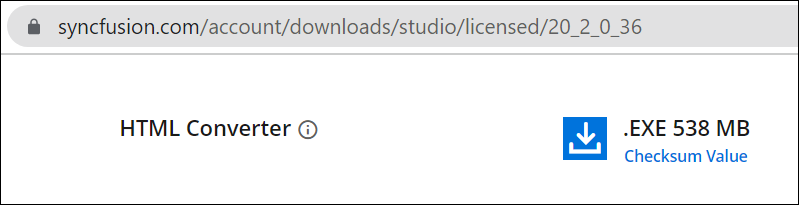
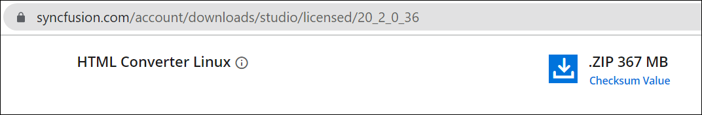
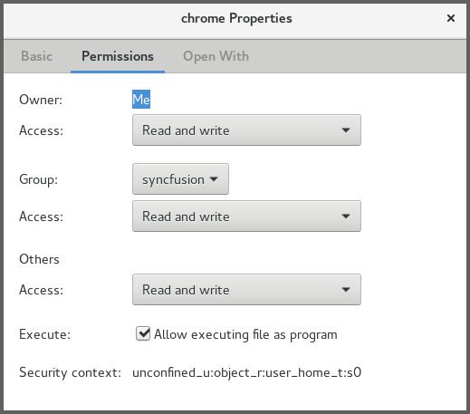
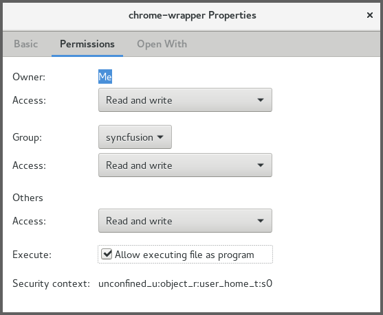

# Converting HTML to PDF

The HTML to PDF converter is a .NET library for converting webpages, SVG, MHTML, and HTML files to PDF using C#. It uses popular rendering engines such as Blink (Google Chrome) and is reliable and accurate. The result preserves all graphics, images, text, fonts, and the layout of the original HTML document or webpage.

Syncfusion HTML-to-PDF converter will work seamlessly in various platforms like Azure Cloud or web apps, Azure Functions, Amazon Web Service (AWS), Docker, WinForms, WPF, ASP.NET MVC, ASP.NET Core with Windows, Linux, and macOS.


## Key features for HTML Converter

* Converts any webpage to PDF.
* Converts any raw HTML string to PDF.
* Converts HTML form to fillable PDF form.
* Automatically creates Table of Contents.
* Automatically creates bookmark hierarchy.
* Converts only a part of the web page to PDF.
* Supports PDF header and PDF footer.
* Repeats HTML table header and footer in PDF.
* Supports HTML5, CSS3, SVG, and Web fonts.
* Converts any HTML to an image.
* Converts any SVG to image.
* Supports accessing HTML pages using both HTTP POST and GET methods.
* Supports HTTP cookies.
* Supports cookies-based form authentication.
* Thread safe.
* Supports internal and external hyperlinks.
* Sets document properties, page settings, security, viewer preferences, and more.
* Protects PDF document with password and permission.
* Compatible with .NET Framework 4.5 and above. 
* Compatible with .NET Core 2.0 and above. 

## Install HTML to PDF .NET library to your project

Include the HTML to PDF converter in your project using two approaches. 
* NuGet packages (Recommended)
* Assemblies.  


### NuGet Packages Required (Recommended)

Directly install the NuGet packages to your .NET application from [nuget.org](https://www.nuget.org/).  

N> The HTML to PDF converter library internally uses the Blink rendering engine for the conversion. The binaries will differ for Windows, Linux, Mac, and AWS. So, separate packages are provided based on OS. Include the packages based on your requirement. 

<table>
<tr>
<thead>
<th><b>Platform(s)</b></th>
<th><b>NuGet Package</b></th>
</thead>
</tr>
<tr>
<td>
(.NET Core, .NET 5, .NET 6) Windows
</td>
<td>
{{'[Syncfusion.HtmlToPdfConverter.Net.Windows.nupkg](https://www.nuget.org/packages/Syncfusion.HtmlToPdfConverter.Net.Windows/)'| markdownify }}
</td>
</tr>
<tr>
<td>
(.NET Core, .NET 5, .NET 6) Linux
</td>
<td>
{{'[Syncfusion.HtmlToPdfConverter.Net.Linux.nupkg](https://www.nuget.org/packages/Syncfusion.HtmlToPdfConverter.Net.Linux/)'| markdownify }}
</td>
</tr>
<tr>
<td>
(.NET Core, .NET 5, .NET 6) Mac
</td>
<td>
{{'[Syncfusion.HtmlToPdfConverter.Net.Mac.nupkg](https://www.nuget.org/packages/Syncfusion.HtmlToPdfConverter.Net.Mac/)'| markdownify }}
</td>
</tr>
<tr>
<td>
(.NET Core, .NET 5, .NET 6) Aws
</td>
<td>
{{'[Syncfusion.HtmlToPdfConverter.Net.Aws.nupkg](https://www.nuget.org/packages/Syncfusion.HtmlToPdfConverter.Net.Aws/)'| markdownify }}
</td>
</tr>
</table>

Use the following packages for .NET Framework targeted applications. If you are using other Syncfusion libraries or components, use the HTML to PDF converter library with the same platform packages.

<table>
<tr>
<thead>
<th><b>Platform(s)</b></th>
<th><b>NuGet Package</b></th>
</thead>
</tr>
<tr>
<td>
Windows Forms
</td>
<td>
{{'[Syncfusion.HtmlToPdfConverter.WinForms.nupkg](https://www.nuget.org/packages/Syncfusion.HtmlToPdfConverter.WinForms/)'| markdownify }}
</td>
</tr>
<tr>
<td>
WPF
</td>
<td>
{{'[Syncfusion.HtmlToPdfConverter.Wpf.nupkg](https://www.nuget.org/packages/Syncfusion.HtmlToPdfConverter.Wpf/)'| markdownify }}
</td>
</tr>
<tr>
<td>
ASP.NET
</td>
<td>
{{'[Syncfusion.HtmlToPdfConverter.AspNet.nupkg](https://www.nuget.org/packages/Syncfusion.HtmlToPdfConverter.AspNet/)'| markdownify }}
</td>
</tr>
<tr>
<td>
ASP.NET MVC
</td>
<td>
{{'[Syncfusion.HtmlToPdfConverter.AspNet.Mvc5.nupkg](https://www.nuget.org/packages/Syncfusion.HtmlToPdfConverter.AspNet.Mvc5/)'| markdownify }}
</td>
</tr>
</table>

### Assemblies Required

Get the following required assemblies by downloading the HTML converter installer. Download and install the HTML converter for [Windows](), [Linux](), and [Mac](), respectively. Please refer to the [advanced installation]() steps for more details. 

<table>
<tr>
<thead>
<th>
Platforms</th>
<th>
Assemblies
</th>
</thead>
</tr>
<tr>
<td> 
WinForms
WPF
ASP.NET
ASP.NET MVC
</td>
<td>
<ul>
<li>Syncfusion.Compression.Base.dll</li>
<li>Syncfusion.Pdf.Base.dll</li>
<li>Syncfusion.HtmlConverter.Base.dll</li>
<li>Newtonsoft.Json package (v13.0.1 or above)</li>
</ul>
</td></tr>
<tr>
<td>
.NET/.NET Core
Blazor 
</td>
<td>
<ul>
<li>Syncfusion.Compression.Portable.dll</li>
<li>Syncfusion.Pdf.Portable.dll</li>
<li>Syncfusion.HtmlConverter.Portable.dll</li>
<li>Newtonsoft.Json package (v13.0.1 or above)</li>
</ul>
</td></tr>
</table>

## Get Started with HTML to PDF conversion

### Convert HTML to PDF in C# 

Integrating HTML to PDF converter library in any .NET application is simple. Please refer to the following steps to include HTML to PDF conversion in your application. 

<b>Steps to convert HTML to PDF in .NET application</b>

Create a new .NET console application.


Install [Syncfusion.HtmlToPdfConverter.Net.Windows](https://www.nuget.org/packages/Syncfusion.HtmlToPdfConverter.Net.Windows) NuGet package as a reference to your .NET application from [NuGet.org](https://www.nuget.org/). 


Include the following namespace in your class file. 



using Syncfusion.Pdf;
using Syncfusion.HtmlConverter;



Use the following code sample to convert the URL to PDF in the program.cs.





//Initialize HTML to PDF converter.
HtmlToPdfConverter htmlConverter = new HtmlToPdfConverter();

//Convert URL to PDF.
PdfDocument document = htmlConverter.Convert("https://www.syncfusion.com");

FileStream fileStream = new FileStream("HTML-to-PDF.pdf", FileMode.CreateNew, FileAccess.ReadWrite);

//Save and close the PDF document.
document.Save(fileStream);
document.Close(true);





A complete working demo can be downloaded from [HTML-to-PDF.zip](https://www.syncfusion.com/downloads/support/directtrac/general/ze/HTML-to-PDF-Demo-1725937239). By executing the program, you will get the PDF document as follows.


### Convert HTML to PDF in Linux

HTML to PDF converter .NET library supports conversion in Linux. Refer to [this](/file-formats/pdf/convert-html-to-pdf/linux) section for more information about HTML to PDF conversion in Linux.

### Convert HTML to PDF in Docker

HTML to PDF converter .NET library supports conversion in Docker. Refer to [this](/file-formats/pdf/convert-html-to-pdf/docker) section for more information about HTML to PDF conversion in Docker. 

### Convert HTML to PDF in Mac

HTML to PDF converter .NET library supports conversion in Mac. Refer to [this](/file-formats/pdf/convert-html-to-pdf/mac) section for more information about HTML to PDF conversion in Mac. 

### Convert HTML to PDF in ASP.NET Core

HTML to PDF converter .NET library supports conversion in ASP.NET Core. Refer to [this](/file-formats/pdf/convert-html-to-pdf/aspnetcore) section for more information about HTML to PDF conversion in ASP.NET Core. 

### Convert HTML to PDF in ASP.NET MVC
HTML to PDF converter .NET library supports conversion in ASP.NET MVC. Refer to [this](/file-formats/pdf/convert-html-to-pdf/aspnetmvc) section for more information about HTML to PDF conversion in ASP.NET MVC.

### Convert HTML to PDF in Blazor
HTML to PDF converter .NET library supports conversion in Blazor. Refer to [this](/file-formats/pdf/converting-html-to-pdf/blazor) section for more information about HTML to PDF conversion in Blazor.

## Features

### URL to PDF

To convert website URL or local HTML file to PDF document, refer to the following code snippet.





//Initialize HTML to PDF converter.
HtmlToPdfConverter htmlConverter = new HtmlToPdfConverter();

//Convert URL to PDF
PdfDocument document = htmlConverter.Convert("https://www.google.com");

FileStream fileStream = new FileStream("HTML-to-PDF.pdf", FileMode.CreateNew, FileAccess.ReadWrite);

//Save and close the PDF document.
document.Save(fileStream);
document.Close(true);






'Initialize HTML to PDF converter
Dim htmlConverter As HtmlToPdfConverter = New HtmlToPdfConverter()

'Convert URL to PDF
Dim document As PdfDocument = htmlConverter.Convert("https://www.google.com")

'Save and close the PDF document 
document.Save("Output.pdf")

document.Close(True)





You can download a complete working sample from [GitHub](https://github.com/SyncfusionExamples/PDF-Examples/tree/master/HTML%20to%20PDF/Blink/Convert-website-URL-to-PDF-document).

### HTML String to PDF

The HTML to PDF converter provides support for converting HTML string to PDF. While converting HTML string to PDF, converter provides option to specify the base URL.

<b>baseURL:</b> Path of the resources (images, style sheets, scripts.,) used in the input HTML string.

For the following HTML string, the baseURL will be the path of the <font color="blue"><i>syncfusion_logo.gif</i></font> image.

For example, if the above image is in <i>“C:/Temp/ HTMLFiles/syncfusion_logo.gif”</i> location, then the baseURL will be as follows.

<b>baseURL:</b> C:/Temp/HTMLFiles/

To convert the HTML string to PDF, refer to the following code snippet. 





//Initialize HTML to PDF converter
HtmlToPdfConverter htmlConverter = new HtmlToPdfConverter();

//HTML string and Base URL 
string htmlText = "<html><body><p> Hello World</p></body></html>";

string baseUrl = @"C:/Temp/HTMLFiles/";

//Convert URL to PDF
PdfDocument document = htmlConverter.Convert(htmlText, baseUrl);

FileStream fileStream = new FileStream("HTML-to-PDF.pdf", FileMode.CreateNew, FileAccess.ReadWrite);

//Save and close the PDF document.
document.Save(fileStream);
document.Close(true);





'Initialize HTML to PDF converter
Dim htmlConverter As HtmlToPdfConverter = New HtmlToPdfConverter()

'HTML string and Base URL 
Dim htmlText As String = "<html><body><p> Hello World</p></body></html>"

Dim baseUrl As String = "C:/Temp/HTMLFiles/"

'Convert URL to PDF
Dim document As PdfDocument = htmlConverter.Convert(htmlText, baseUrl)

'Save and close the PDF document
document.Save("Output.pdf")

document.Close(True)




<html>
<body>

<p> Hello World</p>
</body>
</html>





You can download a complete working sample from [GitHub](https://github.com/SyncfusionExamples/PDF-Examples/tree/master/HTML%20to%20PDF/Blink/Convert-the-HTML-string-to-PDF-document).

### URL to Image

To convert website URL or local HTML file to Image, refer to the following code snippet.





//Initialize HTML to PDF converter
HtmlToPdfConverter htmlConverter = new HtmlToPdfConverter();

//Convert URL to Image
Image[] image = htmlConverter.ConvertToImage("https://www.google.com");

//Save and dispose the image file
image[0].Save("Output.jpg");
image[0].Dispose();





'Initialize HTML to PDF converter with Blink rendering engine
Dim htmlConverter As HtmlToPdfConverter = New HtmlToPdfConverter(HtmlRenderingEngine.Blink)

'Convert URL to Image
Dim image As Image[] = htmlConverter.ConvertToImage("https://www.google.com")

'Save and dispose the image file
image[0].Save("Output.jpg")

image[0].Dispose(True)





//Initialize HTML to PDF converter with Blink rendering engine
HtmlToPdfConverter htmlConverter = new HtmlToPdfConverter(HtmlRenderingEngine.Blink);

//Convert URL to Image
Image image = htmlConverter.ConvertToImage("https://www.google.com");

byte[] imageByte = image.ImageData;

//Save the image

File.WriteAllBytes("Output.jpg", imageByte);





You can download a complete working sample from [GitHub](https://github.com/SyncfusionExamples/PDF-Examples/tree/master/HTML%20to%20PDF/Blink/Convert-website-URL-to-image-file).

### HTML String to Image

The Blink rendering engine supports converting HTML string to Image. While converting HTML string to Image, converter provides an option to specify the base URL.

<b>baseURL:</b> Path of the resources (images, style sheets, scripts.,) used in the input HTML string.

For the following HTML string, the baseURL will be the path of the <font color="blue"><i>syncfusion_logo.gif</i></font> image.

For example, if the previous image is in <i>“C:/Temp/ HTMLFiles/syncfusion_logo.gif”</i> location then the baseURL will be as follows.

<b>baseURL:</b> C:/Temp/HTMLFiles/

To convert the HTML string to Image, refer to the following code snippet.

 



//Initialize HTML to PDF converter with Blink rendering engine
HtmlToPdfConverter htmlConverter = new HtmlToPdfConverter(HtmlRenderingEngine.Blink);

//HTML string and Base URL
string htmlText = "<html><body><p> Hello World</p></body></html>";

string baseUrl = @"C:/Temp/HTMLFiles/";

//Convert HTML string to Image
Image[] image = htmlConverter.ConvertToImage(htmlText, baseUrl);

//Save and dispose the image file
image[0].Save("Output.jpg");
image[0].Dispose();





'Initialize the HTML to PDF converter with Blink rendering engine
Dim htmlConverter As HtmlToPdfConverter = New HtmlToPdfConverter(HtmlRenderingEngine.Blink)

'HTML string and Base URL
Dim htmlText As String = "<html><body><p> Hello World</p></body></html>"

Dim baseUrl As String = "C:/Temp/HTMLFiles/"

'Convert HTML string to Image
Dim image As Image[] = htmlConverter.Convert(htmlText, baseUrl)

'Save and dispose the image file
image[0].Save("Output.jpg")
image[0].Dispose(True)





//Initialize HTML to PDF converter with Blink rendering engine
HtmlToPdfConverter htmlConverter = new HtmlToPdfConverter(HtmlRenderingEngine.Blink);

//HTML string and Base URL
string htmlText = "<html><body><p> Hello World</p></body></html>";

string baseUrl = @"C:/Temp/HTMLFiles/";

//Convert HTML string to Image
Image image = htmlConverter.ConvertToImage(htmlText, baseUrl);

byte[] imageByte = image.ImageData;

//Save the image

File.WriteAllBytes("Output.jpg", imageByte);





<html>
<body>
    
    <p> Hello World</p>
</body>
</html>





You can download a complete working sample from [GitHub](https://github.com/SyncfusionExamples/PDF-Examples/tree/master/HTML%20to%20PDF/Blink/Convert-the-HTML-string-to-image-file).

### JavaScript

The Blink HTML converter supports enabling or disabling the JavaScript while converting HTML to PDF. Refer to the following code snippet.





//Initialize the HTML to PDF converter with Blink rendering engine
HtmlToPdfConverter htmlConverter = new HtmlToPdfConverter(HtmlRenderingEngine.Blink);

BlinkConverterSettings blinkConverterSettings = new BlinkConverterSettings();

//Disable JavaScript; By default, true
blinkConverterSettings.EnableJavaScript = false;

//Assign Blink converter settings to HTML converter
htmlConverter.ConverterSettings = blinkConverterSettings;

//Convert URL to PDF
PdfDocument document = htmlConverter.Convert("https://www.google.com");

//Save and close the PDF document
document.Save("Output.pdf");

document.Close(true);





'Initialize the HTML to PDF converter with Blink rendering engine
Dim htmlConverter As HtmlToPdfConverter = New HtmlToPdfConverter(HtmlRenderingEngine.Blink)

Dim blinkConverterSettings As BlinkConverterSettings = New BlinkConverterSettings()

'Disable JavaScript; By default True
blinkConverterSettings.EnableJavaScript = False

'Assign Blink converter settings to HTML converter
htmlConverter.ConverterSettings = blinkConverterSettings

'Convert URL to PDF
Dim document As PdfDocument = htmlConverter.Convert("https://www.google.com")

'Save and close the PDF document
document.Save("Output.pdf")

document.Close(True)





//Initialize the HTML to PDF converter with Blink rendering engine
HtmlToPdfConverter htmlConverter = new HtmlToPdfConverter(HtmlRenderingEngine.Blink);

BlinkConverterSettings blinkConverterSettings = new BlinkConverterSettings();

//Disable JavaScript; By default, true
blinkConverterSettings.EnableJavaScript = false;

//Assign Blink converter settings to HTML converter
htmlConverter.ConverterSettings = blinkConverterSettings;

//Convert URL to PDF
PdfDocument document = htmlConverter.Convert("https://www.google.com");

FileStream fileStream = new FileStream("Sample.pdf", FileMode.CreateNew, FileAccess.ReadWrite);

//Save and close the PDF document 
document.Save(fileStream);
document.Close(true);





You can download a complete working sample from [GitHub](https://github.com/SyncfusionExamples/PDF-Examples/tree/master/HTML%20to%20PDF/Blink/Disable-JavaScript-when-convert-HTML-to-PDF).

### Additional delay

The Blink HTML converter provides an option to set the [AdditionalDelay](https://help.syncfusion.com/cr/file-formats/Syncfusion.HtmlConverter.BlinkConverterSettings.html#Syncfusion_HtmlConverter_BlinkConverterSettings_AdditionalDelay) property while converting HTML to PDF. Additional delay is the waiting time of the converter for loading the external resources (styles, scripts, images and more). Refer to the following code snippet.





//Initialize the HTML to PDF converter with Blink rendering engine
HtmlToPdfConverter htmlConverter = new HtmlToPdfConverter(HtmlRenderingEngine.Blink);

BlinkConverterSettings blinkConverterSettings = new BlinkConverterSettings();

// Set additional delay; units in milliseconds
blinkConverterSettings.AdditionalDelay = 3000;

//Assign Blink converter settings to HTML converter
htmlConverter.ConverterSettings = blinkConverterSettings;

//Convert URL to PDF
PdfDocument document = htmlConverter.Convert("https://www.google.com");

//Save and close the PDF document
document.Save("Output.pdf");

document.Close(true);





'Initialize the HTML to PDF converter with Blink rendering engine
Dim htmlConverter As HtmlToPdfConverter = New HtmlToPdfConverter(HtmlRenderingEngine.Blink)

Dim blinkConverterSettings As BlinkConverterSettings = New BlinkConverterSettings()

'Set additional delay; units in milliseconds
blinkConverterSettings.AdditionalDelay = 3000

'Assign Blink converter settings to HTML converter
htmlConverter.ConverterSettings = blinkConverterSettings

'Convert URL to PDF
Dim document As PdfDocument = htmlConverter.Convert("https://www.google.com")

'Save and close the PDF document
document.Save("Output.pdf")

document.Close(True)





//Initialize the HTML to PDF converter with Blink rendering engine
HtmlToPdfConverter htmlConverter = new HtmlToPdfConverter(HtmlRenderingEngine.Blink);

BlinkConverterSettings blinkConverterSettings = new BlinkConverterSettings();

// Set additional delay; units in milliseconds
blinkConverterSettings.AdditionalDelay = 3000;

//Assign Blink converter settings to HTML converter
htmlConverter.ConverterSettings = blinkConverterSettings;

//Convert URL to PDF
PdfDocument document = htmlConverter.Convert("https://www.google.com");

FileStream fileStream = new FileStream("Sample.pdf", FileMode.CreateNew, FileAccess.ReadWrite);

//Save and close the PDF document 
document.Save(fileStream);
document.Close(true);





You can download a complete working sample from [GitHub](https://github.com/SyncfusionExamples/PDF-Examples/tree/master/HTML%20to%20PDF/Blink/Set-additional-delay-while-converting-HTML-to-PDF).

### Hyperlinks

The Blink HTML converter support preserving URL links from HTML to PDF. Refer to the following code snippet.





//Initialize the HTML to PDF converter with Blink rendering engine
HtmlToPdfConverter htmlConverter = new HtmlToPdfConverter(HtmlRenderingEngine.Blink);

BlinkConverterSettings blinkConverterSettings = new BlinkConverterSettings();

//Enable hyperlinks; By default - true
blinkConverterSettings.EnableHyperLink = false;

//Assign Blink converter settings to HTML converter
htmlConverter.ConverterSettings = blinkConverterSettings;

//Convert URL to PDF
PdfDocument document = htmlConverter.Convert("https://www.google.com");

//Save and close the PDF document
document.Save("Output.pdf");

document.Close(true);





'Initialize the HTML to PDF converter with Blink rendering engine
Dim htmlConverter As HtmlToPdfConverter = NewHtmlToPdfConverter(HtmlRenderingEngine.Blink)

Dim blinkConverterSettings As BlinkConverterSettings = New BlinkConverterSettings()

'Enable hyperlinks; By default - True
blinkConverterSettings.EnableHyperLink = False

'Assign Blink converter settings to HTML converter
htmlConverter.ConverterSettings = blinkConverterSettings

'Convert URL to PDF
Dim document As PdfDocument = htmlConverter.Convert("https://www.google.com")

'Save and close the PDF document
document.Save("Output.pdf")

document.Close(True)





//Initialize the HTML to PDF converter with Blink rendering engine
HtmlToPdfConverter htmlConverter = new HtmlToPdfConverter(HtmlRenderingEngine.Blink);

BlinkConverterSettings blinkConverterSettings = new BlinkConverterSettings();

//Enable hyperlinks; By default - true
blinkConverterSettings.EnableHyperLink = false;

//Assign Blink converter settings to HTML converter
htmlConverter.ConverterSettings = blinkConverterSettings;

//Convert URL to PDF
PdfDocument document = htmlConverter.Convert("https://www.google.com");

FileStream fileStream = new FileStream("Sample.pdf", FileMode.CreateNew, FileAccess.ReadWrite);

//Save and close the PDF document 
document.Save(fileStream);
document.Close(true);





You can download a complete working sample from [GitHub](https://github.com/SyncfusionExamples/PDF-Examples/tree/master/HTML%20to%20PDF/Blink/Disable-URL-links-while-converting-HTML-to-PDF).

### Bookmarks

The Blink HTML converter provides support for creating bookmarks automatically by enabling the [EnableBookmarks](https://help.syncfusion.com/cr/file-formats/Syncfusion.HtmlConverter.BlinkConverterSettings.html#Syncfusion_HtmlConverter_BlinkConverterSettings_EnableBookmarks) property.

N> The bookmarks are added from the ```<h>``` tag, it supports from ```<h1>``` to ```<h6>```.

Refer to the following code snippet.





//Initialize the HTML to PDF converter with Blink rendering engine

HtmlToPdfConverter htmlConverter = new HtmlToPdfConverter(HtmlRenderingEngine.Blink);

BlinkConverterSettings settings = new BlinkConverterSettings();

//Set enable bookmarks

settings.EnableBookmarks = true;

//Assign Blink converter settings to HTML converter

htmlConverter.ConverterSettings = settings;

//Convert HTML to PDF

PdfDocument document = htmlConverter.Convert("input.html"); 

//Save and close the PDF document

document.Save("Output.pdf");

document.Close(true);





'Initialize the HTML to PDF converter with Blink rendering engine

Dim htmlConverter As HtmlToPdfConverter = New HtmlToPdfConverter(HtmlRenderingEngine.Blink)

Dim settings As BlinkConverterSettings = New BlinkConverterSettings()

'Set enable bookmarks

settings.EnableBookmarks = True

'Assign Blink converter settings to HTML converter

htmlConverter.ConverterSettings = settings

'Convert HTML to PDF

Dim document As PdfDocument = htmlConverter.Convert("input.html")

'Save and close the PDF document

document.Save("Output.pdf")

document.Close(True)





//Initialize the HTML to PDF converter with Blink rendering engine

HtmlToPdfConverter htmlConverter = new HtmlToPdfConverter(HtmlRenderingEngine.Blink);

BlinkConverterSettings settings = new BlinkConverterSettings();

//Set enable bookmarks

settings.EnableBookmarks = true;

//Assign Blink converter settings to HTML converter

htmlConverter.ConverterSettings = settings;

//Convert HTML to PDF

PdfDocument document = htmlConverter.Convert("input.html");

FileStream fileStream = new FileStream("Sample.pdf", FileMode.CreateNew, FileAccess.ReadWrite);

//Save and close the PDF document 
document.Save(fileStream);
document.Close(true);





<html>
<head>
<style>
body
{
text-align: left;
font-size: large;
padding-left: 5px;
}
</style>
</head>
<body>

<h1>Syncfusion</h1>

<h2>Introduction</h2>
	Syncfusion is the enterprise technology partner of choice for software development, delivering a broad range of web, mobile, and desktop controls coupled with a service-oriented approach throughout the entire application life cycle. 
<h2>Products</h2>
	<h4>WEB</h4>
		The most comprehensive suite for enterprise web development.
	<h4>Desktop</h4>
		Comprehensive suite of over 115 components including the fastest chart and grid components.
	<h4>Mobile</h4>
		Comprehensive suite of components for Xamarin.iOS, Xamarin.Android and Xamarin.Forms including the fastest chart and grid.
<h2>Consulting</h2>
	We can build web, mobile, and desktop applications better and faster than anyone since we build on top of our award-winning suite of components and frameworks, saving you time and money.
<h2>Company</h2>
	<h4>About us</h4>
		Syncfusion has established itself as the trusted partner worldwide for use in mission-critical applications. Founded in 2001 and headquartered in Research Triangle Park, N.C., Syncfusion has more than 12,000 customers, including large financial institutions, Fortune 100 companies, and global IT consultancies.
	<h4>contact us</h4>
		Morrisville Office
		Company Headquarters
		2501 Aerial Center Parkway
		Suite 200
		Morrisville, NC 27560
		USA
</body>
</html>





You can download a complete working sample from [GitHub](https://github.com/SyncfusionExamples/PDF-Examples/tree/master/HTML%20to%20PDF/Blink/Creating-bookmarks-while-converting-HTML-to-PDF).

### Table of contents

The Blink HTML converter provides support for creating a table of contents automatically by using the [EnableToc](https://help.syncfusion.com/cr/file-formats/Syncfusion.HtmlConverter.BlinkConverterSettings.html#Syncfusion_HtmlConverter_BlinkConverterSettings_Toc) property.

N> TOC are added from the ```<h>``` tag, it supports from ```<h1>``` to ```<h6>```.

Refer to the following code snippet.





//Initialize the HTML to PDF converter with Blink rendering engine

HtmlToPdfConverter htmlConverter = new HtmlToPdfConverter(HtmlRenderingEngine.Blink);

BlinkConverterSettings settings = new BlinkConverterSettings();

//Set enable table of contents

settings.EnableToc = true;

//Assign Blink converter settings to HTML converter

htmlConverter.ConverterSettings = settings;

//Convert HTML to PDF

PdfDocument document = htmlConverter.Convert("input.html");

//Save and close the PDF document

document.Save("Output.pdf");

document.Close(true);





'Initialize the HTML to PDF converter with Blink rendering engine

Dim htmlConverter As HtmlToPdfConverter = New HtmlToPdfConverter(HtmlRenderingEngine.Blink)

Dim settings As BlinkConverterSettings = New BlinkConverterSettings()

'Set enable table of contents

settings.EnableToc = True

'Assign Blink converter settings to HTML converter

htmlConverter.ConverterSettings = settings

'Convert HTML to PDF

Dim document As PdfDocument = htmlConverter.Convert("input.html")

'Save and close the PDF document

document.Save("Output.pdf")

document.Close(True)





//Initialize the HTML to PDF converter with Blink rendering engine

HtmlToPdfConverter htmlConverter = new HtmlToPdfConverter(HtmlRenderingEngine.Blink);

BlinkConverterSettings settings = new BlinkConverterSettings();

//Set enable table of contents

settings.EnableToc = true;

//Assign Blink converter settings to HTML converter

htmlConverter.ConverterSettings = settings;

//Convert HTML to PDF

PdfDocument document = htmlConverter.Convert("input.html");

FileStream fileStream = new FileStream("Sample.pdf", FileMode.CreateNew, FileAccess.ReadWrite);

//Save and close the PDF document 
document.Save(fileStream);
document.Close(true);





<html>
<head>
<style>
body
{
text-align: left;
font-size: large;
padding-left: 5px;
}
</style>
</head>
<body>

<h1>Syncfusion</h1>

<h2>Introduction</h2>
	Syncfusion is the enterprise technology partner of choice for software development, delivering a broad range of web, mobile, and desktop controls coupled with a service-oriented approach throughout the entire application life cycle. 
<h2>Products</h2>
	<h4>WEB</h4>
		The most comprehensive suite for enterprise web development.
	<h4>Desktop</h4>
		Comprehensive suite of over 115 components including the fastest chart and grid components.
	<h4>Mobile</h4>
		Comprehensive suite of components for Xamarin.iOS, Xamarin.Android and Xamarin.Forms including the fastest chart and grid.
<h2>Consulting</h2>
	We can build web, mobile, and desktop applications better and faster than anyone since we build on top of our award-winning suite of components and frameworks, saving you time and money.
<h2>Company</h2>
	<h4>About us</h4>
		Syncfusion has established itself as the trusted partner worldwide for use in mission-critical applications. Founded in 2001 and headquartered in Research Triangle Park, N.C., Syncfusion has more than 12,000 customers, including large financial institutions, Fortune 100 companies, and global IT consultancies.
	<h4>contact us</h4>
		Morrisville Office
		Company Headquarters
		2501 Aerial Center Parkway
		Suite 200
		Morrisville, NC 27560
		USA
</body>
</html>





You can download a complete working sample from [GitHub](https://github.com/SyncfusionExamples/PDF-Examples/tree/master/HTML%20to%20PDF/Blink/Create-TOC-while-converting-HTML-to-PDF).

#### Table of contents with custom style

The Blink HTML converter provides support for customizing the table of contents style. Each header tag style can be customized by using [HtmlToPdfTocStyle](https://help.syncfusion.com/cr/file-formats/Syncfusion.Pdf.HtmlToPdf.HtmlToPdfTocStyle.html). 

Refer to the following code snippet.





//Initialize the HTML to PDF converter with Blink rendering engine

HtmlToPdfConverter htmlConverter = new HtmlToPdfConverter(HtmlRenderingEngine.Blink);

BlinkConverterSettings settings = new BlinkConverterSettings();

//Set enable table of contents

settings.EnableToc = true;

//Set the style for level 1(H1) items in table of contents

HtmlToPdfTocStyle tocstyleH1 = new HtmlToPdfTocStyle();

tocstyleH1.Font = new PdfStandardFont(PdfFontFamily.TimesRoman, 10, PdfFontStyle.Regular);

tocstyleH1.BackgroundColor = new PdfSolidBrush(new PdfColor(Color.FromArgb(68, 114, 196)));

tocstyleH1.ForeColor = PdfBrushes.White;

tocstyleH1.Padding = new PdfPaddings(5, 5, 3, 3);

settings.Toc.SetItemStyle(1, tocstyleH1);

//Assign Blink converter settings to HTML converter

htmlConverter.ConverterSettings = settings;

//Convert HTML to PDF

PdfDocument document = htmlConverter.Convert("input.html");

//Save and close the PDF document

document.Save("Output.pdf");

document.Close(true);





'Initialize the HTML to PDF converter with Blink rendering engine

Dim htmlConverter As HtmlToPdfConverter = New HtmlToPdfConverter(HtmlRenderingEngine.Blink)

Dim settings As BlinkConverterSettings = New BlinkConverterSettings()

'Set enable table of contents

settings.EnableToc = True

'Set the style for level 1(H1) items in table of contents

Dim tocstyleH1 As New HtmlToPdfTocStyle()

tocstyleH1.Font = New PdfStandardFont(PdfFontFamily.TimesRoman, 10, PdfFontStyle.Regular)

tocstyleH1.BackgroundColor = New PdfSolidBrush(New PdfColor(Color.FromArgb(68, 114, 196)))

tocstyleH1.ForeColor = PdfBrushes.White

tocstyleH1.Padding = New PdfPaddings(5, 5, 3, 3)

settings.Toc.SetItemStyle(1, tocstyleH1)

'Assign Blink converter settings to HTML converter

htmlConverter.ConverterSettings = settings

'Convert HTML to PDF

Dim document As PdfDocument = htmlConverter.Convert("input.html")

'Save and close the PDF document

document.Save("Output.pdf")

document.Close(True)





//Initialize the HTML to PDF converter with Blink rendering engine

HtmlToPdfConverter htmlConverter = new HtmlToPdfConverter(HtmlRenderingEngine.Blink);

BlinkConverterSettings settings = new BlinkConverterSettings();

//Set enable table of contents

settings.EnableToc = true;

//Set the style for level 1(H1) items in table of contents

HtmlToPdfTocStyle tocstyleH1 = new HtmlToPdfTocStyle();

tocstyleH1.Font = new PdfStandardFont(PdfFontFamily.TimesRoman, 10, PdfFontStyle.Regular);

tocstyleH1.BackgroundColor = new PdfSolidBrush(new PdfColor(Color.FromArgb(68, 114, 196)));

tocstyleH1.ForeColor = PdfBrushes.White;

tocstyleH1.Padding = new PdfPaddings(5, 5, 3, 3);

settings.Toc.SetItemStyle(1, tocstyleH1);

//Assign Blink converter settings to HTML converter

htmlConverter.ConverterSettings = settings;

//Convert HTML to PDF

PdfDocument document = htmlConverter.Convert("input.html");

FileStream fileStream = new FileStream("Sample.pdf", FileMode.CreateNew, FileAccess.ReadWrite);

//Save and close the PDF document 
document.Save(fileStream);
document.Close(true);





<html>
<head>
<style>
body
{
text-align: left;
font-size: large;
padding-left: 5px;
}
</style>
</head>
<body>

<h1>Syncfusion</h1>

<h2>Introduction</h2>
	Syncfusion is the enterprise technology partner of choice for software development, delivering a broad range of web, mobile, and desktop controls coupled with a service-oriented approach throughout the entire application life cycle. 
<h2>Products</h2>
	<h4>WEB</h4>
		The most comprehensive suite for enterprise web development.
	<h4>Desktop</h4>
		Comprehensive suite of over 115 components including the fastest chart and grid components.
	<h4>Mobile</h4>
		Comprehensive suite of components for Xamarin.iOS, Xamarin.Android and Xamarin.Forms including the fastest chart and grid.
<h2>Consulting</h2>
	We can build web, mobile, and desktop applications better and faster than anyone since we build on top of our award-winning suite of components and frameworks, saving you time and money.
<h2>Company</h2>
	<h4>About us</h4>
		Syncfusion has established itself as the trusted partner worldwide for use in mission-critical applications. Founded in 2001 and headquartered in Research Triangle Park, N.C., Syncfusion has more than 12,000 customers, including large financial institutions, Fortune 100 companies, and global IT consultancies.
	<h4>contact us</h4>
		Morrisville Office
		Company Headquarters
		2501 Aerial Center Parkway
		Suite 200
		Morrisville, NC 27560
		USA
</body>
</html>





You can download a complete working sample from [GitHub](https://github.com/SyncfusionExamples/PDF-Examples/tree/master/HTML%20to%20PDF/Blink/Create-custom-style-TOC-when-converting-HTML-to-PDF).

### Media Type

The Blink HTML Converter allows selection of media type while converting HTML to PDF. Blink rendering engine supports <b>Screen</b> and <b>Print</b> media types. Refer to the following code snippet to select Print [MediaType](https://help.syncfusion.com/cr/file-formats/Syncfusion.HtmlConverter.BlinkConverterSettings.html#Syncfusion_HtmlConverter_BlinkConverterSettings_MediaType).





//Initialize the HTML to PDF converter with Blink rendering engine
HtmlToPdfConverter htmlConverter = new HtmlToPdfConverter(HtmlRenderingEngine.Blink);

BlinkConverterSettings blinkConverterSettings = new BlinkConverterSettings();

//Set print media type
blinkConverterSettings.MediaType = MediaType.Print;

//Assign Blink converter settings to HTML converter
htmlConverter.ConverterSettings = blinkConverterSettings;

//Convert URL to PDF
PdfDocument document = htmlConverter.Convert("https://www.google.com");

//Save and close the PDF document
document.Save("Output.pdf");

document.Close(true);





'Initialize the HTML to PDF converter with Blink rendering engine
Dim htmlConverter As HtmlToPdfConverter = New HtmlToPdfConverter(HtmlRenderingEngine.Blink)

Dim blinkConverterSettings As BlinkConverterSettings = New BlinkConverterSettings()

'Set print media type
blinkConverterSettings.MediaType = MediaType.Print

'Assign Blink converter settings to HTML converter
htmlConverter.ConverterSettings = blinkConverterSettings

'Convert URL to PDF
Dim document As PdfDocument = htmlConverter.Convert("https://www.google.com")

'Save and close the PDF document
document.Save("Output.pdf")

document.Close(True)





//Initialize the HTML to PDF converter with Blink rendering engine
HtmlToPdfConverter htmlConverter = new HtmlToPdfConverter(HtmlRenderingEngine.Blink);

BlinkConverterSettings blinkConverterSettings = new BlinkConverterSettings();

//Set print media type
blinkConverterSettings.MediaType = MediaType.Print;

//Assign Blink converter settings to HTML converter
htmlConverter.ConverterSettings = blinkConverterSettings;

//Convert URL to PDF
PdfDocument document = htmlConverter.Convert("https://www.google.com");

FileStream fileStream = new FileStream("Sample.pdf", FileMode.CreateNew, FileAccess.ReadWrite);

//Save and close the PDF document 
document.Save(fileStream);
document.Close(true);





You can download a complete working sample from [GitHub](https://github.com/SyncfusionExamples/PDF-Examples/tree/master/HTML%20to%20PDF/Blink/Selection-of-media-type-while-converting-HTML-to-PDF).

N> Print [MediaType](https://help.syncfusion.com/cr/file-formats/Syncfusion.HtmlConverter.BlinkConverterSettings.html#Syncfusion_HtmlConverter_BlinkConverterSettings_MediaType) MediaType enables the repeat html table header and footer support on every PDF page. 

### HTML Form to PDF Form

Blink rendering engine provides support for converting HTML forms to PDF fillable forms automatically by using the [EnableForm](https://help.syncfusion.com/cr/file-formats/Syncfusion.HtmlConverter.BlinkConverterSettings.html#Syncfusion_HtmlConverter_BlinkConverterSettings_EnableForm) property. To convert HTML form to PDF form, refer to the following code snippet.





//Initialize the HTML to PDF converter with Blink rendering engine

HtmlToPdfConverter htmlConverter = new HtmlToPdfConverter(HtmlRenderingEngine.Blink);

BlinkConverterSettings settings = new BlinkConverterSettings();

//Set enable form

settings.EnableForm = true;

//Assign Blink converter settings to HTML converter

htmlConverter.ConverterSettings = settings;

//Convert URL to PDF

PdfDocument document = htmlConverter.Convert("https://www.syncfusion.com"); 

//Save and close the PDF document

document.Save("Output.pdf");

document.Close(true);





'Initialize the HTML to PDF converter with Blink rendering engine

Dim htmlConverter As HtmlToPdfConverter = New HtmlToPdfConverter(HtmlRenderingEngine.Blink)

Dim settings As BlinkConverterSettings = New BlinkConverterSettings()

'Set enable form

settings.EnableForm = True

'Assign Blink converter settings to HTML converter

htmlConverter.ConverterSettings = settings

'Convert URL to PDF

Dim document As PdfDocument = htmlConverter.Convert("https://www.syncfusion.com")

'Save and close the PDF document

document.Save("Output.pdf")

document.Close(True)





//Initialize the HTML to PDF converter with Blink rendering engine

HtmlToPdfConverter htmlConverter = new HtmlToPdfConverter(HtmlRenderingEngine.Blink);

BlinkConverterSettings settings = new BlinkConverterSettings();

//Set enable form

settings.EnableForm = true;

//Assign Blink converter settings to HTML converter

htmlConverter.ConverterSettings = settings;

//Convert URL to PDF

PdfDocument document = htmlConverter.Convert("https://www.syncfusion.com"); 

FileStream fileStream = new FileStream("Sample.pdf", FileMode.CreateNew, FileAccess.ReadWrite);

//Save and close the PDF document 
document.Save(fileStream);
document.Close(true);





You can download a complete working sample from [GitHub](https://github.com/SyncfusionExamples/PDF-Examples/tree/master/HTML%20to%20PDF/Blink/Convert-HTML-form-to-PDF-fillable-form).

### Windows authentication

The webpage you want to convert may protected with windows authentication. Blink rendering engine provides support for converting the Windows Authenticated webpage to PDF document by providing the username and password. Refer to the following code snippet.





// Initialize the HTML to PDF converter with Blink rendering engine
HtmlToPdfConverter htmlConverter = new HtmlToPdfConverter(HtmlRenderingEngine.Blink);

BlinkConverterSettings blinkConverterSettings = new BlinkConverterSettings();

blinkConverterSettings.Username = "username";

blinkConverterSettings.Password = "password";

//Assign Blink converter settings to HTML converter
htmlConverter.ConverterSettings = blinkConverterSettings;

//Convert URL to PDF
PdfDocument document = htmlConverter.Convert("https://www.example.com");

//Save and close the PDF document
document.Save("Output.pdf");

document.Close(true);





'Initialize the HTML to PDF converter with Blink rendering engine
Dim htmlConverter As HtmlToPdfConverter = New HtmlToPdfConverter(HtmlRenderingEngine.Blink)

Dim blinkConverterSettings As BlinkConverterSettings = New BlinkConverterSettings()

blinkConverterSettings.Username = "username"

blinkConverterSettings.Password = "password"

'Assign Blink converter settings to HTML converter
htmlConverter.ConverterSettings = blinkConverterSettings

'Convert URL to PDF
Dim document As PdfDocument = htmlConverter.Convert("https://www.example.com")

'Save and close the PDF document
document.Save("Output.pdf")

document.Close(True)





// Initialize the HTML to PDF converter with Blink rendering engine
HtmlToPdfConverter htmlConverter = new HtmlToPdfConverter(HtmlRenderingEngine.Blink);

BlinkConverterSettings blinkConverterSettings = new BlinkConverterSettings();

blinkConverterSettings.Username = "username";

blinkConverterSettings.Password = "password";

//Assign Blink converter settings to HTML converter
htmlConverter.ConverterSettings = blinkConverterSettings;

//Convert URL to PDF
PdfDocument document = htmlConverter.Convert("https://www.example.com");

FileStream fileStream = new FileStream("Sample.pdf", FileMode.CreateNew, FileAccess.ReadWrite);

//Save and close the PDF document 
document.Save(fileStream);
document.Close(true);





You can download a complete working sample from [GitHub](https://github.com/SyncfusionExamples/PDF-Examples/tree/master/HTML%20to%20PDF/Blink/Convert-windows-authenticated-webpage-to-PDF-document).

### Form authentication

The Blink HTML converter provides support for form authentication by using cookies. The cookies are send to web server for form authentication when the HTML page is requested. Each cookie is represented by a name and value. Refer to the following code snippet.





// Initialize the HTML to PDF converter with Blink rendering engine
HtmlToPdfConverter htmlConverter = new HtmlToPdfConverter(HtmlRenderingEngine.Blink);

BlinkConverterSettings blinkConverterSettings = new BlinkConverterSettings();

// Add cookies as name and value pair

blinkConverterSettings.Cookies.Add("CookieName1", " CookieValue1");

blinkConverterSettings.Cookies.Add("CookieName2", " CookieValue2");


//Assign Blink converter settings to HTML converter
htmlConverter.ConverterSettings = blinkConverterSettings;

//Convert URL to PDF
PdfDocument document = htmlConverter.Convert("https://www.example.com");

//Save and close the PDF document
document.Save("Output.pdf");

document.Close(true);





'Initialize the HTML to PDF converter with Blink rendering engine
Dim htmlConverter As HtmlToPdfConverter = New HtmlToPdfConverter(HtmlRenderingEngine.Blink)

Dim blinkConverterSettings As BlinkConverterSettings = New BlinkConverterSettings()

'Add cookies

blinkConverterSettings.Cookies.Add("Name1", "Value1")

blinkConverterSettings.Cookies.Add("Name2", "Value2")

'Assign Blink converter settings to HTML converter
htmlConverter.ConverterSettings = blinkConverterSettings

'Convert URL to PDF
Dim document As PdfDocument = htmlConverter.Convert("https://www.example.com")

'Save and close the PDF document
document.Save("Output.pdf")

document.Close(True)





// Initialize the HTML to PDF converter with Blink rendering engine
HtmlToPdfConverter htmlConverter = new HtmlToPdfConverter(HtmlRenderingEngine.Blink);

BlinkConverterSettings blinkConverterSettings = new BlinkConverterSettings();

// Add cookies as name and value pair

blinkConverterSettings.Cookies.Add("CookieName1", " CookieValue1");

blinkConverterSettings.Cookies.Add("CookieName2", " CookieValue2");


//Assign Blink converter settings to HTML converter
htmlConverter.ConverterSettings = blinkConverterSettings;

//Convert URL to PDF
PdfDocument document = htmlConverter.Convert("https://www.example.com");

FileStream fileStream = new FileStream("Sample.pdf", FileMode.CreateNew, FileAccess.ReadWrite);

//Save and close the PDF document 
document.Save(fileStream);
document.Close(true);





You can download a complete working sample from [GitHub](https://github.com/SyncfusionExamples/PDF-Examples/tree/master/HTML%20to%20PDF/Blink/Convert-form-authenticated-webpage-to-PDF-document).

### Token-based authentication

The Blink HTML converter supports token-based authentication by using the HTTP request headers. The token values will be send to web server when the HTML page is requested. Refer to the following code snippet.





//Initialize HTML to PDF converter 

HtmlToPdfConverter htmlConverter = new HtmlToPdfConverter(HtmlRenderingEngine.Blink);

BlinkConverterSettings settings = new BlinkConverterSettings();

//Add a bearer token to login a webpage

settings.HttpRequestHeaders.Add("Authorization", "bearer <<token value here>>");

//Assign Blink settings to HTML converter

htmlConverter.ConverterSettings = settings;

//Convert URL to PDF

PdfDocument document = htmlConverter.Convert("https://www.example.com");

//Save and close the PDF document 

document.Save("Output.pdf");

document.Close(true);





'Initialize HTML to PDF converter 

Dim htmlConverter As HtmlToPdfConverter = New HtmlToPdfConverter(HtmlRenderingEngine.Blink)

Dim settings As BlinkConverterSettings = New BlinkConverterSettings

'Add a bearer token to login a webpage

settings.HttpRequestHeaders.Add("Authorization", "bearer <<token value here>>")

'Assign Blink settings to HTML converter

htmlConverter.ConverterSettings = settings

Dim document As PdfDocument = htmlConverter.Convert("https://www.example.com")

'Save and close the PDF document 

document.Save("Output.pdf")

document.Close(true)





//Initialize HTML to PDF converter 

HtmlToPdfConverter htmlConverter = new HtmlToPdfConverter(HtmlRenderingEngine.Blink);

BlinkConverterSettings settings = new BlinkConverterSettings();

//Add a bearer token to login a webpage

settings.HttpRequestHeaders.Add("Authorization", "bearer <<token value here>>");

//Assign Blink settings to HTML converter

htmlConverter.ConverterSettings = settings;

//Convert URL to PDF

PdfDocument document = htmlConverter.Convert("https://www.example.com");

FileStream fileStream = new FileStream("Sample.pdf", FileMode.CreateNew, FileAccess.ReadWrite);

//Save and close the PDF document 
document.Save(fileStream);
document.Close(true);





You can download a complete working sample from [GitHub](https://github.com/SyncfusionExamples/PDF-Examples/tree/master/HTML%20to%20PDF/Blink/Convert-token-based-authenticated-webpage-to-PDF).

### Offline conversion

The Blink HTML converter supports converting HTML to PDF in offline mode. While converting HTML to PDF in offline mode, the converter does not access the resources from the internet. This may increase the performance in slow internet connection.

N> If an online URL is converted in offline mode, the converter will generate empty PDF as it will not try to load any resource from online.

Refer to the following code snippet.





//Initialize the HTML to PDF converter with Blink rendering engine
HtmlToPdfConverter htmlConverter = new HtmlToPdfConverter(HtmlRenderingEngine.Blink);

BlinkConverterSettings blinkConverterSettings = new BlinkConverterSettings();

//Enable offline mode
blinkConverterSettings.EnableOfflineMode = true;

//Assign Blink converter settings to HTML converter
htmlConverter.ConverterSettings = blinkConverterSettings;

//Convert URL to PDF
PdfDocument document = htmlConverter.Convert("https://www.google.com");

//Save and close the PDF document
document.Save("Output.pdf");

document.Close(true);





'Initialize the HTML to PDF converter with Blink rendering engine
Dim htmlConverter As HtmlToPdfConverter = New HtmlToPdfConverter(HtmlRenderingEngine.Blink)

Dim blinkConverterSettings As BlinkConverterSettings = New BlinkConverterSettings()

'Enable offline mode
blinkConverterSettings.EnableOfflineMode = True

'Assign Blink converter settings to HTML converter
htmlConverter.ConverterSettings = blinkConverterSettings

'Convert URL to PDF
Dim document As PdfDocument = htmlConverter.Convert("https://www.google.com")

'Save and close the PDF document
document.Save("Output.pdf")

document.Close(True)





//Initialize the HTML to PDF converter with Blink rendering engine
HtmlToPdfConverter htmlConverter = new HtmlToPdfConverter(HtmlRenderingEngine.Blink);

BlinkConverterSettings blinkConverterSettings = new BlinkConverterSettings();

//Enable offline mode
blinkConverterSettings.EnableOfflineMode = true;

//Assign Blink converter settings to HTML converter
htmlConverter.ConverterSettings = blinkConverterSettings;

//Convert URL to PDF
PdfDocument document = htmlConverter.Convert("https://www.google.com");

FileStream fileStream = new FileStream("Sample.pdf", FileMode.CreateNew, FileAccess.ReadWrite);

//Save and close the PDF document 
document.Save(fileStream);
document.Close(true);





You can download a complete working sample from [GitHub](https://github.com/SyncfusionExamples/PDF-Examples/tree/master/HTML%20to%20PDF/Blink/Convert-HTML-to-PDF-in-offline-mode).

### HTTP GET and POST

The Blink HTML converter supports transmitting the parameter to the webpage. There are two methods to access a webpage. By default, Blink uses GET method. By using HTTP GET method, the parameters can be passed in the query string. In POST method, the parameters can be passed by using the [HttpPostFields](https://help.syncfusion.com/cr/file-formats/Syncfusion.HtmlConverter.BlinkConverterSettings.html#Syncfusion_HtmlConverter_BlinkConverterSettings_HttpPostFields) property.
Refer to the following code snippet to access a webpage using HTTP POST.





//Initialize the HTML to PDF converter with Blink rendering engine
HtmlToPdfConverter htmlConverter = new HtmlToPdfConverter(HtmlRenderingEngine.Blink);

BlinkConverterSettings settings = new BlinkConverterSettings();

//Add HTTP post parameters to HttpPostFields
settings.HttpPostFields.Add("firstName", "Andrew");
settings.HttpPostFields.Add("lastName", "Fuller");

//Assign Blink converter settings to HTML converter
htmlConverter.ConverterSettings = settings;

//Convert URL to PDF
PdfDocument document = htmlConverter.Convert("https://www.example.com");

//Save and close the PDF document
document.Save("Output.pdf");

document.Close(true);





'Initialize the HTML to PDF converter with Blink rendering engine
Dim htmlConverter As HtmlToPdfConverter = New HtmlToPdfConverter(HtmlRenderingEngine.Blink)

Dim settings As BlinkConverterSettings = New BlinkConverterSettings()

'Add HTTP Post parameters to HttpPostFields 
settings.HttpPostFields.Add("firstName", "Andrew")
settings.HttpPostFields.Add("lastName", "Fuller")

'Assign Blink converter settings to HTML converter
htmlConverter.ConverterSettings = settings

'Convert URL to PDF
Dim document As PdfDocument = htmlConverter.Convert("https://www.example.com")

'Save and close the PDF document
document.Save("Output.pdf")

document.Close(True)





//Initialize the HTML to PDF converter with Blink rendering engine
HtmlToPdfConverter htmlConverter = new HtmlToPdfConverter(HtmlRenderingEngine.Blink);

BlinkConverterSettings settings = new BlinkConverterSettings();

//Add HTTP post parameters to HttpPostFields
settings.HttpPostFields.Add("firstName", "Andrew");
settings.HttpPostFields.Add("lastName", "Fuller");

//Assign Blink converter settings to HTML converter
htmlConverter.ConverterSettings = settings;

//Convert URL to PDF
PdfDocument document = htmlConverter.Convert("https://www.example.com");

FileStream fileStream = new FileStream("Sample.pdf", FileMode.CreateNew, FileAccess.ReadWrite);

//Save and close the PDF document 
document.Save(fileStream);
document.Close(true);





You can download a complete working sample from [GitHub](https://github.com/SyncfusionExamples/PDF-Examples/tree/master/HTML%20to%20PDF/Blink/Access-a-webpage-using-HTTP-POST).

Use the following code snippet to access a webpage using HTTP GET.





//Initialize the HTML to PDF converter with Blink rendering engine
HtmlToPdfConverter htmlConverter = new HtmlToPdfConverter(HtmlRenderingEngine.Blink);

string url = "https://www.example.com";

Uri getMethodUri = new Uri(url);
string httpGetData = getMethodUri.Query.Length > 0 ? "&" : "?" + String.Format("{0}={1}", "firstName", "Andrew");

httpGetData += String.Format("&{0}={1}", "lastName", "Fuller");

string urlToConvert = url + httpGetData;

//Convert URL to PDF
PdfDocument document = htmlConverter.Convert(urlToConvert);

//Save and close the PDF document
document.Save("Output.pdf");

document.Close(true);





'Initialize the HTML to PDF converter with Blink rendering engine
Dim htmlConverter As HtmlToPdfConverter = New HtmlToPdfConverter(HtmlRenderingEngine.Blink)

Dim url As String = "https://www.example.com"

Dim getMethodUri As New Uri(url)

Dim httpGetData As String = If(getMethodUri.Query.Length > 0, "&", "?" + [String].Format("{0}={1}", "firstName", "Andrew"))

httpGetData += [String].Format("&{0}={1}", "lastName", "Fuller")

Dim urlToConvert As String = url & httpGetData

'Convert URL to PDF
Dim document As PdfDocument = htmlConverter.Convert(urlToConvert)

'Save and close the PDF document
document.Save("Output.pdf")

document.Close(True)





//Initialize the HTML to PDF converter with Blink rendering engine
HtmlToPdfConverter htmlConverter = new HtmlToPdfConverter(HtmlRenderingEngine.Blink);

string url = "https://www.example.com";

Uri getMethodUri = new Uri(url);
string httpGetData = getMethodUri.Query.Length > 0 ? "&" : "?" + String.Format("{0}={1}", "firstName", "Andrew");

httpGetData += String.Format("&{0}={1}", "lastName", "Fuller");

string urlToConvert = url + httpGetData;

//Convert URL to PDF
PdfDocument document = htmlConverter.Convert(urlToConvert);

FileStream fileStream = new FileStream("Sample.pdf", FileMode.CreateNew, FileAccess.ReadWrite);

//Save and close the PDF document 
document.Save(fileStream);
document.Close(true);





You can download a complete working sample from [GitHub](https://github.com/SyncfusionExamples/PDF-Examples/tree/master/HTML%20to%20PDF/Blink/Access-a-webpage-using-HTTP-GET).

### System proxy

By default, the Blink rendering engine use system proxy settings for converting HTML to PDF. If proxy server is configured in the system, then the rendering engine automatically use the same settings for the conversion. Follow the below steps to set the system proxy settings:

1. Control Panel > Network and Internet > Internet Options.
2. From Internet properties window, open LAN settings under connections tab.
3. Then, set proxy server address and port in LAN settings window.

<b>Please refer below screenshots:</b>
 


### Manual proxy

You can specify the manual proxy settings for the conversion using the ProxySettings property. Refer to the following code snippet to configure the manual proxy settings for the conversion.





//Initialize the HTML to PDF converter with Blink rendering engine

HtmlToPdfConverter htmlConverter = new HtmlToPdfConverter(HtmlRenderingEngine.Blink);

BlinkConverterSettings settings = new BlinkConverterSettings();

//Set manual proxy settings

settings.ProxySettings.HostName = "127.0.0.1";

settings.ProxySettings.PortNumber = 8080;

settings.ProxySettings.Type = BlinkProxyType.HTTP;

//Assign Blink converter settings to HTML converter

htmlConverter.ConverterSettings = settings;

//Convert URL to PDF

PdfDocument document = htmlConverter.Convert("https://www.google.com");

//Save and close the PDF document

document.Save("Output.pdf");

document.Close(true);





'Initialize the HTML to PDF converter with Blink rendering engine

Dim htmlConverter As HtmlToPdfConverter = New HtmlToPdfConverter(HtmlRenderingEngine.Blink)

Dim settings As BlinkConverterSettings = New BlinkConverterSettings()

'Set manual proxy settings

settings.ProxySettings.HostName = "127.0.0.1"

settings.ProxySettings.PortNumber = 8080

settings.ProxySettings.Type = BlinkProxyType.HTTP

'Assign Blink converter settings to HTML converter

htmlConverter.ConverterSettings = settings

'Convert URL to PDF

Dim document As PdfDocument = htmlConverter.Convert("https://www.google.com")

'Save and close the PDF document

document.Save("Output.pdf")

document.Close(True)







//Initialize the HTML to PDF converter with Blink rendering engine

HtmlToPdfConverter htmlConverter = new HtmlToPdfConverter(HtmlRenderingEngine.Blink);

BlinkConverterSettings settings = new BlinkConverterSettings();

//Set manual proxy settings

settings.ProxySettings.HostName = "127.0.0.1";

settings.ProxySettings.PortNumber = 8080;

settings.ProxySettings.Type = BlinkProxyType.HTTP;

//Assign Blink converter settings to HTML converter

htmlConverter.ConverterSettings = settings;

//Convert URL to PDF

PdfDocument document = htmlConverter.Convert("https://www.google.com");

FileStream fileStream = new FileStream("Sample.pdf", FileMode.CreateNew, FileAccess.ReadWrite);

//Save and close the PDF document 
document.Save(fileStream);
document.Close(true);



### Viewport

Adjusting the HTML content size in PDF is possible by using the [ViewPortSize](https://help.syncfusion.com/cr/file-formats/Syncfusion.HtmlConverter.BlinkConverterSettings.html#Syncfusion_HtmlConverter_BlinkConverterSettings_ViewPortSize) property of Blink HTML converter. 
Refer to the following code snippet to adjust Blink viewport.





//Initialize the HTML to PDF converter with Blink rendering engine
HtmlToPdfConverter htmlConverter = new HtmlToPdfConverter(HtmlRenderingEngine.Blink);

BlinkConverterSettings blinkConverterSettings = new BlinkConverterSettings();

//Set Blink viewport size
blinkConverterSettings.ViewPortSize = new Size(800, 0);

//Assign Blink converter settings to HTML converter
htmlConverter.ConverterSettings = blinkConverterSettings;

//Convert URL to PDF
PdfDocument document = htmlConverter.Convert("https://www.google.com");

//Save and close the PDF document
document.Save("Output.pdf");

document.Close(true);





'Initialize the HTML to PDF converter with Blink rendering engine
Dim htmlConverter As HtmlToPdfConverter = New HtmlToPdfConverter(HtmlRenderingEngine.Blink)

Dim blinkConverterSettings As BlinkConverterSettings = New BlinkConverterSettings()

'Set Blink viewport size
blinkConverterSettings.ViewPortSize = New Size(800, 0)

'Assign Blink converter settings to HTML converter
htmlConverter.ConverterSettings = blinkConverterSettings

'Convert URL to PDF
Dim document As PdfDocument = htmlConverter.Convert("https://www.google.com")

'Save and close the PDF document
document.Save("Output.pdf")

document.Close(True)





//Initialize the HTML to PDF converter with Blink rendering engine
HtmlToPdfConverter htmlConverter = new HtmlToPdfConverter(HtmlRenderingEngine.Blink);

BlinkConverterSettings blinkConverterSettings = new BlinkConverterSettings();

//Set Blink viewport size
blinkConverterSettings.ViewPortSize = new Size(800, 0);

//Assign Blink converter settings to HTML converter
htmlConverter.ConverterSettings = blinkConverterSettings;

//Convert URL to PDF
PdfDocument document = htmlConverter.Convert("https://www.google.com");

FileStream fileStream = new FileStream("Sample.pdf", FileMode.CreateNew, FileAccess.ReadWrite);

//Save and close the PDF document 
document.Save(fileStream);
document.Close(true);





You can download a complete working sample from [GitHub](https://github.com/SyncfusionExamples/PDF-Examples/tree/master/HTML%20to%20PDF/Blink/Adjusting-the-HTML-content-size-in-PDF-document).

### Partial webpage to PDF

The Blink rendering engine provides support for converting only the part of an HTML document like a table, div, or image elements from the URL/HTML string. You can convert the particular HTML element by specifying the HTML element ID, refer to the following code snippet.





//Initialize the HTML to PDF converter with Blink rendering engine

HtmlToPdfConverter htmlConverter = new HtmlToPdfConverter(HtmlRenderingEngine.Blink);

//Convert Partial webpage to PDF

PdfDocument document = htmlConverter.ConvertPartialHtml("input.html", "pic");

//Save and close the PDF document

document.Save("Output.pdf");

document.Close(true);





'Initialize the HTML to PDF converter with Blink rendering engine

Dim htmlConverter As HtmlToPdfConverter = New HtmlToPdfConverter(HtmlRenderingEngine.Blink)

'Convert Partial webpage to PDF

Dim document As PdfDocument = htmlConverter. ConvertPartialHtml("input.html", "pic")

'Save and close the PDF document

document.Save("Output.pdf")

document.Close(True)





//Initialize the HTML to PDF converter with Blink rendering engine

HtmlToPdfConverter htmlConverter = new HtmlToPdfConverter(HtmlRenderingEngine.Blink);

//Convert Partial webpage to PDF

PdfDocument document = htmlConverter.ConvertPartialHtml("input.html", "pic");

FileStream fileStream = new FileStream("Sample.pdf", FileMode.CreateNew, FileAccess.ReadWrite);

//Save and close the PDF document 
document.Save(fileStream);
document.Close(true);





<html>
<head>
</head>
<body>
Hello world
	<div id="pic">
		<br>
		This is a Syncfusion Logo
	</div>
	<div>
		Hello world
	</div>
</body>
</html>





You can download a complete working sample from [GitHub](https://github.com/SyncfusionExamples/PDF-Examples/tree/master/HTML%20to%20PDF/Blink/Convert-partial-webpage-to-PDF-document).

### HTML to single PDF page

By using this option, you can render the whole HTML content into a single PDF page. The PDF page size is limited to 14400 points. There are two options to enable this feature since this is disabled by default.

	1. FitWidth
	2. FitHeight

<b>Fit width option:</b> Using this option, the HTML converter adjusts the PDF page height based on the HTML content height. PDF page width remains constant for this option. 
<b>Fit height option:</b> Using this option, the HTML converter scale the HTML content and PDF page width to render the whole HTML content within the height. PDF page height remains constant for this option. 

Refer to the following code snippet.





//Initialize the HTML to PDF converter with Blink rendering engine
HtmlToPdfConverter htmlConverter = new HtmlToPdfConverter(HtmlRenderingEngine.Blink);

BlinkConverterSettings settings = new BlinkConverterSettings();

//Set singlePageLayout option to render the whole HTML content in a single PDF page
settings.SinglePageLayout = SinglePageLayout.FitWidth;

//Assign Blink converter settings to HTML converter
htmlConverter.ConverterSettings = settings;

//Convert URL to PDF
PdfDocument document = htmlConverter.Convert("https://www.google.com");

//Save and close the PDF document
document.Save("Output.pdf");

document.Close(true);





'Initialize the HTML to PDF converter with Blink rendering engine
Dim htmlConverter As HtmlToPdfConverter = New HtmlToPdfConverter(HtmlRenderingEngine.Blink)

Dim settings As BlinkConverterSettings = New BlinkConverterSettings()

'Set singlePageLayout option to render the whole HTML content in a single PDF page
settings.SinglePageLayout = SinglePageLayout.FitWidth

'Assign Blink converter settings to HTML converter
htmlConverter.ConverterSettings = settings

'Convert URL to PDF
Dim document As PdfDocument = htmlConverter.Convert("https://www.google.com")

'Save and close the PDF document
document.Save("Output.pdf")

document.Close(True)





//Initialize the HTML to PDF converter with Blink rendering engine
HtmlToPdfConverter htmlConverter = new HtmlToPdfConverter(HtmlRenderingEngine.Blink);

BlinkConverterSettings settings = new BlinkConverterSettings();

//Set singlePageLayout option to render the whole HTML content in a single PDF page
settings.SinglePageLayout = SinglePageLayout.FitWidth;

//Assign Blink converter settings to HTML converter
htmlConverter.ConverterSettings = settings;

//Convert URL to PDF
PdfDocument document = htmlConverter.Convert("https://www.google.com");

FileStream fileStream = new FileStream("Sample.pdf", FileMode.CreateNew, FileAccess.ReadWrite);

//Save and close the PDF document 
document.Save(fileStream);
document.Close(true);





### Layout Result

Getting height of the HTML content in PDF document is possible by using the ```PdfLayoutResult```. Using this result, you can add contents after converting HTML to PDF. Refer to the following code snippet.





//Initialize the HTML to PDF converter with Blink rendering engine
HtmlToPdfConverter htmlConverter = new HtmlToPdfConverter(HtmlRenderingEngine.Blink);

PdfLayoutResult layoutResult = null;

//Convert URL to PDF
PdfDocument document = htmlConverter.Convert("https://www.syncfusion.com", out layoutResult); 

//Draw the text at the end of HTML content
PdfFont font = new PdfStandardFont(PdfFontFamily.Helvetica, 11);

document.Pages[document.Pages.Count - 1].Graphics.DrawString("End of HTML content", font, PdfBrushes.Red, new PointF(0, layoutResult.Bounds.Bottom));

//Save and close the PDF document
document.Save("Output.pdf");

document.Close(true);





'Initialize the HTML to PDF converter with Blink rendering engine
Dim htmlConverter As HtmlToPdfConverter = New HtmlToPdfConverter(HtmlRenderingEngine.Blink)

Dim layoutResult As PdfLayoutResult = Nothing

'Convert URL to PDF
Dim document As PdfDocument = htmlConverter.Convert("https://www.syncfusion.com", layoutResult)

'Draw the text at the end of HTML content
Dim font As PdfFont = New PdfStandardFont(PdfFontFamily.Helvetica, 11)

document.Pages((document.Pages.Count - 1)).Graphics.DrawString("End of HTML content", font, PdfBrushes.Red, New PointF(0, layoutResult.Bounds.Bottom))

'Save and close the PDF document
document.Save("Output.pdf")

document.Close(True)





//Initialize the HTML to PDF converter with Blink rendering engine
HtmlToPdfConverter htmlConverter = new HtmlToPdfConverter(HtmlRenderingEngine.Blink);

PdfLayoutResult layoutResult = null;

//Convert URL to PDF
PdfDocument document = htmlConverter.Convert("https://www.syncfusion.com", out layoutResult); 

//Draw the text at the end of HTML content
PdfFont font = new PdfStandardFont(PdfFontFamily.Helvetica, 11);

document.Pages[document.Pages.Count - 1].Graphics.DrawString("End of HTML content", font, PdfBrushes.Red, new PointF(0, layoutResult.Bounds.Bottom));

FileStream fileStream = new FileStream("Sample.pdf", FileMode.CreateNew, FileAccess.ReadWrite);

//Save and close the PDF document 
document.Save(fileStream);
document.Close(true);





### Windows status

Windows status can be used instead of additional delay. In additional delay, the amount of time required for loading the resources is unpredictable. This behavior can be avoided by using windows status.

N> This feature requires changes in the HTML file.

N> If windows status does not match in code and HTML, then the converter will meet with deadlock.

Refer to the following code snippet.





// Initialize the HTML to PDF converter with Blink rendering engine
HtmlToPdfConverter htmlConverter = new HtmlToPdfConverter(HtmlRenderingEngine.Blink);

BlinkConverterSettings blinkConverterSettings = new BlinkConverterSettings();

//Set windows status
blinkConverterSettings.WindowStatus = "completed";

//Assign Blink converter settings to HTML converter
htmlConverter.ConverterSettings = blinkConverterSettings;

//Convert URL to PDF
PdfDocument document = htmlConverter.Convert("input.html");

//Save and close the PDF document
document.Save("Output.pdf");

document.Close(true);





'Initialize HTML to PDF converter with Blink rendering engine
Dim htmlConverter As HtmlToPdfConverter = New HtmlToPdfConverter(HtmlRenderingEngine.Blink)

Dim blinkConverterSettings As BlinkConverterSettings = New BlinkConverterSettings()

'Set windows status.
blinkConverterSettings.WindowStatus = "completed"

'Assign Blink converter settings to HTML converter
htmlConverter.ConverterSettings = blinkConverterSettings

'Convert URL to PDF
Dim document As PdfDocument = htmlConverter.Convert("input.html")

'Save and close the PDF document
document.Save("Output.pdf")

document.Close(True)





// Initialize the HTML to PDF converter with Blink rendering engine
HtmlToPdfConverter htmlConverter = new HtmlToPdfConverter(HtmlRenderingEngine.Blink);

BlinkConverterSettings blinkConverterSettings = new BlinkConverterSettings();

// Set windows status.
blinkConverterSettings.WindowStatus = "completed";

//Assign Blink converter settings to HTML converter
htmlConverter.ConverterSettings = blinkConverterSettings;

//Convert URL to PDF
PdfDocument document = htmlConverter.Convert("input.html");

FileStream fileStream = new FileStream("Sample.pdf", FileMode.CreateNew, FileAccess.ReadWrite);

//Save and close the PDF document 
document.Save(fileStream);
document.Close(true);





<html>
<head>
</head>
<body>
    <div id="message">
        Wait for 2 Seconds
    </div>
    <script type="text/javascript">
        setTimeout(function () {
            document.getElementById("message").innerHTML = "Hello World!!";
            window.status = "completed";
        }, 2000);
    </script>
</body>
</html>





You can download a complete working sample from [GitHub](https://github.com/SyncfusionExamples/PDF-Examples/tree/master/HTML%20to%20PDF/Blink/Set-windows-status-while-converting-HTML-to-PDF).

### Temporary path

The Blink HTML converter launching Chrome browser to perform conversion. While launching Chrome browser, temporary files are created in a temporary folder.

By default, HTML converter takes system temporary path (C:\Users\<<username>>\AppData\Local\Temp or C:\Windows\Temp) to perform the conversion.

The temporary path can be changed by using the [TempPath](https://help.syncfusion.com/cr/file-formats/Syncfusion.HtmlConverter.BlinkConverterSettings.html#Syncfusion_HtmlConverter_BlinkConverterSettings_TempPath) property of [BlinkConverterSettings](https://help.syncfusion.com/cr/file-formats/Syncfusion.HtmlConverter.BlinkConverterSettings.html). If this property is set, the converter uses the provided path to perform the conversion. Refer to the following code snippet.





//Initialize the HTML to PDF converter with Blink rendering engine
HtmlToPdfConverter htmlConverter = new HtmlToPdfConverter(HtmlRenderingEngine.Blink);

BlinkConverterSettings blinkConverterSettings = new BlinkConverterSettings();

//Set Temporary Path to generate temporary files
blinkConverterSettings.TempPath = @"C:/HtmlConversion/Temp/";

//Assign Blink converter settings to HTML converter
htmlConverter.ConverterSettings = blinkConverterSettings;

//Convert URL to PDF
PdfDocument document = htmlConverter.Convert("https://www.google.com");

//Save and close the PDF document
document.Save("Output.pdf");

document.Close(true);





'Initialize the HTML to PDF converter with Blink rendering engine
Dim htmlConverter As HtmlToPdfConverter = New HtmlToPdfConverter(HtmlRenderingEngine.Blink)

Dim blinkConverterSettings As BlinkConverterSettings = New BlinkConverterSettings()

'Set Temporary Path to generate temporary files
blinkConverterSettings.TempPath = "C:/HtmlConversion/Temp/"

'Assign Blink converter settings to HTML converter
htmlConverter.ConverterSettings = blinkConverterSettings

'Convert URL to PDF
Dim document As PdfDocument = htmlConverter.Convert("https://www.google.com")

'Save and close the PDF document
document.Save("Output.pdf")

document.Close(True)





//Initialize the HTML to PDF converter with Blink rendering engine
HtmlToPdfConverter htmlConverter = new HtmlToPdfConverter(HtmlRenderingEngine.Blink);

BlinkConverterSettings blinkConverterSettings = new BlinkConverterSettings();

//Set Temporary Path to generate temporary files
blinkConverterSettings.TempPath = @"C:/HtmlConversion/Temp/";

//Assign Blink converter settings to HTML converter
htmlConverter.ConverterSettings = blinkConverterSettings;

//Convert URL to PDF
PdfDocument document = htmlConverter.Convert("https://www.google.com");

FileStream fileStream = new FileStream("Sample.pdf", FileMode.CreateNew, FileAccess.ReadWrite);

//Save and close the PDF document 
document.Save(fileStream);
document.Close(true);





You can download a complete working sample from [GitHub](https://github.com/SyncfusionExamples/PDF-Examples/tree/master/HTML%20to%20PDF/Blink/Set-temporary-path-while-converting-HTML-to-PDF).

## Advanced Installation

You can download and install the HTML to PDF converter for Windows, Linux and Mac platforms. 

[https://www.syncfusion.com/account/downloads](https://www.syncfusion.com/account/downloads )

### Windows

Get the required assemblies and demos for converting HTML to PDF by installing the HTML converter installer for windows. 



### Linux

Get the required assemblies and demos for converting HTML to PDF by installing the HTML converter installer for Linux. 




### Mac

Get the required assemblies and demos for converting HTML to PDF by installing the HTML converter installer for Mac. 

![[HTML to PDF converter for Mac download in add-on section]](Convert-HTML-To-PDF/htmlconversion_images/machtmlconverteraddon.png)

## Troubleshooting and FAQ

<table>
<th style="font-size:14px">Exception</th>
<th style="font-size:14px">BlinkBinaries are missing</th>
<tr>
<th style="font-size:14px">Reason
</th>
<td>When BlinkBinaries are not available in the <i>BlinkPath </i> mentioned location.
</td>
</tr>
<tr>
<th style="font-size:14px">Solution</th>
<td>
Set the path of the BlinkBinaries folder to the BlinkPath property of BlinkConverterSettings.
<br/><br/>
(Or)
<br/><br/>
Place the BlinkBinaries folder in bin folder of the project. 
<br/><br/>
The BlinkBinaries will be available in the HTMLConverter installed location <span style="color:gray;font-size:14px"><i>($SystemDrive\Program Files (x86)\Syncfusion\HTMLConverter\xx.x.x.xx\BlinkBinaries)</i> </span>
<br><br/>
The BlinkBinaries also available in NuGet package installed location if you are using Blink HTML converter from NuGet packages. 

</td>
</tr>

<tr>
<th style="font-size:14px">Mapping BlinkBinaries in Web Application</th>
<td>


//To refer BlinkBinaries from project location
settings.BlinkPath = Server.MapPath("BlinkBinaries");

//or

// To refer BlinkBinaries from bin folder of the Project
settings.BlinkPath = Server.MapPath("~/bin/BlinkBinaries");



</td>
</tr>
</table>

<table>
<th style="font-size:14px">Exception
</th>
<th style="font-size:14px">BlinkBinaries access is denied in server.
</th>

<tr>
<th style="font-size:14px">Reason
</th>
<td>If the BlinkBinaries folder does not have elevated permission for the respective user, then the Blink HTML converter may throw this exception.
</td>
</tr>

<tr>
<th style="font-size:14px">Solution
</th>
<td>You can add read/write/execute permission to for the BlinkBinaries folder for the respective user group.
</td>
</tr>
</table>

<table>

<th style="font-size:14px">Exception
</th>
<th style="font-size:14px">Blink rendering engine only supported from .NET Framework 4.5.
</th>

<tr>
<th style="font-size:14px">Reason
</th>
<td>HTML conversion using blink is only supported from .NET framework 4.5 or above. 
</td>
</tr>

<tr>
<th style="font-size:14px">Solution
</th>
<td>The application should target .NET Framework 4.5 or above to convert the HTML using the Blink rendering engine. 
</td>
</tr>

</table>

<table>
<th style="font-size:14px">Exception
</th>
<th style="font-size:14px">Failed to convert Webpage Exception
</th>

<tr>
<th style="font-size:14px">Reason
</th>
<td>Missing or mismatch of <a href="https://www.nuget.org/packages/Newtonsoft.Json/6.0.8">Newtonsoft.Json</a> package in the project.
</td>
</tr>
<tr>
<th style="font-size:14px">Solution
</th>
<td>For converting HTML to PDF in Blink, you need to refer to the Newtonsoft.Json assembly or NuGet package with version 6.0.8 in the application, otherwise conversion will get failed.
</td>
</tr>

<tr>
<th style="font-size:14px">Reason
</th>
<td>The exception may occur if the Newtonsoft.Json assembly or NuGet package version is above 6.0.8.
</td>
</tr>
<tr>
<th style="font-size:14px">Solution
</th>
<td>The Newtonsoft.Json package version is above 6.0.8, then include the following assembly binding redirection in the app.config/web.config file.
<br><br/>


<runtime>
    <assemblyBinding xmlns="urn:schemas-microsoft-com:asm.v1">
      <dependentAssembly>
        <assemblyIdentity name="Newtonsoft.Json" publicKeyToken="30ad4fe6b2a6aeed" culture="neutral" />
        <bindingRedirect oldVersion="0.0.0.0-8.0.0.0" newVersion="8.0.0.0" />
      </dependentAssembly>
    </assemblyBinding>
</runtime>


</td>
</tr>

<tr>
<th style="font-size:14px">Reason
</th>
<td>If the temporary folder does not have elevated permission for the respective user, then the Blink HTML converter may throw this exception.
</td>
</tr>
<tr>
<th style="font-size:14px">Solution
</th>
<td>The Blink HTML converter has support for setting the temporary path. Using the <i>TempPath</i> property, you can set any folder path that has read/write/execute permission. Then, the converter uses this path for creating temporary files. Refer to the following code snippet to set temp folder.
<br><br/>


BlinkConverterSettings settings = new BlinkConverterSettings();
settings.TempPath = "D://MyProject//bin";


</td>
</tr>

<tr>
<th style="font-size:14px">Reason
</th>
<td>The exception may occur in Windows 7/Windows server 2008 environment due to limitation of <i>ClientWebSocket</i> implementation.
</td>
</tr>
<tr>
<th style="font-size:14px">Solution
</th>
<td>To overcome the exception in Windows 7/Windows server 2008 environment, add the <a href="https://www.nuget.org/packages/System.Buffers/">System.Buffers.4.5.0</a> NuGet package in the sample for conversion. 
</td>
</tr>

<tr>
<th style="font-size:14px">Reason
</th>
<td>The exception may occur in Linux CentOS/Docker environment due to the chrome browser unable to launch from sandbox mode in CentOS.
</td>
</tr>
<tr>
<th style="font-size:14px">Solution
</th>
<td>To overcome the exception in Linux CentOS/Docker environment, provide the execute permission for chrome and chrome-wrapper file inside the BlinkBinaries folder.
<br/>
<b>Refer to the following screenshot:</b>
<br/>

<br/>

<br/>
Also, please add the below command line arguments in our converter setting,
<br/>
<table>
<tr>
<td>


//Set command line arguments to run without sandbox.
blinkConverterSettings.CommandLineArguments.Add("--no-sandbox");
blinkConverterSettings.CommandLineArguments.Add("--disable-setuid-sandbox");


</td>
</tr>
</table>
<br>
</td>
</tr>

<tr>
<th style="font-size:14px">Reason
</th>
<td>Sometimes this exception occurs for only particular URL
</td>
</tr>
<tr>
<th style="font-size:14px">Solution
</th>
<td>Please contact Syncfusion <a href="https://www.syncfusion.com/support/directtrac/incidents/newincident">support</a> with input HTML, code snippet, and environment details (OS, culture settings, bit version etc.,).
</td>
</tr>

</table>

<table>
<th style="font-size:14px">Issue
</th>
<th style="font-size:14px">Blink converter may create PDF with blank pages.
</th>

<tr>
<th style="font-size:14px">Reason
</th>
<td>When the webpage (HTML) is not available or accessible.
</td>
</tr>

<tr>
<th style="font-size:14px">Solution
</th>
<td>Please check the internet connection and the HTML page is available in the mentioned location.
<br><br/>
Check the HTML file or URL is rendered properly in Chrome browser’s print preview. 
</td>
</tr>
</table>

<table>
<th style="font-size:14px">Issue
</th>
<th style="font-size:14px">Images or other contents in the HTML are missing in the resultant PDF document.
</th>

<tr>
<th style="font-size:14px">Reason
</th>
<td>The issue may be due to the slow internet connection or due to the behavior that the conversion completed before the page is loaded completely.
</td>
</tr>
<tr>
<th style="font-size:14px">Solution
</th>
<td>To overcome this issue, add suitable delay for the conversion using the [AdditionalDelay](https://help.syncfusion.com/cr/file-formats/Syncfusion.HtmlConverter.BlinkConverterSettings.html#Syncfusion_HtmlConverter_BlinkConverterSettings_AdditionalDelay) property of the HTMLConverter. 
<br><br/>


BlinkConverterSettings settings = new BlinkConverterSettings();
settings.AdditionalDelay = 2000;


</td>
</tr>

<tr>
<th style="font-size:14px">Reason
</th>
<td>While converting HTML string to PDF, the resources may be missed due to the invalid Base URL.
</td>
</tr>
<tr>
<th style="font-size:14px">Solution
</th>
<td>Overcome this issue by passing the valid base URL (path of the resources) along with the HTML string.
</td>
</tr>

</table>

<table>
<th style="font-size:14px">Issue
</th>
<th style="font-size:14px">Blink conversion failed in Azure app service (Windows).
<i>“The process was terminated due to an unhandled exception”</i>
</th>

<tr>
<th style="font-size:14px">Reason
</th>
<td>Blink rendering engine uses GDI calls for viewing and rendering the webpages. But Azure app service blocks GDI calls in Azure website environment. As azure website does not have the elevated permission and enough rights, so we could not launch the Chrome headless browser in Azure app service (Azure website and Azure function).
</td>
</tr>

<tr>
<th style="font-size:14px">Solution
</th>
<td>You can convert HTML to PDF using the Blink rendering engine in Azure cloud service (which has the elevated permission and rights to access the GDI calls). 
Refer to this <a href="https://www.syncfusion.com/kb/10258/how-to-convert-html-to-pdf-in-azure-using-blink">link</a> for more information. 
</td>
</tr>
</table>

<table>
	<tr>
		<th style="font-size:14px" colspan="2">HTML conversion support in Azure</th>
	</tr>
	<tr>
		<th style="font-size:14px">Azure App Service (Linux)</th>
		<td>Yes</td>
	</tr>
	<tr>
		<th style="font-size:14px">Azure Functions (Linux)</th>
		<td>Yes</td>
	</tr>
	<tr>
		<th style="font-size:14px">Azure Cloud Service</th>
		<td>Yes</td>
	</tr>
		<tr>
		<th style="font-size:14px">Azure App Service with Linux docker</th>
		<td>Yes</td>
	</tr>
</table>


## Steps to disable WebKit warning while performing HTML to PDF

By default, the PDF document generated with the WebKit rendering engine comes with the following warning message.


Please refer to the below code snippet to use the DisableWebKitWarning API to remove the default WebKit warning message from the PDF document.





//Initialize HTML to PDF converter
HtmlToPdfConverter htmlConverter = new HtmlToPdfConverter(HtmlRenderingEngine.WebKit);

//Initialize the WebKit converter settings
WebKitConverterSettings settings = new WebKitConverterSettings();

//Disable WebKit warning message
settings.DisableWebKitWarning = true;

//Assign WebKit settings to HTML converter
htmlConverter.ConverterSettings = settings;

//Convert URL to PDF
PdfDocument document = htmlConverter.Convert("https://www.google.com");

FileStream fileStream = new FileStream("Sample.pdf", FileMode.CreateNew, FileAccess.ReadWrite);

//Save and close the PDF document 
document.Save(fileStream);

document.Close(true);




'Initialize the HTML to PDF converter 
Dim htmlConverter As New HtmlToPdfConverter(HtmlRenderingEngine.WebKit)

Dim settings As New WebKitConverterSettings()

'Disable Default WebKit Warning Message
settings.DisableWebKitWarning = true

'Assign WebKit settings to HTML converter
htmlConverter.ConverterSettings = settings

'Convert URL to PDF
Dim document As PdfDocument = htmlConverter.Convert("https://www.google.com")

'Save and close the PDF document 
document.Save("Output.pdf")

document.Close(True)




//Currently, IE rendering engine does not support conversion in .NET Core platform




N>Please try our [Blink](https://help.syncfusion.com/file-formats/pdf/convert-html-to-pdf/blink)engine for best quality and accuracy in HTML to PDF conversion.

## Steps to disable IE warning while performing HTML To PDF using the IE rendering engine

By default, the PDF document generated with the IE rendering engine comes with the following warning message.


Please refer to the below code snippet to use the DisableIEWarning API to remove the default IE warning from the PDF document.





//Initialize the HTML to PDF converter 
 HtmlToPdfConverter htmlConverter = new HtmlToPdfConverter(HtmlRenderingEngine.IE);

IEConverterSettings settings = new IEConverterSettings();

//Disable Default IE warning message.
settings.DisableIEWarning = true;
            
//Assign IE settings to HTML converter
htmlConverter.ConverterSettings = settings;

//Convert URL to PDF
PdfDocument document = htmlConverter.Convert("https://www.google.com");

//Save and close the PDF document 
document.Save("Output.pdf");

document.Close(true);





'Initialize the HTML to PDF converter 
Dim htmlConverter As New HtmlToPdfConverter(HtmlRenderingEngine.IE)

Dim settings As New IEConverterSettings()

'Disable Default IE Warning Message
settings.DisableIEWarning = true

'Assign IE settings to HTML converter
htmlConverter.ConverterSettings = settings

'Convert URL to PDF
Dim document As PdfDocument = htmlConverter.Convert("https://www.google.com")

'Save and close the PDF document 
document.Save("Output.pdf")

document.Close(True)





//Currently, IE rendering engine does not support conversion in .NET Core platform




N>Please try our [Blink](https://help.syncfusion.com/file-formats/pdf/convert-html-to-pdf) engine to improve the quality and accuracy of the HTML to PDF conversion.
