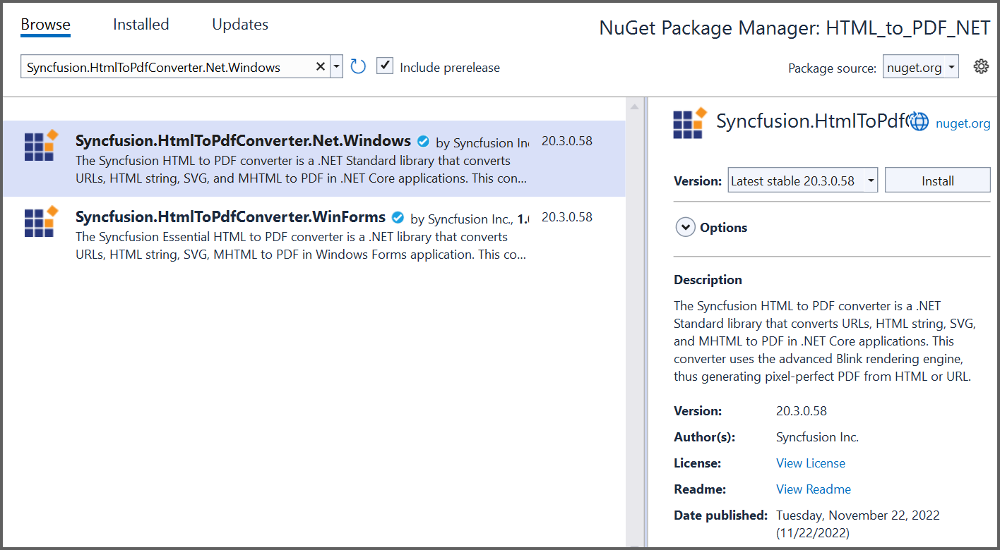

# Converting HTML to PDF

The HTML to PDF converter is a .NET library for converting webpages, SVG, MHTML, and HTML files to PDF using C#. It uses popular rendering engines such as Blink (Google Chrome) and is reliable and accurate. The result preserves all graphics, images, text, fonts, and the layout of the original HTML document or webpage.

Syncfusion HTML-to-PDF converter will work seamlessly in various platforms like Azure Cloud or web apps, Azure Functions, Amazon Web Service (AWS), Docker, WinForms, WPF, ASP.NET MVC, ASP.NET Core with Windows, Linux, and macOS.

## Key features for HTML Converter

* Converts any [webpage to PDF](https://help.syncfusion.com/file-formats/pdf/convert-html-to-pdf/features#url-to-pdf).
* Converts any raw [HTML string to PDF](https://help.syncfusion.com/file-formats/pdf/convert-html-to-pdf/features#html-string-to-pdf).
* Converts [HTML form to fillable PDF form](https://help.syncfusion.com/file-formats/pdf/convert-html-to-pdf/features#html-form-to-pdf-form).
* Automatically creates [Table of Contents](https://help.syncfusion.com/file-formats/pdf/convert-html-to-pdf/features#table-of-contents).
* Automatically creates [bookmark hierarchy](https://help.syncfusion.com/file-formats/pdf/convert-html-to-pdf/features#bookmarks).
* Converts only a [part of the web page to PDF](https://help.syncfusion.com/file-formats/pdf/convert-html-to-pdf/features#partial-webpage-to-pdf).
* Supports PDF header and PDF footer.
* Repeats HTML table header and footer in PDF.
* Supports HTML5, CSS3, SVG, and Web fonts.
* Converts any [HTML to an image](https://help.syncfusion.com/file-formats/pdf/convert-html-to-pdf/features#url-to-image).
* Converts any [SVG to image](https://help.syncfusion.com/file-formats/pdf/convert-html-to-pdf/features#url-to-image).
* Supports accessing HTML pages using both [HTTP POST and GET](https://help.syncfusion.com/file-formats/pdf/convert-html-to-pdf/features#http-get-and-post) methods.
* Supports [HTTP cookies](https://help.syncfusion.com/file-formats/pdf/convert-html-to-pdf/features#form-authentication).
* Supports [cookies-based form authentication](https://help.syncfusion.com/file-formats/pdf/convert-html-to-pdf/features#form-authentication).
* Thread safe.
* Supports internal and external [hyperlinks](https://help.syncfusion.com/file-formats/pdf/convert-html-to-pdf/features#hyperlinks).
* Sets document properties, page settings, security, viewer preferences, and more.
* Protects PDF document with password and permission.
* Compatible with .NET Framework 4.5 and above. 
* Compatible with .NET Core 2.0 and above. 

## Install HTML to PDF .NET library to your project

Include the HTML to PDF converter in your project using two approaches. 
* NuGet packages (Recommended)
* Assemblies.  

### NuGet Packages Required (Recommended)

Directly install the NuGet packages to your .NET application from [nuget.org](https://www.nuget.org/).  

N> The HTML to PDF converter library internally uses the Blink rendering engine for the conversion. The binaries will differ for Windows, Linux, Mac, and AWS. So, separate packages are provided based on OS. Include the packages based on your requirement. 

<table>
<tr>
<thead>
<th><b>Platform(s)</b></th>
<th><b>NuGet Package</b></th>
</thead>
</tr>
<tr>
<td>
(.NET Core, .NET 5, .NET 6) Windows
</td>
<td>
{{'[Syncfusion.HtmlToPdfConverter.Net.Windows.nupkg](https://www.nuget.org/packages/Syncfusion.HtmlToPdfConverter.Net.Windows/)'| markdownify }}
</td>
</tr>
<tr>
<td>
(.NET Core, .NET 5, .NET 6) Linux
</td>
<td>
{{'[Syncfusion.HtmlToPdfConverter.Net.Linux.nupkg](https://www.nuget.org/packages/Syncfusion.HtmlToPdfConverter.Net.Linux/)'| markdownify }}
</td>
</tr>
<tr>
<td>
(.NET Core, .NET 5, .NET 6) Mac
</td>
<td>
{{'[Syncfusion.HtmlToPdfConverter.Net.Mac.nupkg](https://www.nuget.org/packages/Syncfusion.HtmlToPdfConverter.Net.Mac/)'| markdownify }}
</td>
</tr>
<tr>
<td>
(.NET Core, .NET 5, .NET 6) Aws
</td>
<td>
{{'[Syncfusion.HtmlToPdfConverter.Net.Aws.nupkg](https://www.nuget.org/packages/Syncfusion.HtmlToPdfConverter.Net.Aws/)'| markdownify }}
</td>
</tr>
</table>

Use the following packages for .NET Framework targeted applications. If you are using other Syncfusion libraries or components, use the HTML to PDF converter library with the same platform packages.

<table>
<tr>
<thead>
<th><b>Platform(s)</b></th>
<th><b>NuGet Package</b></th>
</thead>
</tr>
<tr>
<td>
Windows Forms
</td>
<td>
{{'[Syncfusion.HtmlToPdfConverter.WinForms.nupkg](https://www.nuget.org/packages/Syncfusion.HtmlToPdfConverter.WinForms/)'| markdownify }}
</td>
</tr>
<tr>
<td>
WPF
</td>
<td>
{{'[Syncfusion.HtmlToPdfConverter.Wpf.nupkg](https://www.nuget.org/packages/Syncfusion.HtmlToPdfConverter.Wpf/)'| markdownify }}
</td>
</tr>
<tr>
<td>
ASP.NET
</td>
<td>
{{'[Syncfusion.HtmlToPdfConverter.AspNet.nupkg](https://www.nuget.org/packages/Syncfusion.HtmlToPdfConverter.AspNet/)'| markdownify }}
</td>
</tr>
<tr>
<td>
ASP.NET MVC
</td>
<td>
{{'[Syncfusion.HtmlToPdfConverter.AspNet.Mvc5.nupkg](https://www.nuget.org/packages/Syncfusion.HtmlToPdfConverter.AspNet.Mvc5/)'| markdownify }}
</td>
</tr>
</table>

### Assemblies Required

Get the following required assemblies by downloading the HTML converter installer. Download and install the HTML converter for [Windows](https://help.syncfusion.com/file-formats/pdf/convert-html-to-pdf/advanced-installation#windows), [Linux](https://help.syncfusion.com/file-formats/pdf/convert-html-to-pdf/advanced-installation#linux), and [Mac](https://help.syncfusion.com/file-formats/pdf/convert-html-to-pdf/advanced-installation#mac), respectively. Please refer to the [advanced installation](/file-formats/pdf/convert-html-to-pdf/advanced-installation) steps for more details. 

<table>
<tr>
<thead>
<th>
Platforms</th>
<th>
Assemblies
</th>
</thead>
</tr>
<tr>
<td> 
WinForms
WPF
ASP.NET
ASP.NET MVC
</td>
<td>
<ul>
<li>Syncfusion.Compression.Base.dll</li>
<li>Syncfusion.Pdf.Base.dll</li>
<li>Syncfusion.HtmlConverter.Base.dll</li>
<li>Newtonsoft.Json package (v13.0.1 or above)</li>
</ul>
</td></tr>
<tr>
<td>
.NET/.NET Core
Blazor 
</td>
<td>
<ul>
<li>Syncfusion.Compression.Portable.dll</li>
<li>Syncfusion.Pdf.Portable.dll</li>
<li>Syncfusion.HtmlConverter.Portable.dll</li>
<li>Newtonsoft.Json package (v13.0.1 or above)</li>
</ul>
</td></tr>
</table>

## Get Started with HTML to PDF conversion

### Convert HTML to PDF in C# 

Integrating HTML to PDF converter library in any .NET application is simple. Please refer to the following steps to include HTML to PDF conversion in your application. 

<b>Steps to convert HTML to PDF in .NET application</b>

Step 1: Create a new .NET console application.

Step 2: Install [Syncfusion.HtmlToPdfConverter.Net.Windows](https://www.nuget.org/packages/Syncfusion.HtmlToPdfConverter.Net.Windows) NuGet package as a reference to your .NET application from [NuGet.org](https://www.nuget.org/). 

Step 3: Include the following namespace in your class file. 



using Syncfusion.Pdf;
using Syncfusion.HtmlConverter;



Step 4: Use the following code sample to convert the URL to PDF in the program.cs.





//Initialize HTML to PDF converter.
HtmlToPdfConverter htmlConverter = new HtmlToPdfConverter();
BlinkConverterSettings blinkConverterSettings = new BlinkConverterSettings();
//Set Blink viewport size.
blinkConverterSettings.ViewPortSize = new Syncfusion.Drawing.Size(1280, 0);
//Assign Blink converter settings to HTML converter.
htmlConverter.ConverterSettings = blinkConverterSettings;
//Convert URL to PDF document.
PdfDocument document = htmlConverter.Convert("https://www.syncfusion.com");
//Create a filestream.
FileStream fileStream = new FileStream("HTML-to-PDF.pdf", FileMode.CreateNew, FileAccess.ReadWrite);
//Save and close the PDF document.
document.Save(fileStream);
document.Close(true);





By executing the program, you will get the PDF document as follows.

A complete working sample can be downloaded from [Github](https://github.com/SyncfusionExamples/html-to-pdf-csharp-examples/tree/master/.NET).

### Convert HTML to PDF in Linux

HTML to PDF converter .NET library supports conversion in Linux. Refer to [this](/file-formats/pdf/convert-html-to-pdf/linux) section for more information about HTML to PDF conversion in Linux.

### Convert HTML to PDF in Docker

HTML to PDF converter .NET library supports conversion in Docker. Refer to [this](/file-formats/pdf/convert-html-to-pdf/docker) section for more information about HTML to PDF conversion in Docker. 

### Convert HTML to PDF in Mac

HTML to PDF converter .NET library supports conversion in Mac. Refer to [this](/file-formats/pdf/convert-html-to-pdf/mac) section for more information about HTML to PDF conversion in Mac. 

### Convert HTML to PDF in ASP.NET Core

HTML to PDF converter .NET library supports conversion in ASP.NET Core. Refer to [this](/file-formats/pdf/convert-html-to-pdf/net-core) section for more information about HTML to PDF conversion in ASP.NET Core. 

### Convert HTML to PDF in ASP.NET MVC
HTML to PDF converter .NET library supports conversion in ASP.NET MVC. Refer to [this](/file-formats/pdf/convert-html-to-pdf/aspnet-mvc) section for more information about HTML to PDF conversion in ASP.NET MVC.

### Convert HTML to PDF in Blazor
HTML to PDF converter .NET library supports conversion in Blazor. Refer to [this](/file-formats/pdf/convert-html-to-pdf/blazor) section for more information about HTML to PDF conversion in Blazor.

### Convert HTML to PDF in Azure
HTML to PDF converter .NET library supports conversion in Azure. Refer to [this](/file-formats/pdf/convert-html-to-pdf/azure) section for more information about HTML to PDF conversion in Azure.

### Convert HTML to PDF in AWS
HTML to PDF converter .NET library supports conversion in AWS. Refer to [this](/file-formats/pdf/convert-html-to-pdf/aws) section for more information about HTML to PDF conversion in AWS.

## Features

Refer to [this](/file-formats/pdf/convert-html-to-pdf/features) section for more information about features in HTML to PDF converter, you can get the details, code examples and demo from this section. 

## Troubleshooting and FAQ

Refer to [this](/file-formats/pdf/convert-html-to-pdf/troubleshooting) section for troubleshooting HTML to PDF conversion failures and frequently asked questions.

## Steps to disable WebKit warning while performing HTML to PDF

By default, the PDF document generated with the WebKit rendering engine comes with the following warning message.

Please refer to the below code snippet to use the DisableWebKitWarning API to remove the default WebKit warning message from the PDF document.





//Initialize HTML to PDF converter
HtmlToPdfConverter htmlConverter = new HtmlToPdfConverter(HtmlRenderingEngine.WebKit);
//Initialize the WebKit converter settings
WebKitConverterSettings settings = new WebKitConverterSettings();
//Disable WebKit warning message
settings.DisableWebKitWarning = true;
//Assign WebKit settings to HTML converter
htmlConverter.ConverterSettings = settings;
//Convert URL to PDF
PdfDocument document = htmlConverter.Convert("https://www.google.com");
FileStream fileStream = new FileStream("Sample.pdf", FileMode.CreateNew, FileAccess.ReadWrite);

//Save and close the PDF document 
document.Save(fileStream);
document.Close(true);




'Initialize the HTML to PDF converter 
Dim htmlConverter As New HtmlToPdfConverter(HtmlRenderingEngine.WebKit)
Dim settings As New WebKitConverterSettings()
'Disable Default WebKit Warning Message
settings.DisableWebKitWarning = true
'Assign WebKit settings to HTML converter
htmlConverter.ConverterSettings = settings
'Convert URL to PDF
Dim document As PdfDocument = htmlConverter.Convert("https://www.google.com")

'Save and close the PDF document 
document.Save("Output.pdf")
document.Close(True)




//Currently, IE rendering engine does not support conversion in .NET Core platform




N>Please try our [Blink](https://help.syncfusion.com/file-formats/pdf/convert-html-to-pdf) engine for best quality and accuracy in HTML to PDF conversion.

## Steps to disable IE warning while performing HTML To PDF using the IE rendering engine

By default, the PDF document generated with the IE rendering engine comes with the following warning message.

Please refer to the below code snippet to use the DisableIEWarning API to remove the default IE warning from the PDF document.





//Initialize the HTML to PDF converter 
 HtmlToPdfConverter htmlConverter = new HtmlToPdfConverter(HtmlRenderingEngine.IE);
IEConverterSettings settings = new IEConverterSettings();
//Disable Default IE warning message.
settings.DisableIEWarning = true;      
//Assign IE settings to HTML converter
htmlConverter.ConverterSettings = settings;
//Convert URL to PDF
PdfDocument document = htmlConverter.Convert("https://www.google.com");

//Save and close the PDF document 
document.Save("Output.pdf");
document.Close(true);




'Initialize the HTML to PDF converter 
Dim htmlConverter As New HtmlToPdfConverter(HtmlRenderingEngine.IE)
Dim settings As New IEConverterSettings()
'Disable Default IE Warning Message
settings.DisableIEWarning = true
'Assign IE settings to HTML converter
htmlConverter.ConverterSettings = settings
'Convert URL to PDF
Dim document As PdfDocument = htmlConverter.Convert("https://www.google.com")

'Save and close the PDF document 
document.Save("Output.pdf")
document.Close(True)




//Currently, IE rendering engine does not support conversion in .NET Core platform




N>Please try our [Blink](https://help.syncfusion.com/file-formats/pdf/convert-html-to-pdf) engine to improve the quality and accuracy of the HTML to PDF conversion.
