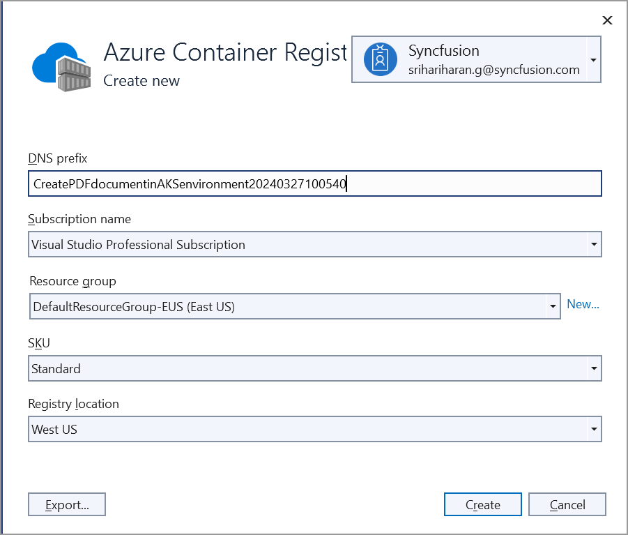
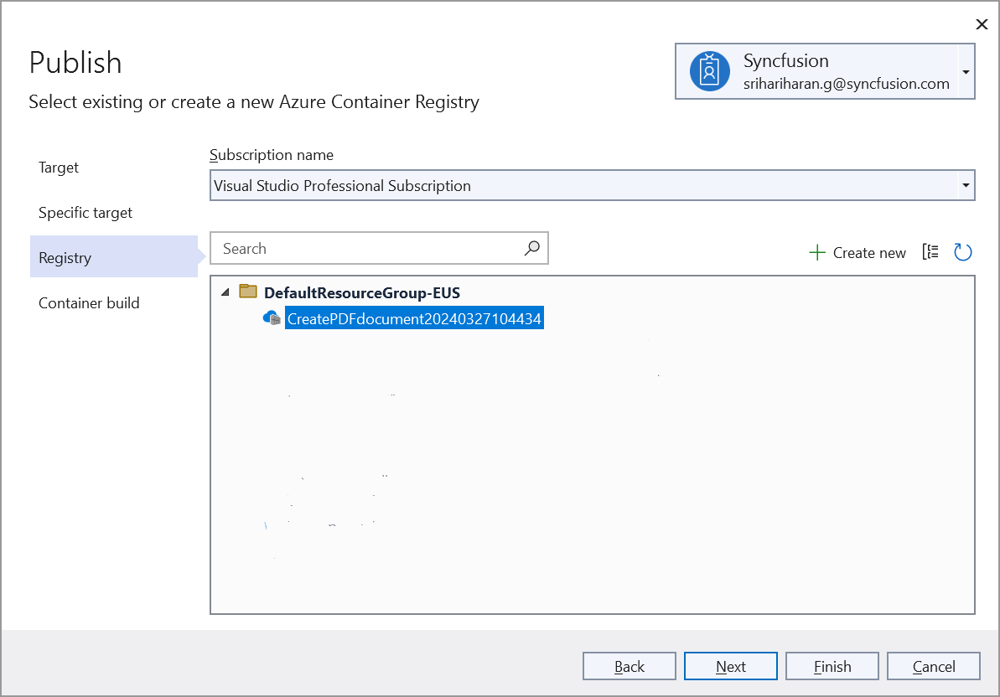
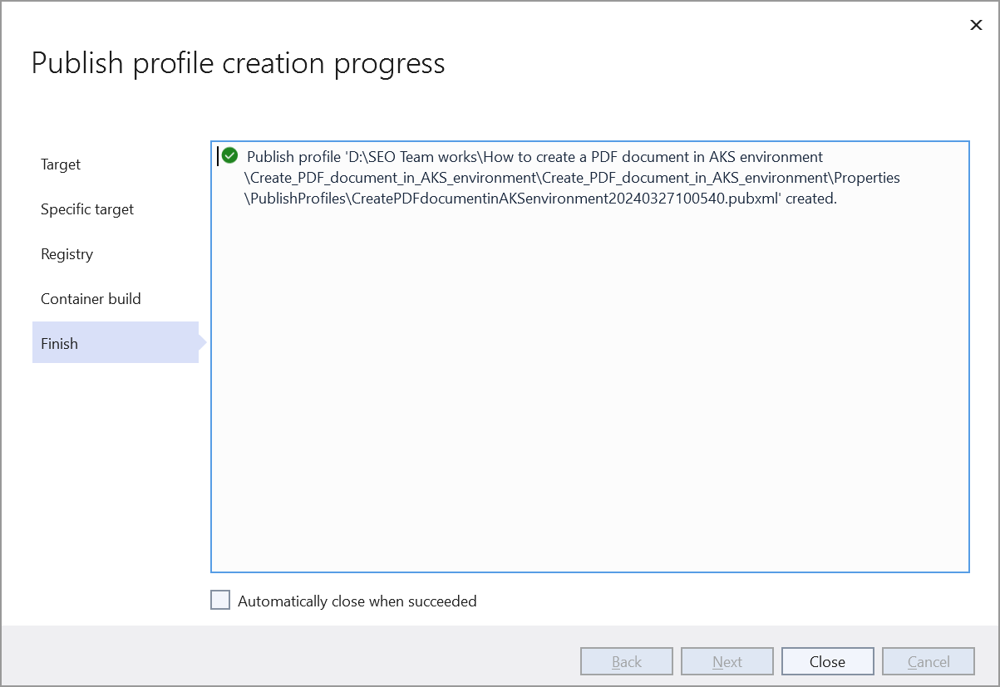
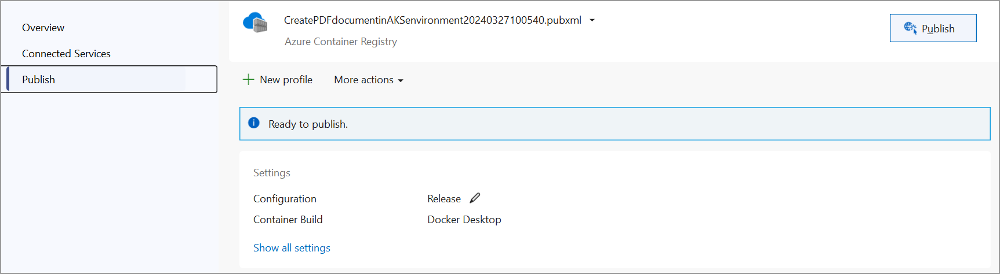
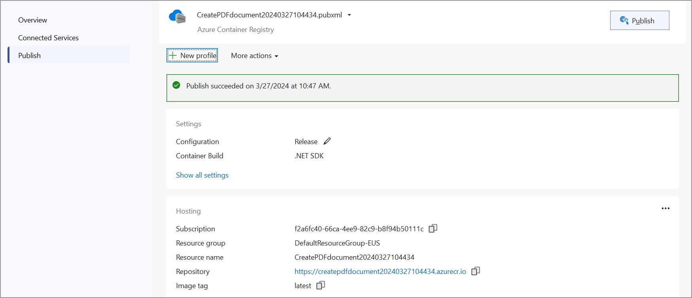
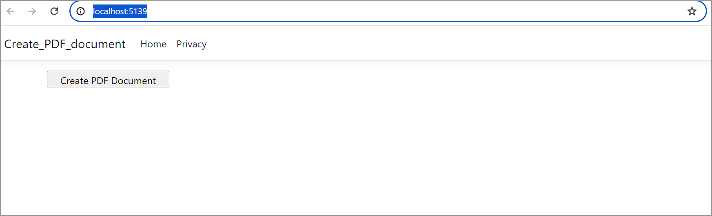

# Create PDF document in AKS Environment 

The [Syncfusion .NET Core PDF library](https://www.syncfusion.com/document-processing/pdf-framework/net-core) is used to create, read, edit PDF documents programmatically without the dependency of Adobe Acrobat. Using this library, you can **create PDF document in AKS Environment**.

## Steps to create PDF document in AKS Environment 

Step 1: Create a new ASP.NET Core Web App (Model-View-Controller).

Step 2: Create a project name and select the location.

Step 3: Click **Create** button.

Step 4: Install the [Syncfusion.Pdf.Net.Core](https://www.nuget.org/packages/Syncfusion.Pdf.Net.Core/) NuGet package as a reference to your project from [NuGet.org](https://www.nuget.org/).

Step 5: A default action method named Index will be present in *HomeController.cs*. Right click on Index method and select Go To View where you will be directed to its associated view page *Index.cshtml*. Add a new button in the *Index.cshtml* as shown below.





@{
    Html.BeginForm("CreatePDFDocument", "Home", FormMethod.Get);
    {
        

            <input type="submit" value="Create PDF Document" style="width:200px;height:27px" />
        

    }
    Html.EndForm();
}





Step 6: Include the following namespaces in *HomeController.cs*.





using Syncfusion.Pdf.Graphics;
using Syncfusion.Pdf;
using System.Diagnostics;
using Syncfusion.Drawing;





Step 7: Add a new action method named CreatePDFDocument in HomeController.cs file and include the below code example to generate a PDF document in *HomeController.cs*. 





    public IActionResult CreatePDFDocument()
    {
        //Create a new PDF document.
        PdfDocument document = new PdfDocument();
        //Add a page to the document.
        PdfPage page = document.Pages.Add();
        //Create PDF graphics for the page.
        PdfGraphics graphics = page.Graphics;
        //Set the standard font.
        PdfFont font = new PdfStandardFont(PdfFontFamily.Helvetica, 20);
        //Draw the text.
        graphics.DrawString("Hello World!!!", font, PdfBrushes.Black, new PointF(0, 0));
        //Saving the PDF to the MemoryStream.
        MemoryStream stream = new MemoryStream();
        document.Save(stream);
        //Set the position as '0'.
        stream.Position = 0;
        //Download the PDF document in the browser.
        FileStreamResult fileStreamResult = new FileStreamResult(stream, "application/pdf");
        fileStreamResult.FileDownloadName = "Sample.pdf";
        return fileStreamResult;
    }





## Steps to publish as AKS Environment

Step 1: Right-click the project and select Publish option.

Step 2: Select the publish target as **Docker Contain Registry**.

Step 3: Select the Specific target as **Azure Contain Registry**.

Step 4: To create a new app service, click **Create new** option.

Step 5: Click the **Create** button to proceed with **Azure Contain Registry** creation.

Step 6: Click the **Finish** button to finalize the **Azure Contain Registry** creation.

Step 7: Click **Close** button.

Step 8: Click the **Publish** button.

Step 9: Now, Publish has been succeeded.

Step 10: Now, the published webpage will open in the **browser**.

Step 11: Select the PDF document and Click **Create PDF document** to generate the PDF document.You will get the output **PDF document** as follows.

You can download a complete working sample from [GitHub]().

Click [here](https://www.syncfusion.com/document-processing/pdf-framework/net-core) to explore the rich set of Syncfusion PDF library features. 

An online sample link to [create PDF document](https://ej2.syncfusion.com/aspnetcore/PDF/HelloWorld#/material3) in ASP.NET Core. 