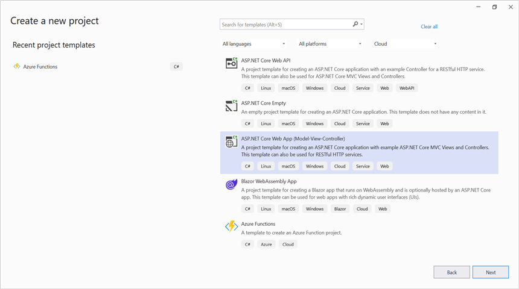
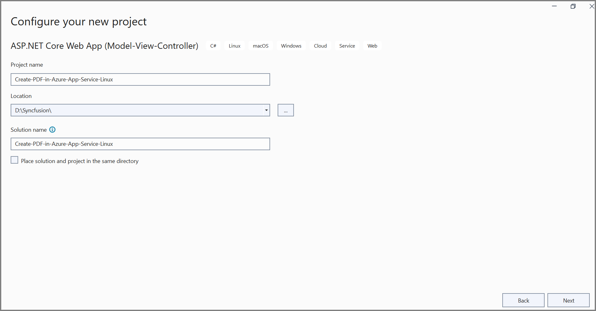
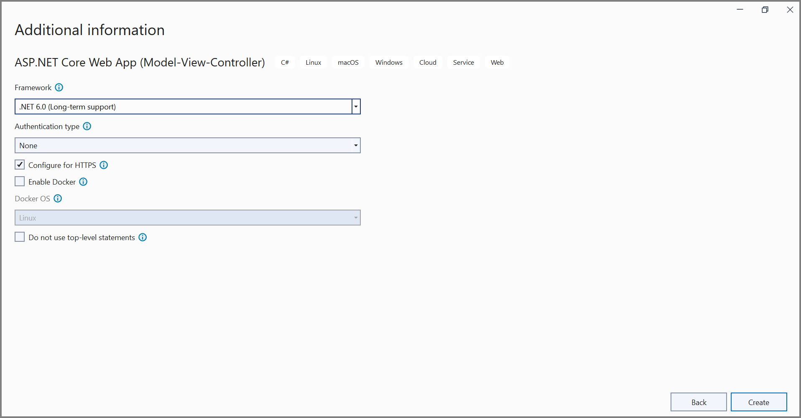
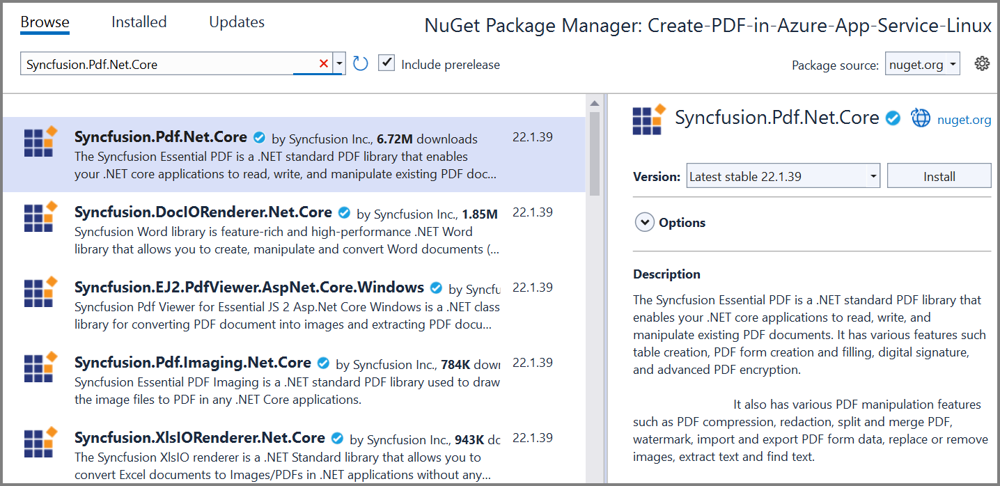
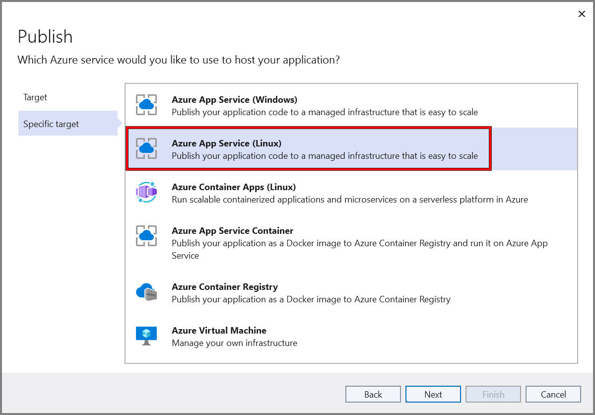
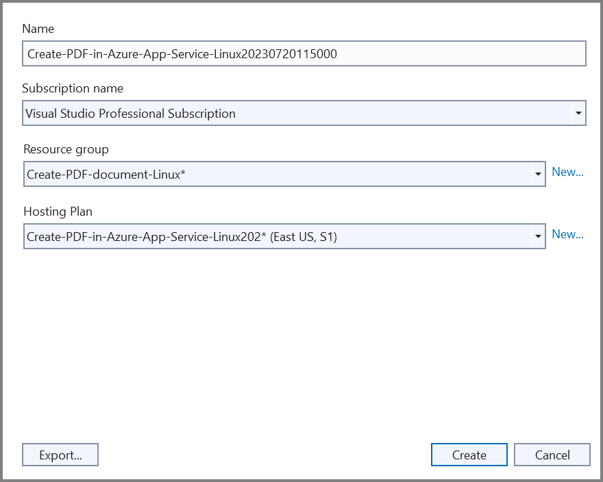
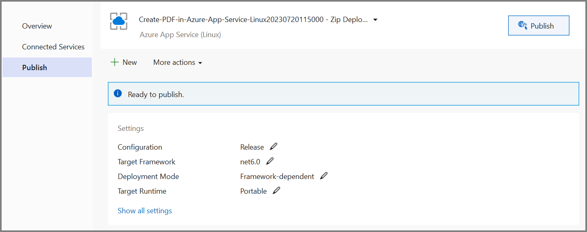
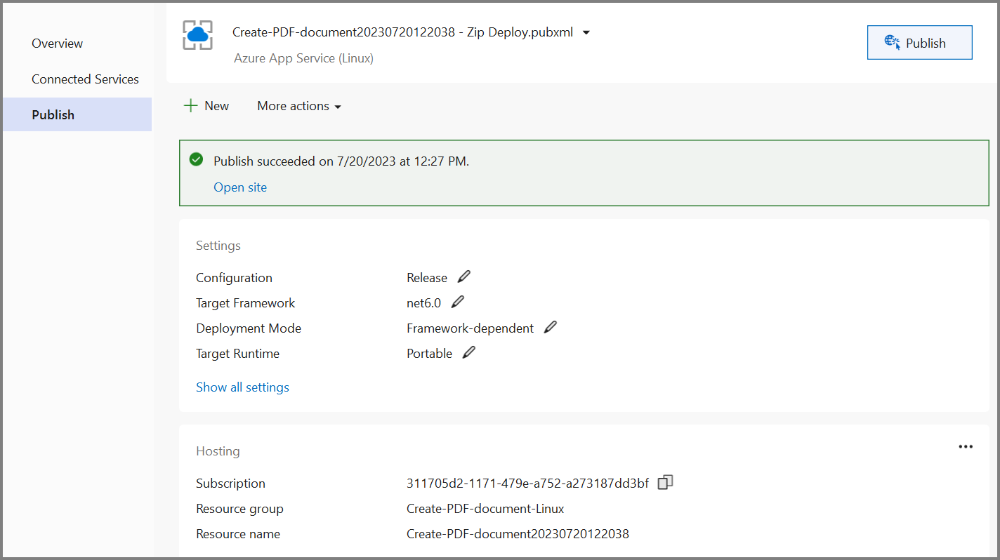

# Create PDF document in Azure App Service on Linux

The [Syncfusion .NET Core PDF library](https://www.syncfusion.com/document-processing/pdf-framework/net-core) is used to create, read, edit PDF documents programmatically without the dependency of Adobe Acrobat. Using this library, you can **create PDF document in Azure App Service on Linux**.

## Steps to create PDF document in Azure App Service on Linux

Step 1: Create a new ASP.NET Core Web App (Model-View-Controller).

Step 2: Create a project name and select the location.

Step 3: Click **Create** button.

Step 4: Install the [Syncfusion.Pdf.Net.Core](https://www.nuget.org/packages/Syncfusion.Pdf.Net.Core/) NuGet package as a reference to your project from [NuGet.org](https://www.nuget.org/).

N> Starting with v16.2.0.x, if you reference Syncfusion assemblies from trial setup or from the NuGet feed, you also have to add "Syncfusion.Licensing" assembly reference and include a license key in your projects. Please refer to this [link](https://help.syncfusion.com/common/essential-studio/licensing/overview) to know about registering Syncfusion license key in your application to use our components.

Step 5: A default action method named Index will be present in *HomeController.cs*. Right click on Index method and select Go To View where you will be directed to its associated view page *Index.cshtml*. Add a new button in the *Index.cshtml* as shown below.





@{
    Html.BeginForm("CreatePDFDocument", "Home", FormMethod.Get);
    {
        

            <input type="submit" value="Create PDF Document" style="width:200px;height:27px" />
        

    }
    Html.EndForm();
}





Step 6: Include the following namespaces in *HomeController.cs*.





using Syncfusion.Pdf.Graphics;
using Syncfusion.Drawing;
using Syncfusion.Pdf.Grid;
using Syncfusion.Pdf;





Step 7: Add a new action method named CreatePDFDocument in HomeController.cs file and include the below code example to generate a PDF document in *HomeController.cs*. 





//To load an existing file. 
private readonly IWebHostEnvironment _hostingEnvironment;
public HomeController(IWebHostEnvironment hostingEnvironment)
{
    _hostingEnvironment = hostingEnvironment;
}

public IActionResult CreatePDFDocument()
{
    //Create a new PDF document.
    PdfDocument document = new PdfDocument();
    //Set the page size.
    document.PageSettings.Size = PdfPageSize.A4;
    //Add a page to the document.
    PdfPage page = document.Pages.Add();

    //Create PDF graphics for the page.
    PdfGraphics graphics = page.Graphics;
    //Load the image from the disk.
    string imagePath = Path.Combine(_hostingEnvironment.WebRootPath, "Data/AdventureCycle.jpg");
    FileStream imageStream = new FileStream(imagePath, FileMode.Open, FileAccess.Read);
    PdfBitmap image = new PdfBitmap(imageStream);
    //Draw an image.
    graphics.DrawImage(image, new RectangleF(130, 0, 250, 100));

    //Draw header text. 
    graphics.DrawString("Adventure Works Cycles", new PdfStandardFont(PdfFontFamily.TimesRoman, 20, PdfFontStyle.Bold), PdfBrushes.Gray, new PointF(150, 150));

    //Add paragraph. 
    string text = "Adventure Works Cycles, the fictitious company on which the AdventureWorks sample databases are based, is a large, multinational manufacturing company. The company manufactures and sells metal and composite bicycles to North American, European and Asian commercial markets. While its base operation is located in Washington with 290 employees, several regional sales teams are located throughout their market base.";
    //Create a text element with the text and font.
    PdfTextElement textElement = new PdfTextElement(text, new PdfStandardFont(PdfFontFamily.TimesRoman, 12));
    //Draw the text in the first column.
    textElement.Draw(page, new RectangleF(0, 200, page.GetClientSize().Width, page.GetClientSize().Height));

    //Create a PdfGrid.
    PdfGrid pdfGrid = new PdfGrid();
    //Add values to the list.
    List<object> data = new List<object>();
    Object row1 = new { Product_ID = "1001", Product_Name = "Bicycle", Price = "10,000" };
    Object row2 = new { Product_ID = "1002", Product_Name = "Head Light", Price = "3,000" };
    Object row3 = new { Product_ID = "1003", Product_Name = "Break wire", Price = "1,500" };
    data.Add(row1);
    data.Add(row2);
    data.Add(row3);
    //Add list to IEnumerable.
    IEnumerable<object> dataTable = data;
    //Assign data source.
    pdfGrid.DataSource = dataTable;
    //Apply built-in table style.
    pdfGrid.ApplyBuiltinStyle(PdfGridBuiltinStyle.GridTable4Accent3);
    //Draw the grid to the page of PDF document.
    pdfGrid.Draw(graphics, new RectangleF(0, 300, page.Size.Width - 80, 0));

    //Saving the PDF to the MemoryStream.
    MemoryStream stream = new MemoryStream();
    document.Save(stream);
    //Set the position as '0'.
    stream.Position = 0;
    //Download the PDF document in the browser.
    FileStreamResult fileStreamResult = new FileStreamResult(stream, "application/pdf");
    fileStreamResult.FileDownloadName = "Sample.pdf";
    return fileStreamResult;
}





## Steps to publish as Azure App Service on Linux

Step 1: Right-click the project and select Publish option.

Step 2: Click the **Add a Publish Profile** button.

Step 3: Select the publish target as **Azure**.

Step 4: Select the Specific target as **Azure App Service (Linux)**.

Step 5: To create a new app service, click **Create new** option.

Step 6: Click the **Create** button to proceed with **App Service** creation.

Step 7: Click the **Finish** button to finalize the **App Service** creation.

Step 8: Click **Close** button.

Step 9: Click the **Publish** button.

Step 10: Now, Publish has been succeeded.

Step 11: Now, the published webpage will open in the **browser**.

Step 12: Select the PDF document and Click **Create PDF document** to generate the PDF document.You will get the output **PDF document** as follows.

You can download a complete working sample from [GitHub]().

Click [here](https://www.syncfusion.com/document-processing/pdf-framework/net-core) to explore the rich set of Syncfusion PDF library features. 

An online sample link to [create PDF document](https://ej2.syncfusion.com/aspnetcore/PDF/HelloWorld#/material3) in ASP.NET Core. 