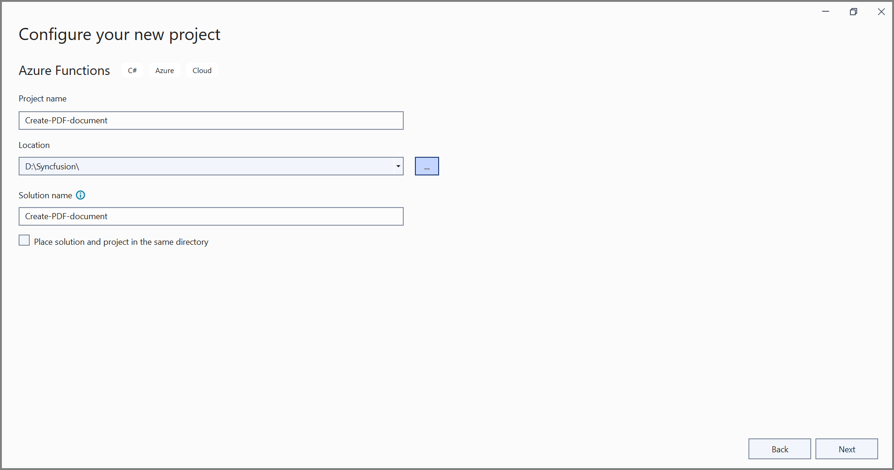

# Create PDF document in Azure Functions v4

The [Syncfusion .NET PDF library](https://www.syncfusion.com/document-processing/pdf-framework/net) is used to create, read, edit PDF documents programmatically without the dependency of Adobe Acrobat. Using this library, you can **create PDF document in Azure Functions v4**.

## Steps to create a PDF document in Azure Functions v4 

Step 1: Create a new Azure Functions project.
 

Step 2: Create a project name and select the location.

Step 3: Select function worker as **.NET 6.0(Long-term support)**. 

Step 4: Install the [Syncfusion.Pdf.Net.Core](https://www.nuget.org/packages/Syncfusion.Pdf.Net.Core/) NuGet package as a reference to your project from [NuGet.org](https://www.nuget.org/).

N> Starting with v16.2.0.x, if you reference Syncfusion assemblies from trial setup or from the NuGet feed, you also have to add "Syncfusion.Licensing" assembly reference and include a license key in your projects. Please refer to this [link](https://help.syncfusion.com/common/essential-studio/licensing/overview) to know about registering Syncfusion license key in your application to use our components.

Step 4: Include the following namespaces in the **Function1.cs** file.




using Syncfusion.Pdf.Graphics;
using Syncfusion.Pdf.Grid;
using Syncfusion.Pdf;
using Syncfusion.Drawing;




Step 5: Add the following code example in **Run** method of **Function1** class to perform **create a PDF document** in Azure Functions and return the resultant **PDF document**.




//Create a new PDF document.
PdfDocument document = new PdfDocument();
//Set the page size.
document.PageSettings.Size = PdfPageSize.A4;
//Add a page to the document.
PdfPage page = document.Pages.Add();

//Create PDF graphics for the page.
PdfGraphics graphics = page.Graphics;
//Load the image from the disk.
var assembly = Assembly.GetExecutingAssembly();
var imageStream = assembly.GetManifestResourceStream("Create_PDF_document.Data.AdventureCycle.jpg");
PdfBitmap image = new PdfBitmap(imageStream);
//Draw an image.
graphics.DrawImage(image, new RectangleF(130, 0, 250, 100));

//Draw header text. 
graphics.DrawString("Adventure Works Cycles", new PdfStandardFont(PdfFontFamily.TimesRoman, 20, PdfFontStyle.Bold), PdfBrushes.Gray, new PointF(150, 150));

//Add paragraph. 
string text = "Adventure Works Cycles, the fictitious company on which the AdventureWorks sample databases are based, is a large, multinational manufacturing company. The company manufactures and sells metal and composite bicycles to North American, European and Asian commercial markets. While its base operation is located in Washington with 290 employees, several regional sales teams are located throughout their market base.";
//Create a text element with the text and font.
PdfTextElement textElement = new PdfTextElement(text, new PdfStandardFont(PdfFontFamily.TimesRoman, 12));
//Draw the text in the first column.
textElement.Draw(page, new RectangleF(0, 200, page.GetClientSize().Width, page.GetClientSize().Height));

//Create a PdfGrid.
PdfGrid pdfGrid = new PdfGrid();
//Add values to the list.
List<object> data = new List<object>();
Object row1 = new { Product_ID = "1001", Product_Name = "Bicycle", Price = "10,000" };
Object row2 = new { Product_ID = "1002", Product_Name = "Head Light", Price = "3,000" };
Object row3 = new { Product_ID = "1003", Product_Name = "Break wire", Price = "1,500" };
data.Add(row1);
data.Add(row2);
data.Add(row3);
//Add list to IEnumerable.
IEnumerable<object> dataTable = data;
//Assign data source.
pdfGrid.DataSource = dataTable;
//Apply built-in table style.
pdfGrid.ApplyBuiltinStyle(PdfGridBuiltinStyle.GridTable4Accent3);
//Draw the grid to the page of PDF document.
pdfGrid.Draw(graphics, new RectangleF(0, 300, page.Size.Width - 80, 0));

MemoryStream memoryStream = new MemoryStream();
//Saves the PDF document file.
document.Save(memoryStream);
//Create the response to return.
HttpResponseMessage response = new HttpResponseMessage(HttpStatusCode.OK);
//Set the PDF document saved stream as content of response.
response.Content = new ByteArrayContent(memoryStream.ToArray());
//Set the contentDisposition as attachment.
response.Content.Headers.ContentDisposition = new ContentDispositionHeaderValue("attachment")
{
    FileName = "Sample.pdf"
};
//Set the content type as PDF document mime type.
response.Content.Headers.ContentType = new System.Net.Http.Headers.MediaTypeHeaderValue("application/pdf");
//Return the response with output PDF document stream.
return response;




Step 6: Right click the project and select **Publish**. Then, create a new profile in the Publish Window.

Step 7: Select the target as **Azure** and click **Next** button.

Step 8: Select the **Azure Function App (Windows)** and click **Next**. 

Step 9: Select the **Create new** button.

Step 10: Click **Create** button. 

Step 11: After creating app service then click **Finish** button. 

Step 12: Click the **Close** button.

Step 13: Click the **Publish** button. 

Step 13: Now, go to Azure portal and select the App Services. After running the service, click **Get function URL > Copy**. Include the URL as a query string in the URL. Then, paste it into the new browser tab. You will get the PDF document as follows. 

You can download a complete working sample from [GitHub](https://github.com/SyncfusionExamples/PDF-Examples/tree/master/Getting%20Started/Azure/Azure%20Function%20V4).

Click [here](https://www.syncfusion.com/document-processing/pdf-framework/net-core) to explore the rich set of Syncfusion PDF library features.

An online sample link to [create a PDF document](https://ej2.syncfusion.com/aspnetcore/PDF/HelloWorld#/material3) in ASP.NET Core.