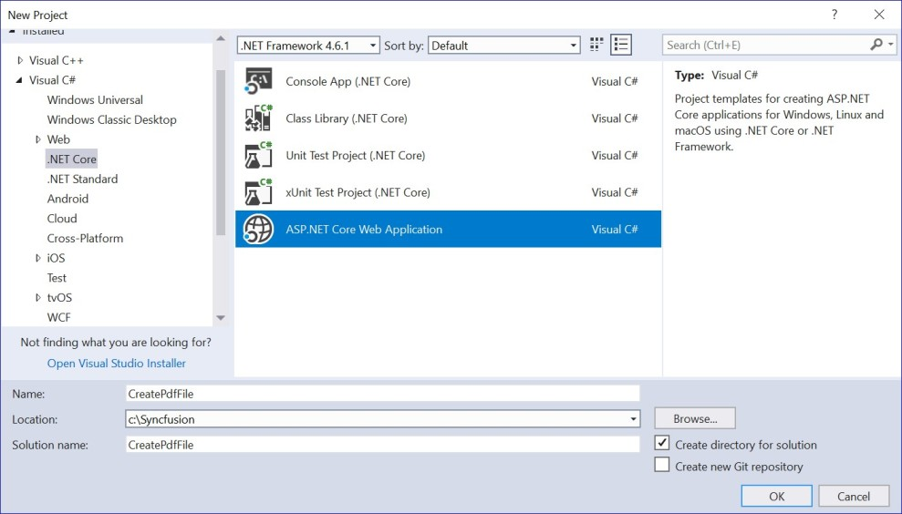
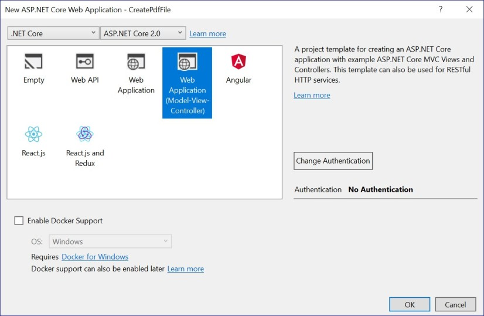
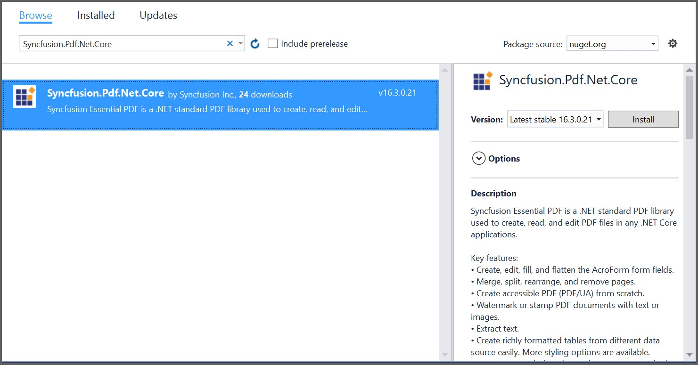

# Create or Generate PDF file in ASP.NET Core

The Syncfusion [.NET Core PDF library](https://www.syncfusion.com/document-processing/pdf-framework/net-core/pdf-library) is used to create, read, and edit PDF documents. This library also offers functionality to merge, split, stamp, forms, and secure PDF files.

To include the .NET Core PDF library into your ASP.NET Core application, please refer to the [NuGet Package Required](/File-Formats/PDF/NuGet-Packages-Required) or [Assemblies Required](/File-Formats/PDF/Assemblies-Required) documentation.

## Steps to create PDF document in ASP.NET Core

Create a new C# ASP.NET Core Web Application project.


Select Web Application pattern (Model-View-Controller) for the project.


Install the [Syncfusion.Pdf.Net.Core](https://www.nuget.org/packages/Syncfusion.Pdf.Net.Core/) [NuGet package](https://help.syncfusion.com/file-formats/nuget-packages) as reference to your ASP.NET Core applications from [NuGet.org](https://www.nuget.org/).


A default controller with name HomeController.cs gets added on creation of ASP.NET Core project. Include the following namespaces in that HomeController.cs file.



using Syncfusion.Pdf;
using Syncfusion.Pdf.Graphics;
using Syncfusion.Drawing;
using System.IO;



A default action method named Index will be present in HomeController.cs. Right click on Index method and select Go To View where you will be directed to its associated view page Index.cshtml.

Add a new button in the Index.cshtml as shown below.



@{Html.BeginForm("CreatePDFDocument", "Home", FormMethod.Get);
{
<div>
    <input type="submit" value="Generate PDF Document" style="width:150px;height:27px" />
</div>
}
Html.EndForm();
}


Add a new action method CreatePDFDocument in HomeController.cs and include the below code snippet to generate a PDF file and download it from a ASP.NET Core application.



//Create a new PDF document
PdfDocument document = new PdfDocument();
  
//Add a page to the document
PdfPage page = document.Pages.Add();
  
//Create PDF graphics for the page
PdfGraphics graphics = page.Graphics;
  
//Set the standard font
PdfFont font = new PdfStandardFont(PdfFontFamily.Helvetica, 20);
  
//Draw the text
graphics.DrawString("Hello World!!!", font, PdfBrushes.Black, new PointF(0, 0));
  
//Saving the PDF to the MemoryStream
MemoryStream stream = new MemoryStream();
  
document.Save(stream);
  
//Set the position as '0'.
stream.Position = 0;
  
//Download the PDF document in the browser
FileStreamResult fileStreamResult = new FileStreamResult(stream, "application/pdf");
  
fileStreamResult.FileDownloadName = "Sample.pdf";
  
return fileStreamResult;



A complete work sample can be downloaded from [Create-PDF-file.zip](http://www.syncfusion.com/downloads/support/directtrac/general/ze/CreatePdfFile_CoreWeb-983162689 )

You can download a complete working sample from [GitHub](https://github.com/SyncfusionExamples/PDF-Examples/tree/master/Getting%20Started/ASP.NET%20Core/Create-new-PDF-document).

By executing the program, you will get the PDF document as follows.


N> The WinForms and WPF controls support in .NET Core 3.0 have been provided. To run this application, please install the [System.Drawing.Common](https://www.nuget.org/packages/System.Drawing.Common) NuGet package as a dependent package. 

## Creating a PDF document with image

The following code example shows how to create a PDF document with an image.



//Create a new PDF document.
PdfDocument doc = new PdfDocument();
//Add a page to the document.
PdfPage page = doc.Pages.Add();
//Create PDF graphics for the page
PdfGraphics graphics = page.Graphics;
//Load the image as stream.
FileStream imageStream = new FileStream("Autumn Leaves.jpg", FileMode.Open, FileAccess.Read);
PdfBitmap image = new PdfBitmap(imageStream);
//Draw the image
graphics.DrawImage(image, 0, 0);
//Save the PDF document to stream
MemoryStream stream = new MemoryStream();
doc.Save(stream);
//If the position is not set to '0' then the PDF will be empty.
stream.Position = 0;
//Close the document.
doc.Close(true);
//Defining the ContentType for pdf file.
string contentType = "application/pdf";
//Define the file name.
string fileName = "Output.pdf";
//Creates a FileContentResult object by using the file contents, content type, and file name.
return File(stream, contentType, fileName); 
         


You can download a complete working sample from [GitHub](https://github.com/SyncfusionExamples/PDF-Examples/tree/master/Getting%20Started/ASP.NET%20Core/Creating-a-PDF-document-with-image).

## Creating a PDF document with table

The following code example shows how to create a PDF document with a simple table.



//Generate a new PDF document.
PdfDocument doc = new PdfDocument();
//Add a page.
PdfPage page = doc.Pages.Add();
//Create a PdfGrid.
PdfGrid pdfGrid = new PdfGrid();
//Add values to list
List<object> data = new List<object>();
Object row1 = new { ID = "E01", Name = "Clay" };
Object row2 = new { ID = "E02", Name = "Thomas" };
Object row3 = new { ID = "E03", Name = "Andrew" };
Object row4 = new { ID = "E04", Name = "Paul" };
Object row5 = new { ID = "E05", Name = "Gray" };
data.Add(row1);
data.Add(row2);
data.Add(row3);
data.Add(row4);
data.Add(row5);
//Add list to IEnumerable
IEnumerable<object> dataTable = data;
//Assign data source.
pdfGrid.DataSource = dataTable;
//Draw grid to the page of PDF document.
pdfGrid.Draw(page, new Syncfusion.Drawing.PointF(10, 10));
//Write the PDF document to stream
MemoryStream stream = new MemoryStream();
doc.Save(stream);
//If the position is not set to '0' then the PDF will be empty.
stream.Position = 0;
//Close the document.
doc.Close(true);
//Defining the ContentType for pdf file.
string contentType = "application/pdf";
//Define the file name.
string fileName = "Output.pdf";
//Creates a FileContentResult object by using the file contents, content type, and file name.
return File(stream, contentType, fileName);



You can download a complete working sample from [GitHub](https://github.com/SyncfusionExamples/PDF-Examples/tree/master/Getting%20Started/ASP.NET%20Core/Create-PDF-document-with-table).

## Creating a simple PDF document with basic elements
The [PdfDocument](https://help.syncfusion.com/cr/file-formats/Syncfusion.Pdf.PdfDocument.html) object represents an entire PDF document that is being created. The following code example shows how to generate a PDF document and add a [PdfPage](https://help.syncfusion.com/cr/file-formats/Syncfusion.Pdf.PdfPage.html) to it along with the [PdfPageSettings](https://help.syncfusion.com/cr/file-formats/Syncfusion.Pdf.PdfPageSettings.html).



//Creates a new PDF document
PdfDocument document = new PdfDocument();
//Adds page settings
document.PageSettings.Orientation = PdfPageOrientation.Landscape;
document.PageSettings.Margins.All = 50;
//Adds a page to the document
PdfPage page = document.Pages.Add();
PdfGraphics graphics = page.Graphics;




1. Essential PDF has APIs similar to the .NET GDI plus which helps to draw elements to the PDF page just like 2D drawing in .NET. 
2. Unlike System.Drawing APIs all the units are measured in point instead of pixel. 
3. In PDF, all the elements are placed in absolute positions and has the possibility for content overlapping if misplaced. 
4. Essential PDF provides the rendered bounds for each and every elements added through [PdfLayoutResult](https://help.syncfusion.com/cr/file-formats/Syncfusion.Pdf.Graphics.PdfLayoutResult.html) objects. This can be used to add successive elements and prevent content overlap.

The following code example explains how to add an image from disk to a PDF document, by providing the rectangle coordinates. 



//Loads the image as stream
FileStream imageStream = new FileStream("AdventureCycle.jpg", FileMode.Open, FileAccess.Read);
RectangleF bounds = new RectangleF(176, 0, 390, 130);
PdfImage image = PdfImage.FromStream(imageStream);
//Draws the image to the PDF page
page.Graphics.DrawImage(image, bounds);




The following methods can be used to add text to a PDF document.

1. [DrawString()](https://help.syncfusion.com/cr/file-formats/Syncfusion.Pdf.Graphics.PdfGraphics.html#Syncfusion_Pdf_Graphics_PdfGraphics_DrawString_System_String_Syncfusion_Pdf_Graphics_PdfFont_Syncfusion_Pdf_Graphics_PdfBrush_System_Drawing_PointF_) method of the [PdfGraphics](https://help.syncfusion.com/cr/file-formats/Syncfusion.Pdf.Graphics.PdfGraphics.html)
2. [PdfTextElement](https://help.syncfusion.com/cr/file-formats/Syncfusion.Pdf.Graphics.PdfTextElement.html) class.

The ```PdfTextElement``` provides the layout result of the added text by using the location of the next element that decides to prevent content overlapping. This is not available in the ```DrawString``` method. 

The following code example adds the necessary text such as address, invoice number and date to create a basic invoice application. 



PdfBrush solidBrush = new PdfSolidBrush(new PdfColor(126, 151, 173));
bounds = new RectangleF(0,bounds.Bottom + 90, graphics.ClientSize.Width, 30);
//Draws a rectangle to place the heading in that region.
graphics.DrawRectangle(solidBrush, bounds);
//Creates a font for adding the heading in the page
PdfFont subHeadingFont = new PdfStandardFont(PdfFontFamily.TimesRoman, 14);
//Creates a text element to add the invoice number
PdfTextElement element = new PdfTextElement("INVOICE " + id.ToString(), subHeadingFont);
element.Brush = PdfBrushes.White;

//Draws the heading on the page
PdfLayoutResult result = element.Draw(page, new PointF(10, bounds.Top + 8));
string currentDate = "DATE " + DateTime.Now.ToString("MM/dd/yyyy");
//Measures the width of the text to place it in the correct location
SizeF textSize = subHeadingFont.MeasureString(currentDate);
PointF textPosition = new PointF(graphics.ClientSize.Width - textSize.Width - 10, result.Bounds.Y);
//Draws the date by using DrawString method
graphics.DrawString(currentDate, subHeadingFont, element.Brush, textPosition);
PdfFont timesRoman = new PdfStandardFont(PdfFontFamily.TimesRoman, 10);
//Creates text elements to add the address and draw it to the page.
element = new PdfTextElement("BILL TO ", timesRoman);
element.Brush = new PdfSolidBrush(new PdfColor(126, 155, 203));
result = element.Draw(page, new PointF(10, result.Bounds.Bottom + 25));
PdfPen linePen = new PdfPen(new PdfColor(126, 151, 173), 0.70f);
PointF startPoint = new PointF(0, result.Bounds.Bottom + 3);
PointF endPoint = new PointF(graphics.ClientSize.Width, result.Bounds.Bottom + 3);
//Draws a line at the bottom of the address
graphics.DrawLine(linePen, startPoint, endPoint);




Essential PDF provides two types of table models. The difference between both the table models can be referred from the link 
[Difference between PdfLightTable and PdfGrid](/file-formats/pdf/working-with-tables#difference-between-pdflighttable-and-pdfgrid "difference-between-pdflighttable-and-pdfgrid")

Since the invoice document requires only simple cell customizations, the given code example explains how to create a simple invoice table by using [PdfGrid](https://help.syncfusion.com/cr/file-formats/Syncfusion.Pdf.Grid.PdfGrid.html).



//Creates the datasource for the table
DataTable invoiceDetails = GetProductDetailsAsDataTable();
//Creates a PDF grid
PdfGrid grid = new PdfGrid();
//Adds the data source
grid.DataSource = invoiceDetails;
//Creates the grid cell styles
PdfGridCellStyle cellStyle = new PdfGridCellStyle();
cellStyle.Borders.All = PdfPens.White;
PdfGridRow header = grid.Headers[0];
//Creates the header style
PdfGridCellStyle headerStyle = new PdfGridCellStyle();
headerStyle.Borders.All = new PdfPen(new PdfColor(126, 151, 173));
headerStyle.BackgroundBrush = new PdfSolidBrush(new PdfColor(126, 151, 173));
headerStyle.TextBrush = PdfBrushes.White;
headerStyle.Font = new PdfStandardFont(PdfFontFamily.TimesRoman, 14f, PdfFontStyle.Regular);

//Adds cell customizations
for (int i = 0; i < header.Cells.Count; i++)
{
if (i == 0 || i == 1)
header.Cells[i].StringFormat = new PdfStringFormat(PdfTextAlignment.Left, PdfVerticalAlignment.Middle);
else
header.Cells[i].StringFormat = new PdfStringFormat(PdfTextAlignment.Right, PdfVerticalAlignment.Middle);
}

//Applies the header style
header.ApplyStyle(headerStyle);
cellStyle.Borders.Bottom = new PdfPen(new PdfColor(217, 217, 217), 0.70f);
cellStyle.Font = new PdfStandardFont(PdfFontFamily.TimesRoman, 12f);
cellStyle.TextBrush = new PdfSolidBrush(new PdfColor(131, 130, 136));
//Creates the layout format for grid
PdfGridLayoutFormat layoutFormat = new PdfGridLayoutFormat();
// Creates layout format settings to allow the table pagination
layoutFormat.Layout = PdfLayoutType.Paginate;
//Draws the grid to the PDF page.
PdfGridLayoutResult gridResult = grid.Draw(page, new RectangleF(new PointF(0, result.Bounds.Bottom + 40), new SizeF(graphics.ClientSize.Width, graphics.ClientSize.Height - 100)), layoutFormat);




The following code example shows how to save the invoice document to disk and dispose the [PdfDocument](https://help.syncfusion.com/cr/file-formats/Syncfusion.Pdf.PdfDocument.html) object.



FileStream fileStream = new FileStream("Sample.pdf", FileMode.CreateNew, FileAccess.ReadWrite);
//Save and close the PDF document 
document.Save(fileStream);
document.Close(true);



You can download a complete working sample from [GitHub](https://github.com/SyncfusionExamples/PDF-Examples/tree/master/Getting%20Started/ASP.NET%20Core/Create-PDF-document-with-basic-elements).

The following screenshot shows the invoice PDF document created by using Essential PDF.


## Filling forms

An interactive form, sometimes referred to as an AcroForm is a collection of fields for gathering information interactively from the user. A [PDF document](https://help.syncfusion.com/cr/file-formats/Syncfusion.Pdf.PdfDocument.html) can contain any number of fields appearing in any combination of pages, all of that make a single, globally interactive form spanning the entire document.

.NET Core PDF library allows you to create and manipulate existing form in PDF document. To work with existing form documents, the following namespaces are required.

1. Syncfusion.Pdf
2. Syncfusion.Pdf.Parsing

The following guide shows how to fill a sample PDF form as shown.


.NET Core PDF library allows you to fill the form fields by using [PdfLoadedField](https://help.syncfusion.com/cr/file-formats/Syncfusion.Pdf.Parsing.PdfLoadedField.html) class. You can get the form field either by using its field name or field index.



//Load the PDF document
FileStream docStream = new FileStream("JobApplication.pdf", FileMode.Open, FileAccess.Read);
PdfLoadedDocument loadedDocument = new PdfLoadedDocument(docStream);
//Loads the form
PdfLoadedForm form = loadedDocument.Form;
//Fills the textbox field by using index
(form.Fields[0] as PdfLoadedTextBoxField).Text = "John";
//Fills the textbox fields by using field name
(form.Fields["LastName"] as PdfLoadedTextBoxField).Text = "Doe";
(form.Fields["Address"] as PdfLoadedTextBoxField).Text = " John Doe \n 123 Main St \n Anytown, USA";
//Loads the radio button group
PdfLoadedRadioButtonItemCollection radioButtonCollection = (form.Fields["Gender"] as PdfLoadedRadioButtonListField).Items;
//Checks the 'Male' option
radioButtonCollection[0].Checked = true;
//Checks the 'business' checkbox field
(form.Fields["Business"] as PdfLoadedCheckBoxField).Checked = true;
//Checks the 'retiree' checkbox field
(form.Fields["Retiree"] as PdfLoadedCheckBoxField).Checked = true;
//Write the PDF document to stream
MemoryStream stream = new MemoryStream();
loadedDocument.Save(stream);
//If the position is not set to '0' then the PDF will be empty.
stream.Position = 0;
//Close the document.
loadedDocument.Close(true);
//Defining the ContentType for pdf file.
string contentType = "application/pdf";
//Define the file name.
string fileName = "output.pdf";
//Creates a FileContentResult object by using the file contents, content type, and file name.
return File(stream, contentType, fileName);



You can download a complete working sample from [GitHub](https://github.com/SyncfusionExamples/PDF-Examples/tree/master/Getting%20Started/ASP.NET%20Core/Fill-form-in-an-existing-PDF-document).

The filled form is shown in adobe reader application as follows.


## Merge PDF Documents

.NET Core PDF library supports merging multiple PDF documents from stream using [Merge](https://help.syncfusion.com/cr/file-formats/Syncfusion.Pdf.PdfDocumentBase.html#Syncfusion_Pdf_PdfDocumentBase_Merge_Syncfusion_Pdf_PdfDocumentBase_Syncfusion_Pdf_Parsing_PdfLoadedDocument_) method.

You can merge the PDF document streams by using the following code example.



//Generate a PDF document
PdfDocument finalDoc = new PdfDocument();
FileStream stream1 = new FileStream("file1.pdf", FileMode.Open, FileAccess.Read);
FileStream stream2 = new FileStream("file2.pdf", FileMode.Open, FileAccess.Read);
// Creates a PDF stream for merging
Stream[] streams = { stream1, stream2 };
// Merges PDFDocument.
PdfDocumentBase.Merge(finalDoc, streams);
//Save the PDF document to stream
MemoryStream stream = new MemoryStream();
finalDoc.Save(stream);
//If the position is not set to '0' then the PDF will be empty.
stream.Position = 0;
//Close the document.
finalDoc.Close(true);
//Defining the ContentType for pdf file.
string contentType = "application/pdf";
//Define the file name.
string fileName = "sample.pdf";
//Creates a FileContentResult object by using the file contents, content type, and file name.
return File(stream, contentType, fileName);



You can download a complete working sample from [GitHub](https://github.com/SyncfusionExamples/PDF-Examples/tree/master/Getting%20Started/ASP.NET%20Core/Merge-multiple-PDF-documents).

N> You can also explore our [.NET Core PDF library demo](https://ej2.syncfusion.com/aspnetcore/PDF/Default#/bootstrap5) that shows how to create and modify PDF files from C# with just five lines of code.