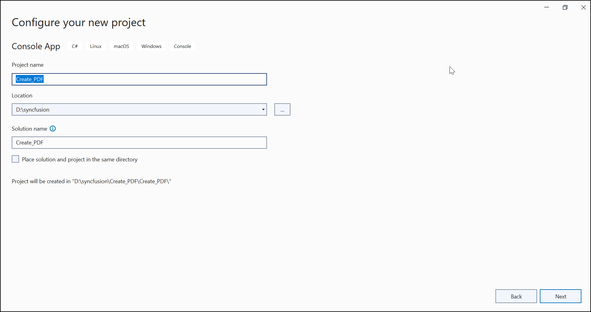
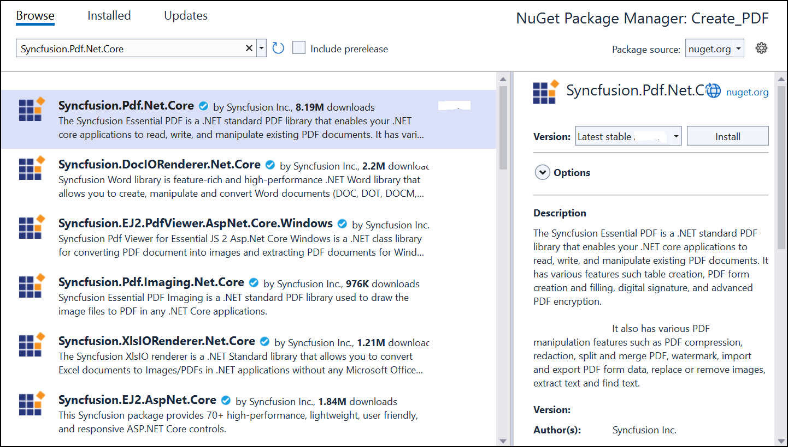
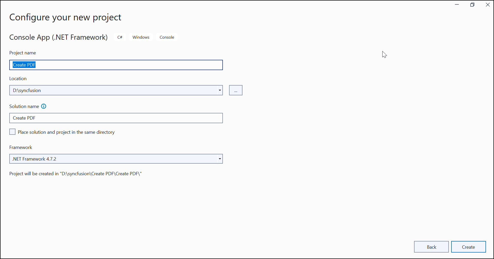

---
title: Create PDF file in Console Application | Syncfusion
description: Learn here how to create a PDF file in Console Application using the Syncfusion PDF library.
platform: file-formats
control: PDF
documentation: UG
--- 

# Create or Generate a PDF file in a Console application

The Syncfusion [.NET PDF library](https://www.syncfusion.com/document-processing/pdf-framework/net/pdf-library) is used to create, read, and edit PDF documents. This library also offers functionality to merge, split, stamp, form, and secure PDF files.

## Create a simple PDF document using .NET Core

The following steps illustrate creating a simple Hello World PDF document in a console application using .NET Core.

Step 1: Create a new C# Console Application project.

Step 2: Name the project.

Step 3: Install the [Syncfusion.Pdf.Net.Core](https://www.nuget.org/packages/Syncfusion.Pdf.Net.Core) NuGet package as reference to your .NET Standard applications from [NuGet.org](https://www.nuget.org).

N> Starting with v16.2.0.x, if you reference Syncfusion assemblies from trial setup or from the NuGet feed, you also have to add "Syncfusion.Licensing" assembly reference and include a license key in your projects. Please refer to this [link](https://help.syncfusion.com/common/essential-studio/licensing/overview) to learn about registering Syncfusion license key in your application to use our components.

Step 4: Include the following namespaces in the *Program.cs* file.



using Syncfusion.Pdf.Graphics;
using Syncfusion.Pdf;
using Syncfusion.Drawing;



Step 5: Include the below code snippet in *Program.cs* to create an PDF file.


 
//Create a new PDF document.
PdfDocument document = new PdfDocument();
//Add a page to the document.
PdfPage page = document.Pages.Add();
//Create PDF graphics for the page.
PdfGraphics graphics = page.Graphics;
//Set the standard font.
PdfFont font = new PdfStandardFont(PdfFontFamily.Helvetica, 20);
//Draw the text.
graphics.DrawString("Hello World!!!", font, PdfBrushes.Black, new PointF(0, 0));
//Create a fileStream.
FileStream fileStream = new FileStream("Output.pdf", FileMode.CreateNew, FileAccess.ReadWrite);
//Save and close the PDF document.
document.Save(fileStream);
document.Close(true);



You can download a complete working sample from [GitHub](https://github.com/SyncfusionExamples/PDF-Examples/tree/master/Getting%20Started/Console/.NET%20Core/Create_PDF).

By executing the program, you will get the PDF document as follows.

## Create a simple PDF document using .NET Framework

The following steps illustrates creating a simple Hello world PDF document in console application using .NET Framework.

Step 1: Create a new C# Console Application (.NET Framework) project.

Step 2: Name the project.

Step 3: Install the [Syncfusion.Pdf.WinForms](https://www.nuget.org/packages/Syncfusion.Pdf.WinForms/) NuGet package as reference to your .NET Standard applications from [NuGet.org](https://www.nuget.org).

N> The [Syncfusion.Pdf.WinForms](https://www.nuget.org/packages/Syncfusion.Pdf.WinForms/) NuGet package is dependent package for Syncfusion Windows Forms GUI controls, so named with sufix "WinForms". It has a platform-independent .NET framework (4.0, 4.5, 4.5.1, 4.6) assemblies of the PDF library and doesn't contain any Windows Forms-related references or code. Hence, we recommend this package for the .NET framework Console application.

Step 4: Include the following namespaces in the *Program.cs*.



using Syncfusion.Pdf.Graphics;
using Syncfusion.Pdf;
using System.Drawing;



Step 5: Include the following code sample in *Program.cs* to create a PDF file.


 
//Create a new PDF document. 
using (PdfDocument document = new PdfDocument()) {
    //Add a page to the document.
    PdfPage page = document.Pages.Add();
    //Create PDF graphics for a page.
    PdfGraphics graphics = page.Graphics;
    //Set the standard font.
    PdfFont font = new PdfStandardFont(PdfFontFamily.Helvetica, 20);
    //Draw the text.
    graphics.DrawString("Hello World!!!", font, PdfBrushes.Black, new PointF(0, 0));
    //Save the document.
    document.Save("Output.pdf");
}



You can download a complete working sample from [GitHub](https://github.com/SyncfusionExamples/PDF-Examples/tree/master/Getting%20Started/Console/.NET%20Framework/Create%20PDF).

By executing the program, you will get the PDF document as follows.

Click [here](https://www.syncfusion.com/document-processing/pdf-framework/net) to explore the rich set of Syncfusion PDF library features.

An online sample link to [create PDF document](https://ej2.syncfusion.com/aspnetcore/PDF/HelloWorld#/material3) in ASP.NET Core.
