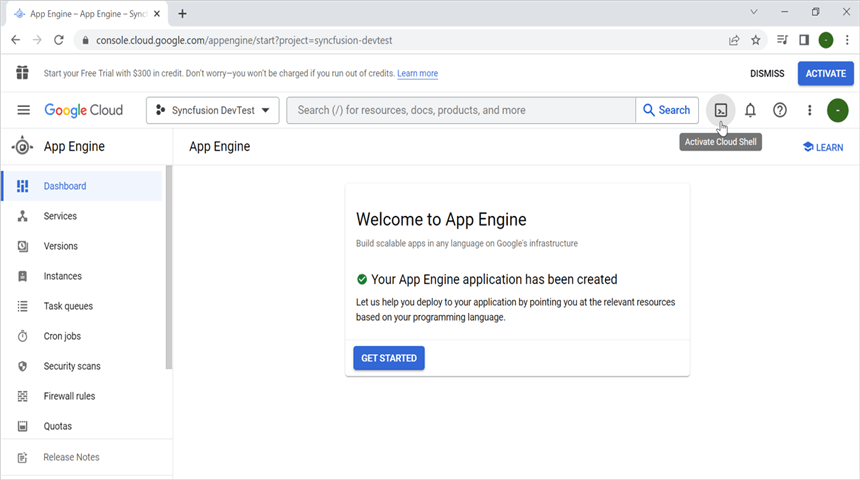

# Create PDF document in Google App Engine

The [Syncfusion .NET Core PDF library](https://www.syncfusion.com/document-processing/pdf-framework/net-core) is used to create, read, and edit PDF documents programatically without the dependency of Adobe Acrobat. Using this library, you can **open and save PDF document in Google App Engine**.

## Set up App Engine

Step 1: Open the **Google Cloud Console** and click the **Activate Cloud Shell** button.

Step 2: Click the **Cloud Shell Editor** button to view the **Workspace**.

Step 3: Open **Cloud Shell Terminal**, run the following **command** to confirm authentication.



gcloud auth list




Step 4: Click the **Authorize** button.

## Create an application for App Engine

Step 1: Open Visual Studio and select the ASP.NET Core Web app (Model-View-Controller) template.

Step 2: Configure your new project according to your requirements.

Step 3: Click the **Create** button.

Step 4:Install the [Syncfusion.Pdf.Net.Core](https://www.nuget.org/packages/Syncfusion.Pdf.Net.Core/) NuGet package as a reference to your project from the [NuGet.org](https://www.nuget.org/).

N> Starting with v16.2.0.x, if you reference Syncfusion assemblies from the trial setup or from the NuGet feed, you also have to add the "Syncfusion.Licensing" assembly reference and include a license key in your projects. Please refer to this [link](https://help.syncfusion.com/common/essential-studio/licensing/overview) to know about registering the Syncfusion license key in your application to use our components.

Step 5: Include the following namespaces in the **HomeController.cs** file.




using Syncfusion.Pdf;
using Syncfusion.Pdf.Graphics;
using Syncfusion.Drawing;
using System.IO;




Step 6: A default action method named Index will be present in HomeController.cs. Right click on Index method and select **Go To View** where you will be directed to its associated view page **Index.cshtml**.

Step 7: Add a new button in the Index.cshtml as shown below.




@{Html.BeginForm("CreateDocument", "Home", FormMethod.Get);
    {
        

            <input type="submit" value="Create PDF Document" style="width:200px;height:27px" />
        

    }
    Html.EndForm();
}



Step 8: Add a new action method **CreateDocument** in HomeController.cs and include the below code snippet to **create PDF document** and download it.




//Open an existing PDF document.
FileStream document = new FileStream("Input.pdf", FileMode.Open, FileAccess.Read);
PdfLoadedDocument document = new PdfLoadedDocument(stream);

//Load the existing page.
PdfLoadedPage loadedPage = document.Pages[0] as PdfLoadedPage;
//Create PDF graphics for the page.
PdfGraphics graphics = loadedPage.Graphics;

//Create a PdfGrid.
PdfGrid pdfGrid = new PdfGrid();
//Add values to the list.
List<object> data = new List<object>();
Object row1 = new { Product_ID = "1001", Product_Name = "Bicycle", Price = "10,000" };
Object row2 = new { Product_ID = "1002", Product_Name = "Head Light", Price = "3,000" };
Object row3 = new { Product_ID = "1003", Product_Name = "Break wire", Price = "1,500" };
data.Add(row1);
data.Add(row2);
data.Add(row3);
//Add list to IEnumerable.
IEnumerable<object> dataTable = data;
//Assign data source.
pdfGrid.DataSource = dataTable;
//Apply built-in table style.
pdfGrid.ApplyBuiltinStyle(PdfGridBuiltinStyle.GridTable4Accent3);
//Draw the grid to the page of PDF document.
pdfGrid.Draw(graphics, new RectangleF(40, 400, loadedPage.Size.Width - 80, 0));

//Save the document into stream.
MemoryStream memoryStream = new MemoryStream();
//Save and Close the PDF Document.
document.Save(memoryStream);
document.Close(true);
return Convert.ToBase64String(memoryStream.ToArray());




