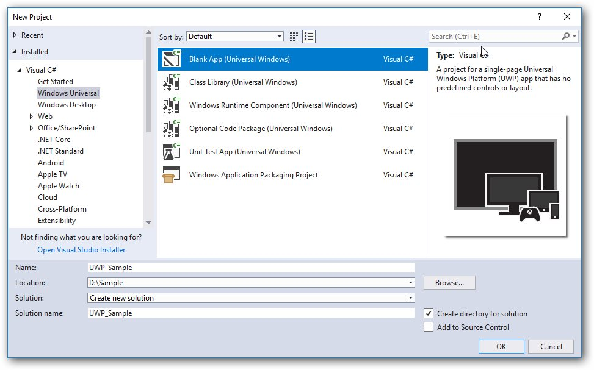
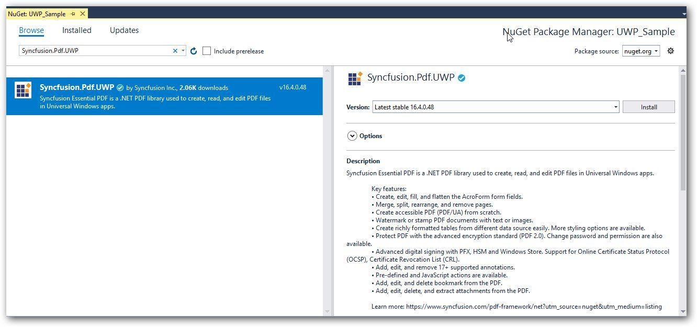
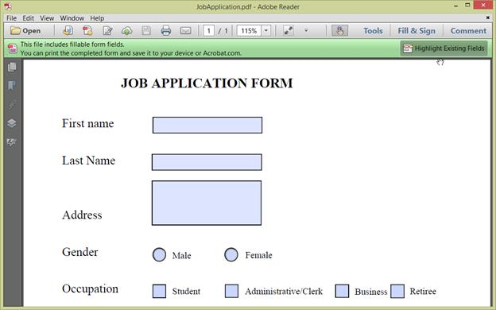
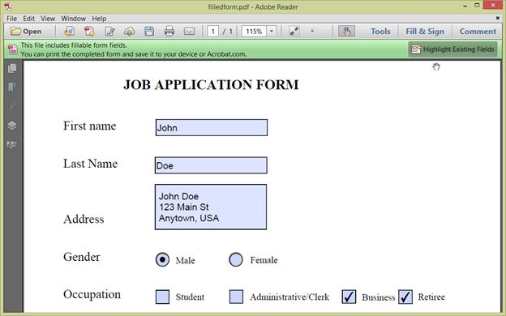

# Create of Generate PDF file in UWP

The Syncfusion [UWP PDF library](https://www.syncfusion.com/document-processing/pdf-framework/uwp/pdf-library) is used to create, read, and edit PDF documents. This library also offers functionality to merge, split, stamp, forms, and secure PDF files.

In your UWP application, add the following assembly to use PDF.

* Syncfusion.Pdf.UWP

For more details, refer to this [Assemblies Required](/File-Formats/PDF/Assemblies-Required) documentation.

## Steps to create PDF document in UWP

Create a new UWP application project. 


Install the [Syncfusion.Pdf.UWP](https://www.nuget.org/packages/Syncfusion.Pdf.UWP/) NuGet package as reference to your UWP applications from [NuGet.org](https://www.nuget.org/).


Create button in MainPage.Xaml page using below code snippet and create Button_Click event.


<Grid>
  <Button Content="CreatePDF" HorizontalAlignment="Center"  VerticalAlignment="Center" Width="150" Height="100" Click="Button_Click" />
</Grid>



Include the following namespaces in the MainPage.xaml.cs file.



using Syncfusion.Pdf;
using Syncfusion.Pdf.Graphics;
using System;
using System.Collections.Generic;
using System.Drawing;
using System.IO;
using Windows.Storage;
using Windows.Storage.Pickers;
using Windows.UI.Popups;
using Windows.UI.Xaml;
using Windows.UI.Xaml.Controls;



Include the following code snippet in the click event of the button in MainPage.xaml.cs to Create PDF and save it in a stream.



using (PdfDocument document = new PdfDocument())
{
//Add a page to the document
PdfPage page = document.Pages.Add();

//Create PDF graphics for the page
PdfGraphics graphics = page.Graphics;

//Set the standard font
PdfFont font = new PdfStandardFont(PdfFontFamily.Helvetica, 20);

//Draw the text
graphics.DrawString("Hello World!!!", font, PdfBrushes.Black, new PointF(0, 0));

//Create memory stream
MemoryStream ms = new MemoryStream();

// Open the document in browser after saving it
document.Save(ms);

//Close the document
document.Close(true);

Save(ms, "Sample.pdf");
}


Use the following helper method to save the stream as a physical file and open the file for viewing.


#region Helper Methods
public async void Save(Stream stream, string filename)
{
stream.Position = 0; 

StorageFile stFile; 
if (!(Windows.Foundation.Metadata.ApiInformation.IsTypePresent("Windows.Phone.UI.Input.HardwareButtons"))) 
{ 
    FileSavePicker savePicker = new FileSavePicker(); 
    savePicker.DefaultFileExtension = ".pdf"; 
    savePicker.SuggestedFileName = "Sample"; 
    savePicker.FileTypeChoices.Add("Adobe PDF Document", new List<string>() { ".pdf" }); 
    stFile = await savePicker.PickSaveFileAsync(); 
} 
else 
{ 
    StorageFolder local = Windows.Storage.ApplicationData.Current.LocalFolder; 
    stFile = await local.CreateFileAsync(filename, CreationCollisionOption.ReplaceExisting); 
} 
if (stFile != null) 
{ 
    Windows.Storage.Streams.IRandomAccessStream fileStream = await stFile.OpenAsync(FileAccessMode.ReadWrite); 
    Stream st = fileStream.AsStreamForWrite(); 
    st.SetLength(0); 
    st.Write((stream as MemoryStream).ToArray(), 0, (int)stream.Length); 
    st.Flush(); 
    st.Dispose(); 
    fileStream.Dispose(); 
    MessageDialog msgDialog = new MessageDialog("Do you want to view the Document?", "File created."); 
    UICommand yesCmd = new UICommand("Yes"); 
    msgDialog.Commands.Add(yesCmd); 
    UICommand noCmd = new UICommand("No"); 
    msgDialog.Commands.Add(noCmd); 
    IUICommand cmd = await msgDialog.ShowAsync(); 
    if (cmd == yesCmd) 
    { 
        // Launch the retrieved file 
        bool success = await Windows.System.Launcher.LaunchFileAsync(stFile); 
    } 
} 
}
#endregion



A complete working sample can be downloaded from [Create PDF file.zip](http://www.syncfusion.com/downloads/support/directtrac/general/ze/UWP_Sample1746484692 )

By executing the program, you will get the PDF document as follows.


## Creating a PDF document with image

The following code example shows how to create a PDF document with an image.



//Create a new PDF document.
PdfDocument doc = new PdfDocument();
//Add a page to the document.
PdfPage page = doc.Pages.Add();
//Create PDF graphics for the page
PdfGraphics graphics = page.Graphics;
//Load the image as stream
Stream imageStream = typeof(MainPage).GetTypeInfo().Assembly.GetManifestResourceStream("Sample.Assets.Data.Autumn Leaves.jpg");
//Load the image from the disk.
PdfBitmap image = new PdfBitmap(imageStream);
//Draw the image
graphics.DrawImage(image, 0, 0);
//Create memory stream
MemoryStream ms = new MemoryStream();
//Open the document in browser after saving it
doc.Save(ms);
//Close the document
doc.Close(true);
Save(ms, "Sample.pdf");




//Create a new PDF document.
PdfDocument doc = new PdfDocument();
//Add a page.
PdfPage page = doc.Pages.Add();
//Create a PdfGrid.
PdfGrid pdfGrid = new PdfGrid();
//Add values to list
List<object> data = new List<object>();
Object row1 = new { ID = "E01", Name = "Clay" };
Object row2 = new { ID = "E02", Name = "Thomas" };
Object row3 = new { ID = "E03", Name = "Andrew" };
Object row4 = new { ID = "E04", Name = "Paul" };
Object row5 = new { ID = "E05", Name = "Gray" };
data.Add(row1);
data.Add(row2);
data.Add(row3);
data.Add(row4);
data.Add(row5);
//Add list to IEnumerable
IEnumerable<object> dataTable = data;
//Assign data source.
pdfGrid.DataSource = dataTable;
//Draw grid to the page of PDF document.
pdfGrid.Draw(page, new PointF(10, 10));
//Save the PDF document to stream.
MemoryStream stream = new MemoryStream();
await doc.SaveAsync(stream);
//Close the document.
doc.Close(true);
//Save the stream as PDF document file in local machine. Refer to PDF/UWP section for respected code samples.
Save(stream, "Output.pdf");



## Creating a simple PDF document with basic elements
The [PdfDocument](https://help.syncfusion.com/cr/file-formats/Syncfusion.Pdf.PdfDocument.html) object represents an entire PDF document that is being created. The following code example shows how to create a PDF document and add a [PdfPage](https://help.syncfusion.com/cr/file-formats/Syncfusion.Pdf.PdfPage.html) to it along with the [PdfPageSettings](https://help.syncfusion.com/cr/file-formats/Syncfusion.Pdf.PdfPageSettings.html).



//Creates a new PDF document
PdfDocument document = new PdfDocument();
//Adds page settings
document.PageSettings.Orientation = PdfPageOrientation.Landscape;
document.PageSettings.Margins.All = 50;
//Adds a page to the document
PdfPage page = document.Pages.Add();
PdfGraphics graphics = page.Graphics;



1. Essential PDF has APIs similar to the .NET GDI plus which helps to draw elements to the PDF page just like 2D drawing in .NET. 
2. Unlike System.Drawing APIs all the units are measured in point instead of pixel. 
3. In PDF, all the elements are placed in absolute positions and has the possibility for content overlapping if misplaced. 
4. Essential PDF provides the rendered bounds for each and every elements added through [PdfLayoutResult](https://help.syncfusion.com/cr/file-formats/Syncfusion.Pdf.Graphics.PdfLayoutResult.html) objects. This can be used to add successive elements and prevent content overlap.

The following code example explains how to add an image from disk to a PDF document, by providing the rectangle coordinates. 


//Load the image as stream
Stream imageStream = typeof(MainPage).GetTypeInfo().Assembly.GetManifestResourceStream("Sample.Assets.Data.AdventureCycle.jpg");
//Load the image from the stream.
PdfImage image = PdfImage.FromStream(imageStream);
RectangleF bounds = new RectangleF(176, 0, 390, 130);
//Draws the image to the PDF page
page.Graphics.DrawImage(image, bounds);



The following methods can be used to add text to a PDF document.

1. [DrawString()](https://help.syncfusion.com/cr/file-formats/Syncfusion.Pdf.Graphics.PdfGraphics.html#Syncfusion_Pdf_Graphics_PdfGraphics_DrawString_System_String_Syncfusion_Pdf_Graphics_PdfFont_Syncfusion_Pdf_Graphics_PdfBrush_System_Drawing_PointF_) method of the [PdfGraphics](https://help.syncfusion.com/cr/file-formats/Syncfusion.Pdf.Graphics.PdfGraphics.html)
2. [PdfTextElement](https://help.syncfusion.com/cr/file-formats/Syncfusion.Pdf.Graphics.PdfTextElement.html) class.

The ```PdfTextElement``` provides the layout result of the added text by using the location of the next element that decides to prevent content overlapping. This is not available in the ```DrawString``` method. 

The following code example adds the necessary text such as address, invoice number and date to create a basic invoice application. 


PdfBrush solidBrush = new PdfSolidBrush(new PdfColor(126, 151, 173));
bounds = new RectangleF(0, bounds.Bottom + 90, graphics.ClientSize.Width, 30);
//Draws a rectangle to place the heading in that region.
graphics.DrawRectangle(solidBrush, bounds);
//Creates a font for adding the heading in the page
PdfFont subHeadingFont = new PdfStandardFont(PdfFontFamily.TimesRoman, 14);
//Creates a text element to add the invoice number
PdfTextElement element = new PdfTextElement("INVOICE " + id.ToString(), subHeadingFont);
element.Brush = PdfBrushes.White;

//Draws the heading on the page
PdfLayoutResult result = element.Draw(page, new PointF(10, bounds.Top + 8));
string currentDate = "DATE " + DateTime.Now.ToString("MM/dd/yyyy");
//Measures the width of the text to place it in the correct location
SizeF textSize = subHeadingFont.MeasureString(currentDate);
PointF textPosition = new PointF(graphics.ClientSize.Width - textSize.Width - 10, result.Bounds.Y);
//Draws the date by using DrawString method
graphics.DrawString(currentDate, subHeadingFont, element.Brush, textPosition);
PdfFont timesRoman = new PdfStandardFont(PdfFontFamily.TimesRoman, 10);
//Creates text elements to add the address and draw it to the page.
element = new PdfTextElement("BILL TO ", timesRoman);
element.Brush = new PdfSolidBrush(new PdfColor(126, 155, 203));
result = element.Draw(page, new PointF(10, result.Bounds.Bottom + 25));
PdfPen linePen = new PdfPen(new PdfColor(126, 151, 173), 0.70f);
PointF startPoint = new PointF(0, result.Bounds.Bottom + 3);
PointF endPoint = new PointF(graphics.ClientSize.Width, result.Bounds.Bottom + 3);
//Draws a line at the bottom of the address
graphics.DrawLine(linePen, startPoint, endPoint);



Essential PDF provides two types of table models. The difference between both the table models can be referred from the link 
[Difference between PdfLightTable and PdfGrid](/file-formats/pdf/working-with-tables#difference-between-pdflighttable-and-pdfgrid "difference-between-pdflighttable-and-pdfgrid")

Since the invoice document requires only simple cell customizations, the given code example explains how to create a simple invoice table by using [PdfGrid](https://help.syncfusion.com/cr/file-formats/Syncfusion.Pdf.Grid.PdfGrid.html).



//Creates the datasource for the table
DataTable invoiceDetails = GetProductDetailsAsDataTable();
//Creates a PDF grid
PdfGrid grid = new PdfGrid();
//Adds the data source
grid.DataSource = invoiceDetails;
//Creates the grid cell styles
PdfGridCellStyle cellStyle = new PdfGridCellStyle();
cellStyle.Borders.All = PdfPens.White;
PdfGridRow header = grid.Headers[0];
//Creates the header style
PdfGridCellStyle headerStyle = new PdfGridCellStyle();
headerStyle.Borders.All = new PdfPen(new PdfColor(126, 151, 173));
headerStyle.BackgroundBrush = new PdfSolidBrush(new PdfColor(126, 151, 173));
headerStyle.TextBrush = PdfBrushes.White;
headerStyle.Font = new PdfStandardFont(PdfFontFamily.TimesRoman, 14f, PdfFontStyle.Regular);

//Adds cell customizations
for (int i = 0; i < header.Cells.Count; i++)
{
if (i == 0 || i == 1)
header.Cells[i].StringFormat = new PdfStringFormat(PdfTextAlignment.Left, PdfVerticalAlignment.Middle);
else
header.Cells[i].StringFormat = new PdfStringFormat(PdfTextAlignment.Right, PdfVerticalAlignment.Middle);
}

//Applies the header style
header.ApplyStyle(headerStyle);
cellStyle.Borders.Bottom = new PdfPen(new PdfColor(217, 217, 217), 0.70f);
cellStyle.Font = new PdfStandardFont(PdfFontFamily.TimesRoman, 12f);
cellStyle.TextBrush = new PdfSolidBrush(new PdfColor(131, 130, 136));
//Creates the layout format for grid
PdfGridLayoutFormat layoutFormat = new PdfGridLayoutFormat();
// Creates layout format settings to allow the table pagination
layoutFormat.Layout = PdfLayoutType.Paginate;
//Draws the grid to the PDF page.
PdfGridLayoutResult gridResult = grid.Draw(page, new RectangleF(new PointF(0, result.Bounds.Bottom + 40), new SizeF(graphics.ClientSize.Width, graphics.ClientSize.Height - 100)), layoutFormat);



The following code example shows how to save the invoice document to disk and dispose the [PdfDocument](https://help.syncfusion.com/cr/file-formats/Syncfusion.Pdf.PdfDocument.html) object.

//Save the PDF document to stream.
MemoryStream stream = new MemoryStream();
await document.SaveAsync(stream);
//Close the document.
document.Close(true);
//Save the stream as PDF document file in local machine. Refer to PDF/UWP section for respected code samples.
Save(stream, "Sample.pdf");


The following screenshot shows the invoice PDF document created by using Essential PDF.


## Filling forms

An interactive form, sometimes referred to as an AcroForm is a collection of fields for gathering information interactively from the user. A PDF document can contain any number of fields appearing in any combination of pages, all of that make a single, globally interactive form spanning the entire document.

Essential PDF allows you to create and manipulate existing form in PDF document. To work with existing form documents, the following namespaces are required.

1. Syncfusion.Pdf
2. Syncfusion.Pdf.Parsing

The following guide shows how to fill a sample PDF form as shown.



Essential PDF allows you to fill the form fields by using [PdfLoadedField](https://help.syncfusion.com/cr/file-formats/Syncfusion.Pdf.Parsing.PdfLoadedField.html) class. You can get the form field either by using its field name or field index.



//Create the file open picker
var picker = new FileOpenPicker();
picker.FileTypeFilter.Add(".pdf");
//Browse and chose the file
StorageFile file = await picker.PickSingleFileAsync();
//Creates an empty PDF loaded document instance
PdfLoadedDocument loadedDocument = new PdfLoadedDocument();
//Loads or opens an existing PDF document through Open method of PdfLoadedDocument class
await loadedDocument.OpenAsync(file);
//Loads the form
PdfLoadedForm form = loadedDocument.Form;
//Fills the textbox field by using index
(form.Fields[0] as PdfLoadedTextBoxField).Text = "John";
//Fills the textbox fields by using field name
(form.Fields["LastName"] as PdfLoadedTextBoxField).Text = "Doe";
(form.Fields["Address"] as PdfLoadedTextBoxField).Text = " John Doe \n 123 Main St \n Anytown, USA";
//Loads the radio button group
PdfLoadedRadioButtonItemCollection radioButtonCollection = (form.Fields["Gender"] as PdfLoadedRadioButtonListField).Items;
//Checks the 'Male' option
radioButtonCollection[0].Checked = true;
//Checks the 'business' checkbox field
(form.Fields["Business"] as PdfLoadedCheckBoxField).Checked = true;
//Checks the 'retiree' checkbox field
(form.Fields["Retiree"] as PdfLoadedCheckBoxField).Checked = true;
//Save the PDF document to stream.
MemoryStream stream = new MemoryStream();
await loadedDocument.SaveAsync(stream);
//Close the document.
loadedDocument.Close(true);
//Save the stream as PDF document file in local machine. Refer to PDF/UWP section for respected code samples.
Save(stream, "output.pdf");



The filled form is shown in adobe reader application as follows.




