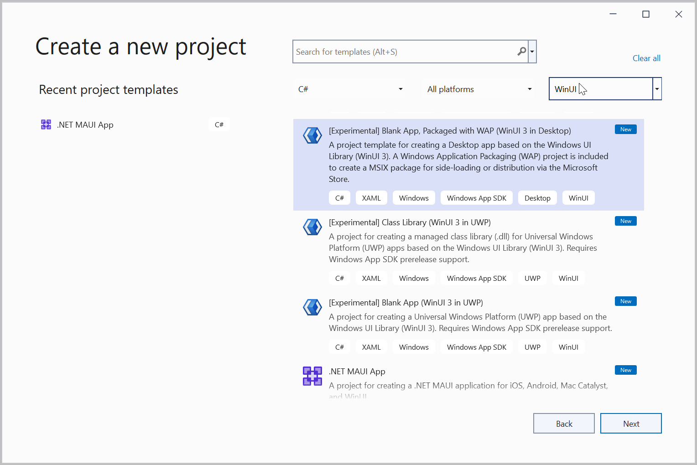
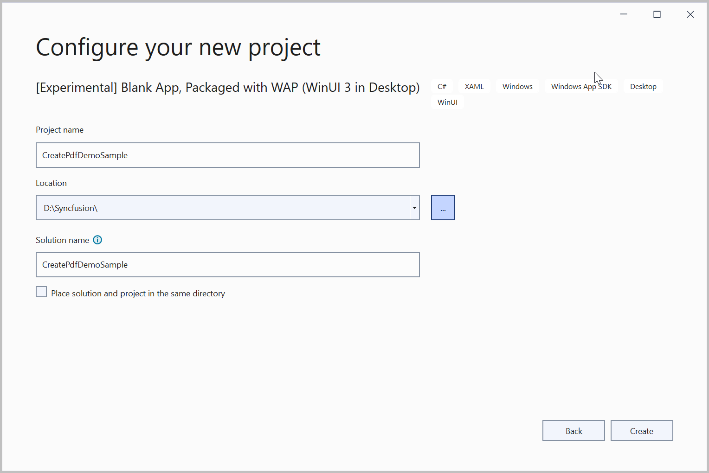
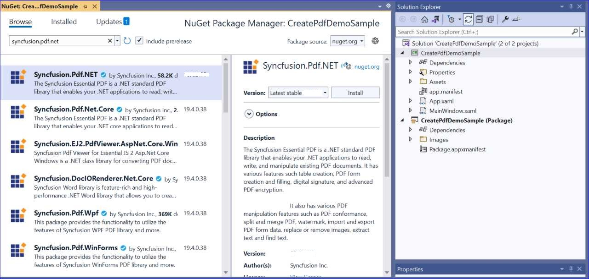
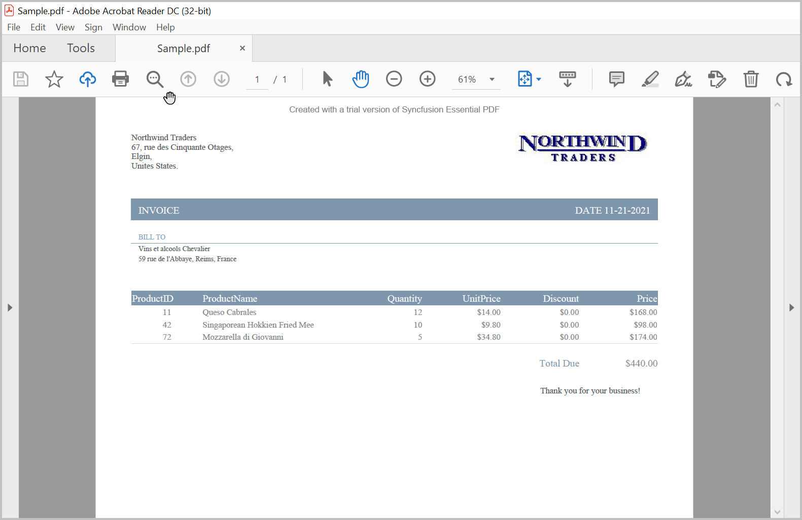
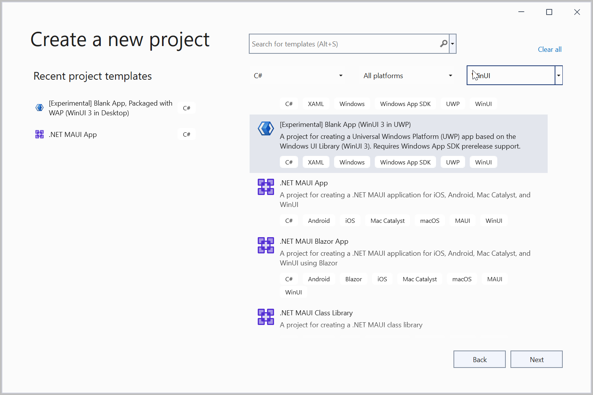
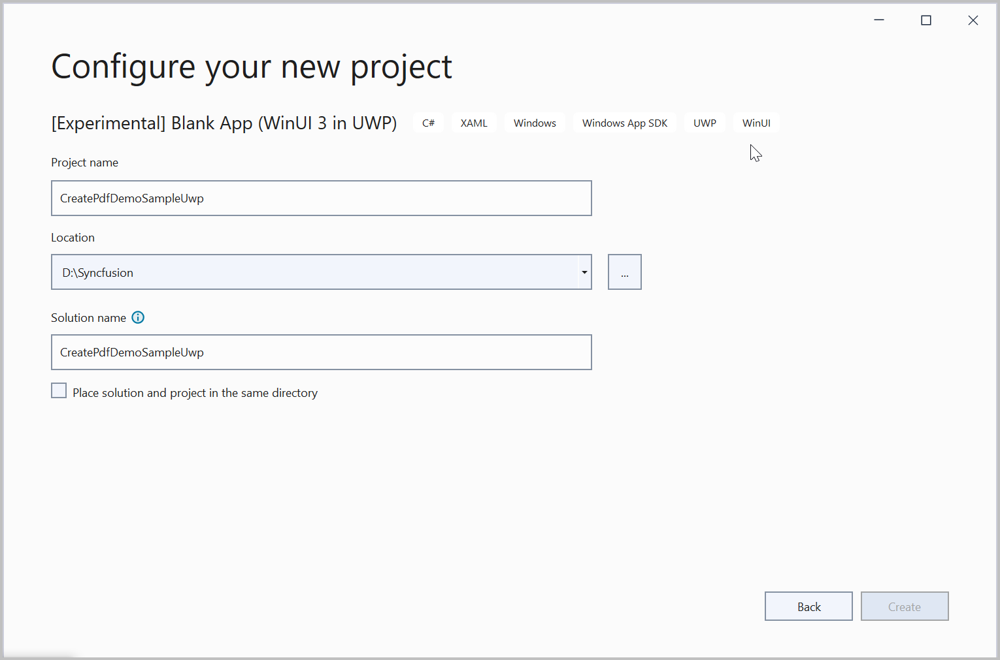

# Create PDF file in WinUI

Syncfusion Essential PDF is a [.NET Core PDF library](https://www.syncfusion.com/pdf-framework/net-core/pdf-library) used to create, read, and edit **PDF** documents. Using this library, you can **create a PDF document in WinUI**.

**Prerequisites:**
To use the WinUI 3 project templates, install the Windows App SDK extension for Visual Studio. For more details, refer [here](https://docs.microsoft.com/en-us/windows/apps/windows-app-sdk/set-up-your-development-environment).

## WinUI Desktop app

1.Create a new C# WinUI Desktop app. Select Blank App, Packaged with WAP (WinUI 3 in Desktop) from the template and click the **Next** button.

2.Enter the project name and click **Create**.

3.Set the Target version to Windows 10, version 2004 (build 19041) and the Minimum version to Windows 10, version 1809 (build 17763) and then click **OK**.

4.Install the [Syncfusion.Pdf.Net.Core](https://www.nuget.org/packages/Syncfusion.Pdf.Net.Core) NuGet package as a reference to your project from the [NuGet.org](https://www.nuget.org/).

N> Starting with v16.2.0.x, if you reference Syncfusion assemblies from trial setup or from the NuGet feed, you also have to add "Syncfusion.Licensing" assembly reference and include a license key in your projects. Please refer to this [link](https://help.syncfusion.com/common/essential-studio/licensing/license-key) to know about registering a Syncfusion license key in your application to use our components.

5.Add a new button to the **MainWindow.xaml** as shown below.





<Window
    x:Class="CreatePdfDemoSample.MainWindow"
    xmlns="http://schemas.microsoft.com/winfx/2006/xaml/presentation"
    xmlns:x="http://schemas.microsoft.com/winfx/2006/xaml"
    xmlns:local="using:CreatePdfDemoSample"
    xmlns:d="http://schemas.microsoft.com/expression/blend/2008"
    xmlns:mc="http://schemas.openxmlformats.org/markup-compatibility/2006"
    mc:Ignorable="d">

    <StackPanel Orientation="Horizontal" HorizontalAlignment="Center" VerticalAlignment="Center">
        <Button x:Name="button" Click="createPdf_Click">Create PDF</Button>
    </StackPanel>
</Window>





6.Include the following namespaces in the **MainWindow.xaml.cs** file.





using Syncfusion.Pdf;
using Syncfusion.Pdf.Graphics;
using Syncfusion.Pdf.Grid;
using Syncfusion.Drawing;
using System.Reflection;
using System.Xml.Linq;





7.Add a new action method **createPdf_Click** in MainWindow.xaml.cs and include the below code snippet to **create a PDF document**.





//Create a new PDF document.
 PdfDocument document = new PdfDocument();
 document.PageSettings.Orientation = PdfPageOrientation.Landscape;
document.PageSettings.Margins.All = 50;

//Add a page to the document.
PdfPage page = document.Pages.Add();

//Create PDF graphics for the page.
PdfGraphics graphics = page.Graphics;

//Create a text element with the text and font.
PdfTextElement element = new PdfTextElement("Northwind Traders\n67, rue des Cinquante Otages,\nElgin,\nUnites States.");
element.Font = new PdfStandardFont(PdfFontFamily.TimesRoman, 12);
element.Brush = new PdfSolidBrush(new PdfColor(89, 89, 93));
PdfLayoutResult result = element.Draw(page, new RectangleF(0, 0, page.Graphics.ClientSize.Width / 2, 200));

//Draw the image to PDF page with specified size. 
Stream imgStream = typeof(MainWindow).GetTypeInfo().Assembly.GetManifestResourceStream("CreatePdfDemoSample.Assets.logo.jpg");
PdfImage img = new PdfBitmap(imgStream);
graphics.DrawImage(img, new RectangleF(graphics.ClientSize.Width - 200, result.Bounds.Y, 190, 45));
PdfFont subHeadingFont = new PdfStandardFont(PdfFontFamily.TimesRoman, 14);
graphics.DrawRectangle(new PdfSolidBrush(new PdfColor(126, 151, 173)), new RectangleF(0, result.Bounds.Bottom + 40, graphics.ClientSize.Width, 30));

//Create a text element with the text and font.
element = new PdfTextElement("INVOICE", subHeadingFont);
element.Brush = PdfBrushes.White;
result = element.Draw(page, new PointF(10, result.Bounds.Bottom + 48));
string currentDate = "DATE " + DateTime.Now.ToString("MM/dd/yyyy");
SizeF textSize = subHeadingFont.MeasureString(currentDate);
graphics.DrawString(currentDate, subHeadingFont, element.Brush, new PointF(graphics.ClientSize.Width - textSize.Width - 10, result.Bounds.Y));

//Create a text element and draw it to PDF page.
element = new PdfTextElement("BILL TO ", new PdfStandardFont(PdfFontFamily.TimesRoman, 10));
element.Brush = new PdfSolidBrush(new PdfColor(126, 155, 203));
result = element.Draw(page, new PointF(10, result.Bounds.Bottom + 25));
graphics.DrawLine(new PdfPen(new PdfColor(126, 151, 173), 0.70f), new PointF(0, result.Bounds.Bottom + 3), new PointF(graphics.ClientSize.Width, result.Bounds.Bottom + 3));

//Get products list to create invoice 
IEnumerable<CustOrders> products = Orders.GetProducts();

List<CustOrders> list = new List<CustOrders>();
foreach (CustOrders cust in products)
{
    list.Add(cust);
}
var reducedList = list.Select(f => new { f.ProductID, f.ProductName, f.Quantity, f.UnitPrice, f.Discount, f.Price }).ToList();

//Get the shipping address details. 
IEnumerable<ShipDetails> shipDetails = Orders.GetShipDetails();]]
GetShipDetails(shipDetails);

//Create a text element and draw it to PDF page.
element = new PdfTextElement(shipName, new PdfStandardFont(PdfFontFamily.TimesRoman, 10));
element.Brush = new PdfSolidBrush(new PdfColor(89, 89, 93));
result = element.Draw(page, new RectangleF(10, result.Bounds.Bottom + 5, graphics.ClientSize.Width / 2, 100));

//Create a text element and draw it to PDF page.
element = new PdfTextElement(string.Format("{0}, {1}, {2}", address, shipCity, shipCountry), new PdfStandardFont(PdfFontFamily.TimesRoman, 10));
element.Brush = new PdfSolidBrush(new PdfColor(89, 89, 93));
result = element.Draw(page, new RectangleF(10, result.Bounds.Bottom + 3, graphics.ClientSize.Width / 2, 100));

//Create a PDF grid with product details.
PdfGrid grid = new PdfGrid();
grid.DataSource = reducedList;

//Initialize PdfGridCellStyle and set border color.
PdfGridCellStyle cellStyle = new PdfGridCellStyle();
cellStyle.Borders.All = PdfPens.White;
cellStyle.Borders.Bottom = new PdfPen(new PdfColor(217, 217, 217), 0.70f);
cellStyle.Font = new PdfStandardFont(PdfFontFamily.TimesRoman, 12f);
cellStyle.TextBrush = new PdfSolidBrush(new PdfColor(131, 130, 136));

//Initialize PdfGridCellStyle and set header style.
PdfGridCellStyle headerStyle = new PdfGridCellStyle();
headerStyle.Borders.All = new PdfPen(new PdfColor(126, 151, 173));
headerStyle.BackgroundBrush = new PdfSolidBrush(new PdfColor(126, 151, 173));
headerStyle.TextBrush = PdfBrushes.White;
headerStyle.Font = new PdfStandardFont(PdfFontFamily.TimesRoman, 14f, PdfFontStyle.Regular);

PdfGridRow header = grid.Headers[0];
for (int i = 0; i < header.Cells.Count; i++)
{
    if (i == 0 || i == 1)
        header.Cells[i].StringFormat = new PdfStringFormat(PdfTextAlignment.Left, PdfVerticalAlignment.Middle);
    else
        header.Cells[i].StringFormat = new PdfStringFormat(PdfTextAlignment.Right, PdfVerticalAlignment.Middle);
}
header.ApplyStyle(headerStyle);

foreach (PdfGridRow row in grid.Rows)
{
    row.ApplyStyle(cellStyle);
    for (int i = 0; i < row.Cells.Count; i++)
    {
        //Create and customize the string formats
        PdfGridCell cell = row.Cells[i];
        if (i == 1)
            cell.StringFormat = new PdfStringFormat(PdfTextAlignment.Left, PdfVerticalAlignment.Middle);
        else if (i == 0)
            cell.StringFormat = new PdfStringFormat(PdfTextAlignment.Center, PdfVerticalAlignment.Middle);
        else
            cell.StringFormat = new PdfStringFormat(PdfTextAlignment.Right, PdfVerticalAlignment.Middle);

        if (i > 2)
        {
            float val = float.MinValue;
            float.TryParse(cell.Value.ToString(), out val);
            cell.Value = '$' + val.ToString("0.00");
        }
    }
}

grid.Columns[0].Width = 100;
grid.Columns[1].Width = 200;

//Set properties to paginate the grid.
PdfGridLayoutFormat layoutFormat = new PdfGridLayoutFormat();
layoutFormat.Layout = PdfLayoutType.Paginate;

//Draw grid to the page of PDF document.
PdfGridLayoutResult gridResult = grid.Draw(page, new RectangleF(new PointF(0, result.Bounds.Bottom + 40), new SizeF(graphics.ClientSize.Width, graphics.ClientSize.Height - 100)), layoutFormat);
float pos = 0.0f;
for (int i = 0; i < grid.Columns.Count - 1; i++)
    pos += grid.Columns[i].Width;

PdfFont font = new PdfStandardFont(PdfFontFamily.TimesRoman, 14f);

GetTotalPrice(products);

gridResult.Page.Graphics.DrawString("Total Due", font, new PdfSolidBrush(new PdfColor(126, 151, 173)), new RectangleF(new PointF(pos, gridResult.Bounds.Bottom + 20), new SizeF(grid.Columns[3].Width - pos, 20)), new PdfStringFormat(PdfTextAlignment.Right));
gridResult.Page.Graphics.DrawString("Thank you for your business!", new PdfStandardFont(PdfFontFamily.TimesRoman, 12), new PdfSolidBrush(new PdfColor(89, 89, 93)), new PointF(pos - 55, gridResult.Bounds.Bottom + 60));
pos += grid.Columns[4].Width;
gridResult.Page.Graphics.DrawString('$' + string.Format("{0:N2}", total), font, new PdfSolidBrush(new PdfColor(131, 130, 136)), new RectangleF(new PointF(pos, gridResult.Bounds.Bottom + 20), new SizeF(grid.Columns[4].Width - pos, 20)), new PdfStringFormat(PdfTextAlignment.Right));

string filePath = Path.GetFullPath("Sample.pdf");

//Save the PDF document to stream.
using (FileStream outputStream = new FileStream(filePath, FileMode.Create, FileAccess.ReadWrite, FileShare.ReadWrite))
{
    document.Save(outputStream);
    document.Close();
}





A complete working example of creating a PDF document in the WinUI Desktop app can be downloaded from this [link](https://www.syncfusion.com/downloads/support/directtrac/general/ze/CreatePdfDemoSample-1441042814).

By executing the program, you will get the **PDF document** as follows.

## WinUI UWP app

1.Create a new C# WinUI UWP app. Select Blank App (WinUI 3 in UWP)from the template and **click** the Next button.

N> To get the UWP Experimental project templates and build UWP apps with WinUI 3, you should download the [Windows App SDK Experimental Extension](https://aka.ms/projectreunion/previewdownload) for Visual Studio.

2.Enter the project name and click **Create**.

3.Set the Target version to Windows 10, version 2004 (build 19041) and the Minimum version to Windows 10, version 1809 (build 17763) and then click **OK**.

4.Install the [Syncfusion.Pdf.Net.Core](https://www.nuget.org/packages/Syncfusion.Pdf.Net.Core) NuGet package as a reference to your project from the [NuGet.org](https://www.nuget.org/).

N> Starting with v16.2.0.x, if you reference Syncfusion assemblies from trial setup or from the NuGet feed, you also have to add "Syncfusion.Licensing" assembly reference and include a license key in your projects. Please refer to this [link](https://help.syncfusion.com/common/essential-studio/licensing/license-key) to know about registering a Syncfusion license key in your application to use our components.

5.Add a new button in the **MainPage.xaml** as shown below.





<Page
    x:Class="CreatePdfDemoSampleUwp.MainPage"
    xmlns="http://schemas.microsoft.com/winfx/2006/xaml/presentation"
    xmlns:x="http://schemas.microsoft.com/winfx/2006/xaml"
    xmlns:local="using:CreatePdfDemoSampleUwp"
    xmlns:d="http://schemas.microsoft.com/expression/blend/2008"
    xmlns:mc="http://schemas.openxmlformats.org/markup-compatibility/2006"
    mc:Ignorable="d"
    Background="{ThemeResource ApplicationPageBackgroundThemeBrush}">

    <StackPanel Orientation="Horizontal" HorizontalAlignment="Center" VerticalAlignment="Center">
        <Button x:Name="button" Click="createPdf_Click">Create PDF</Button>
    </StackPanel>
</Page>





6.Include the following namespaces in the **MainPage.xaml.cs** file.





using Syncfusion.Pdf;
using Syncfusion.Pdf.Graphics;
using Syncfusion.Pdf.Grid;
using Syncfusion.Drawing;
using System.Reflection;
using System.Xml.Linq;
using Windows.Storage;
using Windows.Storage.Pickers;
using Windows.Storage.Streams;





7.Add a new action method **createPdf_Click** in MainPage.xaml.cs and include the below code snippet to **create a PDF document**.





//Create a new PDF document.
PdfDocument document = new PdfDocument();
document.PageSettings.Orientation = PdfPageOrientation.Landscape;
document.PageSettings.Margins.All = 50;

//Add a page to the document.
PdfPage page = document.Pages.Add();

//Create PDF graphics for the page.
PdfGraphics graphics = page.Graphics;

//Create a text element with the text and font.
PdfTextElement element = new PdfTextElement("Northwind Traders\n67, rue des Cinquante Otages,\nElgin,\nUnites States.");
element.Font = new PdfStandardFont(PdfFontFamily.TimesRoman, 12);
element.Brush = new PdfSolidBrush(new PdfColor(89, 89, 93));
PdfLayoutResult result = element.Draw(page, new RectangleF(0, 0, page.Graphics.ClientSize.Width / 2, 200));

//Draw the image to PDF page with specified size. 
Stream imgStream = typeof(MainPage).GetTypeInfo().Assembly.GetManifestResourceStream("CreatePdfDemoSampleUwp.Assets.logo.jpg");
PdfImage img = new PdfBitmap(imgStream);
graphics.DrawImage(img, new RectangleF(graphics.ClientSize.Width - 200, result.Bounds.Y, 190, 45));
PdfFont subHeadingFont = new PdfStandardFont(PdfFontFamily.TimesRoman, 14);
graphics.DrawRectangle(new PdfSolidBrush(new PdfColor(126, 151, 173)), new RectangleF(0, result.Bounds.Bottom + 40, graphics.ClientSize.Width, 30));

//Create a text element with the text and font.
element = new PdfTextElement("INVOICE", subHeadingFont);
element.Brush = PdfBrushes.White;
result = element.Draw(page, new PointF(10, result.Bounds.Bottom + 48));
string currentDate = "DATE " + DateTime.Now.ToString("MM/dd/yyyy");
SizeF textSize = subHeadingFont.MeasureString(currentDate);
graphics.DrawString(currentDate, subHeadingFont, element.Brush, new PointF(graphics.ClientSize.Width - textSize.Width - 10, result.Bounds.Y));

//Create a text element and draw it to PDF page.
element = new PdfTextElement("BILL TO ", new PdfStandardFont(PdfFontFamily.TimesRoman, 10));
element.Brush = new PdfSolidBrush(new PdfColor(126, 155, 203));
result = element.Draw(page, new PointF(10, result.Bounds.Bottom + 25));
graphics.DrawLine(new PdfPen(new PdfColor(126, 151, 173), 0.70f), new PointF(0, result.Bounds.Bottom + 3), new PointF(graphics.ClientSize.Width, result.Bounds.Bottom + 3));

//Get products list to create invoice 
IEnumerable<CustOrders> products = Orders.GetProducts();

List<CustOrders> list = new List<CustOrders>();
foreach (CustOrders cust in products)
{
    list.Add(cust);
}
var reducedList = list.Select(f => new { f.ProductID, f.ProductName, f.Quantity, f.UnitPrice, f.Discount, f.Price }).ToList();

//Get the shipping address details. 
IEnumerable<ShipDetails> shipDetails = Orders.GetShipDetails();
GetShipDetails(shipDetails);

//Create a text element and draw it to PDF page.
element = new PdfTextElement(shipName, new PdfStandardFont(PdfFontFamily.TimesRoman, 10));
element.Brush = new PdfSolidBrush(new PdfColor(89, 89, 93));
result = element.Draw(page, new RectangleF(10, result.Bounds.Bottom + 5, graphics.ClientSize.Width / 2, 100));

//Create a text element and draw it to PDF page.
element = new PdfTextElement(string.Format("{0}, {1}, {2}", address, shipCity, shipCountry), new PdfStandardFont(PdfFontFamily.TimesRoman, 10));
element.Brush = new PdfSolidBrush(new PdfColor(89, 89, 93));
result = element.Draw(page, new RectangleF(10, result.Bounds.Bottom + 3, graphics.ClientSize.Width / 2, 100));

//Create a PDF grid with product details.
PdfGrid grid = new PdfGrid();
grid.DataSource = reducedList;

//Initialize PdfGridCellStyle and set border color.
PdfGridCellStyle cellStyle = new PdfGridCellStyle();
cellStyle.Borders.All = PdfPens.White;
cellStyle.Borders.Bottom = new PdfPen(new PdfColor(217, 217, 217), 0.70f);
cellStyle.Font = new PdfStandardFont(PdfFontFamily.TimesRoman, 12f);
cellStyle.TextBrush = new PdfSolidBrush(new PdfColor(131, 130, 136));

//Initialize PdfGridCellStyle and set header style.
PdfGridCellStyle headerStyle = new PdfGridCellStyle();
headerStyle.Borders.All = new PdfPen(new PdfColor(126, 151, 173));
headerStyle.BackgroundBrush = new PdfSolidBrush(new PdfColor(126, 151, 173));
headerStyle.TextBrush = PdfBrushes.White;
headerStyle.Font = new PdfStandardFont(PdfFontFamily.TimesRoman, 14f, PdfFontStyle.Regular);

PdfGridRow header = grid.Headers[0];
for (int i = 0; i < header.Cells.Count; i++)
{
    if (i == 0 || i == 1)
        header.Cells[i].StringFormat = new PdfStringFormat(PdfTextAlignment.Left, PdfVerticalAlignment.Middle);
    else
        header.Cells[i].StringFormat = new PdfStringFormat(PdfTextAlignment.Right, PdfVerticalAlignment.Middle);
}
header.ApplyStyle(headerStyle);

foreach (PdfGridRow row in grid.Rows)
{
    row.ApplyStyle(cellStyle);
    for (int i = 0; i < row.Cells.Count; i++)
    {
        //Create and customize the string formats
        PdfGridCell cell = row.Cells[i];
        if (i == 1)
            cell.StringFormat = new PdfStringFormat(PdfTextAlignment.Left, PdfVerticalAlignment.Middle);
        else if (i == 0)
            cell.StringFormat = new PdfStringFormat(PdfTextAlignment.Center, PdfVerticalAlignment.Middle);
        else
            cell.StringFormat = new PdfStringFormat(PdfTextAlignment.Right, PdfVerticalAlignment.Middle);

        if (i > 2)
        {
            float val = float.MinValue;
            float.TryParse(cell.Value.ToString(), out val);
            cell.Value = '$' + val.ToString("0.00");
        }
     }
}

grid.Columns[0].Width = 100;
grid.Columns[1].Width = 200;

//Set properties to paginate the grid.
PdfGridLayoutFormat layoutFormat = new PdfGridLayoutFormat();
layoutFormat.Layout = PdfLayoutType.Paginate;

//Draw grid to the page of PDF document.
PdfGridLayoutResult gridResult = grid.Draw(page, new RectangleF(new PointF(0, result.Bounds.Bottom + 40), new SizeF(graphics.ClientSize.Width, graphics.ClientSize.Height - 100)), layoutFormat);
float pos = 0.0f;
for (int i = 0; i < grid.Columns.Count - 1; i++)
    pos += grid.Columns[i].Width;

PdfFont font = new PdfStandardFont(PdfFontFamily.TimesRoman, 14f);

GetTotalPrice(products);

gridResult.Page.Graphics.DrawString("Total Due", font, new PdfSolidBrush(new PdfColor(126, 151, 173)), new RectangleF(new PointF(pos, gridResult.Bounds.Bottom + 20), new SizeF(grid.Columns[3].Width - pos, 20)), new PdfStringFormat(PdfTextAlignment.Right));
gridResult.Page.Graphics.DrawString("Thank you for your business!", new PdfStandardFont(PdfFontFamily.TimesRoman, 12), new PdfSolidBrush(new PdfColor(89, 89, 93)), new PointF(pos - 55, gridResult.Bounds.Bottom + 60));
pos += grid.Columns[4].Width;
gridResult.Page.Graphics.DrawString('$' + string.Format("{0:N2}", total), font, new PdfSolidBrush(new PdfColor(131, 130, 136)), new RectangleF(new PointF(pos, gridResult.Bounds.Bottom + 20), new SizeF(grid.Columns[4].Width - pos, 20)), new PdfStringFormat(PdfTextAlignment.Right));

//Save the PDF document to  MemoryStream.
using (MemoryStream stream = new MemoryStream())
{
    document.Save(stream);
    document.Close();
    //Save the stream as a PDF document file in the local machine.
    Save(stream, "Sample.pdf");
}
			




A complete working example of creating a PDF document in  the WinUI UWP app can be downloaded from this [link](https://www.syncfusion.com/downloads/support/directtrac/general/ze/CreatePdfDemoSampleUwp-634488365).

By executing the program, you will get the **PDF document** as follows.

### Save PDF document in UWP





async void Save(MemoryStream streams, string filename)
{
	streams.Position = 0;
	StorageFile stFile;
	if (!(Windows.Foundation.Metadata.ApiInformation.IsTypePresent("Windows.Phone.UI.Input.HardwareButtons")))
	{
		FileSavePicker savePicker = new FileSavePicker();
        savePicker.DefaultFileExtension = ".pdf";
		savePicker.SuggestedFileName = filename;
		savePicker.FileTypeChoices.Add("PDF Documents", new List<string>() { ".pdf" });
		stFile = await savePicker.PickSaveFileAsync();
	}
	else
	{
		StorageFolder local = Windows.Storage.ApplicationData.Current.LocalFolder;
		stFile = await local.CreateFileAsync(filename, CreationCollisionOption.ReplaceExisting);
	}
	if (stFile != null)
	{
		using (IRandomAccessStream zipStream = await stFile.OpenAsync(FileAccessMode.ReadWrite))
		{
			//Write compressed data from memory to file.
			using (Stream outstream = zipStream.AsStreamForWrite())
			{
				byte[] buffer = streams.ToArray();
				outstream.Write(buffer, 0, buffer.Length);
				outstream.Flush();
			}
		}
	}
	//Launch the saved PDF file.
	await Windows.System.Launcher.LaunchFileAsync(stFile);
}




