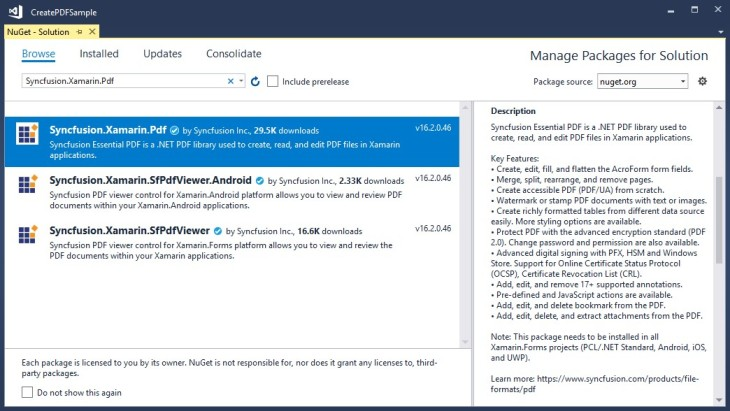
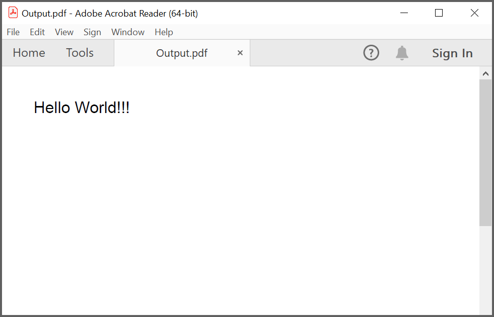
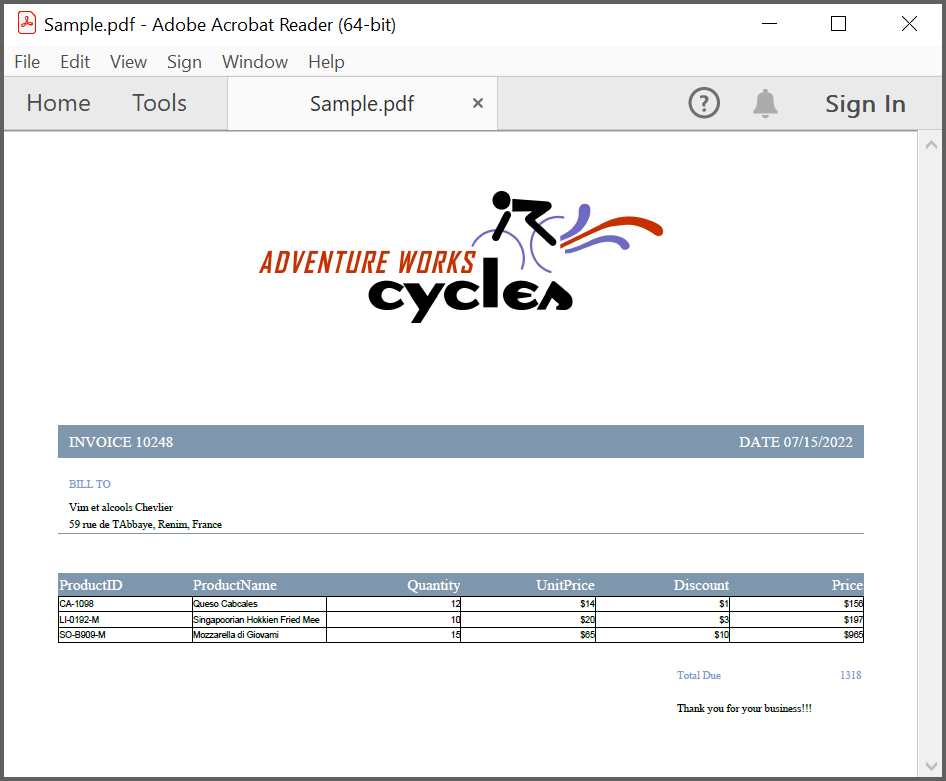
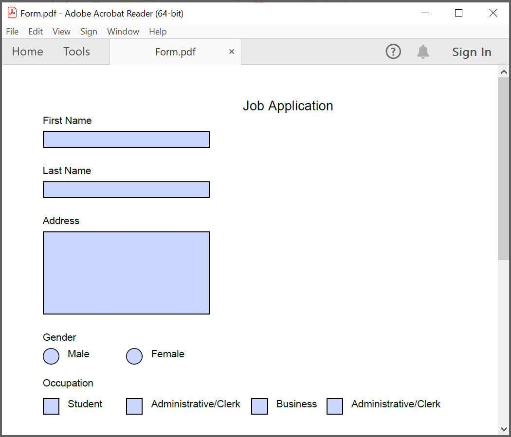

# Create or Generate PDF file in Xamarin

The Syncfusion [Xamarin PDF library](https://www.syncfusion.com/document-processing/pdf-framework/xamarin/pdf-library) is used to create, read, and edit PDF documents. This library also offers functionality to merge, split, stamp, forms, and secure PDF files.

To include the Syncfusion Xamarin PDF library into your Xamarin application, please refer to the [NuGet Package Required](/File-Formats/PDF/NuGet-Packages-Required) or [Assemblies Required](/File-Formats/PDF/Assemblies-Required) documentation.

## Steps to create PDF document in Xamarin

Step 1: Create a new C# Xamarin.Forms application project.


Step 2: Select a project template and required platforms to deploy the application. In this application, the portable assemblies to be shared across multiple platforms, so the .NET Standard code sharing strategy has been selected. For more details about code sharing, refer [here](https://learn.microsoft.com/en-us/xamarin/cross-platform/app-fundamentals/code-sharing).

N> If .NET Standard is not available in the code sharing strategy, the Portable Class Library (PCL) can be selected.


Step 3: Install the [Syncfusion.Xamarin.PDF](https://www.nuget.org/packages/Syncfusion.Xamarin.PDF/) NuGet package as a reference to your Xamarin.Forms applications from [NuGet.org](https://www.nuget.org/).


Step 4: Add new Forms XAML page in portable project if there is no XAML page is defined in the App class. Otherwise, proceed to the next step.

a. To add the new XAML page, right-click the project and select **Add > New Item** and add a Forms XAML Page from the list. Name it as **MainXamlPage**.

b. In App class of portable project (App.cs), replace the existing constructor of App class with the following code example, which invokes the *MainXamlPage*.



public App()
{
    //The root page of your application.
    MainPage = new MainXamlPage();
}



Step 5: In the *MainXamlPage.xaml*, add new button as follows.


<ContentPage xmlns="http://xamarin.com/schemas/2014/forms"
             xmlns:x="http://schemas.microsoft.com/winfx/2009/xaml"
             x:Class="GettingStarted. MainXamlPage">
<StackLayout VerticalOptions="Center">
<Button Text="Generate Document" Clicked="OnButtonClicked" HorizontalOptions="Center"/>
</StackLayout>
</ContentPage>


Step 6: Include the following namespace in the *MainXamlPage.xaml.cs* file.



using Syncfusion.Pdf;
using Syncfusion.Pdf.Parsing;
using Syncfusion.Pdf.Graphics;
using Syncfusion.Pdf.Grid;



Step 7: Include the following code example in the click event of the button in *MainXamlPage.xaml.cs*, to create a PDF document and save it in a stream. In this code example, the [PdfDocument](https://help.syncfusion.com/cr/file-formats/Syncfusion.Pdf.PdfDocument.html) object represents an entire PDF document that is being created and add a [PdfPage](https://help.syncfusion.com/cr/file-formats/Syncfusion.Pdf.PdfPage.html) to it. The text has been added in PDF by using the [DrawString](https://help.syncfusion.com/cr/file-formats/Syncfusion.Pdf.Graphics.PdfGraphics.html#Syncfusion_Pdf_Graphics_PdfGraphics_DrawString_System_String_Syncfusion_Pdf_Graphics_PdfFont_Syncfusion_Pdf_Graphics_PdfBrush_System_Drawing_PointF_) method of [PdfGraphics](https://help.syncfusion.com/cr/file-formats/Syncfusion.Pdf.Graphics.PdfGraphics.html) class. 
 


//Create a new PDF document.
PdfDocument document = new PdfDocument();
//Add a page to the document.
PdfPage page = document.Pages.Add();
//Create PDF graphics for the page.
PdfGraphics graphics = page.Graphics;
//Set the standard font.
PdfFont font = new PdfStandardFont(PdfFontFamily.Helvetica, 20);
//Draw the text.
graphics.DrawString("Hello World!!!", font, PdfBrushes.Black, new PointF(0, 0));
//Save the document to the stream.
MemoryStream stream = new MemoryStream();
document.Save(stream);
//Close the document.
document.Close(true);
//Save the stream as a file in the device and invoke it for viewing.
Xamarin.Forms.DependencyService.Get<ISave>().SaveAndView("Output.pdf", "application / pdf", stream);



Step 8: Download the helper files from this [link](https://www.syncfusion.com/downloads/support/directtrac/general/ze/Helper_Class1450461599 ) and add them into the mentioned project. These helper files allow you to save the stream as a physical file and open the file for viewing.

<table>
  <tr>
    <th>Project</th>
    <th>File Name</th>
	<th>Summary</th>
  </tr>
  <tr>
    <td>portable project</td>
    <td>ISave.cs </td>
	<td>Represent the base interface for save operation</td>	
  </tr>
  <tr>
    <td rowspan="2">iOS Project</td>
    <td>SaveIOS.cs</td>
	<td>Represent the base interface for save operation</td>	
  </tr>
   <tr>    
    <td>PreviewControllerDS.cs</td>
	<td>Helper class for viewing the PDF file in iOS device</td>	
  </tr>
  <tr>
    <td>Android project</td>
    <td>SaveAndroid.cs</td>
	<td>Save implementation for Android device</td>	
  </tr>
  <tr>
    <td>WinPhone project</td>
    <td>SaveWinPhone.cs</td>
	<td>Save implementation for Windows Phone device</td>	
  </tr>
  <tr>
    <td>UWP project</td>
    <td>SaveWindows.cs</td>
	<td>Save implementation for UWP device.</td>	
  </tr>
  <tr>
    <td>Windows(8.1) project </td>
    <td>SaveWindows81.cs</td>
	<td>Save implementation for WinRT device.</td>	
  </tr>     
</table>

Step 9: Compile and execute the application. This will creates a simple PDF document.

You can download a complete working sample from [GitHub](https://github.com/SyncfusionExamples/PDF-Examples/tree/master/Getting%20Started/Xamarin/CreatePDFDocument).

By executing the program, you will get the PDF document as follows.

 
## Creating a PDF document with image

Load image stream from the local files on disk and draw the images through the [DrawImage](https://help.syncfusion.com/cr/file-formats/Syncfusion.Pdf.Graphics.PdfGraphics.html#Syncfusion_Pdf_Graphics_PdfGraphics_DrawImage_Syncfusion_Pdf_Graphics_PdfImage_System_Single_System_Single_) method of the [PdfGraphics](https://help.syncfusion.com/cr/file-formats/Syncfusion.Pdf.Graphics.PdfGraphics.html) class. The following code example shows how to create a PDF document with an image.



//Create a new PDF document.
PdfDocument doc = new PdfDocument();
//Add a page to the document.
PdfPage page = doc.Pages.Add();
//Create PDF graphics for the page.
PdfGraphics graphics = page.Graphics;
//Load the image as stream.
Stream imageStream = typeof(App).GetTypeInfo().Assembly.GetManifestResourceStream("Sample.Assets.Autumn Leaves.jpg");
//Load the image from the disk.
PdfBitmap image = new PdfBitmap(imageStream);
//Draw the image.
graphics.DrawImage(image, 0, 0);
////Save the document to the stream.
MemoryStream stream = new MemoryStream();
//Save the document.
doc.Save(stream);
//Close the document.
doc.Close(true);
//Save the stream as a file in the device and invoke it for viewing.
Xamarin.Forms.DependencyService.Get<ISave>().SaveAndView("Output.pdf", "application/pdf", stream);



You can download a complete working sample from [GitHub](https://github.com/SyncfusionExamples/PDF-Examples/tree/master/Getting%20Started/Xamarin/CreatePDFwithImage).

## Creating a PDF document with table

The [PdfGrid](https://help.syncfusion.com/cr/file-formats/Syncfusion.Pdf.Grid.PdfGrid.html) allows you to create a table from a [DataSource](https://help.syncfusion.com/cr/file-formats/Syncfusion.Pdf.Grid.PdfGrid.html#Syncfusion_Pdf_Grid_PdfGrid_DataSource) (data set, data table, arrays, or IEnumerable object) in a PDF document.The following code example shows how to create a PDF document with a simple table.
 


//Create a new PDF document.
PdfDocument doc = new PdfDocument();
//Add a page.
PdfPage page = doc.Pages.Add();
//Create a PdfGrid.
PdfGrid pdfGrid = new PdfGrid();
//Add values to list.
List<object> data = new List<object>();
Object row1 = new { ID = "E01", Name = "Clay" };
Object row2 = new { ID = "E02", Name = "Thomas" };
Object row3 = new { ID = "E03", Name = "Andrew" };
Object row4 = new { ID = "E04", Name = "Paul" };
Object row5 = new { ID = "E05", Name = "Gray" };
data.Add(row1);
data.Add(row2);
data.Add(row3);
data.Add(row4);
data.Add(row5);
//Add list to IEnumerable.
IEnumerable<object> dataTable = data;
//Assign data source.
pdfGrid.DataSource = dataTable;
//Draw grid to the page of PDF document.
pdfGrid.Draw(page, new PointF(10, 10));
//Save the PDF document to stream.
MemoryStream stream = new MemoryStream();
doc.Save(stream);
//Close the document.
doc.Close(true);
//Save the stream as a file in the device and invoke it for viewing
Xamarin.Forms.DependencyService.Get<ISave>().SaveAndView("Output.pdf", "application/pdf", stream);



You can download a complete working sample from [GitHub](https://github.com/SyncfusionExamples/PDF-Examples/tree/master/Getting%20Started/Xamarin/CreatePDFwithTable).

## Creating a simple PDF document with basic elements
The [PdfDocument](https://help.syncfusion.com/cr/file-formats/Syncfusion.Pdf.PdfDocument.html) object represents an entire PDF document that is being created. The following code example shows how to create a PDF document and add a [PdfPage](https://help.syncfusion.com/cr/file-formats/Syncfusion.Pdf.PdfPage.html) to it along with the [PdfPageSettings](https://help.syncfusion.com/cr/file-formats/Syncfusion.Pdf.PdfPageSettings.html).



//Creates a new PDF document.
PdfDocument document = new PdfDocument();
//Adds page settings.
document.PageSettings.Orientation = PdfPageOrientation.Landscape;
document.PageSettings.Margins.All = 50;
//Adds a page to the document.
PdfPage page = document.Pages.Add();
PdfGraphics graphics = page.Graphics;



1. Essential PDF has APIs similar to the .NET GDI plus which helps to draw elements to the PDF page just like 2D drawing in .NET. 
2. Unlike System.Drawing APIs all the units are measured in point instead of pixel. 
3. In PDF, all the elements are placed in absolute positions and has the possibility for content overlapping if misplaced. 
4. Essential PDF provides the rendered bounds for each and every elements added through [PdfLayoutResult](https://help.syncfusion.com/cr/file-formats/Syncfusion.Pdf.Graphics.PdfLayoutResult.html) objects. This can be used to add successive elements and prevent content overlap.

The following code example explains how to add an image from disk to a PDF document, by providing the rectangle coordinates. 
 


//Loads the image as stream.
Stream imageStream = typeof(App).GetTypeInfo().Assembly.GetManifestResourceStream("Sample.Assets.AdventureCycle.jpg");
RectangleF bounds = new RectangleF(176, 0, 390, 130);
PdfImage image = PdfImage.FromStream(imageStream);
//Draws the image to the PDF page.
page.Graphics.DrawImage(image, bounds);



The following methods can be used to add text to a PDF document.

1. [DrawString()](https://help.syncfusion.com/cr/file-formats/Syncfusion.Pdf.Graphics.PdfGraphics.html#Syncfusion_Pdf_Graphics_PdfGraphics_DrawString_System_String_Syncfusion_Pdf_Graphics_PdfFont_Syncfusion_Pdf_Graphics_PdfBrush_System_Drawing_PointF_) method of the [PdfGraphics](https://help.syncfusion.com/cr/file-formats/Syncfusion.Pdf.Graphics.PdfGraphics.html)
2. [PdfTextElement](https://help.syncfusion.com/cr/file-formats/Syncfusion.Pdf.Graphics.PdfTextElement.html) class.

The ```PdfTextElement``` provides the layout result of the added text by using the location of the next element that decides to prevent content overlapping. This is not available in the ```DrawString``` method. 

The following code example adds the necessary text such as address, invoice number and date to create a basic invoice application. 
 


PdfBrush solidBrush = new PdfSolidBrush(new PdfColor(126, 151, 173));
bounds = new RectangleF(0, bounds.Bottom + 90, graphics.ClientSize.Width, 30);
//Draws a rectangle to place the heading in that region.
graphics.DrawRectangle(solidBrush, bounds);
//Creates a font for adding the heading in the page.
PdfFont subHeadingFont = new PdfStandardFont(PdfFontFamily.TimesRoman, 14);
//Creates a text element to add the invoice number.
PdfTextElement element = new PdfTextElement("INVOICE " + id.ToString(), subHeadingFont);
element.Brush = PdfBrushes.White;

//Draws the heading on the page.
PdfLayoutResult result = element.Draw(page, new PointF(10, bounds.Top + 8));
string currentDate = "DATE " + DateTime.Now.ToString("MM/dd/yyyy");
//Measures the width of the text to place it in the correct location.
SizeF textSize = subHeadingFont.MeasureString(currentDate);
PointF textPosition = new PointF(graphics.ClientSize.Width - textSize.Width - 10, result.Bounds.Y);
//Draws the date by using DrawString method.
graphics.DrawString(currentDate, subHeadingFont, element.Brush, textPosition);
PdfFont timesRoman = new PdfStandardFont(PdfFontFamily.TimesRoman, 10);
//Creates text elements to add the address and draw it to the page.
element = new PdfTextElement("BILL TO ", timesRoman);
element.Brush = new PdfSolidBrush(new PdfColor(126, 155, 203));
result = element.Draw(page, new PointF(10, result.Bounds.Bottom + 25));
PdfPen linePen = new PdfPen(new PdfColor(126, 151, 173), 0.70f);
PointF startPoint = new PointF(0, result.Bounds.Bottom + 3);
PointF endPoint = new PointF(graphics.ClientSize.Width, result.Bounds.Bottom + 3);
//Draws a line at the bottom of the address.
graphics.DrawLine(linePen, startPoint, endPoint);



Essential PDF provides two types of table models. The difference between both the table models can be referred from the link 
[Difference between PdfLightTable and PdfGrid](/file-formats/pdf/working-with-tables#difference-between-pdflighttable-and-pdfgrid "difference-between-pdflighttable-and-pdfgrid")

Since the invoice document requires only simple cell customizations, the given code example explains how to create a simple invoice table by using [PdfGrid](https://help.syncfusion.com/cr/file-formats/Syncfusion.Pdf.Grid.PdfGrid.html).
 


//Creates the datasource for the table.
DataTable invoiceDetails = GetProductDetailsAsDataTable();
//Creates a PDF grid.
PdfGrid grid = new PdfGrid();
//Adds the data source.
grid.DataSource = invoiceDetails;
//Creates the grid cell styles.
PdfGridCellStyle cellStyle = new PdfGridCellStyle();
cellStyle.Borders.All = PdfPens.White;
PdfGridRow header = grid.Headers[0];
//Creates the header style.
PdfGridCellStyle headerStyle = new PdfGridCellStyle();
headerStyle.Borders.All = new PdfPen(new PdfColor(126, 151, 173));
headerStyle.BackgroundBrush = new PdfSolidBrush(new PdfColor(126, 151, 173));
headerStyle.TextBrush = PdfBrushes.White;
headerStyle.Font = new PdfStandardFont(PdfFontFamily.TimesRoman, 14f, PdfFontStyle.Regular);

//Adds cell customizations.
for (int i = 0; i < header.Cells.Count; i++)
{
if (i == 0 || i == 1)
header.Cells[i].StringFormat = new PdfStringFormat(PdfTextAlignment.Left, PdfVerticalAlignment.Middle);
else
header.Cells[i].StringFormat = new PdfStringFormat(PdfTextAlignment.Right, PdfVerticalAlignment.Middle);
}

//Applies the header style.
header.ApplyStyle(headerStyle);
cellStyle.Borders.Bottom = new PdfPen(new PdfColor(217, 217, 217), 0.70f);
cellStyle.Font = new PdfStandardFont(PdfFontFamily.TimesRoman, 12f);
cellStyle.TextBrush = new PdfSolidBrush(new PdfColor(131, 130, 136));
//Creates the layout format for grid.
PdfGridLayoutFormat layoutFormat = new PdfGridLayoutFormat();
//Creates layout format settings to allow the table pagination.
layoutFormat.Layout = PdfLayoutType.Paginate;
//Draws the grid to the PDF page.
PdfGridLayoutResult gridResult = grid.Draw(page, new RectangleF(new PointF(0, result.Bounds.Bottom + 40), new SizeF(graphics.ClientSize.Width, graphics.ClientSize.Height - 100)), layoutFormat);

 

The following code example shows how to save the invoice document to disk and dispose the [PdfDocument](https://help.syncfusion.com/cr/file-formats/Syncfusion.Pdf.PdfDocument.html) object.
 


//Save the PDF document to stream.
MemoryStream stream = new MemoryStream();
document.Save(stream);
//Close the document.
document.Close(true);
//Save the stream as a file in the device and invoke it for viewing
Xamarin.Forms.DependencyService.Get<ISave>().SaveAndView("Output.pdf", "application/pdf", stream);



You can download a complete working sample from [GitHub](https://github.com/SyncfusionExamples/PDF-Examples/tree/master/Getting%20Started/Xamarin/CreateInvoicePDF).

The following screenshot shows the invoice PDF document created by using Essential PDF.


## Filling forms

An interactive form sometimes referred to as an AcroForm, is a collection of fields for gathering information interactively from the user. A [PDF document](https://help.syncfusion.com/cr/file-formats/Syncfusion.Pdf.PdfDocument.html) or [existing PDF document](https://help.syncfusion.com/cr/file-formats/Syncfusion.Pdf.Parsing.PdfLoadedDocument.html) contain any number of fields appearing in any combination of pages, all that make a single, globally interactive form spanning the entire document.

Essential PDF allows you to [create and manipulate existing form](https://www.syncfusion.com/document-processing/pdf-framework/net/pdf-library/pdf-form-fields) in a PDF document using the [PdfForm](https://help.syncfusion.com/cr/file-formats/Syncfusion.Pdf.Interactive.PdfForm.html) class. The [PdfLoadedFormFieldCollection](https://help.syncfusion.com/cr/file-formats/Syncfusion.Pdf.Parsing.PdfLoadedFormFieldCollection.html) class represents the entire field collection of the loaded form. To work with existing form documents, the following namespaces are required.

1. Syncfusion.Pdf
2. Syncfusion.Pdf.Parsing

The following guide shows how to fill out a sample PDF form.


Essential PDF allows you to fill the form fields by using [PdfLoadedField](https://help.syncfusion.com/cr/file-formats/Syncfusion.Pdf.Parsing.PdfLoadedField.html) class. You can get the form field either by using its field name or field index.
 


//Loads the PDF form.
PdfLoadedDocument loadedDocument = new PdfLoadedDocument(@"JobApplication.pdf");
//Loads the form.
PdfLoadedForm form = loadedDocument.Form;
//Fills the textbox field by using index.
(form.Fields[0] as PdfLoadedTextBoxField).Text = "John";
//Fills the textbox fields by using field name.
(form.Fields["LastName"] as PdfLoadedTextBoxField).Text = "Doe";
(form.Fields["Address"] as PdfLoadedTextBoxField).Text = " John Doe \n 123 Main St \n Anytown, USA";
//Loads the radio button group.
PdfLoadedRadioButtonItemCollection radioButtonCollection = (form.Fields["Gender"] as PdfLoadedRadioButtonListField).Items;
//Checks the 'Male' option.
radioButtonCollection[0].Checked = true;
//Checks the 'business' checkbox field.
(form.Fields["Business"] as PdfLoadedCheckBoxField).Checked = true;
//Checks the 'retiree' checkbox field.
(form.Fields["Retiree"] as PdfLoadedCheckBoxField).Checked = true;
//Save the PDF document to stream.
MemoryStream stream = new MemoryStream();
loadedDocument.Save(stream);
//Close the document.
loadedDocument.Close(true);
//Save the stream as a file in the device and invoke it for viewing
Xamarin.Forms.DependencyService.Get<ISave>().SaveAndView("Output.pdf", "application/pdf", stream);

  

You can download a complete working sample from [GitHub](https://github.com/SyncfusionExamples/PDF-Examples/tree/master/Getting%20Started/Xamarin/PDFFormFilling).

The filled form is shown in adobe reader application as follows.


## Merge PDF Documents

Essential PDF supports [merging multiple PDF documents](https://www.syncfusion.com/document-processing/pdf-framework/net/pdf-library/merge-pdf) from stream using the [Merge](https://help.syncfusion.com/cr/file-formats/Syncfusion.Pdf.PdfDocumentBase.html#Syncfusion_Pdf_PdfDocumentBase_Merge_Syncfusion_Pdf_PdfDocumentBase_Syncfusion_Pdf_Parsing_PdfLoadedDocument_) method of the [PdfDocumentBase](https://help.syncfusion.com/cr/file-formats/Syncfusion.Pdf.PdfDocumentBase.html) class.

You can merge the PDF document streams by using the following code example.
 


//Creates a PDF document.
PdfDocument finalDoc = new PdfDocument();
//Loads the Pdf as a stream.
Stream stream1 = typeof(App).GetTypeInfo().Assembly.GetManifestResourceStream("Sample.Assets.file1.pdf");
Stream stream2 = typeof(App).GetTypeInfo().Assembly.GetManifestResourceStream("Sample.Assets.file2.pdf");
// Creates a PDF stream for merging.
Stream[] streams = { stream1, stream2 };
// Merges PDFDocument.
PdfDocumentBase.Merge(finalDoc, streams);
//Save the PDF document to stream.
MemoryStream stream = new MemoryStream();
finalDoc.Save(stream);
//If the position is not set to '0' then the PDF will be empty.
stream.Position = 0;
//Close the document.
finalDoc.Close(true);
//Save the stream as a file in the device and invoke it for viewing
Xamarin.Forms.DependencyService.Get<ISave>().SaveAndView("Output.pdf", "application/pdf", stream);



You can download a complete working sample from [GitHub](https://github.com/SyncfusionExamples/PDF-Examples/tree/master/Getting%20Started/Xamarin/MergePDFs).


