## How to download HTML Converter Mac installer?

Refer this [link](https://help.syncfusion.com/common/essential-studio/download/) to download trial\licensed installer based on your license.

The latest WebKit HTML converter for Mac can be downloaded as PKG file from the following link,

https://www.syncfusion.com/downloads/latest-version 

In the downloads page, click the “Mac” button and download the HTML Converter Mac installer.
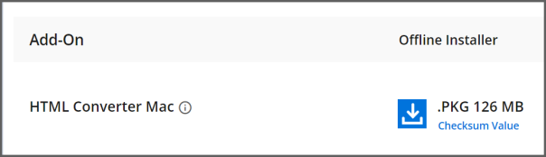

## Step-by-Step Installation

The following procedure illustrates how to install Essential Studio WebKit HTML Converter Mac installer. 

Double-click the Syncfusion Essential Studio WebKit HTML Converter Mac installer(.pkg) file. The installer Wizard opens. Click <b>Continue</b>.
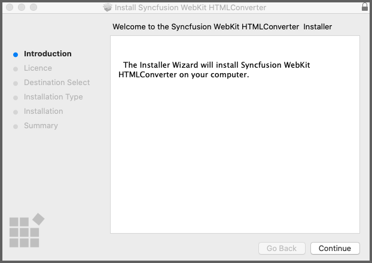

Software License Agreement window opens. Click <b>Continue</b>.

Confirmation window will be displayed for the License Agreement. Click <b>Agree</b>.
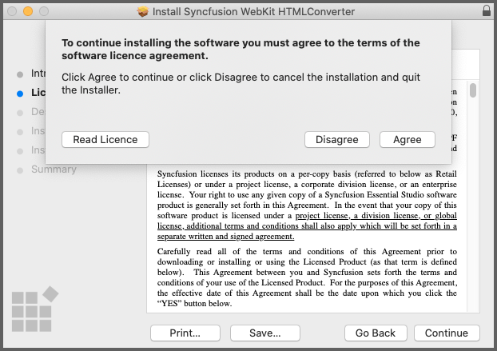

N> Unlock key is not required for installing the Mac installer. Syncfusion Mac installer can be used for developing purposes without registering the Unlock key.

Destination Select windows opens. Click <b>Continue</b>.
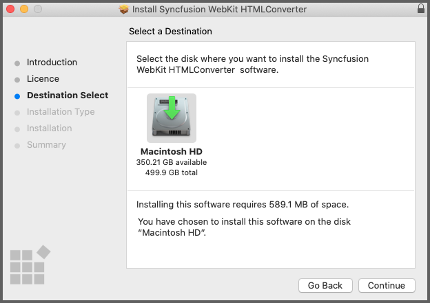

Installation Type window opens. Click <b>Install</b>.
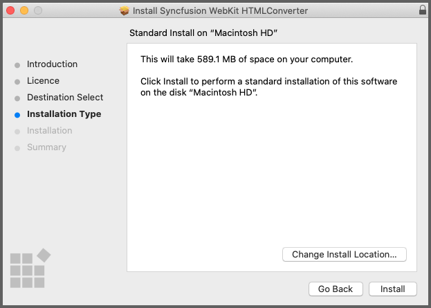

Authentication window opens. Provide your system’s username, password and click <b>Install Software</b>.
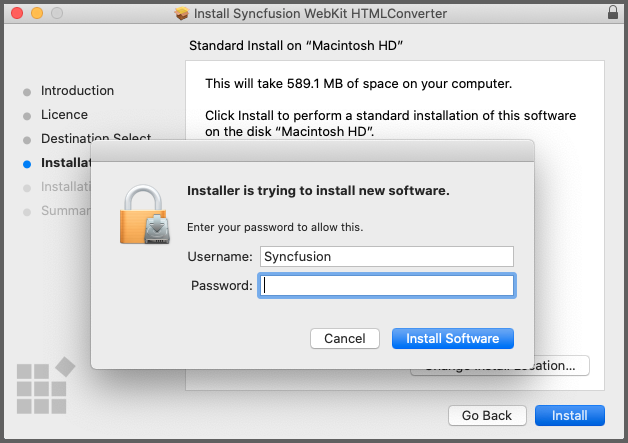

Installation will be started in your machine.
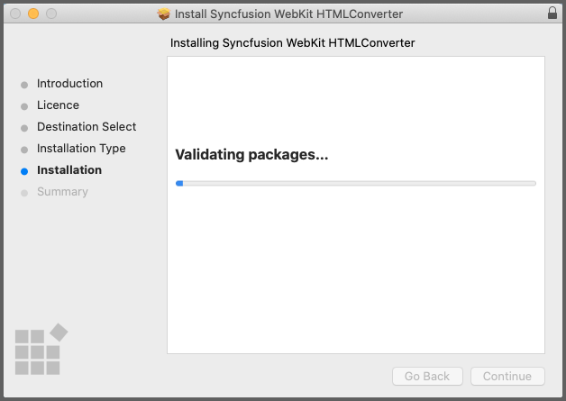

Completed screen will be displayed once the installation is finished. Click Close to exit the installation wizard.
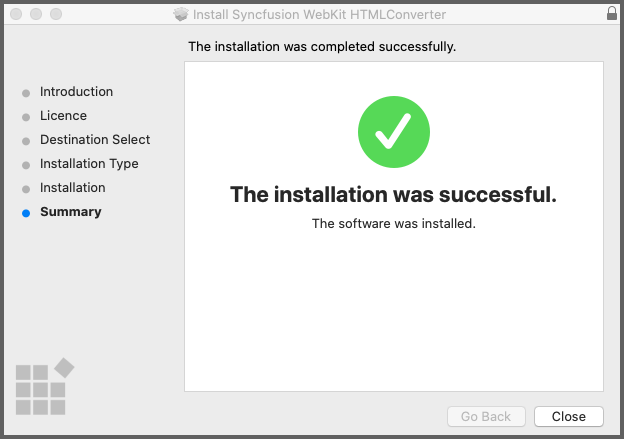

By default, Mac installer will install the files in following location.

Location: {Documents}\Syncfusion\ {version}\ {platform}
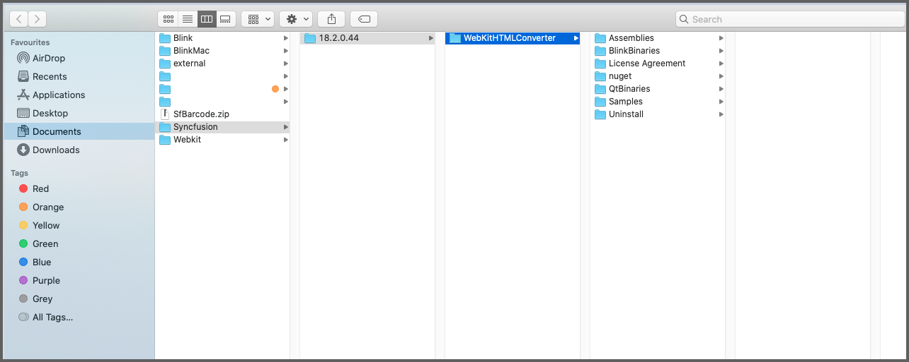

## How to use the HTML converter in Visual Studio for Mac.

Create a new C# ASP.NET Core Web Application project.
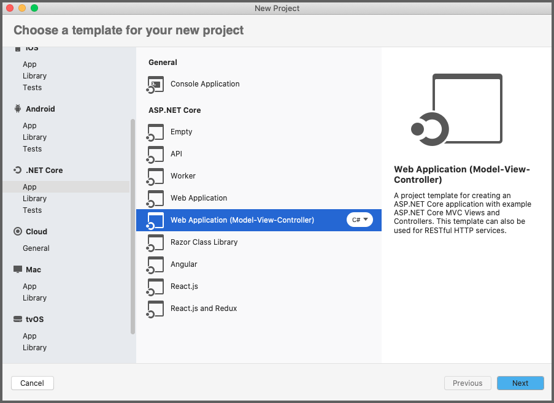

Select the Target Framework of your project.
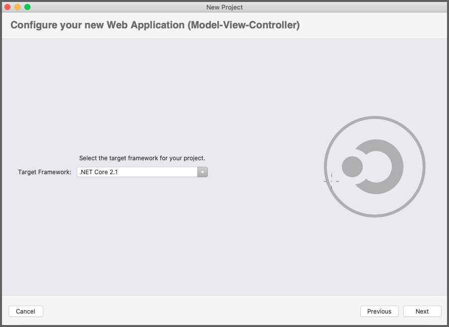

Configure your application and click <b>Create</b>.
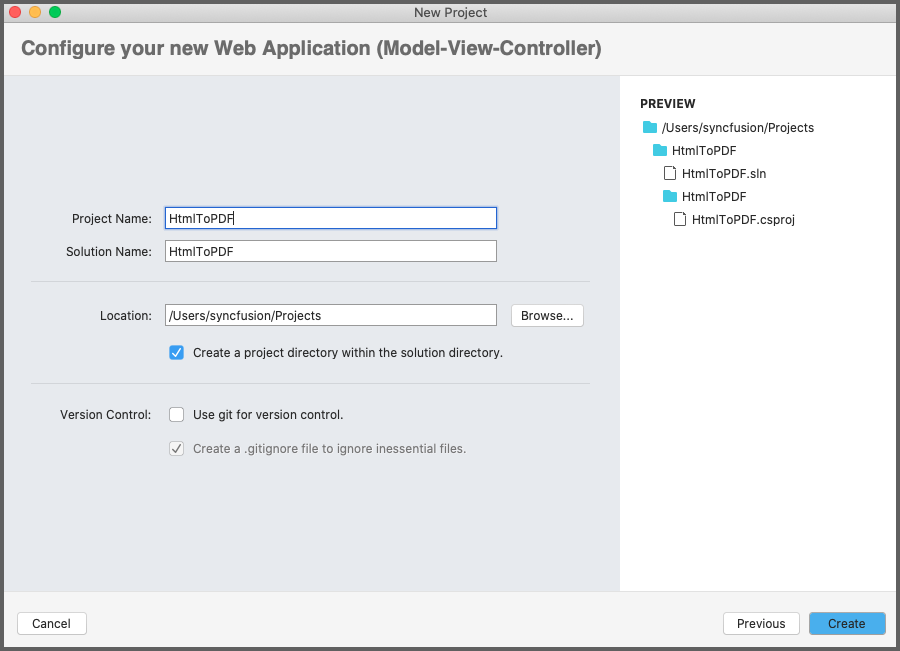

Install the [Syncfusion.HtmlToPdfConverter.QtWebKit.Net.Core](https://www.nuget.org/packages/Syncfusion.HtmlToPdfConverter.QtWebKit.Net.Core/) NuGet package as reference to your .NET Standard applications from [NuGet.org](https://www.nuget.org/).
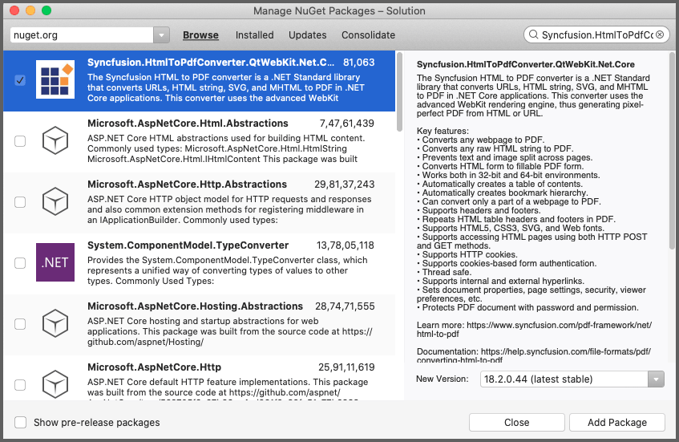

Copy the QtBinariesMac folder from the installed HtmlToPdfConverter package and paste it into the folder which contains the HTMLtoPDF.csproj file.
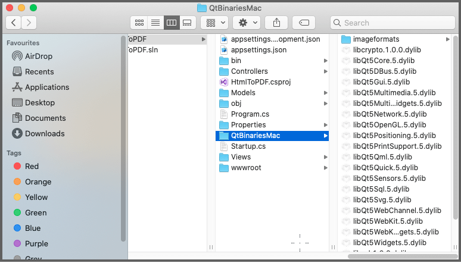

A default controller with name HomeController.cs gets added on creation of ASP.NET MVC project. Include the following namespaces in that HomeController.cs file.



using Syncfusion.Pdf;
using Syncfusion.HtmlConverter;
using System.IO;
using Microsoft.AspNetCore.Hosting;



A default action method named Index will be present in HomeController.cs. Right click on Index method and select Go To View where you will be directed to its associated view page Index.cshtml.

Add a new button in the Index.cshtml as shown below.



@{Html.BeginForm("ExportToPDF", "Home", FormMethod.Post);
{

    <input type="submit" value="Convert PDF" style="width:150px;height:27px" />

}
Html.EndForm();
}


Add a new action method ExportToPDF in HomeController.cs and include the below code snippet to convert HTML to PDF file and download it.



//To get content root path of the project
private readonly IHostingEnvironment _hostingEnvironment;
public HomeController(IHostingEnvironment hostingEnvironment)
{
   _hostingEnvironment = hostingEnvironment;
}

public IActionResult ExportToPDF()
{
//Initialize HTML to PDF converter 
HtmlToPdfConverter htmlConverter = new HtmlToPdfConverter(HtmlRenderingEngine.WebKit);

WebKitConverterSettings settings = new WebKitConverterSettings();

//Set WebKit path
settings.WebKitPath = Path.Combine(_hostingEnvironment.ContentRootPath, "QtBinariesMac");

//Assign WebKit settings to HTML converter
htmlConverter.ConverterSettings = settings;

//Convert URL to PDF
PdfDocument document = htmlConverter.Convert("https://www.google.com");

//Saving the PDF to the MemoryStream
MemoryStream stream = new MemoryStream();

document.Save(stream);

//Download the PDF document in the browser
return File(stream.ToArray(), System.Net.Mime.MediaTypeNames.Application.Pdf, "Output.pdf");

}



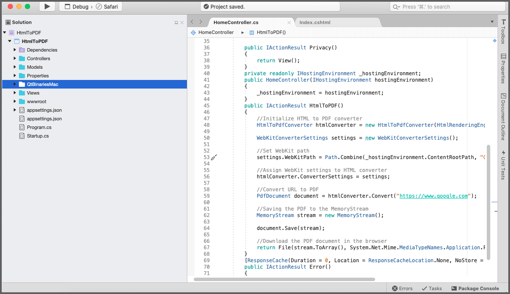

Right click the project and select <b>Build</b>. 
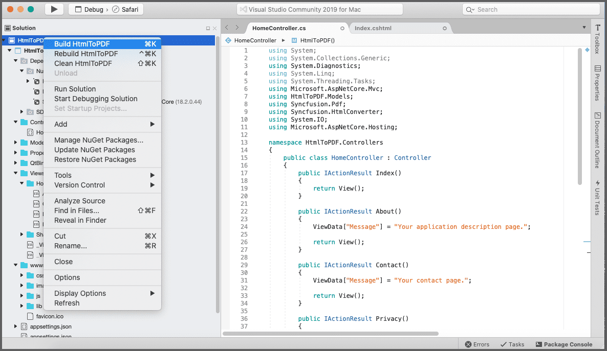

After Build succeeded. Run the application.
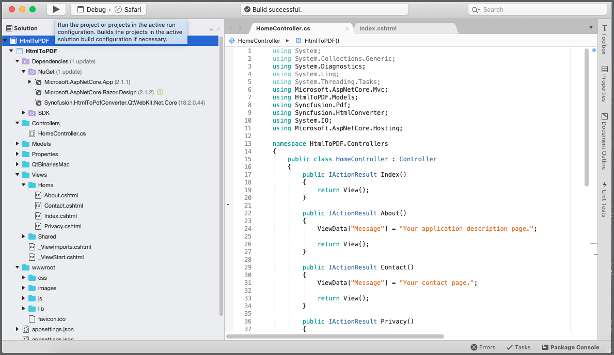

A complete working sample can be downloaded from [HtmlToPDF.zip](https://www.syncfusion.com/downloads/support/directtrac/general/ze/HtmlToPDF-545793311)

By executing the program, you will get the PDF document as follows.

